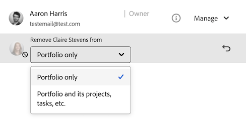

# Rechten van objecten verwijderen

<!--Audited: 01/2024-->

U kunt machtigingen van andere gebruikers verwijderen voor objecten die u toegang hebt tot Delen. Het verwijderen van machtigingen uit objecten is identiek voor alle objecten die kunnen worden gedeeld.

Gelijkaardige overwegingen zoals voor het delen van voorwerpen zijn van toepassing voor het verwijderen van toestemmingen uit voorwerpen. Voor meer informatie, zie de sectie [ Overwegingen over het delen van voorwerpen ](../../workfront-basics/grant-and-request-access-to-objects/sharing-permissions-on-objects-overview.md#consider) in het artikel [ Overzicht van het delen van toestemmingen op voorwerpen ](../../workfront-basics/grant-and-request-access-to-objects/sharing-permissions-on-objects-overview.md)

## Toegangsvereisten

+++ Breid uit om de toegangseisen voor de functionaliteit in dit artikel weer te geven. 

<table style="table-layout:auto"> 
 <col> 
 <col> 
 <tbody> 
  <tr> 
   <td role="rowheader">Adobe Workfront-pakket</td> 
   <td> 
Alle 
 </td> 
  </tr> 
  <tr> 
   <td role="rowheader">Adobe Workfront-licentie</td> 
   <td> 
Medewerker of hoger
 
   
Aanvraag of hoger

   
<strong> Nota </strong>: Sommige voorwerpen vereisen een hogere toegang dan Verzoek.

   </td> 
  </tr> 
  <tr> 
   <td role="rowheader">Configuraties op toegangsniveau</td> 
   <td> 
Toegang tot of hoger weergeven voor de objecten die u wilt delen
 </td> 
  </tr> 
  <tr> 
   <td role="rowheader">Objectmachtigingen</td> 
   <td> 
Machtigingen of hoger weergeven voor de objecten die u wilt delen
 
Rechten beheren om overgeërfde machtigingen voor objecten te verwijderen
  </td> 
  </tr>
 </tbody> 
</table>

Voor meer detail over de informatie in deze lijst, zie [ vereisten van de Toegang in de documentatie van Workfront ](/help/quicksilver/administration-and-setup/add-users/access-levels-and-object-permissions/access-level-requirements-in-documentation.md).

+++

## Entiteiten verwijderen uit de lijst voor delen van een object {#remove-entities-from-the-sharing-list-of-an-object}

U kunt entiteiten (gebruikers, taakrollen, teams, groepen, bedrijven) verwijderen uit de lijst voor gedeeld gebruik van een object. Hierdoor worden hun machtigingen voor het object verwijderd.

1. Ga naar het object waaruit u machtigingen wilt verwijderen.

   Voor informatie over welke voorwerpen kunnen worden gedeeld, zie [ Overzicht van het delen van toestemmingen op voorwerpen ](../../workfront-basics/grant-and-request-access-to-objects/sharing-permissions-on-objects-overview.md).

1. (Voorwaardelijk) Ga als volgt te werk voor programma&#39;s, portfolio&#39;s en documenten:

   1. Klik het **Meer** pictogram  naast de objecten naam, dan klik **het Delen** of **Aandeel.**

      

   1. Klik **x** naast de naam van een gebruiker, team, groep, bedrijf, baanrol om hen in de doos van de objecten toegang te verwijderen.

      

   1. In de **[toegang van Workfront van de Naam van de Gebruiker ] zal van dit** drop-down menu worden verwijderd, selecteer of u hun toegang enkel uit het voorwerp wilt worden verwijderd u, of van alle kindvoorwerpen verbonden aan het hebt geselecteerd.

1. (Voorwaardelijk) Ga als volgt te werk voor projecten, taken en problemen:

   1. Klik **Aandeel** aan het recht van de naam van het voorwerp.

      
   1. Zoek de gebruiker, de rol, het team, de groep, of het bedrijf u uit het voorwerp wilt verwijderen.
   1. Klik **verwijderen**.
In **verwijder &lt; Naam van de Gebruiker > van** drop-down menu, selecteer of u hun toegang enkel uit het voorwerp wilt worden verwijderd u, of uit alle kindvoorwerpen verbonden aan het hebt geselecteerd.

      

   De volgende scenario&#39;s bestaan:

   * Als u de entiteit alleen uit het object verwijdert, verliest die entiteit haar machtigingen voor het object en de overgeërfde machtigingen voor de onderliggende objecten. Als ze eerder machtigingen hadden gekregen voor de onderliggende items afzonderlijk, behouden ze dezelfde machtigingen voor alle onderliggende objecten die eraan zijn gekoppeld wanneer u deze optie selecteert.
   * Als u de entiteit van het voorwerp en alle kindvoorwerpen verwijdert, verliest die entiteit hun toestemmingen aan het voorwerp evenals alle kindvoorwerpen, zelfs toen zij eerder individuele toestemming op elk kindvoorwerp werden verleend.

1. Klik **sparen**.

<!--
## Remove permissions from several objects in bulk

You can remove entities (users, job roles, teams, groups, companies) from several objects at a time when you bulk select them in a list.

>[!NOTE]
>
>You cannot view what access entities have for all the objects selected when you select them in bulk. You must know which entity you want to remove from the sharing of the objects selected before removing their permissions.

1. Go to the list of objects that you want to share.

   For information about which objects can be shared, see [Overview of sharing permissions on objects](../../workfront-basics/grant-and-request-access-to-objects/sharing-permissions-on-objects-overview.md).

1. Select several objects in the list, then click the **Share** icon at the top of the list. 
1. Type the name of the user, role, team, group, or company for which you want to remove the access in the **Edit `<Object Name>` access to** field. 
1. From the access drop-down menu, select **No Access**.

   

1. In the `<User Name>`'s Workfront access will be removed from this drop-down menu, select whether you want their access to be removed just from the objects that you have selected, or from all other children objects associated with it.  
   The following scenarios exist:

   * If you remove the entity only from the object, that entity loses their permissions on the object, and their inherited permissions to the children objects. If they were previously granted permissions to the children items individually, they retain the same permissions on all children objects associated with it when you select this option.  
   * If you remove the entity from the object and all the children objects, that entity loses their permissions to the object as well as all children objects, even when they were previously given individual permission on each child object.

   **Example:** Select whether to remove permissions to just the tasks you selected in a list, or to the issues and documents attached to the tasks as well.

   

1. (Optional) To change permissions in bulk for several objects, select another level of sharing for the selected entity.

   For example, if they have Manage permissions, select Contribute or View instead. 

1. Click **Save**.

-->

## Overerfde machtigingen verwijderen

Overerfde machtigingen kunnen worden verwijderd van objecten, zodat eigenaars specifiek kunnen bepalen wie toegang krijgt tot onderliggende objecten, ongeacht de toegang van een gebruiker tot een bovenliggend object.

>[!IMPORTANT]
>
>Alleen gebruikers met de machtiging Beheren kunnen overgeërfde machtigingen verwijderen.

Overerfde machtigingen verwijderen:

1. Ga naar een object waarvoor u beheerdersmachtigingen hebt. Ga bijvoorbeeld naar een taak.
1. Ga naar het vakje van de objecten toegang zoals die in [ wordt beschreven verwijdert entiteiten uit de het delen lijst van een voorwerp ](#remove-entities-from-the-sharing-list-of-an-object) sectie in dit artikel.
1. Selecteer **Draai van** naast **Geërfte Toestemming** om onbruikbaar te maken.

   Dit zorgt ervoor dat niemand die toestemmingen aan het oudervoorwerp (bijvoorbeeld, het project) wordt verleend toestemmingen aan deze taak door gebrek heeft. U moet afzonderlijke entiteiten weergeven in de lijst voor gedeeld gebruik van de taak om machtigingen voor de taak te verlenen.

   >[!TIP]
   >
   >U kunt afzonderlijke entiteiten niet verwijderen uit de lijst Overgenomen machtigingen. U kunt de Overgenomen machtigingen alleen uitschakelen voor alle vermelde entiteiten.

1. Klik **sparen**.

## Een object privé maken

Als u een object in het hele systeem hebt gedeeld of dit hebt gedeeld met externe toepassingen door het openbaar te maken, kunt u het opnieuw privé maken door de systeembrede of openbare machtigingen te verwijderen.

Voor meer informatie over het maken van een voorwerp beschikbaar systeem-breed, of openbaar, zie [ een voorwerp ](../../workfront-basics/grant-and-request-access-to-objects/share-an-object.md) delen.

Een object privé maken:

1. Ga naar het object dat u privé wilt maken.\
   Navigeer bijvoorbeeld naar een rapport.
1. Klik **Acties van het Rapport**, dan **het Delen**.

   

1. Klik het tandwielpictogram, dan uncheck **maak dit openbaar aan externe gebruikers**.
1. In **wie toegang** drop-down menu heeft, klik **slechts uitgenodigde mensen kunnen tot** toegang hebben ophouden delend het met alle gebruikers van Workfront.
1. Klik **sparen**.
