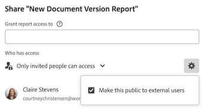

# Rechten van objecten verwijderen

<!--Audited: 01/2024-->

U kunt machtigingen van andere gebruikers verwijderen voor objecten die u toegang hebt tot Delen. Het verwijderen van machtigingen uit objecten is identiek voor alle objecten die kunnen worden gedeeld.

Gelijkaardige overwegingen zoals voor het delen van voorwerpen zijn van toepassing voor het verwijderen van toestemmingen uit voorwerpen. Voor meer informatie, zie de sectie [ Overwegingen over het delen van voorwerpen ](../../workfront-basics/grant-and-request-access-to-objects/sharing-permissions-on-objects-overview.md#consider) in het artikel [ Overzicht van het delen van toestemmingen op voorwerpen ](../../workfront-basics/grant-and-request-access-to-objects/sharing-permissions-on-objects-overview.md)

## Toegangsvereisten

U moet het volgende hebben om objecten te delen:

<table style="table-layout:auto"> 
 <col> 
 <col> 
 <tbody> 
  <tr> 
   <td role="rowheader">Adobe Workfront-plan</td> 
   <td> 
Alle 
 </td> 
  </tr> 
  <tr> 
   <td role="rowheader">Workfront-licentie*</td> 
   <td> 
Nieuwe licentie: Medewerker of hoger

   of  
   
Huidige licentie: aanvragen of hoger

   
<b>OPMERKING</b>

Voor sommige objecten is een hogere toegang vereist dan Aanvraag. 

Voor de nieuwe licentie kan een medewerker bijvoorbeeld uitgaven delen, maar alleen gebruikers met een standaardlicentie kunnen een project delen.

Voor de huidige licentie kan een aanvrager problemen delen, maar alleen Workers of Planners kunnen een project delen.
 
   </td> 
  </tr> 
  <tr> 
   <td role="rowheader">Configuraties op toegangsniveau</td> 
   <td> 
Toegang tot of hoger weergeven voor de objecten die u wilt delen
 </td> 
  </tr> 
  <tr> 
   <td role="rowheader">Objectmachtigingen</td> 
   <td> 
Machtigingen of hoger weergeven voor de objecten die u wilt delen
 
Rechten beheren om overgeërfde machtigingen voor objecten te verwijderen
  </td> 
  </tr> 
 </tbody> 
</table>

*Neem contact op met uw Workfront-beheerder om te weten te komen welk abonnement, licentietype of toegang u hebt. Voor meer informatie, zie [ vereisten van de Toegang voor de documentatie van Workfront ](/help/quicksilver/administration-and-setup/add-users/access-levels-and-object-permissions/access-level-requirements-in-documentation.md).

## Entiteiten verwijderen uit de lijst voor delen van een object {#remove-entities-from-the-sharing-list-of-an-object}

U kunt entiteiten (gebruikers, taakrollen, teams, groepen, bedrijven) verwijderen uit de lijst voor gedeeld gebruik van een object. Hierdoor worden hun machtigingen voor het object verwijderd.

1. Ga naar het object waaruit u machtigingen wilt verwijderen.

   Voor informatie over welke voorwerpen kunnen worden gedeeld, zie [ Overzicht van het delen van toestemmingen op voorwerpen ](../../workfront-basics/grant-and-request-access-to-objects/sharing-permissions-on-objects-overview.md).

1. (Voorwaardelijk) Ga als volgt te werk voor programma&#39;s, portfolio&#39;s en documenten:

   1. Klik het **Meer** pictogram  naast de objecten naam, dan klik **het Delen** of **Aandeel.**

      

   1. Klik **x** naast de naam van een gebruiker, team, groep, bedrijf, baanrol om hen in de doos van de objecten toegang te verwijderen.

      

   1. In **&lt; de toegang van de Naam van de Gebruiker > van Workfront zal uit dit** drop-down menu worden verwijderd, selecteer of u hun toegang wilt worden verwijderd enkel uit het voorwerp u, of uit alle kindvoorwerpen verbonden aan het hebt geselecteerd.

1. (Voorwaardelijk) Ga als volgt te werk voor projecten, taken en problemen:

   1. Klik **Aandeel** aan het recht van de naam van het voorwerp.

      
   1. Zoek de gebruiker, de rol, het team, de groep, of het bedrijf u uit het voorwerp wilt verwijderen.
   1. Klik **verwijderen**.
In **verwijder &lt; Naam van de Gebruiker > van** drop-down menu, selecteer of u hun toegang enkel uit het voorwerp wilt worden verwijderd u, of uit alle kindvoorwerpen verbonden aan het hebt geselecteerd.

      

   De volgende scenario&#39;s bestaan:

   * Als u de entiteit alleen uit het object verwijdert, verliest die entiteit haar machtigingen voor het object en de overgeërfde machtigingen voor de onderliggende objecten. Als ze eerder machtigingen hadden gekregen voor de onderliggende items afzonderlijk, behouden ze dezelfde machtigingen voor alle onderliggende objecten die eraan zijn gekoppeld wanneer u deze optie selecteert.
   * Als u de entiteit van het voorwerp en alle kindvoorwerpen verwijdert, verliest die entiteit hun toestemmingen aan het voorwerp evenals alle kindvoorwerpen, zelfs toen zij eerder individuele toestemming op elk kindvoorwerp werden verleend.

1. Klik **sparen**.

## Rechten van meerdere objecten bulksgewijs verwijderen

U kunt entiteiten (gebruikers, taakrollen, teams, groepen, bedrijven) uit verscheidene voorwerpen verwijderen tegelijkertijd wanneer u hen in een lijst in bulk selecteert.

>[!NOTE]
>
>U kunt niet bekijken wat de toegangsentiteiten voor alle geselecteerde voorwerpen hebben wanneer u hen in massa selecteert. Voordat u de machtigingen verwijdert, moet u weten welke entiteit u uit het delen van de geselecteerde objecten wilt verwijderen.

1. Ga naar de lijst met objecten die u wilt delen.

   Voor informatie over welke voorwerpen kunnen worden gedeeld, zie [ Overzicht van het delen van toestemmingen op voorwerpen ](../../workfront-basics/grant-and-request-access-to-objects/sharing-permissions-on-objects-overview.md).

1. Selecteer verscheidene voorwerpen in de lijst, dan klik het **pictogram van het Aandeel**  bij de bovenkant van de lijst.
1. Typ de naam van de gebruiker, de rol, het team, de groep, of het bedrijf waarvoor u de toegang in **wilt verwijderen geeft `<Object Name>` toegang tot** gebied uit.
1. Van het toegangsdrop-down menu, uitgezochte **Geen Toegang**.

   

1. In de Workfront van `<User Name>` wordt de toegang verwijderd uit dit drop-down menu, selecteer of u hun toegang wilt worden verwijderd enkel uit de voorwerpen die u hebt geselecteerd, of uit alle andere kindvoorwerpen verbonden aan het.\
   De volgende scenario&#39;s bestaan:

   * Als u de entiteit alleen uit het object verwijdert, verliest die entiteit haar machtigingen voor het object en de overgeërfde machtigingen voor de onderliggende objecten. Als ze eerder machtigingen hadden gekregen voor de onderliggende items afzonderlijk, behouden ze dezelfde machtigingen voor alle onderliggende objecten die eraan zijn gekoppeld wanneer u deze optie selecteert. 
   * Als u de entiteit van het voorwerp en alle kindvoorwerpen verwijdert, verliest die entiteit hun toestemmingen aan het voorwerp evenals alle kindvoorwerpen, zelfs toen zij eerder individuele toestemming op elk kindvoorwerp werden verleend.

   **Voorbeeld:** selecteer of om toestemmingen aan enkel de taken te verwijderen u in een lijst selecteerde, of aan de kwesties en de documenten in bijlage aan de taken eveneens.

   

1. (Optioneel) Als u machtigingen in bulk wilt wijzigen voor meerdere objecten, selecteert u een ander niveau voor delen voor de geselecteerde entiteit.

   Als ze bijvoorbeeld beheermachtigingen hebben, selecteert u Contribute of Weergeven.

1. Klik **sparen**.

## Overerfde machtigingen verwijderen

Overerfde machtigingen kunnen worden verwijderd van objecten, zodat eigenaars specifiek kunnen bepalen wie toegang krijgt tot onderliggende objecten, ongeacht de toegang van een gebruiker tot een bovenliggend object.

>[!IMPORTANT]
>
>Alleen gebruikers met de machtiging Beheren kunnen overgeërfde machtigingen verwijderen.

Overerfde machtigingen verwijderen:

1. Ga naar een object waarvoor u beheerdersmachtigingen hebt. Ga bijvoorbeeld naar een taak.
1. Ga naar het vakje van de objecten toegang zoals die in [ wordt beschreven verwijdert entiteiten uit de het delen lijst van een voorwerp ](#remove-entities-from-the-sharing-list-of-an-object) sectie in dit artikel.
1. Selecteer **x** naast **Geërfte Toestemming** op de het delen doos om iedereen te verwijderen die daar wordt vermeld.

   

   Dit zorgt ervoor dat niemand die toestemmingen aan het oudervoorwerp (bijvoorbeeld, het project) wordt verleend toestemmingen aan deze taak door gebrek heeft. Je moet een lijst maken  afzonderlijke entiteiten in de lijst voor gedeeld gebruik van de taak om machtigingen te verlenen voor de taak.

   >[!TIP]
   >
   >U kunt afzonderlijke entiteiten niet verwijderen uit de lijst Overgenomen machtigingen. U kunt de Overgenomen machtigingen alleen uitschakelen voor alle vermelde entiteiten.

1. Klik **sparen**. 

## Een object privé maken

Als u een object in het hele systeem hebt gedeeld of dit hebt gedeeld met externe toepassingen door het openbaar te maken, kunt u het opnieuw privé maken door de systeembrede of openbare machtigingen te verwijderen. 

Voor meer informatie over het maken van een voorwerp beschikbaar systeem-breed, of openbaar, zie [ een voorwerp ](../../workfront-basics/grant-and-request-access-to-objects/share-an-object.md) delen.

Een object privé maken:

1. Ga naar het object dat u privé wilt maken.\
   Navigeer bijvoorbeeld naar een rapport.
1. Klik **Acties van het Rapport**, dan **het Delen**.

   

1. Klik **verwijderen openbare toegang** om de toegang van externe gebruikers te verwijderen om het rapport te bekijken.
1. Klik **verwijderen systeembrede toegang** ophouden delend het met alle gebruikers van Workfront. 
1. Klik **sparen**.
