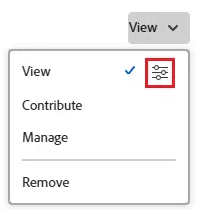

# Een taak delen

Uw Adobe Workfront-beheerder kan u toegang verlenen tot weergave- of bewerkingstaken wanneer zij toegangsniveaus toewijzen. Voor meer informatie over het verlenen van toegang tot taken, zie [ Toegang van de Verlening tot taken ](../../administration-and-setup/add-users/configure-and-grant-access/grant-access-tasks.md).

Samen met het toegangsniveau dat gebruikers worden verleend, kunt u hen toestemmingen aan Mening, Contribute, of Manage ook verlenen specifieke taken die u toegang hebt om te delen.

Machtigingen gelden specifiek voor één item in Workfront en definiëren welke handelingen u op dat item kunt uitvoeren.

## Toegangsvereisten

+++ Breid uit om de toegangseisen voor de functionaliteit in dit artikel weer te geven. 

<table style="table-layout:auto"> 
 <col> 
 <col> 
 <tbody> 
  <tr> 
   <td role="rowheader">Adobe Workfront-pakket</td> 
   <td> 
Alle
 </td> 
  </tr> 
  <tr> 
   <td role="rowheader">Adobe Workfront-licentie</td> 
   <td> 
Standard
 
   
Werk of hoger
 
   </td> 
  </tr> 
  <tr> 
   <td role="rowheader">Configuraties op toegangsniveau</td> 
   <td> 
Toegang tot of hoger weergeven voor de objecten die u wilt delen
 </td> 
  </tr> 
  <tr> 
   <td role="rowheader">Objectmachtigingen</td> 
   <td> 
Machtigingen of hoger weergeven voor de objecten die u wilt delen
</td> 
  </tr> 
 </tbody> 
</table>

Voor meer detail over de informatie in deze lijst, zie [ vereisten van de Toegang in de documentatie van Workfront ](/help/quicksilver/administration-and-setup/add-users/access-levels-and-object-permissions/access-level-requirements-in-documentation.md).

+++

## Overwegingen bij het delen van een taak

Naast de overwegingen hieronder, zie ook [ Overzicht van het delen van toestemmingen op voorwerpen ](../../workfront-basics/grant-and-request-access-to-objects/sharing-permissions-on-objects-overview.md).

* De maker van een taak beschikt standaard over de machtiging Beheren.
* U kunt taken afzonderlijk delen, maar u kunt ook meerdere taken tegelijk in bulk delen.\
  Taken delen is hetzelfde als andere objecten delen. Voor meer informatie over het delen van punten in Workfront, zie [ een voorwerp ](../../workfront-basics/grant-and-request-access-to-objects/share-an-object.md) delen.

* U kunt de volgende toestemmingen aan een taak verlenen:

   * Weergave
   * Beheren
   * Contribute
* Wanneer u een taak deelt, erven de gebruikers de zelfde toestemmingen op alle kindvoorwerpen verbonden aan de taak door gebrek. Ze nemen bijvoorbeeld dezelfde machtigingen over voor de onderliggende taken, problemen en documenten die aan de taak zijn gekoppeld.\
  Zie voor meer informatie over de hiërarchie van objecten in Workfront   [ Begrijp voorwerpen in Adobe Workfront ](../../workfront-basics/navigate-workfront/workfront-navigation/understand-objects.md).

  De Workfront-beheerder kan opgeven of documenten machtigingen van hogere objecten moeten overnemen op het toegangsniveau van de gebruiker. Voor meer informatie over het beperken van geërfte toestemmingen op documenten, zie [ tot douanetoegangsniveaus ](../../administration-and-setup/add-users/configure-and-grant-access/create-modify-access-levels.md) leiden of wijzigen.

* U kunt overgeërfde toestemmingen van een taak verwijderen.\
  Voor meer informatie over het verwijderen van erfrechten uit objecten raadpleegt u   [ verwijdert toestemmingen uit voorwerpen ](../../workfront-basics/grant-and-request-access-to-objects/remove-permissions-from-objects.md).

## Manieren om een taak te delen

U kunt een taak op de volgende manieren delen:

* Handmatig, afzonderlijk of in bulk.

* Automatisch, door het volgende te doen:

   * Geef de machtigingen voor een van de bovenliggende objecten van de taak op: project, programma of portfolio. Taken nemen de machtigingen over van de bovenliggende objecten. Voor informatie over het bekijken van geërfte toestemmingen op voorwerpen, zie [ Mening geërfte toestemmingen op voorwerpen ](../../workfront-basics/grant-and-request-access-to-objects/view-inherited-permissions-on-objects.md).
   * Voeg entiteiten aan het Delen van het Project op een malplaatje toe dat wordt gebruikt om het project tot stand te brengen de taak is. Voor informatie over het delen van projecten van malplaatjes, zie [ een malplaatje ](../../workfront-basics/grant-and-request-access-to-objects/share-a-template.md) delen.

   * Specificeer de toestemmingen op alle taken in een project wanneer u het project uitgeeft.  Voor informatie over het beheren van de toegang tot taken op het project dat op de toestemmingen van een gebruiker aan het project wordt gebaseerd, zie de  sectie in het artikel [ projecten ](../../manage-work/projects/manage-projects/edit-projects.md) uitgeven.

  >[!TIP]
  >
  >Als u niet specificeert welke taaktoestemmingen u gebruikers wilt hebben wanneer zij aan de taken op het project worden toegewezen, ontvangen zij de zelfde toestemmingen die zij op het project door gebrek hebben.

## Een taak delen

1. Navigeer naar de taak die u wilt delen.

1. Aan het recht van de taaknaam, klik **Aandeel**. Het **de dialoogvakje van de Naam van de Taak 1} van het Aandeel [ opent.]**

   

1. In de **taaktoegang van de Verlening tot** gebied, begin typend de naam van de gebruiker, het team, de rol, de groep, of het bedrijf u de taak met wilt delen, dan klik de naam wanneer het in de drop-down lijst verschijnt.

   >[!TIP]
   >
   >U kunt een taak alleen delen met actieve gebruikers, teams, rollen of bedrijven.

1. (Facultatief) selecteer **wie toegang** drop-down heeft en het de toegangsniveau van de taak selecteert:

   * **slechts kunnen de uitgenodigde mensen toegang hebben:** slechts de gebruikers die aan de taak worden uitgenodigd kunnen tot het (Gebrek) toegang hebben.
   * **iedereen in het systeem kan** bekijken: Alle gebruikers in het systeem kunnen de taak zonder een uitnodiging bekijken.

1. Klik op de vervolgkeuzelijst rechts van de naam van de gebruiker en selecteer het desbetreffende machtigingsniveau voor deze taak:

   * **Mening**: De gebruiker kan de taak herzien en delen.
   * **draag** bij: De gebruiker kan updates maken, logboekinformatie, minder belangrijke uitgeven maken, en de taak delen (omvat ook alle toestemmingen van de Mening).
   * **leidt**: De gebruiker heeft volledige toegang tot de taak zonder administratieve rechten, die op het toegangsniveau (omvat ook alle toestemmingen van de Mening en van Contribute) worden verleend.

1. (Optioneel) Klik op het pictogram Geavanceerde opties naast het machtigingsniveau dat u hebt toegekend om specifieke machtigingen voor de taak te configureren.

   

1. (Facultatief) om geërfte toestemmingen voor de kindvoorwerpen van de taak uit te zetten, klik **Draai** gealigneerd met **Geërfde toestemmingen**.

1. (Facultatief) om de taak snel te delen gebruikend een verbinding, klik **verbinding van het Exemplaar** en door:sturen het aan de ontvanger.

1. Klik **sparen**.

## Taken bulksgewijs delen

1. Navigeer naar het project dat de taken bevat u wilt delen.

1. In het **lusje van Taken** op de projectpagina, selecteer de doos links van elke taak u wilt delen, dan klik het **pictogram van het Aandeel**  bij de bovenkant van de pagina. Het deelmodaal wordt geopend.

   

1. In de **taaktoegang van de Verlening tot** gebied, begin typend de naam van de gebruiker, het team, de rol, de groep, of het bedrijf u de taken met wilt delen, dan klik de naam wanneer het in de drop-down lijst verschijnt.

   >[!TIP]
   >
   >U kunt taken met actieve gebruikers, teams, rollen, of bedrijven slechts delen.

1. (Facultatief) selecteer **wie toegang** drop-down heeft en het de toegangsniveau van de taken selecteert:

   * **slechts kunnen de uitgenodigde mensen toegang hebben:** slechts de gebruikers die aan de taken worden uitgenodigd kunnen tot hen (Gebrek) toegang hebben.
   * **iedereen in het systeem kan** bekijken: Alle gebruikers in het systeem kunnen de taken zonder een uitnodiging bekijken.

1. Klik op de vervolgkeuzelijst rechts van de naam van de gebruiker en selecteer het desbetreffende machtigingsniveau voor de taken:

   * **Mening**: De gebruiker kan de taken herzien en delen.
   * **draag** bij: De gebruiker kan updates maken, logboekinformatie, minder belangrijke uitgeven maken, en de taken (omvat ook alle toestemmingen van de Mening) delen.
   * **leidt**: De gebruiker heeft volledige toegang tot de taken zonder administratieve rechten, die op het toegangsniveau (omvat ook alle toestemmingen van de Mening en van Contribute) worden verleend.

1. (Optioneel) Klik op het pictogram Geavanceerde opties naast het machtigingsniveau dat u hebt toegekend om specifieke machtigingen voor de taken te configureren.

   

1. Klik **sparen**.

## Taakmachtigingen

In de volgende tabel wordt weergegeven welke machtigingen u gebruikers kunt verlenen wanneer u hen toestaat een taak weer te geven, bij te dragen of te beheren:

<table border="2" cellspacing="15" cellpadding="1"> 
 <col> 
 <col> 
 <col> 
 <col> 
 <thead> 
  <tr> 
   <th><strong> Actie </strong> </th> 
   <th><strong> leiden </strong> </th> 
   <th><strong> draagt </strong> bij </th> 
   <th><strong> Mening </strong> </th> 
  </tr> 
 </thead> 
 <tbody> 
  <tr> 
   <td scope="row">Taak/taken toevoegen</td> 
   <td>✓</td> 
   <td>✓</td> 
   <td>  </td> 
  </tr> 
  <tr> 
   <td scope="row">Voorgangers toevoegen</td> 
   <td>✓</td> 
   <td>  </td> 
   <td>  </td> 
  </tr> 
  <tr> 
   <td scope="row">Probleem(en) toevoegen</td> 
   <td>✓</td> 
   <td>✓</td> 
   <td>✓</td> 
  </tr> 
  <tr> 
   <td scope="row">Taak verwijderen</td> 
   <td>✓</td> 
   <td>  </td> 
   <td>  </td> 
  </tr> 
  <tr> 
   <td scope="row"> 
Algemene taakbewerking 
 </td> 
   <td>✓</td> 
   <td>✓</td> 
   <td>  </td> 
  </tr> 
  <tr> 
   <td scope="row">Taakstatus wijzigen</td> 
   <td>✓</td> 
   <td>✓</td> 
   <td>  </td> 
  </tr> 
  <tr> 
   <td scope="row">Taakbeperking bewerken</td> 
   <td>✓</td> 
   <td>  </td> 
   <td>  </td> 
  </tr> 
  <tr> 
   <td scope="row">Taak weergeven</td> 
   <td>✓</td> 
   <td>✓</td> 
   <td>✓</td> 
  </tr> 
  <tr> 
   <td scope="row">Document(en) toevoegen</td> 
   <td>✓</td> 
   <td>✓</td> 
   <td>✓</td> 
  </tr> 
  <tr> 
   <td scope="row">Taak kopiëren*</td> 
   <td>✓</td> 
   <td>✓</td> 
   <td>✓</td> 
  </tr> 
  <tr> 
   <td scope="row">Taak verplaatsen*</td> 
   <td>✓</td> 
   <td>  </td> 
   <td>  </td> 
  </tr> 
  <tr> 
   <td scope="row">Logboekuren</td> 
   <td>✓</td> 
   <td>✓</td> 
   <td>  </td> 
  </tr> 
  <tr> 
   <td scope="row">Geplande datums wijzigen</td> 
   <td>✓</td> 
   <td>  </td> 
   <td>  </td> 
  </tr> 
  <tr> 
   <td scope="row">Toewijzing accepteren</td> 
   <td>✓</td> 
   <td>✓</td> 
   <td>  </td> 
  </tr> 
  <tr> 
   <td scope="row">Een toewijzing maken</td> 
   <td>✓</td> 
   <td>✓</td> 
   <td>  </td> 
  </tr> 
  <tr> 
   <td scope="row">Aangepast formulier bijvoegen</td> 
   <td>✓</td> 
   <td>  </td> 
   <td>  </td> 
  </tr> 
  <tr> 
   <td scope="row">Aangepaste velden bewerken</td> 
   <td>✓</td> 
   <td>✓</td> 
   <td>  </td> 
  </tr> 
  <tr> 
   <td scope="row">Een goedkeuringsproces maken</td> 
   <td>✓</td> 
   <td>  </td> 
   <td>  </td> 
  </tr> 
  <tr> 
   <td scope="row">Een taak goedkeuren</td> 
   <td>✓</td> 
   <td>✓</td> 
   <td>✓</td> 
  </tr> 
  <tr> 
   <td scope="row">Financiën bewerken*</td> 
   <td>✓</td> 
   <td>  </td> 
   <td>  </td> 
  </tr> 
  <tr> 
   <td scope="row">Uitgaven toevoegen/bewerken</td> 
   <td>✓</td> 
   <td>✓</td> 
   <td>  </td> 
  </tr> 
  <tr> 
   <td scope="row">Financiën weergeven</td> 
   <td>✓</td> 
   <td>✓</td> 
   <td>✓</td> 
  </tr> 
  <tr> 
   <td scope="row">Updates/opmerkingen</td> 
   <td>✓</td> 
   <td>✓</td> 
   <td>✓</td> 
  </tr> 
  <tr> 
   <td scope="row">Delen</td> 
   <td>✓</td> 
   <td>✓</td> 
   <td>✓</td> 
  </tr> 
  <tr> 
   <td scope="row">Delen in het hele systeem</td> 
   <td>  </td> 
   <td>  </td> 
   <td>✓</td> 
  </tr> 
 </tbody> 
</table>

&#42; wordt gecontroleerd door toegangsniveau en de toestemmingen op het project.
