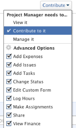
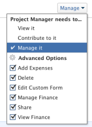

# Een taak delen

Uw Adobe Workfront-beheerder kan u toegang verlenen tot weergave- of bewerkingstaken wanneer zij toegangsniveaus toewijzen. Voor meer informatie over het verlenen van toegang tot taken raadpleegt u [Toegang verlenen tot taken](../../administration-and-setup/add-users/configure-and-grant-access/grant-access-tasks.md).

Samen met het toegangsniveau dat gebruikers worden verleend, kunt u hen toestemmingen aan Mening, Contribute, of Manage ook verlenen specifieke taken die u toegang hebt om te delen.

Machtigingen gelden specifiek voor één item in Workfront en definiëren welke handelingen u op dat item kunt uitvoeren.

## Overwegingen bij het delen van een taak

Naast de onderstaande overwegingen, zie ook [Overzicht van het delen van machtigingen voor objecten](../../workfront-basics/grant-and-request-access-to-objects/sharing-permissions-on-objects-overview.md).

* De maker van een taak heeft er standaard beheerdersmachtigingen voor.
* U kunt taken afzonderlijk delen, maar u kunt ook meerdere taken tegelijk in bulk delen.\
   Taken delen is hetzelfde als andere objecten delen. Ga voor meer informatie over het delen van objecten in Workfront naar [Een object delen](../../workfront-basics/grant-and-request-access-to-objects/share-an-object.md).

* U kunt de volgende toestemmingen aan een taak verlenen: 

   * Weergave
   * Beheren
   * Contribute\
        

* Wanneer u een taak deelt, erven de gebruikers de zelfde toestemmingen op alle kindvoorwerpen verbonden aan de taak, door gebrek. Ze nemen bijvoorbeeld dezelfde machtigingen over voor de onderliggende taken, problemen en documenten die aan de taak zijn gekoppeld.\
   Voor meer informatie over de hiërarchie van objecten in Workfront raadpleegt u  [Objecten in Adobe Workfront begrijpen](../../workfront-basics/navigate-workfront/workfront-navigation/understand-objects.md).

   De Workfront-beheerder kan opgeven of documenten machtigingen van hogere objecten moeten overnemen op het toegangsniveau van de gebruiker. Zie voor meer informatie over het beperken van overerfde machtigingen voor documenten [Aangepaste toegangsniveaus maken of wijzigen](../../administration-and-setup/add-users/configure-and-grant-access/create-modify-access-levels.md).

* U kunt overgeërfde toestemmingen van een taak verwijderen.\
   Voor meer informatie over het verwijderen van erfrechten uit objecten raadpleegt u  [Rechten van objecten verwijderen](../../workfront-basics/grant-and-request-access-to-objects/remove-permissions-from-objects.md).

## Manieren om een taak te delen

U kunt een taak op de volgende manieren delen:

* Handmatig, afzonderlijk of in bulk. Taken handmatig delen lijkt op het delen van andere objecten in Workfront.

   Ga voor meer informatie over het delen van objecten in Workfront naar  [Een object delen](../../workfront-basics/grant-and-request-access-to-objects/share-an-object.md).

* Automatisch, door het volgende te doen:

   * Geef de machtigingen voor een van de bovenliggende objecten van de taak op: project, programma of portfolio. Taken nemen de machtigingen over van de bovenliggende objecten. Voor informatie over het weergeven van overgeërfde machtigingen voor objecten raadpleegt u [Overerfde machtigingen voor objecten weergeven](../../workfront-basics/grant-and-request-access-to-objects/view-inherited-permissions-on-objects.md).
   * Voeg entiteiten aan het Delen van het Project op een malplaatje toe dat wordt gebruikt om het project tot stand te brengen de taak is. Voor informatie over het delen van projecten van malplaatjes, zie [Een sjabloon delen](../../workfront-basics/grant-and-request-access-to-objects/share-a-template.md).

   * Specificeer de toestemmingen op alle taken in een project wanneer u het project uitgeeft. Voor informatie over het beheren van de toegang tot taken op het project dat op de toestemmingen van een gebruiker aan het project wordt gebaseerd, zie  in het artikel [Projecten bewerken](../../manage-work/projects/manage-projects/edit-projects.md).
   >[!TIP]
   >
   >Als u niet specificeert welke taaktoestemmingen u gebruikers wilt hebben wanneer zij aan de taken op het project worden toegewezen, ontvangen zij de zelfde toestemmingen die zij op het project hebben, door gebrek.

## Taakmachtigingen

In de volgende tabel wordt weergegeven welke machtigingen u gebruikers kunt verlenen wanneer u hen toestaat een taak weer te geven, bij te dragen of te beheren:

<table border="2" cellspacing="15" cellpadding="1"> 
 <col> 
 <col> 
 <col> 
 <col> 
 <thead> 
  <tr> 
   <th><strong>Handeling</strong> </th> 
   <th><strong>Beheren</strong> </th> 
   <th><strong>Contribute</strong> </th> 
   <th><strong>Weergave</strong> </th> 
  </tr> 
 </thead> 
 <tbody> 
  <tr> 
   <td scope="row">Taak/taken toevoegen</td> 
   <td>✓</td> 
   <td>✓</td> 
   <td> </td> 
  </tr> 
  <tr> 
   <td scope="row">Voorgangers toevoegen</td> 
   <td>✓</td> 
   <td> </td> 
   <td> </td> 
  </tr> 
  <tr> 
   <td scope="row">Probleem(en) toevoegen</td> 
   <td>✓</td> 
   <td>✓</td> 
   <td>✓</td> 
  </tr> 
  <tr> 
   <td scope="row">Taak verwijderen</td> 
   <td>✓</td> 
   <td> </td> 
   <td> </td> 
  </tr> 
  <tr> 
   <td scope="row"> 
Algemene taakbewerking 
 </td> 
   <td>✓</td> 
   <td>✓</td> 
   <td> </td> 
  </tr> 
  <tr> 
   <td scope="row">Taakstatus wijzigen</td> 
   <td>✓</td> 
   <td>✓</td> 
   <td> </td> 
  </tr> 
  <tr> 
   <td scope="row">Taakbeperking bewerken</td> 
   <td>✓</td> 
   <td> </td> 
   <td> </td> 
  </tr> 
  <tr> 
   <td scope="row">Taak weergeven</td> 
   <td>✓</td> 
   <td>✓</td> 
   <td>✓</td> 
  </tr> 
  <tr> 
   <td scope="row">Document(en) toevoegen</td> 
   <td>✓</td> 
   <td>✓</td> 
   <td>✓</td> 
  </tr> 
  <tr> 
   <td scope="row">Taak kopiëren*</td> 
   <td>✓</td> 
   <td>✓</td> 
   <td>✓</td> 
  </tr> 
  <tr> 
   <td scope="row">Taak verplaatsen*</td> 
   <td>✓</td> 
   <td> </td> 
   <td> </td> 
  </tr> 
  <tr> 
   <td scope="row">Logboekuren</td> 
   <td>✓</td> 
   <td>✓</td> 
   <td> </td> 
  </tr> 
  <tr> 
   <td scope="row">Geplande datums wijzigen</td> 
   <td>✓</td> 
   <td> </td> 
   <td> </td> 
  </tr> 
  <tr> 
   <td scope="row">Toewijzing accepteren</td> 
   <td>✓</td> 
   <td>✓</td> 
   <td> </td> 
  </tr> 
  <tr> 
   <td scope="row">Een toewijzing maken</td> 
   <td>✓</td> 
   <td>✓</td> 
   <td> </td> 
  </tr> 
  <tr> 
   <td scope="row">Aangepast formulier bijvoegen</td> 
   <td>✓</td> 
   <td> </td> 
   <td> </td> 
  </tr> 
  <tr> 
   <td scope="row">Aangepaste velden bewerken</td> 
   <td>✓</td> 
   <td>✓</td> 
   <td> </td> 
  </tr> 
  <tr> 
   <td scope="row">Een goedkeuringsproces maken</td> 
   <td>✓</td> 
   <td> </td> 
   <td> </td> 
  </tr> 
  <tr> 
   <td scope="row">Een taak goedkeuren</td> 
   <td>✓</td> 
   <td>✓</td> 
   <td>✓</td> 
  </tr> 
  <tr> 
   <td scope="row">Financiën bewerken*</td> 
   <td>✓</td> 
   <td> </td> 
   <td> </td> 
  </tr> 
  <tr> 
   <td scope="row">Uitgaven toevoegen/bewerken</td> 
   <td>✓</td> 
   <td>✓</td> 
   <td> </td> 
  </tr> 
  <tr> 
   <td scope="row">Financiën weergeven</td> 
   <td>✓</td> 
   <td>✓</td> 
   <td>✓</td> 
  </tr> 
  <tr> 
   <td scope="row">Updates/opmerkingen</td> 
   <td>✓</td> 
   <td>✓</td> 
   <td>✓</td> 
  </tr> 
  <tr> 
   <td scope="row">Delen</td> 
   <td>✓</td> 
   <td>✓</td> 
   <td>✓</td> 
  </tr> 
  <tr> 
   <td scope="row">Delen op systeemniveau</td> 
   <td> </td> 
   <td> </td> 
   <td>✓</td> 
  </tr> 
 </tbody> 
</table>

&#42;Gecontroleerd door toegangsniveau en de toestemmingen op het project.
