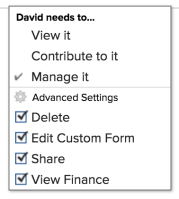

# Een uitgave delen

Uw Adobe Workfront-beheerder verleent gebruikers toegang tot weergave- of bewerkingsproblemen wanneer zij toegangsniveaus toewijzen. Voor meer informatie over het verlenen van toegang tot kwesties, zie [Toegang verlenen tot kwesties](../../administration-and-setup/add-users/configure-and-grant-access/grant-access-issues.md).

Samen met het toegangsniveau dat gebruikers wordt verleend, kunt u hen toestemmingen aan Mening, Contribute, of Manage ook verlenen specifieke kwesties die u toegang hebt om te delen. Voor meer informatie over toegangsniveaus en toestemmingen, zie [Hoe de toegangsniveaus en de toestemmingen samenwerken](../../administration-and-setup/add-users/access-levels-and-object-permissions/how-access-levels-permissions-work-together.md).

Machtigingen gelden specifiek voor één item in Workfront en definiëren welke handelingen u op dat item kunt uitvoeren.

## Overwegingen bij het delen van problemen

Naast de onderstaande overwegingen, zie ook [Overzicht van het delen van machtigingen voor objecten](../../workfront-basics/grant-and-request-access-to-objects/sharing-permissions-on-objects-overview.md).

>[!NOTE]
>
>Een Workfront-beheerder kan machtigingen toevoegen of verwijderen voor alle items in het systeem, zonder de eigenaar van die items te zijn.

* De maker van een uitgave heeft er standaard beheerdersmachtigingen voor.
* U kunt kwesties individueel delen, of u kunt verscheidene van hen tegelijkertijd delen. Delen is hetzelfde als delen van andere objecten in Workfront. Ga voor meer informatie over het delen van objecten in Workfront naar [Een object delen](../../workfront-basics/grant-and-request-access-to-objects/share-an-object.md).
* U kunt de volgende toestemmingen aan een kwestie verlenen: 

   * Weergave

      

   * Beheren

      

   * Contribute\
      

* Als u een uitgave deelt, nemen alle documenten die aan de uitgave zijn gekoppeld dezelfde machtigingen over.

   De Workfront-beheerder kan opgeven of documenten machtigingen van hogere objecten moeten overnemen op het toegangsniveau van de gebruiker. Zie voor meer informatie over het beperken van overerfde machtigingen voor documenten [Aangepaste toegangsniveaus maken of wijzigen](../../administration-and-setup/add-users/configure-and-grant-access/create-modify-access-levels.md).

* U kunt overgeërfde machtigingen verwijderen uit een uitgave. Zie voor meer informatie [Rechten van objecten verwijderen](../../workfront-basics/grant-and-request-access-to-objects/remove-permissions-from-objects.md).

## Manieren om een probleem te delen

* Handmatig, wat vergelijkbaar is met het delen van andere objecten in Workfront. Ga voor meer informatie over het delen van objecten in Workfront naar [Een object delen](../../workfront-basics/grant-and-request-access-to-objects/share-an-object.md).
* Automatisch, door één van het volgende te doen:

   * Geef de machtigingen op voor een van de bovenliggende objecten van de uitgave: project, programma of portfolio. De kwesties erven de toestemmingen van hun oudervoorwerpen. Voor informatie over het weergeven van overgeërfde machtigingen voor objecten raadpleegt u [Overerfde machtigingen voor objecten weergeven](../../workfront-basics/grant-and-request-access-to-objects/view-inherited-permissions-on-objects.md).
   * Voeg entiteiten aan het Delen van het Project op een malplaatje toe dat wordt gebruikt om het project tot stand te brengen de kwestie is. Voor informatie over het delen van projecten van malplaatjes, zie [Een sjabloon delen](../../workfront-basics/grant-and-request-access-to-objects/share-a-template.md).

   * Specificeer de toestemmingen op alle kwesties in een project wanneer u het project uitgeeft. Voor informatie over het beheren van de toegang tot kwesties of verzoeken op het project dat op de toestemmingen van een gebruiker aan het project wordt gebaseerd, zie  in het artikel [Projecten bewerken](../../manage-work/projects/manage-projects/edit-projects.md).

      >[!TIP]
      >
      >Als u niet specificeert welke uitgevende toestemmingen u gebruikers wilt hebben wanneer zij aan de kwesties op het project worden toegewezen, ontvangen zij de zelfde toestemmingen die zij op het project hebben, door gebrek.

   * Geef de machtigingen op die gebruikers ontvangen bij problemen die ze in een aanvraagwachtrij verzenden wanneer ze een aanvraagwachtrij maken. Zie voor meer informatie [Een aanvraagwachtrij maken](../../manage-work/requests/create-and-manage-request-queues/create-request-queue.md).

      >[!IMPORTANT]
      >
      >De toestemmingen worden verleend verschillend afhankelijk van al dan niet het project als verzoekrij wordt gepubliceerd:
      >
      >   
      >   
      >   * Wanneer een gebruiker een verzoek naar een project voorlegt dat als verzoekrij wordt gepubliceerd, wordt het Primaire Contact en ingegaan door gebruikers verleend de gespecificeerde toestemming.
      >   * Wanneer een gebruiker een verzoek naar een project indient dat niet als verzoekrij wordt gepubliceerd, wordt het Primaire Contact (als verschillend van ingegaan door gebruiker) de gespecificeerde toestemming verleend, en de Ingegaan door gebruiker wordt verleend leidt toestemmingen aan de kwestie.

<!--

<h2>Automatically share an issue at the project level</h2>

(NOTE: this info duplicates in Edit projects - linked there instead (above).)&nbsp;

As the Project Owner, you can grant permissions automatically to users as the issues are added to a project.

<ol>
<li value="1">Go to the project whose issues you want to share automatically.</li>
<li value="2"> Click the More menu , then click <strong>Edit</strong>. </li>
<li value="3">In the <strong>Edit Project</strong> box that displays, click <strong>Access</strong>.</li>
<li value="4">In the <strong>When someone is assigned to an ISSUE</strong> field, select from the following permissions levels:
<ul>
<li><strong>View</strong></li>
<li><strong>Contribute</strong></li>
<li><strong>Manage</strong> Now, when someone is assigned to an issue on the selected project, they are granted the specified permissions to the issue.&nbsp;</li>
</ul></li>
<li value="5">(Optional) Select the <strong>Also grant ... access to the project</strong> field to also grant View, Contribute, or Manage permissions to the projects to the user assigned to the issue</li>
<li value="6">In the <strong>When someone submits a REQUEST ...</strong> field, select from the following permissions levels:
<ul>
<li><strong>View</strong></li>
<li><strong>Contribute</strong></li>
<li>
<strong>Manage</strong>
<note type="important">

Permissions are granted differently depending on whether or not the project is published as a request queue:

<ul>
<li>When a user submits a request to a project published as a request queue, the Primary Contact and Entered By users are granted the permission specified.</li>
<li>When a user submits a request to a project not published as a request queue, the Primary Contact (if different from Entered By user) is granted the permission specified, and the Entered By user is granted Manage permissions to the issue.</li>
</ul>
</note></li>
</ul></li>
<li value="7"> 
(Optional) Select the <strong>People from the same company will inherit the same permissions for all requests</strong> field.
 
People from the same company as the user submitting the request are granted the same permissions on the requests as the user.&nbsp;
 </li>
<li value="8">Click <strong>Save Changes</strong>.</li>
</ol>

-->

<!--

<h2>Automatically share an issue in request queues</h2>

(NOTE: drafted because it's duplicated from Create a Request Queue which is linked above)&nbsp;

As the Project Owner, you can grant permissions automatically to users as the issues are submitted to a request queue.

<ol>
<li value="1">Go to the project whose issues you want to share automatically.</li>
<li value="2">Click <strong>Edit Project</strong>.</li>
<li value="3">Click <strong>More</strong> then click <strong>Queue Setup</strong>. </li>
<li value="4"> 
On the <strong>Queue Details</strong> sub-tab, in the drop-down menu under <strong>When someone makes a request, automatically grant</strong>, select from the following permissions levels:

<ul>
<li><strong>View Access</strong> </li>
<li><strong>Contribute Access</strong> </li>
<li> 
<strong>Manage Access</strong> 
 </li>
</ul> 
Now, when someone submits a request to the selected project, they are granted the specified permissions to the request.
 </li>
<li value="5"> 
(Optional) Select the <strong>People from the same company will inherit the same permissions for all requests</strong>.
 
People from the same company as the user submitting the request are granted the same permissions on the requests as the user.&nbsp;
 </li>
<li value="6">Click <strong>Save</strong>.</li>
</ol>

-->

## Machtigingen voor afgifte

In de volgende tabel wordt weergegeven welke machtigingen u gebruikers kunt verlenen wanneer u hen toestaat een uitgave weer te geven, bij te dragen of te beheren:

<table style="table-layout:auto"> 
 <col> 
 <col> 
 <col> 
 <col> 
 <tbody> 
  <tr> 
   <td><strong>Handelingen</strong> </td> 
   <td><strong>Beheren</strong> </td> 
   <td><strong>Contribute</strong> </td> 
   <td><strong>Weergave</strong> </td> 
  </tr> 
  <tr> 
   <td> 
Problemen toevoegen
 </td> 
   <td>✓</td> 
   <td> </td> 
   <td> </td> 
  </tr> 
  <tr> 
   <td>Verwijderen </td> 
   <td>✓</td> 
   <td> </td> 
   <td> </td> 
  </tr> 
  <tr> 
   <td>Aangepast formulier bijvoegen</td> 
   <td>✓</td> 
   <td> </td> 
   <td> </td> 
  </tr> 
  <tr> 
   <td>Aangepaste velden bewerken</td> 
   <td>✓</td> 
   <td>✓</td> 
   <td> </td> 
  </tr> 
  <tr> 
   <td>Probleem goedkeuren</td> 
   <td>✓</td> 
   <td>✓</td> 
   <td>✓</td> 
  </tr> 
  <tr> 
   <td>Een goedkeuringsproces toevoegen</td> 
   <td>✓</td> 
   <td> </td> 
   <td> </td> 
  </tr> 
  <tr> 
   <td>Documenten toevoegen</td> 
   <td>✓</td> 
   <td>✓</td> 
   <td>✓</td> 
  </tr> 
  <tr> 
   <td>Probleem kopiëren*</td> 
   <td>✓</td> 
   <td>✓</td> 
   <td>✓</td> 
  </tr> 
  <tr> 
   <td>Probleem verplaatsen</td> 
   <td>✓</td> 
   <td> </td> 
   <td> </td> 
  </tr> 
  <tr> 
   <td>Logboekuren</td> 
   <td>✓</td> 
   <td>✓</td> 
   <td> </td> 
  </tr> 
  <tr> 
   <td>Omzetten in project*</td> 
   <td>✓</td> 
   <td> </td> 
   <td> </td> 
  </tr> 
  <tr> 
   <td>Toewijzing accepteren</td> 
   <td>✓</td> 
   <td>✓</td> 
   <td> </td> 
  </tr> 
  <tr> 
   <td>Updates/opmerkingen</td> 
   <td>✓</td> 
   <td>✓</td> 
   <td>✓</td> 
  </tr> 
  <tr> 
   <td>Geplande datums wijzigen</td> 
   <td>✓</td> 
   <td> </td> 
   <td> </td> 
  </tr> 
  <tr> 
   <td>Toewijzingen maken</td> 
   <td>✓</td> 
   <td>✓</td> 
   <td> </td> 
  </tr> 
  <tr> 
   <td>Delen</td> 
   <td>✓</td> 
   <td>✓</td> 
   <td>✓</td> 
  </tr> 
  <tr> 
   <td>Delen op systeemniveau</td> 
   <td> </td> 
   <td> </td> 
   <td>✓</td> 
  </tr> 
 </tbody> 
</table>

&#42;Gecontroleerd door de toegangsniveaus en de toestemmingen op het project.
