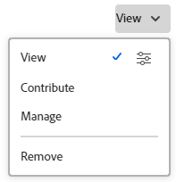

# Een object delen

<!--Audited: 01/2024-->

Uw Adobe Workfront-beheerder verleent gebruikers toegang tot weergave- of bewerkingsobjecten wanneer zij toegangsniveaus toewijzen. Voor meer informatie over het verlenen van toegang tot voorwerpen, zie [ tot douanetoegangsniveaus ](../../administration-and-setup/add-users/configure-and-grant-access/create-modify-access-levels.md) leiden of wijzigen.

Samen met het toegangsniveau dat de gebruikers worden verleend, kunt u hen toestemmingen ook verlenen om specifieke voorwerpen te bekijken of uit te geven die u creeerde of toegang om hebt te delen. Voor meer informatie over toegangsniveaus en toestemmingen, zie [ hoe de toegangsniveaus en de toestemmingen samen ](../../administration-and-setup/add-users/access-levels-and-object-permissions/how-access-levels-permissions-work-together.md) werken.

Machtigingen gelden specifiek voor één item in Workfront en definiëren welke handelingen u op dat item kunt uitvoeren.

Voor informatie over het delen van toestemmingen op voorwerpen, zie [ Overzicht van het delen van toestemmingen op voorwerpen ](../../workfront-basics/grant-and-request-access-to-objects/sharing-permissions-on-objects-overview.md).

>[!NOTE]
>
>Een Workfront-beheerder kan machtigingen toevoegen of verwijderen voor alle items in het systeem, zonder de eigenaar van die items te zijn.

In dit artikel wordt beschreven hoe u de volgende objecten kunt delen:

* Projecten, taken, problemen
* Portfolio&#39;s, programma&#39;s
* Documenten

Zie ook de volgende artikelen voor informatie over het delen van alle andere objecten in Workfront:

* Voor malplaatjes, zie [ het projectmalplaatjes van het Aandeel ](../../manage-work/projects/create-and-manage-templates/share-project-template.md).
* Voor proeven, zie [ een Bewijs van het Aandeel in Workfront Proof ](../../workfront-proof/wp-work-proofsfiles/share-proofs-and-files/share-proof.md).
* Raadpleeg de volgende artikelen voor rapporten, dashboards en kalenders:

   * [Een rapport delen in Adobe Workfront](../../reports-and-dashboards/reports/creating-and-managing-reports/share-report.md)
   * [Een dashboard delen](../../reports-and-dashboards/dashboards/creating-and-managing-dashboards/share-dashboard.md)
   * [Een kalenderrapport delen](../../reports-and-dashboards/reports/calendars/share-a-calendar-report.md)

  Bovendien, zie [ rapporten van het Aandeel, dashboards, en kalenders ](../../workfront-basics/grant-and-request-access-to-objects/permissions-reports-dashboards-calendars.md) voor algemene informatie over het delen van rapporten, dashboards, en kalenders.

* Voor filters, meningen, en groeperingen, zie [ een filter, een mening, of het groeperen ](../../reports-and-dashboards/reports/reporting-elements/share-filter-view-grouping.md) delen.
* Voor documentomslagen, zie [ een documentomslag ](../../workfront-basics/grant-and-request-access-to-objects/share-a-document-folder.md) delen.
* Voor plannen, zie [ een plan in de Planner van het Scenario ](../../scenario-planner/share-a-plan.md) delen.

  Voor Workfront Scenario Planner is mogelijk een aanvullende licentie vereist.

* Voor doelstellingen, zie [ een doel in de Doelen van Workfront delen ](../../workfront-goals/workfront-goals-settings/share-a-goal.md).

  Voor Workfront Goals is mogelijk een extra licentie nodig.

* Zie de volgende artikelen voor Workfront Planning-objecten:

   * [Weergaven delen](/help/quicksilver/planning/access/share-views.md)
   * [Werkruimten delen](/help/quicksilver/planning/access/share-workspaces.md)

  Voor toegang tot Workfront Planning is een extra licentie vereist.

## Toegangsvereisten

+++ Breid uit om de toegangseisen voor de functionaliteit in dit artikel weer te geven.

U moet het volgende hebben om objecten te delen:

<table style="table-layout:auto"> 
 <col> 
 <col> 
 <tbody> 
  <tr> 
   <td role="rowheader">Adobe Workfront-plan</td> 
   <td> 
Alle 
 </td> 
  </tr> 
  <tr> 
   <td role="rowheader">Adobe Workfront-licentie*</td> 
   <td> 
Nieuwe licentie: standaard
 
   of
   
Huidige licentie: werken of hoger

   </td> 
  </tr> 
  <tr> 
   <td role="rowheader">Configuraties op toegangsniveau</td> 
   <td> 
Toegang tot of hoger weergeven voor de objecten die u wilt delen
 </td> 
  </tr> 
  <tr> 
   <td role="rowheader">Objectmachtigingen</td> 
   <td> 
Machtigingen of hoger weergeven voor de objecten die u wilt delen
</td> 
  </tr> 
 </tbody> 
</table>

*Voor meer informatie, zie [ vereisten van de Toegang in de documentatie van Workfront ](/help/quicksilver/administration-and-setup/add-users/access-levels-and-object-permissions/access-level-requirements-in-documentation.md).

+++

## Een project, taak of uitgave delen vanaf de bijbehorende pagina

1. Ga naar de project-, taak- of uitgavepagina die u wilt delen.

   Voor informatie over welke voorwerpen kunnen worden gedeeld, zie [ Overzicht van het delen van toestemmingen op voorwerpen ](../../workfront-basics/grant-and-request-access-to-objects/sharing-permissions-on-objects-overview.md).

1. Klik de **knoop van het Aandeel** naast de objecten naam.

   

1. In de **toegang van de Verlening tot** doos, begin typend de naam van de gebruiker, het team, de rol, de groep, of het bedrijf met wie u het voorwerp wilt delen, dan klik de naam wanneer het in de drop-down lijst verschijnt.

   {width="350"}

   >[!TIP]
   >
   >U kunt een object alleen delen met actieve gebruikers, teams, rollen of bedrijven.

   >[!TIP]
   >
   >Als u meerdere entiteiten een soortgelijke naam hebt gegeven, worden deze allemaal vermeld onder hun type. De namen van de entiteiten worden in alfabetische volgorde weergegeven. De volgorde waarin de entiteitstypen worden weergegeven, is echter willekeurig.
   >

1. (Optioneel) Herhaal stap 3 voor elke gebruiker, elk team, elke rol of elke groep aan wie u toegang tot het object wilt verlenen.

1. Specificeer de toestemmingen voor elke gebruiker, het team, de rol, de groep, of het bedrijf die u in Stap 3 toevoegde door het drop-down menu rechts van hun naam te klikken, dan het toestemmingsniveau te selecteren dat u wilt verlenen.

   

   Voor het verwijderen van toestemmingen uit een voorwerp, zie [ toestemmingen uit voorwerpen ](/help/quicksilver/workfront-basics/grant-and-request-access-to-objects/remove-permissions-from-objects.md) verwijderen.

   De volgende opties zijn beschikbaar:

   * **Mening:** de Gebruikers kunnen het punt herzien en delen.
   * **draag** bij: De gebruikers kunnen updates maken, logboekinformatie, minder belangrijke uitgeven maken, en delen, plus alle toestemmingen van de Mening.
   * **leidt:** de gebruikers hebben volledige toegang tot het voorwerp zonder administratieve rechten (die op het toegangsniveau worden verleend). Bovendien beschikken ze over alle machtigingen Weergeven en Contribute.

     >[!NOTE]
     >
     >De Workfront-beheerder of de maker van het object kan machtigingen van deze entiteiten verwijderen.

1. (Optioneel) Klik op het pictogram Geavanceerde opties naast het machtigingsniveau dat u hebt toegekend om specifieke machtigingen voor het object te configureren.

   

   Afhankelijk van het geselecteerde object zijn er verschillende geavanceerde opties voor weergave, beheer en Contribute.

   Voor meer informatie over toestemmingsniveaus, zie [ Overzicht van het delen van toestemmingen op voorwerpen ](../../workfront-basics/grant-and-request-access-to-objects/sharing-permissions-on-objects-overview.md).

1. (Facultatief) om dit voorwerp beschikbaar te maken aan alle gebruikers in het systeem, klik dropdown menu onder **die toegang** heeft, dan in het drop-down menu klikt **iedereen in het systeem kan** bekijken.

   

   Alle gebruikers kunnen het object zien op basis van de machtigingen die u instelt.

1. (Facultatief en voorwaardelijk) wanneer het delen van een project, klik het **pictogram van het Gaan , dan controleer de doos naast** Reeks als mijn malplaatje van de projecttoegang **om de toestemmingen als malplaatje te plaatsen.**

   Nadat u toestemmingen op één project hebt bepaald, worden deze zelfde toestemmingen automatisch toegepast de volgende tijd u een project van kras creeert.

   >[!NOTE]
   >
   >Het malplaatje van de projecttoegang treedt de het delen gebreken met voeten die aan u door de beheerder van Workfront in uw Niveau van de Toegang worden verleend.\
   >Voor meer informatie over het specificeren van het delen van gebreken voor projecten in het Niveau van de Toegang, zie [ Toegang van de Verlening tot projecten ](../../administration-and-setup/add-users/configure-and-grant-access/grant-access-projects.md)

   <!--
   >this note also appears in Understanding Project Permissions-->

   U kunt toestemmingen op de projecten specificeren die van een malplaatje zullen worden gecreeerd wanneer u het malplaatje deelt. Voor meer informatie, zie [ het projectmalplaatjes van het Aandeel ](../../manage-work/projects/create-and-manage-templates/share-project-template.md).

1. (Voorwaardelijk) om het voorwerp met gebruikers snel te delen die toegang hebben, klik **verbinding van het Exemplaar**.

1. Klik **sparen**.

## Een document, portfolio of programma delen vanaf de pagina

1. Ga naar de document-, portfolio- of programmapagina die u wilt delen.

   Voor informatie over welke voorwerpen kunnen worden gedeeld, zie [ Overzicht van het delen van toestemmingen op voorwerpen ](../../workfront-basics/grant-and-request-access-to-objects/sharing-permissions-on-objects-overview.md).

1. Voor portefeuilles en programma&#39;s:

   Klik de **knoop van het Aandeel** naast de objecten naam.

   

   of

   Voor documenten:

   Klik **Meer** pictogram  naast de objecten naam, dan klik **Aandeel**.

   

1. In **geef &lt; de Naam van Objecten > toegang tot** gebied, begin typend de naam van de gebruiker, het team, de rol, de groep, of het bedrijf met wie u het voorwerp wilt delen, dan klik de naam wanneer het in de drop-down lijst verschijnt.

   

   >[!TIP]
   >
   >* Als u meerdere entiteiten een soortgelijke naam hebt gegeven, worden deze allemaal vermeld onder hun type. De namen van de entiteiten worden in alfabetische volgorde weergegeven. De volgorde waarin de entiteitstypen worden weergegeven, is echter willekeurig.
   >
   >* U kunt een object alleen delen met actieve gebruikers, teams, rollen of bedrijven.

1. (Optioneel) Herhaal stap 3 voor elke gebruiker, elk team, elke rol of elke groep aan wie u toegang tot het object wilt verlenen.

1. Specificeer de toestemmingen voor elke gebruiker, het team, de rol, de groep, of het bedrijf die u in Stap 3 toevoegde door het drop-down menu te klikken, dan het toestemmingsniveau te selecteren dat u wilt verlenen.

   Voor het verwijderen van toestemmingen uit een voorwerp, zie [ toestemmingen uit voorwerpen ](/help/quicksilver/workfront-basics/grant-and-request-access-to-objects/remove-permissions-from-objects.md) verwijderen.

   De volgende opties zijn beschikbaar:

   * **Mening:** de Gebruikers kunnen het punt herzien en delen.
   * **leidt:** de gebruikers hebben volledige toegang tot het voorwerp zonder administratieve rechten (die op het toegangsniveau worden verleend). Bovendien beschikken ze over alle machtigingen Weergeven en Contribute.

     >[!NOTE]
     >
     >De Workfront-beheerder of de maker van het object kan machtigingen van deze entiteiten verwijderen.

     

1. (Facultatief) klik **Geavanceerde Montages** om specifieke toestemmingen op het voorwerp te vormen.

   Afhankelijk van het geselecteerde object zijn er verschillende geavanceerde opties voor weergave en beheer.\
   Voor meer informatie over de toestemmingsniveaus, zie [ Overzicht van het delen van toestemmingen op voorwerpen ](../../workfront-basics/grant-and-request-access-to-objects/sharing-permissions-on-objects-overview.md).

1. (Facultatief) om dit voorwerp ter beschikking te stellen van alle gebruikers in het systeem, klik **het pictogram van het Verraad** , dan in het drop-down menu klikt **maakt dit zichtbare systeem-breed**.

   Alle gebruikers kunnen het object zien op basis van de machtigingen die u instelt.

1. (Facultatief) om het voorwerp openbaar te maken, klik **maak dit openbaar aan externe gebruikers**.

   >[!TIP]
   >
   >Deze optie is niet beschikbaar voor alle objecten.

   {width="350"}

1. (Voorwaardelijk) als u het voorwerp aan externe gebruikers openbaar maakte, klik **exemplaarverbinding**, dan verdeel de verbinding aan externe gebruikers.

   Gebruikers met de koppeling kunnen het object weergeven.

   >[!CAUTION]
   >
   >We raden u aan voorzichtig te zijn wanneer u een object met vertrouwelijke informatie deelt met externe gebruikers. Op deze manier kunnen ze informatie weergeven zonder dat ze een Workfront-gebruiker of onderdeel van uw organisatie zijn.

1. Klik **sparen**.

## Enkelvoudige of bulkobjecten uit een lijst delen

1. Ga naar de lijst met de objecten die u wilt delen.

   Voor informatie over welke voorwerpen kunnen worden gedeeld, zie [ Overzicht van het delen van toestemmingen op voorwerpen ](../../workfront-basics/grant-and-request-access-to-objects/sharing-permissions-on-objects-overview.md).

1. Klik checkbox naast de voorwerp(s) u zou willen delen, dan het **pictogram van het Aandeel**  bij de bovenkant van de pagina klikken.

   Het vak **&lt; Object > Toegang** wordt geopend.

   {width="350"}

1. In **geef &lt; de Naam van Objecten > toegang voor** doos uit, begin typend de naam van de gebruiker, het team, de rol, de groep, of het bedrijf met wie u de voorwerpen wilt delen, dan klik de naam wanneer het in de drop-down lijst verschijnt.

   {width="350"}

   >[!TIP]
   >
   >* U kunt een object alleen delen met actieve gebruikers, teams, rollen of bedrijven.
   >
   >
   >* Als u meerdere entiteiten een soortgelijke naam hebt gegeven, worden deze allemaal vermeld onder hun type. De namen van de entiteiten worden in alfabetische volgorde weergegeven. De volgorde waarin de entiteitstypen worden weergegeven, is echter willekeurig.
   >

1. (Optioneel) Herhaal stap 3 voor elke gebruiker, team, rol of groep aan wie u toegang wilt verlenen tot de objecten.

1. Specificeer de toestemmingen voor elke gebruiker, het team, de rol, de groep, of het bedrijf die u in Stap 3 toevoegde door het drop-down menu rechts van hun naam te klikken, dan het toestemmingsniveau te selecteren dat u wilt verlenen.

   Voor het verwijderen van toestemmingen uit een voorwerp, zie [ toestemmingen uit voorwerpen ](/help/quicksilver/workfront-basics/grant-and-request-access-to-objects/remove-permissions-from-objects.md) verwijderen.

   

   De volgende opties zijn beschikbaar:

   * **Mening:** de Gebruikers kunnen het punt herzien en delen.
   * **draag** bij: De gebruikers kunnen updates maken, logboekinformatie, minder belangrijke uitgeven maken, en delen, plus alle toestemmingen van de Mening.

     >[!TIP]
     >
     >U kunt Contribute-machtigingen alleen verlenen voor de volgende objecten:
     >
     >* Projecten
     >* Taken
     >* Problemen
     >

   * **leidt:** de gebruikers hebben volledige toegang tot het voorwerp zonder administratieve rechten (die op het toegangsniveau worden verleend). Bovendien beschikken ze over alle machtigingen Weergeven en Contribute.

     >[!NOTE]
     >
     >De Workfront-beheerder of de maker van het object kan machtigingen van deze entiteiten verwijderen.

1. (Facultatief) klik **Geavanceerde Montages** om specifieke toestemmingen op het voorwerp te vormen.

   Afhankelijk van het geselecteerde object zijn er verschillende geavanceerde opties voor weergave, beheer en Contribute.\
   Voor meer informatie over de toestemmingsniveaus, zie [ Overzicht van het delen van toestemmingen op voorwerpen ](../../workfront-basics/grant-and-request-access-to-objects/sharing-permissions-on-objects-overview.md).

   

1. (Facultatief) om dit voorwerp ter beschikking te stellen van alle gebruikers in het systeem, klik **het pictogram van het Verraad** , dan in het drop-down menu klikt **maakt dit zichtbare systeem-breed**.

   Alle gebruikers kunnen de objecten zien op basis van de machtigingen die u instelt.

1. (Facultatief en voorwaardelijk) wanneer het delen van een project, klik het **pictogram van het Gaan , dan in het drop-down menu klikt** Reeks als mijn malplaatje van de projecttoegang **om de toestemmingen als malplaatje te plaatsen.**

   Nadat u toestemmingen op één project hebt bepaald, worden deze zelfde toestemmingen automatisch toegepast de volgende tijd u een project van kras creeert.

   >[!NOTE]
   >
   >Het malplaatje van de projecttoegang treedt de het delen gebreken met voeten die aan u door de beheerder van Workfront in uw Niveau van de Toegang worden verleend.\
   >Voor meer informatie over het specificeren van het delen van gebreken voor projecten in het Niveau van de Toegang, zie [ Toegang van de Verlening tot projecten ](../../administration-and-setup/add-users/configure-and-grant-access/grant-access-projects.md)

   <!--
   >this note also appears in Understanding Project Permissions-->

   U kunt toestemmingen op de projecten specificeren die van een malplaatje zullen worden gecreeerd wanneer u het malplaatje deelt. Voor meer informatie, zie [ het projectmalplaatjes van het Aandeel ](../../manage-work/projects/create-and-manage-templates/share-project-template.md).

1. (Facultatief) om de voorwerp(en) openbaar te maken, klik **maak dit openbaar aan externe gebruikers**.

   >[!TIP]
   >
   >Deze optie is niet beschikbaar voor alle objecten.

   {width="350"}

1. (Voorwaardelijk) als u het voorwerp (de voorwerpen) openbaar aan externe gebruikers maakte, klik **exemplaarverbinding**, dan verdeel de verbinding aan externe gebruikers.

   Gebruikers met de koppeling kunnen het object weergeven.

   >[!CAUTION]
   >
   >We raden u aan voorzichtig te zijn wanneer u een object met vertrouwelijke informatie deelt met externe gebruikers. Op deze manier kunnen ze informatie weergeven zonder dat ze een Workfront-gebruiker of onderdeel van uw organisatie zijn.

1. Klik **sparen**.
