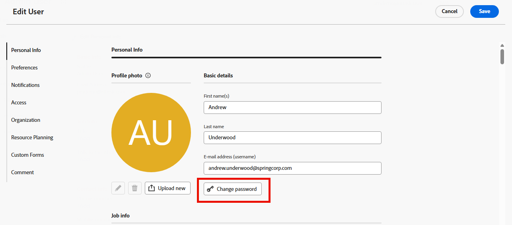

# Wachtwoord opnieuw instellen

{{important-not-on-aec}}

U kunt het wachtwoord van [!DNL Adobe Workfront] opnieuw instellen. Als belangrijke veiligheidsmaatregel, adviseren wij dat u dit regelmatig doet.

>[!NOTE]
>
>Een [!DNL Workfront] beheerder kan de beperkingen van het douanewachtwoord vormen, zoals die in [ worden verklaard vormt de voorkeur van de systeemveiligheid ](../../../administration-and-setup/manage-workfront/security/configure-security-preferences.md) en [ vormt wachtwoordbeleid voor authentificatie ](../../../administration-and-setup/manage-workfront/security/configure-password-policies-authentication.md).
>
><!-- [!DNL Workfront] administrator can also reset your password in an Enhanced Authentication enabled environment. For more information, see [Reset a user's password with Enhanced Authentication](../../../workfront-basics/manage-your-account-and-profile/managing-your-workfront-account/reset-user-password-eauth.md).-->

## Toegangsvereisten

+++ Breid uit om de toegangseisen voor de functionaliteit in dit artikel weer te geven. 

U moet het volgende hebben:

<table style="table-layout:auto"> 
 <col> 
 </col> 
 <col> 
 </col> 
 <tbody> 
  <tr> 
   <td role="rowheader"><strong>[!DNL Adobe Workfront] plan</strong></td> 
   <td> 
Alle
 </td> 
  </tr> 
  <tr> 
   <td role="rowheader"><strong>[!DNL Adobe Workfront] licentie</strong></td> 
   <td> 
      
Nieuw:

         <ul>
         <li>
Medewerker of hoger
</li>
         </ul>
      
Huidige:

         <ul>
         <li>
Aanvraag of hoger
</li>
         </ul>
   </td>
  </tr> 
 </tbody> 
</table>

Voor informatie, zie [ vereisten van de Toegang in de documentatie van Workfront ](/help/quicksilver/administration-and-setup/add-users/access-levels-and-object-permissions/access-level-requirements-in-documentation.md).

+++

## Uw wachtwoord opnieuw instellen in [!DNL Adobe Workfront]

{{step1-click-profile-pic}}

1. Klik **[!UICONTROL More menu]** , dan klik **[!UICONTROL Edit]**.

1. Klik onder **[!UICONTROL Edit Person]** in het vak **[!UICONTROL Personal Info]** dat wordt weergegeven op **[!UICONTROL Change password]** .

   

   Als uw organisatie [!DNL Workfront] met een oplossing SSO heeft geïntegreerd, kunt u worden verpletterd om uw wachtwoorden door uw SSO systeem terug te stellen wanneer u **[!UICONTROL Change password]** klikt. Hiermee wordt uw SSO-wachtwoord opnieuw ingesteld, wat invloed heeft op het aanmelden bij al uw andere toepassingen binnen uw organisatie.

1. Typ uw oude wachtwoord en typ het nieuwe wachtwoord dat u twee keer wilt.

   Uw wachtwoord moet ten minste 8 tekens hebben en twee van de volgende typen tekens bevatten:

   * Hoofdletters
   * Kleine letters
   * Getallen
   * Speciale tekens (zoals ! @ # $ %)

   De regels van het wachtwoord kunnen strenger zijn dan dit, afhankelijk van configuratiemontages die door uw [!DNL Workfront] beheerder worden geplaatst.

1. Klik op **[!UICONTROL Save]**.
