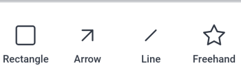

# Opmerking over proefdrukken in [!DNL Android]

U kunt bestaande opmerkingen op een proefdruk controleren en oplossen en nieuwe opmerkingen en annotaties toevoegen aan het proefdrukdocument.

Uw toegang tot opmerkingen over proefdrukken is gelijk aan die in [!DNL Adobe Workfront] . Voor informatie over het proefdrukken van mogelijkheden, zie [&#x200B; Profielen van de Toestemmingen van de Bewijs in  [!DNL Workfront Proof]](../../../workfront-proof/wp-acct-admin/account-settings/proof-perm-profiles-in-wp.md).

>[!NOTE]
>
>Als de eigenaar van de proefdruk de proefdruk heeft vergrendeld, kunt u er geen opmerkingen over maken. Voor meer informatie, zie [&#x200B; Slot en ontgrendel een proef &#x200B;](../../../workfront-basics/mobile-apps/using-the-workfront-mobile-app/work-with-proofs-in-mobile-app.md#lock) in het artikel [&#x200B; Overzicht en maak besluiten over proeven in  [!DNL Adobe Workfront]  mobiele app &#x200B;](../../../workfront-basics/mobile-apps/using-the-workfront-mobile-app/work-with-proofs-in-mobile-app.md).

## Bestaande opmerkingen in een proefdruk bekijken

U kunt opmerkingen bekijken die zijn gemaakt op een proefdrukdocument. Met opmerkingen worden vaak tekeningen toegevoegd die het gebied van het document aangeven waarnaar de opmerking verwijst. Tekeningen kunnen pijlen, lijnen, rechthoeken, markeringen en vrije tekeningen bevatten.

1. Open de proefdruk van het document. Voor informatie, zie [&#x200B; Overzicht en maak besluiten over proeven in  [!DNL Adobe Workfront]  mobiele app &#x200B;](../../../workfront-basics/mobile-apps/using-the-workfront-mobile-app/work-with-proofs-in-mobile-app.md).
1. Selecteer een commentaarpictogram op het pictogram van de documentpagina  om de commentaar en om het even welke bijbehorende tekeningen en gehechtheid te openen.

   Als de opmerking meerdere antwoorden bevat, kunt u **[!UICONTROL View Replies]** selecteren om alle reacties weer te geven of het opmerkingsblad omhoog en omlaag vegen om meer inhoud weer te geven.

1. Selecteer de miniatuur van de opmerking als u een bijlage op de opmerking wilt weergeven. Volg de aanwijzingen om het bijlagebestand naar het apparaat te downloaden.
1. Om op de commentaar te antwoorden, typ uw reactie in het tekstvakje onder de commentaar en selecteer het **[!UICONTROL Send]** pictogram .

### De lijst met opmerkingen gebruiken

1. Om een lijst van alle commentaren in orde door paginanummer te zien, selecteer het commentaarpictogram  op het hoogste recht.

   Het aantal ongelezen opmerkingen wordt aangegeven op het pictogram voor opmerkingen.  Ongelezen commentaren in de lijst zijn duidelijk met een blauwe punt. Opmerkingen met bijlagen hebben een pictogram voor een papieren clip ![[!UICONTROL Attachment] &#x200B;](assets/mobile-paper-clip-icon.png) .

1. Selecteer in de lijst een afzonderlijke opmerking om de opmerking en de bijbehorende tekeningen op de documentpagina weer te geven.
1. Selecteer de X om de lijst met opmerkingen te sluiten en terug te keren naar de proefdruk.

### Handeling maken op opmerkingen in de selectieweergave

>[!NOTE]
>
>De opties in het menu van de selectieweergave **[!UICONTROL More]** kunnen verschillen, afhankelijk van de instelling die de [!DNL Workfront] beheerder of de [!DNL Workfront Proof] beheerder heeft ingesteld.

1. Als u meer opties voor opmerkingen wilt zien, selecteert u ![[!UICONTROL List of comments] icon &#x200B;](assets/mobile-listofcommentsicon-30x27.png) rechtsboven in de lijst met opmerkingen.

   Naast elke opmerking wordt een selectievakje weergegeven.

   >[!NOTE]
   >
   >In de selectieweergave hebt u geen toegang tot de opmerkingen in het document. Selecteer de pijl linksboven om terug te keren naar de lijst met opmerkingen.

1. Tik op het selectievakje om een afzonderlijke opmerking te selecteren.

   Om alle commentaren te selecteren, selecteer het **[!UICONTROL More]** menu op het hoogste recht  en kies **[!UICONTROL Select All]**.

1. Als u de geselecteerde opmerking wilt oplossen, selecteert u ![[!UICONTROL Resolve comment] pictogram &#x200B;](assets/mobile-resolvecomment-icon-30x30.png) rechtsboven.

   U kunt slechts één opmerking tegelijk oplossen. De opmerking is gemarkeerd met een groen pictogram om aan te geven dat de opmerking is opgelost.

   De oorspronkelijke opmerking blijft in het document staan. Een opmerkingsresolutie wordt weergegeven als een antwoord op de oorspronkelijke opmerking: &quot;[!UICONTROL This thread was resolved by [name].]&quot;

   U kunt de resolutie ongedaan maken door de opgeloste opmerking te selecteren en het pictogram **[!UICONTROL Undo]** rechtsboven te selecteren.

1. Om de geselecteerde commentaren als gelezen te merken, selecteer het **[!UICONTROL Mark as read]** pictogram .

   Deze optie is alleen beschikbaar als u ongelezen opmerkingen hebt geselecteerd.

1. Om de geselecteerde commentaren te schrappen, selecteer het **[!UICONTROL More]** menu op het hoogste recht  en kies **[!UICONTROL Delete]**. Selecteer vervolgens **[!UICONTROL Delete]** in het bevestigingsbericht om de opmerking permanent te verwijderen.
1. Selecteer de pijl linksboven om de selectieweergave af te sluiten en terug te keren naar de lijst met opmerkingen.

## Opmerking over een proefdruk

U kunt uw proefdrukopmerkingen koppelen aan een specifiek gebied in het document. Gebruik de tekengereedschappen om een gebied te selecteren waarop u een opmerking wilt plaatsen.

1. Open de proefdruk van het document. Voor informatie, zie [&#x200B; Overzicht en maak besluiten over proeven in  [!DNL Adobe Workfront]  mobiele app &#x200B;](../../../workfront-basics/mobile-apps/using-the-workfront-mobile-app/work-with-proofs-in-mobile-app.md).
1. Selecteer een tekengereedschap op de werkbalk onder aan het proefdrukscherm.

   

   Schuif de werkbalk naar rechts als u het gewenste gereedschap niet ziet.

1. Selecteer **[!UICONTROL Settings]** naast de naam van het gereedschap om de kleur, dekking en dikte te definiëren. Selecteer het sterpictogram om deze opties als de standaardinstellingen voor het gereedschap te kiezen.

   

1. Teken de vorm op het proefdrukdocument. Selecteer het **[!UICONTROL Undo]** pictogram  om de tekening ongedaan te maken.
1. (Voorwaardelijk) Selecteer de vorm en kies **[!UICONTROL Settings]** om de vorminstellingen te bewerken of **[!UICONTROL Remove]** om de vorm te verwijderen.

   

1. Selecteer **[!UICONTROL Add Comment]**.
1. Typ de opmerking in het tekstvak.
1. Als u een contactpersoon op de opmerking wilt labelen, typt u het @-symbool of selecteert u ![[!UICONTROL Tag contact]](assets/mobile-tag-user-icon.png) om het @-symbool toe te voegen, typt u de naam van de contactpersoon die u wilt opnemen en klikt u op de naam wanneer deze wordt weergegeven in de vervolgkeuzelijst.

   De contactpersoon ontvangt een e-mailbericht wanneer de opmerking aan de proefdruk wordt toegevoegd.

1. Als u een bijlage aan de opmerking wilt toevoegen, selecteert u ![[!UICONTROL Attachment] icon &#x200B;](assets/mobile-paper-clip-icon.png) . Kies **[!UICONTROL Select a Document]** of **[!UICONTROL Take a Photo]** en volg de aanwijzingen om het bestand of de foto aan de opmerking te koppelen.

   Klik op de X in de miniatuurafbeelding om de bijlage te verwijderen.

1. Selecteer het **[!UICONTROL Send]** pictogram  om de commentaar en het trekken aan de proef toe te voegen.
