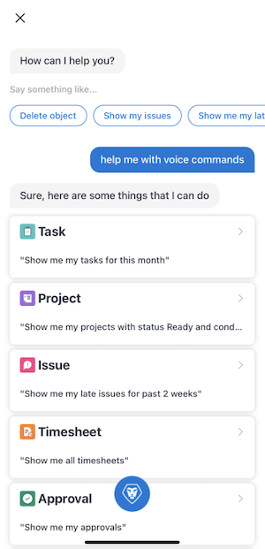

# [!DNL Adobe Workfront] virtuele mobiele app-assistent

Gebruik de [!DNL Adobe Workfront] virtuele assistent voor mobiele apps om informatie te zoeken, te verwijderen en te zoeken in [!DNL Workfront]. Bovendien kunt u virtuele hulpbevelen en vragen vastzetten om tot de resultaten op elk ogenblik toegang te hebben.

## Beschikbare opdrachten

Gebruik de volgende stembevelen om het werk in mobiele app te beheren:

* [[!UICONTROL Show me], [!UICONTROL Find], [!UICONTROL Search for]](#show-me-find-search-for)
* [[!UICONTROL Delete]](#delete)
* [[!UICONTROL Help me with commands]](#help-me-with-commands)

### [!UICONTROL Show me], [!UICONTROL Find], [!UICONTROL Search for]

Gebruik de [!UICONTROL show me] gebruiken voor informatie over de volgende objecten:

<table style="table-layout:auto"> 
 <col> 
 <col> 
 <col> 
 <col> 
 <tbody> 
  <tr> 
   <td> </td> 
   <td>Datum</td> 
   <td>[!UICONTROL Status]</td> 
   <td>[!UICONTROL Condition]</td> 
  </tr> 
  <tr> 
   <td> 
Taak
 </td> 
   <td>Ja</td> 
   <td>Ja</td> 
   <td>Ja</td> 
  </tr> 
  <tr> 
   <td>Probleem</td> 
   <td>Ja</td> 
   <td>Ja</td> 
   <td>Ja</td> 
  </tr> 
  <tr> 
   <td>Project</td> 
   <td>Ja</td> 
   <td>Ja</td> 
   <td>Ja</td> 
  </tr> 
  <tr> 
   <td>Tijdschema</td> 
   <td>Ja</td> 
   <td>Ja</td> 
   <td>Nee</td> 
  </tr> 
  <tr> 
   <td>Team</td> 
   <td>Nee</td> 
   <td>Nee</td> 
   <td>Nee</td> 
  </tr> 
  <tr> 
   <td>Goedkeuring</td> 
   <td>Ja</td> 
   <td>Nee</td> 
   <td>Nee</td> 
  </tr> 
  <tr> 
   <td>Programma</td> 
   <td>Ja</td> 
   <td>Nee</td> 
   <td>Nee</td> 
  </tr> 
  <tr> 
   <td>Portfolio</td> 
   <td>Ja</td> 
   <td>Nee</td> 
   <td>Nee</td> 
  </tr> 
  <tr> 
   <td>Rapport</td> 
   <td>Ja</td> 
   <td>Nee</td> 
   <td>Nee</td> 
  </tr> 
  <tr> 
   <td>Dashboard</td> 
   <td>Ja</td> 
   <td>Nee</td> 
   <td>Nee</td> 
  </tr> 
 </tbody> 
</table>

#### Voorbeelden

<table style="table-layout:auto"> 
 <col> 
 <col> 
 <tbody> 
  <tr> 
   <td colspan="2"><strong>Mijn objecten zoeken</strong> </td> 
  </tr> 
  <tr> 
   <td> 
    <ul> 
     <li>Mijn taken tonen</li> 
     <li> Mijn problemen tonen </li> 
     <li>Mijn teams tonen </li> 
     <li>Mijn taken voor de afgelopen twee weken weergeven </li> 
     <li>Mijn projecten tonen voor 2020</li> 
     <li> Mijn problemen voor 1 april tonen </li> 
     <li>Mijn tijdbladen voor augustus tonen </li> 
    </ul> </td> 
   <td> 
    <ul> 
     <li>Mijn taken met status weergeven [!UICONTROL In Progress] </li> 
     <li>Toon me mijn kwesties met voorwaarde [!UICONTROL Some Concerns] </li> 
     <li>Mijn projecten met status weergeven [!UICONTROL Planning] en toestand [!UICONTROL On Target] </li> 
     <li>Mijn problemen met status weergeven [!UICONTROL New] en [!UICONTROL In Progress] </li> 
     <li>Mijn tijdbladen met status weergeven [!UICONTROL Open] voor 2019 </li> 
     <li>Mijn projecten met status weergeven [!UICONTROL On Hold] en toestand [!UICONTROL At Risk] voor deze maand </li> 
    </ul> </td> 
  </tr> 
  <tr> 
   <td colspan="2"><strong>Projecten doorzoeken die ik heb/projecten die ik heb ingeschakeld</strong> </td> 
  </tr> 
  <tr> 
   <td> 
    <ul> 
     <li>Mijn eigen projecten tonen </li> 
     <li>Projecten weergeven waarop ik sta </li> 
     <li>Toon me projecten die ik bezit met status [!UICONTROL Planning] </li> 
    </ul> </td> 
   <td> 
    <ul> 
     <li>Toon me projecten met mijn voorwaarde [!UICONTROL On Target] </li> 
     <li>Toon me projecten die ik vorige week bezit </li> 
     <li>Toon me projecten met mijn voorwaarde [!UICONTROL On Target] voor afgelopen maart </li> 
    </ul> </td> 
  </tr> 
  <tr> 
   <td colspan="2"><strong>Mijn persoonlijke taken doorzoeken</strong></td> 
  </tr> 
  <tr> 
   <td> 
    <ul> 
     <li>Mijn persoonlijke taken weergeven </li> 
     <li>Mijn persoonlijke taken met status weergeven [!UICONTROL In Progress] </li> 
    </ul> </td> 
   <td> 
    <ul> 
     <li>Toon me mijn persoonlijke taken met voorwaarde [!UICONTROL Going Smoothly] </li> 
     <li>Mijn persoonlijke taken met status weergeven [!UICONTROL In Progress] op 26 april </li> 
    </ul> </td> 
  </tr> 
  <tr> 
   <td colspan="2"><strong>Mijn late objecten zoeken</strong></td> 
  </tr> 
  <tr> 
   <td> 
    <ul> 
     <li>Mijn late objecten weergeven </li> 
     <li>Mijn late objecten weergeven voor augustus 2020 </li> 
     <li>Mijn late taken tonen </li>
     <li>Toon me mijn late kwesties </li> 
    </ul> </td> 
   <td> 
    <ul> 
     <li>Mijn late taken met status weergeven [!UICONTROL New] </li> 
     <li>Toon me mijn late kwesties met status [!UICONTROL In Progress] </li> 
     <li>Toon me mijn late kwesties met voorwaarde [!UICONTROL Going Smoothly] voor de laatste 2 dagen </li> 
     <li>Mijn status voor late taken weergeven [!UICONTROL Complete] voor 26 maart </li> 
    </ul> </td> 
  </tr> 
  <tr> 
   <td colspan="2"><strong>Zoeken naar objecten op toegewezen persoon (persoon/team). Alleen beschikbaar op [!DNL iOS] apparaten.</strong></td> 
  </tr> 
  <tr> 
   <td> 
    <ul> 
     <li>Aan mij toegewezen problemen tonen </li> 
     <li>Toon me kwesties die aan Helen worden toegewezen </li> 
     <li>Geef me de uitgaven weer die zijn toegewezen aan [!UICONTROL Android] team </li> 
     <li>Toon me taken die aan "Helen worden toegewezen </li> 
     <li>Toon mij taken die aan "[!DNL Android]" team </li> 
    </ul> </td> 
   <td> 
    <ul> 
     <li>Toon me projecten die aan Helen worden toegewezen </li> 
     <li>Toon me projecten die aan worden toegewezen [!DNL Android] team </li> 
     <li>Toon me project/taak/kwestie [!DNL Android] team werkt momenteel aan </li> 
     <li>Toon me programma/portefeuille toegewezen/eigendom van Helen </li> 
     <li>Gebruikers/personen/leden van [!DNL Android] team </li> 
    </ul> </td> 
  </tr> 
 </tbody> 
</table>

### [!UICONTROL Delete]

Gebruik de opdracht Verwijderen om de volgende objecttypen te verwijderen:

* Taak
* Probleem
* Document
* Tijdschema

#### Voorbeelden

<table style="table-layout:auto"> 
 <col> 
 <col> 
 <tbody> 
  <tr> 
   <td colspan="2"><strong>Object verwijderen</strong></td> 
  </tr> 
  <tr> 
   <td> 
    <ul> 
     <li>Object verwijderen</li> 
     <li>Taak verwijderen</li> 
     <li>Huidig object verwijderen* *alleen beschikbaar via de [!UICONTROL Details] scherm</li> 
    </ul> </td> 
   <td> 
    <ul> 
     <li>Object met naammarketing verwijderen</li> 
     <li>Taak verwijderen met naamontwerpcontrole</li> 
    </ul> </td> 
  </tr> 
 </tbody> 
</table>

### Help mij met opdrachten

Gebruik de opdracht Help om een lijst met beschikbare opdrachten rechtstreeks in de mobiele app weer te geven.

## Opdrachten vastzetten

Gebruik de speldfunctie om toegang te krijgen tot opgeslagen opdrachten van de virtuele assistent en tot punten vanuit uw webbrowser. Als u een opdracht eenmaal hebt vastgezet, kunt u deze op elk gewenst moment openen via het dialoogvenster [!UICONTROL Pin] gebied.

### Virtuele assistent (VA)

Het VA-gedeelte van het [!UICONTROL Pin] De pagina laat u stembevelen bewaren om in een recentere tijd toegang te hebben.

Een opdracht vastzetten:

1. Geef uw opdracht een status en tik vervolgens op de knop **[!UICONTROL Pin]** op de resultatenpagina.

### Webbrowser

De [!UICONTROL Web] van de [!UICONTROL Pin] Met deze pagina hebt u toegang tot objecten die u in uw webbrowser hebt vastgezet. Als het vastgezette object wordt ondersteund in de mobiele app, wordt het eerst daar geopend. Als deze functie niet wordt ondersteund, wordt een webbrowser gestart.
