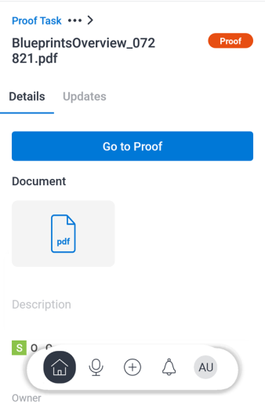

# Evalueren en besluiten nemen over proefdrukken in de [!DNL Adobe Workfront] mobiele app

Wanneer een proefdruk ter goedkeuring aan u is toegewezen, wordt deze weergegeven in uw lijst met goedkeuringen in de mobiele app. U kunt de proefdruk rechtstreeks in de app bekijken en er een beslissing over nemen. Voor informatie over het evalueren en goedkeuren van proefdrukken in [!DNL Adobe Workfront], zie [Proefdrukken controleren binnen [!DNL Adobe Workfront]](../../../review-and-approve-work/proofing/reviewing-proofs-within-workfront/review-proofs-in-wf.md).

U kunt opmerkingen toevoegen aan de proefdruk en een herzieningsproces doorlopen voordat u een definitieve beslissing neemt. Zie voor meer informatie over opmerkingen [Opmerking over proefdrukken in [!DNL iOS]](../../../workfront-basics/mobile-apps/using-the-workfront-mobile-app/comment-on-proofs-ios.md) of [Opmerking over proefdrukken in [!DNL Android]](../../../workfront-basics/mobile-apps/using-the-workfront-mobile-app/comment-on-proofs-android.md).

U hebt dezelfde toegang tot proefdrukken voor revisie en goedkeuring als in [!DNL Adobe Workfront]. Voor informatie over proefdrukmogelijkheden raadpleegt u [Profielen met proefmachtigingen in [!DNL Workfront Proof]](../../../workfront-proof/wp-acct-admin/account-settings/proof-perm-profiles-in-wp.md).

## Een proefdruk openen en bekijken

1. De proefdrukgoedkeuringstaak openen:

   * Selecteer de proefdrukgoedkeuringstaak in de [!UICONTROL Approvals] gebied van [!UICONTROL My Work].

      \
      of

   * Selecteren **[!UICONTROL Show all Approvals]** in de [!UICONTROL Approvals] gebied van [!UICONTROL My Work]. Selecteer vervolgens de proefdrukgoedkeuringstaak in de lijst met alle goedkeuringen.

      Voor informatie over [!UICONTROL My Work] in de mobiele app raadpleegt u [[!UICONTROL My Work] in de mobiele app](../../../workfront-basics/mobile-apps/using-the-workfront-mobile-app/my-work-section-mobile.md).

1. Selecteer op de pagina Details de optie **[!UICONTROL Go to Proof]**.

   

1. Controleer de proefdruk van het document.
1. (Optioneel) Selecteer ![[!UICONTROL Single Page icon]](assets/mobile-proofpagingicon1-25x36.png) rechtsboven in het document om van de weergave Eén pagina naar de doorlopende weergave te gaan. Selecteren ![[!UICONTROL Continuous Page icon]](assets/mobile-proofpagingicon2-25x25.png) om terug te keren naar de weergave van één pagina.

   In de weergave Eén pagina bladert u naar rechts en naar links om door de documentpagina&#39;s te bladeren. In de doorlopende weergave schuift u omhoog en omlaag om door de pagina&#39;s te bladeren.

1. (Optioneel) Ga naar een specifieke pagina met de schuifindicator aan de rechterkant:

   1. Tik op de schuifindicator.
   1. Typ het paginanummer in het dialoogvenster [!UICONTROL Go To Page] en selecteert u **[!UICONTROL OK]**.
   1. 

1. Selecteer de pijl linksboven in het document om terug te gaan naar de [!UICONTROL Details] pagina.
1. (Optioneel) Op de [!UICONTROL Details] pagina, selecteert u **[!UICONTROL Updates]** alle updates van de proefdruk te bekijken, zoals het tijdstip waarop deze werd gemaakt en het tijdstip waarop deze ter goedkeuring werd verzonden.

## Een proefdruk vergrendelen en ontgrendelen

Elke gebruiker die is toegewezen als eigenaar, auteur of moderator van een proefdruk, kan een proefdruk vergrendelen om te voorkomen dat anderen opmerkingen maken of besluiten nemen.

### Een proefdruk vergrendelen

1. Open de proefdruk van het document en selecteer de optie **[!UICONTROL More]** menu  rechtsboven in het document. Selecteer vervolgens **[!UICONTROL More]**.
1. Selecteren **[!UICONTROL Lock Document]**.\
   A &quot;[!UICONTROL Locked]&quot; boven aan het document wordt weergegeven.

### Een proefdruk ontgrendelen

1. Open de proefdruk van het document en selecteer de optie **[!UICONTROL More]** menu  rechtsboven in het document. Selecteer vervolgens **[!UICONTROL More]**.
1. Selecteren **[!UICONTROL Unlock Document]**.
1. Selecteren **[!UICONTROL Unlock]** in het bevestigingsbericht.

## Besluiten nemen over een bewijs

Nadat u het bewijs van het document hebt herzien, kunt u een besluit in het bewijs zelf nemen. Als de eigenaar van het bewijs het bewijs heeft gesloten, zult u geen besluit kunnen nemen.

### Beslissing nemen in het bewijs

1. Open de proefdruk van het document.
1. Het pictogram voor een beslissing selecteren ![[!UICONTROL Decision] pictogram](assets/mobile-proofcheckmarkdecisionicon-30x30.png) rechtsboven in het document.
1. Selecteer een beslissing in het dialoogvenster [!UICONTROL Make a Decision] doos.

   Hieronder worden enkele algemene beslissingsopties weergegeven. De [!DNL Adobe Workfront] beheerder of [!UICONTROL Workfront Proof] de beheerder kan de lijst van besluitvormingsopties vormen. Voor meer informatie over hoe de beheerders besluiten kunnen vormen, zie [Opties voor goedkeuringsbeslissingen configureren in Workfront Proef](../../../workfront-proof/wp-acct-admin/account-settings/configure-approval-decision-in-wp.md).

   <table style="table-layout:auto"> 
    <col> 
    <col> 
    <tbody> 
     <tr> 
      <td role="rowheader"><strong>[!UICONTROL Approved]</strong></td> 
      <td>De proefdruk is gereed om naar de volgende fase van de workflow te gaan.</td> 
     </tr> 
     <tr> 
      <td role="rowheader"><strong>[!UICONTROL Approved with changes]</strong></td> 
      <td> 
De proefdruk moet worden gewijzigd, maar u hoeft de revisie niet te zien voordat deze naar de volgende fase van de workflow gaat.
 </td> 
     </tr> 
     <tr> 
      <td role="rowheader"><strong>[!UICONTROL Rejected]</strong></td> 
      <td>De proefdruk wordt afgewezen en gaat niet verder in de workflow.</td> 
     </tr> 
    </tbody> 
   </table>

1. (Voorwaardelijk) Als de optie [!DNL Adobe Workfront] beheerder of [!DNL Workfront Proof] beheerder heeft een lijst toegevoegd van [!UICONTROL Reasons]selecteert u de redenen die voor uw beslissing van toepassing zijn.

   Sommige redenen kunnen ook opmerkingen vereisen om uit te leggen waarom u de reden hebt gekozen.

   Voor meer informatie over hoe de beheerders redenen kunnen vormen, zie  [Opties voor goedkeuringsbeslissingen configureren in [!DNL Workfront Proof]](../../../workfront-proof/wp-acct-admin/account-settings/configure-approval-decision-in-wp.md).

1. Selecteren **[!UICONTROL Submit]**.

### Je beslissing in de proefdruk wijzigen

1. Open de proefdruk van het document.
1. Het pictogram voor een beslissing selecteren ![[!UICONTROL Decision] pictogram](assets/mobile-proofcheckmarkdecisionicon-30x30.png) rechtsboven in het document.

   De [!UICONTROL Make a Decision] toont uw huidige beslissing.

1. Selecteer een andere beslissing of kies **[!UICONTROL Clear Selection]** om de beslissing te verwijderen.

   Voor beslissingen met redenen kunt u een andere reden kiezen of de reden verwijderen.

1. Selecteren **[!UICONTROL Submit]**.
