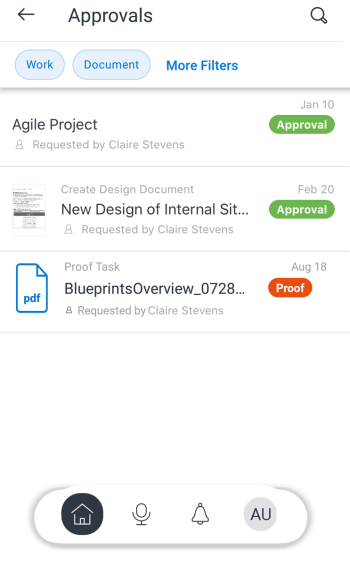
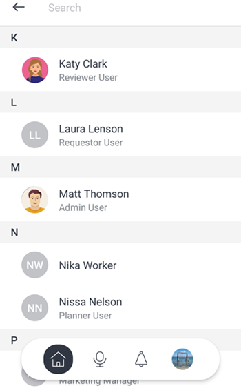

# [!DNL Adobe Workfront] for [!DNL Android]

Met de app [!DNL Adobe Workfront] hebt u toegang tot uw werk op elk [!DNL Android] -apparaat. U kunt de mobiele app [!DNL Workfront] installeren en gebruiken op telefoons en tablets met [!DNL Android] 5.0 of hoger.

Voor informatie over het programma openen aan mobiele app, zie het sectie [ Login aan  [!DNL Workfront]  mobiele app ](../../../workfront-basics/manage-your-account-and-profile/managing-your-workfront-account/log-in-to-workfront.md#log) in het artikel [ Login aan  [!DNL Adobe Workfront]](../../../workfront-basics/manage-your-account-and-profile/managing-your-workfront-account/log-in-to-workfront.md).

## [!UICONTROL Home]

In het gebied [!UICONTROL Home] kunt u rechtstreeks werken aan taken, problemen en goedkeuringen die aan u zijn toegewezen. Vanuit het gebied [!UICONTROL Home] van de app kunt u:

<table style="table-layout:auto"> 
 <col> 
 <col> 
 <tbody> 
  <tr> 
   <td> 
    <ul> 
     <li>Aan de slag met taken en problemen</li> 
     <li>Taken en problemen markeren als [!UICONTROL Done]</li> 
     <li>Taken en problemen opnieuw toewijzen</li> 
     <li>Wijzig de [!UICONTROL Commit Date]</li> 
    </ul> </td> 
   <td> 
    <ul> 
     <li>Taak- en uitgavestatus bijwerken</li> 
     <li>Post in het gebied Updates</li> 
     <li>Documenten weergeven</li> 
     <li>Foto's koppelen</li> 
     <li> 
Een verzoek of een snelle taak maken
 
Opmerking: snelle taken die thuis worden gemaakt, zijn persoonlijke taken, tenzij u een project toewijst.
 </li> 
    </ul> </td> 
  </tr> 
 </tbody> 
</table>

Zie de secties [[!UICONTROL Home] Gebiedswidgets ](../../../workfront-basics/mobile-apps/using-the-workfront-mobile-app/home-area-widgets-mobile.md) en [[!UICONTROL My Work] in de mobiele app ](../../../workfront-basics/mobile-apps/using-the-workfront-mobile-app/my-work-section-mobile.md) voor meer informatie.

## [!UICONTROL Boards]

In het gebied [!UICONTROL Boards] hebt u toegang tot uw [!DNL Workfront] -borden.

Zie [[!DNL Adobe Workfront] [!UICONTROL Boards] for mobile ](/help/quicksilver/workfront-basics/mobile-apps/using-the-workfront-mobile-app/mobile-boards.md) voor meer informatie.

## [!UICONTROL Projects]

In het gebied [!UICONTROL Projects] kunt u communiceren met en projecten beheren die u hebt en die u uitvoert. Vanuit het gebied [!UICONTROL projects] van de app kunt u:

<table style="table-layout:auto"> 
 <col> 
 <col> 
 <tbody> 
  <tr> 
   <td> 
    <ul> 
     <li>Projectstatus bijwerken</li> 
     <li>Belangrijke projectdetails weergeven</li> 
     <li>Post in het gebied [!UICONTROL Updates]</li> 
     <li>Taken, problemen en verzoeken converteren naar projecten</li> 
    </ul> </td> 
   <td> 
    <ul> 
     <li>Interactie met projecttaken en -kwesties</li> 
     <li>Documenten weergeven</li> 
     <li>Foto's koppelen</li> 
     <li> 
Een snelle taak maken
 
Nota: De taken die in een project worden gecreeerd worden automatisch toegewezen aan het project u binnen bent. 
 </li> 
    </ul> </td> 
  </tr> 
 </tbody> 
</table>

## [!UICONTROL Approvals]

In het gebied [!UICONTROL Approvals] kunt u goedkeuringen bekijken en goedkeuren die aan u zijn toegewezen of gedelegeerd. Vanuit het gebied [!UICONTROL approvals] kunt u het volgende goedkeuren:

<table style="table-layout:auto">
 <col>
 <col>
 <tbody>
  <tr>
   <td>
    <ul>
     <li>Werk (taken en problemen)</li>
     <li>Documenten</li>
     <li>Proefdrukken </li>
    </ul> </td>
   <td>
    <ul>
     <li>Timesheets</li>
     <li>Toegangsverzoeken</li>
    </ul> </td>
  </tr>
 </tbody>
</table>

Voor meer informatie over goedkeuringen, zie [ Goedkeuringen in  [!DNL Adobe Workfront]  mobiele app ](../../../workfront-basics/mobile-apps/using-the-workfront-mobile-app/approvals-in-mobile-app.md).

Voor informatie bij het herzien van en het goedkeuren van proeven, zie [ Overzicht en maak besluiten over proeven in  [!DNL Adobe Workfront]  mobiele app ](../../../workfront-basics/mobile-apps/using-the-workfront-mobile-app/work-with-proofs-in-mobile-app.md).

## [!UICONTROL Notifications]

In het gebied [!UICONTROL Notifications] kunt u meldingen in de app voor uw werk weergeven en hierop reageren.

>[!NOTE]
>Hyperlinks zijn niet beschikbaar in de updatemeldingen, tenzij de volledige inhoud van een notitie een hyperlink zonder weergavetekst is.

## [!UICONTROL Requests]

In het gebied [!UICONTROL Requests] kunt u details over aanvragen weergeven. Vanuit het gebied [!UICONTROL Requests] van de app kunt u:

<table style="table-layout:auto">
 <col>
 <col>
 <tbody>
  <tr>
   <td>
    <ul>
     <li>De aanvraag opnieuw toewijzen</li>
     <li>De status bijwerken</li>
     <li>De prioriteit aanpassen</li>
    </ul> </td>
   <td>
    <ul>
     <li>Post in het gebied Updates</li>
     <li>Documenten weergeven</li>
     <li>Foto's koppelen</li>
     <li>Een verzoek opslaan als concept</li>
    </ul> </td>
  </tr>
 </tbody>
</table>

## [!UICONTROL Timesheets]

In het gebied [!UICONTROL timesheets] kunt u details over uw tijdbladen bekijken. In het gedeelte Timesheets van de app kunt u het volgende doen:

* Post in het gebied [!UICONTROL Updates]
* Urentypen aanpassen
* De tijd wijzigen die u hebt aangemeld
* Opmerkingen invoeren op uw timesheet
* Uw timesheet sluiten

## [!UICONTROL Favorites]

U kunt bestaande items openen via het menu [!UICONTROL Favorites] en nieuwe items toevoegen aan het menu Favorieten.

## [!UICONTROL Contacts]

In het gebied [!UICONTROL Contacts] kunt u de contactgegevens van alle gebruikers in uw bedrijf bekijken.

## [!UICONTROL Configuration]

In het gebied [!UICONTROL Configuration] kunt u het volgende doen:

* Uw instellingen beheren
* Toegewezen teams weergeven
* Beveiligingsvoorkeuren instellen
* Feedback verzenden
* Help-inhoud openen
* Afmelden

