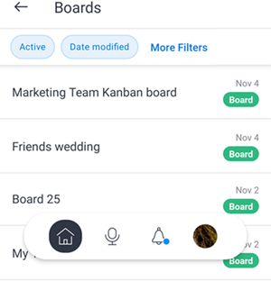

# [!DNL Adobe Workfront] for [!DNL iOS]

De [!DNL Adobe Workfront] kunt u uw werk op elk [!DNL iOS] apparaat. U kunt de [!DNL Workfront] mobiele app op telefoons en tablets met iOS 10 of hoger. Een specifieke [!DNL Workfront] de mobiele app is beschikbaar voor beide [!DNL iPhone] en de [!DNL iPad].

Zie de sectie voor informatie over het aanmelden bij de mobiele app [Aanmelden bij de [!UICONTROL Workfront] mobiele app](../../../workfront-basics/manage-your-account-and-profile/managing-your-workfront-account/log-in-to-workfront.md#log) in het artikel [Aanmelden bij [!DNL Adobe Workfront]](../../../workfront-basics/manage-your-account-and-profile/managing-your-workfront-account/log-in-to-workfront.md).

## [!UICONTROL Home]

De [!UICONTROL Home] kunt u rechtstreeks werken aan taken, problemen en goedkeuringen die aan u zijn toegewezen. Van de [!UICONTROL Home] in de app kunt u:

<table style="table-layout:auto"> 
 <col> 
 <col> 
 <tbody> 
  <tr> 
   <td> 
    <ul> 
     <li>Aan de slag met taken en problemen</li> 
     <li>Taken en problemen markeren als [!UICONTROL Done]</li> 
     <li>Taken en problemen opnieuw toewijzen</li> 
     <li>Wijzig de [!UICONTROL Commit Date]</li> 
    </ul> </td> 
   <td> 
    <ul> 
     <li>Taak- en uitgavestatus bijwerken</li> 
     <li>Plaatsen in het gebied Updates</li> 
     <li>Documenten weergeven</li> 
     <li>Foto's koppelen</li> 
     <li> 
Een verzoek of een snelle taak maken
 
Opmerking: Snelle taken die thuis worden gemaakt, zijn persoonlijke taken, tenzij u een project toewijst.
 </li> 
    </ul> </td> 
  </tr> 
 </tbody> 
</table>

Zie voor meer informatie [[!UICONTROL Home] gebiedswidgets](../../../workfront-basics/mobile-apps/using-the-workfront-mobile-app/home-area-widgets-mobile.md) en [[!UICONTROL My Work] in de mobiele app](../../../workfront-basics/mobile-apps/using-the-workfront-mobile-app/my-work-section-mobile.md).

## [!UICONTROL Boards]

De [!UICONTROL Boards] kunt u toegang krijgen tot uw [!DNL Workfront] borden.

Zie voor meer informatie [[!DNL Adobe Workfront] [!UICONTROL Boards] voor mobiel](/help/quicksilver/workfront-basics/mobile-apps/using-the-workfront-mobile-app/mobile-boards.md).

## [!UICONTROL Projects]

De [!UICONTROL Projects] kunt u interageren met en beheren [!UICONTROL projects] jij hebt en projecten waar je mee bezig bent. Vanuit het projectgebied van de app kunt u:

<table style="table-layout:auto"> 
 <col> 
 <col> 
 <tbody> 
  <tr> 
   <td> 
    <ul> 
     <li>Projectstatus bijwerken</li> 
     <li>Belangrijke projectdetails weergeven</li> 
     <li>Plaatsen in de [!UICONTROL Updates] gebied</li> 
     <li>Taken, problemen en verzoeken converteren naar projecten</li> 
    </ul> </td> 
   <td> 
    <ul> 
     <li>Interactie met projecttaken en -kwesties</li> 
     <li>Documenten weergeven</li> 
     <li>Foto's koppelen</li> 
     <li> 
Een snelle taak maken
 
Opmerking: De taken die in een project worden gecreeerd worden automatisch toegewezen aan het project u binnen bent. 
 </li> 
    </ul> </td> 
  </tr> 
 </tbody> 
</table>

## Goedkeuringen

De [!UICONTROL Approvals] kunt u bekijken en goedkeuren [!UICONTROL approvals] toegewezen of gedelegeerd aan u. Vanuit het goedkeuringsgebied kunt u het volgende goedkeuren:

<table style="table-layout:auto">
 <col>
 <col>
 <tbody>
  <tr>
   <td>
    <ul>
     <li>Werk (taken en problemen)</li>
     <li>Documenten</li>
     <li>Proefdrukken </li>
    </ul> </td>
   <td>
    <ul>
     <li>Timesheets</li>
     <li>Toegangsverzoeken</li>
    </ul> </td>
  </tr>
 </tbody>
</table>

Voor meer informatie over goedkeuringen raadpleegt u [Goedkeuringen in de [!DNL Adobe Workfront] mobiele app](../../../workfront-basics/mobile-apps/using-the-workfront-mobile-app/approvals-in-mobile-app.md).

Voor informatie over het beoordelen en goedkeuren van proefdrukken raadpleegt u [Evalueren en besluiten nemen over proefdrukken in de [!DNL Adobe Workfront] mobiele app](../../../workfront-basics/mobile-apps/using-the-workfront-mobile-app/work-with-proofs-in-mobile-app.md).

## [!UICONTROL Notifications]

De [!UICONTROL Notifications] kunt u in de app meldingen voor uw werk weergeven en hierop reageren.

>[!NOTE]
>Hyperlinks zijn niet beschikbaar in de updatemeldingen, tenzij de volledige inhoud van een notitie een hyperlink zonder weergavetekst is.

## [!UICONTROL Requests]

De [!UICONTROL Requests] kunt u details over verzoeken bekijken. Van de [!UICONTROL Requests] in de app kunt u:

<table style="table-layout:auto">
 <col>
 <col>
 <tbody>
  <tr>
   <td>
    <ul>
     <li>De aanvraag opnieuw toewijzen</li>
     <li>De status bijwerken</li>
     <li>De prioriteit aanpassen</li>
    </ul> </td>
   <td>
    <ul>
     <li>Plaatsen in de [!UICONTROL Updates] gebied</li>
     <li>Documenten weergeven</li>
     <li>Foto's koppelen</li>
     <li>Een verzoek opslaan als concept</li>
    </ul> </td>
  </tr>
 </tbody>
</table>

## Timesheets

De [!UICONTROL timesheets] kunt u details over uw tijdbladen bekijken. In de [!UICONTROL Timesheets] in de app kunt u:

* Plaatsen in de [!UICONTROL Updates] gebied
* Urentypen aanpassen
* De tijd wijzigen die u hebt aangemeld
* Opmerkingen invoeren op uw timesheet
* Uw timesheet sluiten

## [!UICONTROL Favorites]

U kunt bestaande items openen via het menu Favorieten en nieuwe items toevoegen aan het menu [!UICONTROL Favorites] -menu.

## [!UICONTROL Contacts]

De [!UICONTROL Contacts] kunt u de contactgegevens van alle gebruikers in uw bedrijf bekijken.

## [!UICONTROL Configuration]

De [!UICONTROL Configuration] kunt u:

* Uw instellingen beheren
* Toegewezen teams weergeven
* Beveiligingsvoorkeuren instellen
* Feedback verzenden
* Help-inhoud openen
* Afmelden

## Virtuele assistent

De virtuele medewerker staat u toe om de volgende taken via stembevel uit te voeren:

* [!UICONTROL Show me]
* [!UICONTROL Delete]
* [!UICONTROL Search for]
* [!UICONTROL Help me with commands]

Voor meer informatie over de Virtuele medewerker, zie [[!DNL Adobe Workfront] virtuele mobiele app-assistent](../../../workfront-basics/mobile-apps/using-the-workfront-mobile-app/wf-mobile-virtual-assistant.md).

## [!UICONTROL Pin]

De [!UICONTROL Pin] in dit gebied hebt u toegang tot opgeslagen opdrachten voor virtuele assistenten en tot punten vanuit uw webbrowser.

Voor meer informatie over de Virtuele medewerker, zie [Virtuele assistent voor Adobe Workfront Mobile-app](../../../workfront-basics/mobile-apps/using-the-workfront-mobile-app/wf-mobile-virtual-assistant.md).
