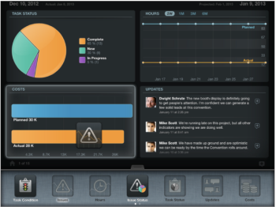

# Widgets bijwerken in het dialoogvenster [!UICONTROL Project Details] weergave

U kunt aanvullende informatie weergeven over de [!UICONTROL project] nadat u het van de projectlijst hebt betreden door widgets aan uw toe te voegen [!UICONTROL Project Details] scherm. Elke gebruiker kan zijn eigen widgets aanpassen.

## Toegangsvereisten

U moet de volgende toegang hebben in [!DNL Workfront] om de stappen in dit artikel uit te voeren:

<table style="table-layout:auto"> 
 <col> 
 </col> 
 <col> 
 </col> 
 <tbody> 
  <tr> 
   <td role="rowheader"><strong>[!DNL Adobe Workfront] plan*</strong></td> 
   <td> 
Alle
 </td> 
  </tr> 
  <tr> 
   <td role="rowheader"><strong>[!DNL Adobe Workfront] licentie*</strong></td> 
   <td> 
[!UICONTROL Review] of hoger
 </td> 
  </tr> 
 </tbody> 
</table>

&#42;Neem contact op met uw [!DNL Workfront] beheerder.

## De widgets in het dialoogvenster [!UICONTROL Project Details] weergave

1. Van de [!DNL Adobe Workfront View] homepage, navigeer aan een project door zijn naam te tikken.
1. Tik op de tab onderaan in het midden van het scherm.\
   De [!UICONTROL widget] wordt weergegeven.\
   Blader door de widgets door van links naar rechts te vegen.\
   

1. Sleep een widget om de lay-out van uw projectpagina aan te passen.\
   U kunt maximaal vier widgets tegelijk weergeven.\
   U kunt de widgets opnieuw rangschikken door ze naar een andere locatie te slepen.\
   De widgetrangschikking wordt opgeslagen wanneer u tussen projecten navigeert.

1. Selecteer een van de volgende widgets:

   * **[!UICONTROL Task Condition]**: Toont alle taken in het project door [!UICONTROL Condition] in een cirkeldiagram.
   * **[!UICONTROL Issues]**: Geeft de tijdlijn van alle problemen in een lijndiagram weer. Het aantal openstaande kwesties wordt tussen haakjes aangegeven.
   * **[!UICONTROL Hours]**: Hiermee geeft u het dialoogvenster [!UICONTROL Actual] en [!UICONTROL Planned Hours] op de taken van het project in een gecombineerde lijngrafiek.
   * **[!UICONTROL Issue]** [!UICONTROL Status]: Hiermee geeft u alle uitgaven weer op basis van status in een cirkeldiagram.
   * **[!UICONTROL Updates]**: Toont alle updates en commentaren op het project.
   * **[!UICONTROL Costs]**: Hiermee geeft u het dialoogvenster [!UICONTROL Actual] en de [!UICONTROL Planned Cost] van het project in een gecombineerd staafdiagram.
   * **[!UICONTROL Revenue]**: Hiermee geeft u het dialoogvenster [!UICONTROL Actual] en de [!UICONTROL Planned Revenue] van het project in een gecombineerd staafdiagram.
   * **[!UICONTROL Task Progress]**: Toont alle taken in het project door [!UICONTROL Progress Status] in een cirkeldiagram.
   * **[!UICONTROL Upcoming Tasks]**: Geeft maximaal zes aanstaande taken weer. De widget sorteert de projecttaken in de volgende volgorde:

      * in de eerste plaats door de [!UICONTROL Estimated Due Date]
      * tweede [!UICONTROL Work Breakdown Structure]

      De laatste twee volledige taken (indien van toepassing) en de volgende vier taken worden weergegeven. Om te begrijpen welke taken in zullen worden getoond [!DNL Workfront] U kunt een taakrapport maken voor het project dat u bekijkt en dit sorteren op de geschatte vervaldatum en vervolgens op de knop [!DNL Workfront] Indelingsstructuur. De eerste 6 taken zijn de taken die worden vermeld in de mobiele app Workfront View in het dialoogvenster [!UICONTROL Upcoming] De widget Taken.

   * **[!UICONTROL Remaining Tasks]**: Toont de onvolledige taken in een lijngrafiek.
   * **[!UICONTROL Documents]**: Hiermee geeft u een lijst weer met documenten die aan het project zijn gekoppeld.\

      U kunt de volgende documentindelingen openen met [!DNL Workfront View]:

      * alle tekstbestanden
      * .pdf
      * afbeeldingsbestanden (.jpg, .jpeg, .png, enz.)
      * .xls
   * **[!UICONTROL Details]**: Toont de volgende details over het project:

      * Projectnaam
      * Naam van de maker van het project
      * Projectstatus
      * Projectgroep
      * Projectplanning
   * **[!UICONTROL Team]**: Toont de namen van de gebruikers die op het Team van het Project zijn.\

      Voor meer informatie over projectteams, zie [Overzicht van het projectteam](../../../manage-work/projects/planning-a-project/project-team-overview.md).
