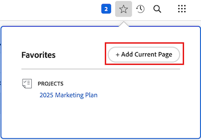

# Favorieten weergeven en beheren

<!-- Audited: 5/2025 -->

Met het menu [!UICONTROL Favorites] hebt u snel toegang tot items. De items blijven in het menu [!UICONTROL Favorites] staan totdat u ze verwijdert. U kunt maximaal 40 items in het menu Favorieten plaatsen.

## Toegangsvereisten

+++ Breid uit om de toegangseisen voor de functionaliteit in dit artikel weer te geven.

U moet de volgende toegang hebben om de stappen in dit artikel uit te voeren:

<table style="table-layout:auto"> 
 <col> 
 </col> 
 <col> 
 </col> 
 <tbody> 
  <tr> 
   <td role="rowheader">[!DNL Adobe Workfront] plan</td> 
   <td> 
Alle
 </td> 
  </tr> 
  <tr> 
   <td role="rowheader">[!DNL Adobe Workfront] licentie</td> 
   <td> 

      
Nieuw: Medewerker of hoger

      
of

      
Huidig: Verzoek of hoger
 </td> 
  </tr> 
 </tbody> 
</table>

Voor meer detail over de informatie in deze lijst, zie [ vereisten van de Toegang in de documentatie van Workfront ](/help/quicksilver/administration-and-setup/add-users/access-levels-and-object-permissions/access-level-requirements-in-documentation.md).

+++

## Een favoriet weergeven

Als je een eerder toegevoegd object wilt bekijken als favoriet:

1. Klik het **[!UICONTROL Favorites]** pictogram  in de hoger-juiste hoek van om het even welke [!DNL Adobe Workfront] pagina.

1. In de **lijst van Favorieten**, klik het punt u wilt bekijken.

## Een item toevoegen als favoriet

U kunt recente items of de huidige pagina toevoegen aan het menu [!UICONTROL Favorites] .

* [Recente objecten toevoegen als favoriet](#add-recent-items-as-a-favorite)
* [Het huidige item toevoegen als een favoriet](#add-the-current-item-as-a-favorite)

### Recente objecten toevoegen als favoriet

1. Klik het **[!UICONTROL Recents]** pictogram  in de hoger-juiste hoek van om het even welke pagina in de nieuwe [!DNL Adobe Workfront] ervaring.
1. Klik op de ster in lijn met het item dat u als favoriet wilt opslaan. Het recente puntvertoningen in het **** menu van Favorieten.

   

### Het huidige item toevoegen als een favoriet

1. Ga naar de pagina die u als favoriet wilt toevoegen.
1. Klik het **[!DNL Favorites]** pictogram  in de hoger-juiste hoek van de pagina, dan klik **[!UICONTROL Add Current Page]**.

   

   >[!NOTE]
   >
   >Als u op het pictogram **[!UICONTROL Favorites]** klikt op een object dat u al als favoriet hebt toegevoegd, wordt het object verwijderd uit het menu [!UICONTROL Favorites] .\
   >

## Een item verwijderen uit het menu [!UICONTROL Favorites]

1. Klik het **[!UICONTROL Favorites]** pictogram  in de hoger-juiste hoek van om het even welke [!DNL Workfront] pagina.

1. Beweeg over het punt dat u als favoriet wilt verwijderen, dan **X** naast het klikken.

   of

   Als u op de pagina bent die u als favoriet wilt verwijderen, klik het **[!UICONTROL Favorites]** pictogram  naast de objecten naam om het uit het **Favorieten** menu te verwijderen.
