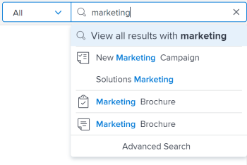

# Zoeken [!DNL Adobe Workfront]

U kunt items gemakkelijk vinden in [!DNL Adobe Workfront] door te zoeken naar items wanneer u de exacte locatie niet kunt onthouden.

U kunt het vak [!UICONTROL Search] in de rechterbovenhoek van elke pagina in [!DNL Workfront] zien.

U moet over machtigingen beschikken om een object weer te geven voordat u het in een zoekopdracht kunt vinden. Om deze reden, variëren de onderzoeksresultaten van gebruiker aan gebruiker.

## Toegangsvereisten

+++ Vouw deze sectie uit om de toegang te bekijken die nodig is om de stappen in dit artikel uit te voeren.

<table style="table-layout:auto"> 
 <col> 
 <col> 
 <tbody> 
  <tr> 
   <td role="rowheader"><strong>[!DNL Adobe Workfront] plan*</strong></td> 
   <td> 
Alle
 </td> 
  </tr> 
  <tr> 
   <td role="rowheader"><strong>[!DNL Adobe Workfront] licentie*</strong></td> 
   <td> 
Aanvraag of hoger
 </td> 
  </tr> 
  <tr> 
   <td role="rowheader"><strong>Configuraties op toegangsniveau*</strong></td> 
   <td> 
[!UICONTROL View] toegang tot het type object 
 
Opmerking: als u nog steeds geen toegang hebt, vraag dan aan de [!DNL Workfront] -beheerder of deze aanvullende beperkingen op uw toegangsniveau heeft ingesteld. Voor informatie over hoe een [!DNL Workfront] beheerder uw toegangsniveau kan wijzigen, zie <a href="../../../administration-and-setup/add-users/configure-and-grant-access/create-modify-access-levels.md" class="MCXref xref"> tot douanetoegangsniveaus </a> leiden of wijzigen.
</td> 
  </tr> 
  <tr> 
   <td role="rowheader"><strong>Objectmachtigingen</strong></td> 
   <td> 
U moet over machtigingen beschikken om een object weer te geven voordat u het in een zoekopdracht kunt vinden.
 
Voor informatie bij het vragen van om extra toegang, zie <a href="../../../workfront-basics/grant-and-request-access-to-objects/request-access.md" class="MCXref xref"> de toegang van het Verzoek tot voorwerpen </a>.
 </td> 
  </tr> 
 </tbody> 
</table>

&#42; om te weten te komen welk plan, vergunningstype, of toegang u hebt, contacteer uw [!DNL Workfront] beheerder.

+++

## Zoeken begrijpen

* [[!UICONTROL Objects available for search]](#objects-available-for-search)
* [[!UICONTROL Fields available for search]](#fields-available-for-search)

### Objecten beschikbaar voor zoeken

U kunt in Workfront naar de volgende objecten zoeken:

* Projecten
* Taken
* Problemen
* Rapporten
* Gebruikers
* Sjablonen
* Documenten
* Portfolio&#39;s
* Programma&#39;s
* Dashboards
* Bedrijven
* Notities

### Beschikbare velden voor zoeken

De velden die u kunt zoeken, zijn gebaseerd op het type zoekopdracht: Standaard of [!UICONTROL Advanced Search] .

* **BasisOnderzoek**: Wanneer het zoeken naar voorwerpen in een basisonderzoek, [!DNL Workfront] zoekt tekst die uw sleutelwoorden op de volgende gebieden zou kunnen bevatten:

   * Objectnamen
   * Beschrijvingen
   * Aangepaste gegevensvelden
   * Updates
   * Documentnamen (in zoekopdrachten in specifieke documenten en in een basiszoekopdracht)

  Voor meer informatie over fundamenteel het zoeken in [!DNL Workfront], zie [ BasisOnderzoek ](#basic-search) in dit artikel.

* **[!UICONTROL Advanced Search]**: In een [!UICONTROL Advanced Search] kunt u filters instellen om te zoeken in velden die niet beschikbaar zijn in de standaardzoekopdracht. Daarom kunt u in [!UICONTROL Advanced Search] elk veld in het object doorzoeken.

  Voor meer informatie over [!UICONTROL Advanced Search], zie [ Geavanceerd Onderzoek ](#advanced-search) in dit artikel.

>[!NOTE]
>
>Als u een [!UICONTROL Advanced Search] wilt uitvoeren, moet u de optie [!UICONTROL Advanced Search] selecteren wanneer u begint met zoeken. U kunt een standaardzoekopdracht niet verfijnen naar een [!UICONTROL Advanced Search] .

## De beperkingen van [!DNL Workfront] zoekopdrachten begrijpen

Houd rekening met de volgende beperkingen wanneer u [!UICONTROL Search] in [!DNL Workfront] gebruikt:

* Zoekopdrachten zijn niet hoofdlettergevoelig
* [!DNL Workfront] kan typos niet corrigeren of begrijpen
* Zoeken in [!DNL Workfront] ondersteunt geen jokertekens
* Zoeken in [!DNL Workfront] ondersteunt gedeeltelijke woordzoekopdrachten, maar ondersteunt geen zoekopdrachten in subtekenreeksen.\
   Het zoektrefwoord &#39;stand&#39; geeft bijvoorbeeld resultaten met het woord &#39;standard&#39;, maar geeft geen resultaten met het woord &#39;understanding&#39;.

## Meerdere woorden zoeken

Wanneer u meerdere woorden opneemt in een zoekopdracht en u alleen objecten wilt zoeken die overeenkomen met alle woorden in het vak Zoeken, kunt u de woorden in willekeurige volgorde typen.

Als u bijvoorbeeld zoekt naar &quot;Marketingdemo&quot; (zonder aanhalingstekens), worden objecten met de volgende namen gevonden:

* Marketingdemo
* Demo-marketing
* Demo marktanalyse januari

Het vindt ook voorwerpen die &quot;Marketing&quot;in de naam en &quot;Demo&quot;in de beschrijving zouden kunnen hebben.

U kunt echter het volgende doen in het vak [!UICONTROL Search] om de weergegeven zoekresultaten aan te passen:

<table style="table-layout:auto"> 
 <col> 
 <col> 
 <tbody> 
  <tr> 
   <td>Aanhalingstekens opnemen</td> 
   <td> 
Door woorden in de juiste volgorde binnen dubbele aanhalingstekens in te voeren, kunt u alleen objecten zoeken die exact overeenkomen.  bijvoorbeeld, vindt het zoeken naar "Demo van de Marketing"(met aanhalingstekens) voorwerpen met de volgende namen:
 
    <ul> 
     <li> Marketingdemo</li> 
     <li> Januari Marketing Demo</li> 
     <li>Demoplan voor marketing</li> 
    </ul> 
In deze zoekopdracht wordt echter geen object gevonden met de naam "Demo Marketing".
 </td> 
  </tr> 
  <tr> 
   <td>Inclusief OF</td> 
   <td> 
Door woorden met "OR" (zonder aanhalingstekens) te verbinden, kunt u alleen objecten zoeken die overeenkomen met ten minste een van de woorden in het vak [!UICONTROL Search] . Deze woorden kunnen in willekeurige volgorde worden ingevoerd.  Bijvoorbeeld, vindt het zoeken naar "Marketing OF Demo"(zonder aanhalingstekens) voorwerpen met de volgende namen:
 
    <ul> 
     <li> Marktanalysedemo</li> 
     <li>Demo marktanalyse januari</li> 
     <li>Demo</li> 
     <li>Marktanalyse</li> 
    </ul> 
Opmerking: "OR" moet zich in kapitalen bevinden. Anders wordt het geïnterpreteerd als een ander woord in de woordgroep waarnaar u zoekt.
 </td> 
  </tr> 
  <tr> 
   <td>Inclusief EN</td> 
   <td> 
Door woorden met "AND" (zonder aanhalingstekens) te verbinden, kunt u alleen objecten zoeken die overeenkomen met alle woorden in het vak [!UICONTROL Search] . Deze woorden kunnen in willekeurige volgorde worden ingevoerd.  bijvoorbeeld, vindt het zoeken naar "Marketing EN Demo"(zonder aanhalingstekens) voorwerpen met de volgende namen:
 
    <ul> 
     <li>Marketingdemo</li> 
     <li>Demo-marketing</li> 
     <li>Demo marktanalyse januari</li> 
    </ul> 
Opmerking: "AND" moet zich in alle uiteinden bevinden. Anders wordt het geïnterpreteerd als een ander woord in de woordgroep waarnaar u zoekt. Op dezelfde manier zoekt "&amp;" (zonder aanhalingstekens) alleen naar objecten die het en-teken bevatten.
 </td> 
  </tr> 
 </tbody> 
</table>

## Zoeken gebruiken in [!DNL Workfront]

[!DNL Workfront] bevat twee soorten zoekopdrachten: Standaard en geavanceerd. Gebruik de standaardzoekopdracht als u trefwoorden wilt zoeken in veelvoorkomende objectvelden, zoals naam of beschrijving. Gebruik [!UICONTROL Advanced Search] als u filters wilt gebruiken om te zoeken in andere objectvelden.

* [Standaardzoekopdracht](#basic-search)
* [Geavanceerd zoeken](#advanced-search)

### Standaardzoekopdracht

Met een standaardzoekopdracht kunt u trefwoorden zoeken voor alle objecten in het systeem of voor slechts één object tegelijk (zoals projecten). [!DNL Workfront] zoekt vervolgens naar deze trefwoorden in een paar specifieke velden. Vervolgens kunt u de zoekresultaten verfijnen op basis van andere objectspecifieke velden die zijn geselecteerd door [!DNL Workfront] .

Voor een lijst van de specifieke die gebieden in basisonderzoek worden gezocht, zie [ Gebieden beschikbaar voor onderzoek ](#fields-available-for-search) in dit artikel.

>[!NOTE]
>
>Als u een [!UICONTROL Advanced Search] wilt uitvoeren, moet u de optie [!UICONTROL Advanced Search] selecteren wanneer u begint met zoeken. U kunt een standaardzoekopdracht niet verfijnen naar een [!UICONTROL Advanced Search] .

* [Een basiszoekopdracht uitvoeren](#perform-a-basic-search)
* [Een basiszoekopdracht verfijnen](#refine-a-basic-search)

#### Een basiszoekopdracht uitvoeren

U kunt een basiszoekopdracht op een van de volgende manieren uitvoeren:

* Alle objecten in het systeem (algemene zoekopdracht).
* Op slechts één object tegelijk (objectspecifieke zoekopdracht).

Een basiszoekopdracht uitvoeren:

1. Klik op het vergrootglas  rechtsboven op de pagina. U kunt ook **[!UICONTROL ALT + /]** of **[!UICONTROL Option + /]** typen om het menu [!UICONTROL Search] te openen.

1. (Optioneel) Als u naar een specifiek object wilt zoeken, klikt u op de vervolgkeuzelijst **[!UICONTROL All]** en selecteert u het object dat u wilt zoeken.

   

1. Typ in het vak **[!UICONTROL Search]** de informatie die u zoekt.\
   Voor informatie over welke gebieden in [!DNL Workfront] worden gezocht, zie [ Onderzoek ](#understand-search) begrijpen.\
   \
   Terwijl u begint te typen in de zoekbalk, geeft [!DNL Workfront] aanbevelingen op basis van uw weergavegeschiedenis en wordt het gewenste trefwoord in blauw gemarkeerd.

1. Als het item dat u zoekt wordt weergegeven in het menu [!UICONTROL typeahead] , klikt u erop.

   of

   Druk op **[!UICONTROL Enter]** om een uitgebreide zoekopdracht uit te voeren. Deze zoekopdracht zoekt naar de gehele database in plaats van naar de laatst bekeken items.

   De pagina [!UICONTROL Search Results] wordt geopend vanaf de linkerkant en bedekt het grootste deel van de vorige pagina.

   Als u een algemeen onderzoek uitvoerde, [!DNL Workfront] winst resultaten voor om het even welk voorwerp dat de onderzoekstermijn in om het even welke gezochte gebieden aanpast, zoals die in [ wordt beschreven Begrijp Onderzoek ](#understand-search). De objecten die overeenkomen met uw zoekopdracht worden weergegeven in een lijst.

   >[!NOTE]
   >
   >Soms worden variaties van een woord weergegeven in de lijst met gevonden items.\
   >Als u bijvoorbeeld zoekt naar &#39;marketing&#39;, worden objecten weergegeven die &#39;marketing&#39; of &#39;markt&#39; in de naam bevatten.

1. (Facultatief) als uw onderzoek te vele resultaten produceerde, verfijnen uw onderzoek zoals die in [ wordt beschreven een basisonderzoek ](#refine-a-basic-search) verfijnen.
1. (Optioneel) Als u wilt terugkeren naar de pagina die u vóór de zoekopdracht hebt weergegeven, klikt u op **[!UICONTROL Close]** in de rechterbovenhoek.

>[!NOTE]
>
>De pagina [!UICONTROL Search Results] blijft alleen geopend wanneer deze de focus heeft. Wanneer u buiten de pagina klikt of een andere pagina opent, wordt de [!UICONTROL Search Results] -pagina gesloten.

#### Een basiszoekopdracht verfijnen

Nadat u een basiszoekopdracht hebt uitgevoerd (zoals beschreven in [[!UICONTROL Perform a basic search]](#perform-a-basic-search) ), kunt u de zoekopdracht verfijnen.

Gebruik de werkbalk links van de zoekresultaten om de informatie die u zoekt te beperken.

Een zoekopdracht verfijnen:

1. (Voorwaardelijk) Als u een algemene zoekopdracht hebt uitgevoerd, selecteert u het object dat u zoekt in de lijst met objecten linksboven in de resultaten.
1. Zoek de velden die beschikbaar zijn voor de objecten die worden weergegeven in de zoekopdracht op de werkbalk links van de resultaten.\
   De waarden van elke veldweergave, gesorteerd op aantal, tot 10 waarden voor elk veld.
1. Klik in een van de velden die beschikbaar zijn om de lijst met resultaten te verkorten.\
   De selecties die u maakt, worden in blauw gemarkeerd en de veldwaarden die u niet selecteert, worden verborgen.\
   Nadat u elke nieuwe waarde hebt geselecteerd, worden de resultaten aan de rechterkant dynamisch bijgewerkt.\
   

1. (Optioneel) Klik op de geselecteerde waarden om deze te deselecteren en alle waarden voor elk veld opnieuw weer te geven.

### [!UICONTROL Advanced Search]

U kunt in [!UICONTROL Advanced Search] zoeken met velden en filters die niet beschikbaar zijn voor de standaardzoekopdracht. U kunt bijvoorbeeld zoeken naar projecten met een specifieke prioriteit of de naam van een documenteigenaar.

>[!NOTE]
>
>Als u een [!UICONTROL Advanced Search] wilt uitvoeren, moet u de optie [!UICONTROL Advanced Search] selecteren wanneer u begint met zoeken. U kunt een standaardzoekopdracht niet verfijnen naar een [!UICONTROL Advanced Search] .

* [[!UICONTROL Advanced Search] gebruiken](#use-advanced-search)

#### [!UICONTROL Advanced Search] gebruiken

Met [!UICONTROL Advanced Search] kunt u uw zoekopdracht filteren op basis van specifieke criteria.\
Dit type zoekopdracht is handig wanneer u een trefwoord dat aan een object is gekoppeld, niet kunt onthouden, maar wel bepaalde specifieke gegevens over dat object kent (bijvoorbeeld Projectprioriteit, Naam eigenaar document, enzovoort).

Een geavanceerde zoekopdracht uitvoeren:

1. Klik in de rechterbovenhoek van een pagina in [!DNL Workfront] op het **[!UICONTROL Search]** pictogram  . Het menu [!DNL Search] wordt weergegeven.

1. Klik onder aan het menu [!UICONTROL Search] op **[!UICONTROL Advanced Search]** .\
   \
   De pagina [!UICONTROL Advanced Search] wordt geopend vanaf rechts en bedekt het grootste deel van de vorige pagina.

1. Selecteer het type object waarnaar u zoekt.\
   **[!UICONTROL Projects]** is standaard geselecteerd.

   

1. (Optioneel) Typ een trefwoord in het veld boven aan de lijst.
1. (Optioneel) Klik op **[!UICONTROL Filter your results]** om de zoekresultaten te filteren op basis van specifieke veldtypen en selecteer vervolgens een veld in de lijst. Selecteer zo nodig ook een waarde voor het veld.\
   of\
   Voeg een nieuw filter toe.

1. Klik op **[!UICONTROL Search]**.\
   Rechts van de werkbalk [!UICONTROL Advanced Search] wordt een lijst met items weergegeven die overeenkomen met uw zoekopdracht.

1. (Optioneel) Als u wilt terugkeren naar de pagina die u vóór de zoekopdracht hebt weergegeven, klikt u op **[!UICONTROL Close]** in de rechterbovenhoek.

>[!NOTE]
>
>De pagina [!UICONTROL Search Results] blijft alleen geopend wanneer deze de focus heeft. Wanneer u buiten de pagina klikt of een andere pagina opent, wordt de [!UICONTROL Search Results] -pagina gesloten.
