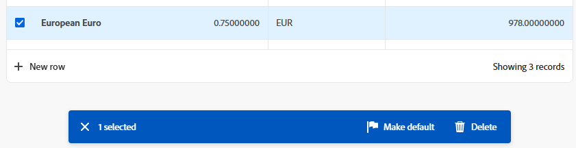

# Uitgebreide lijsten gebruiken

Uitgebreide lijsten zijn beschikbaar in sommige gebieden van Adobe Workfront. Deze lijsten gebruiken een lijstformaat voor het tonen van de lijstitems, en zij hebben een verschillend uiterlijk dan de standaardlijsten. Het beheer van weergaven wordt ook verbeterd, zoals filteren, groeperen, kolommen beheren en zoeken.

Voor informatie over de standaardlijsten, zie [ begonnen worden met lijsten in Adobe Workfront ](/help/quicksilver/workfront-basics/navigate-workfront/use-lists/view-items-in-a-list.md).

>[!NOTE]
>
>Elke verbeterde lijst kan verschillend worden gevormd om u te helpen de gegevens tonen die u nodig hebt. In elke lijst worden niet alle functies gebruikt die in dit artikel worden beschreven. Sommige lijsten kunnen speciale functies hebben die alleen op die lijst van toepassing zijn.

## Toegangsvereisten

+++ Breid uit om de toegangseisen voor de functionaliteit in dit artikel weer te geven.

<table style="table-layout:auto">
 <col> 
 <col>
 <tbody> 
  <tr> 
   <td>Adobe Workfront-pakket</td> 
   <td>
Alle
</td> 
  </tr> 
  <tr> 
   <td>Adobe Workfront-licentie</td> 
   <td>
   
Medewerker of hoger

   
Aanvraag of hoger
</td>
  </tr>
 </tbody> 
</table>

Voor informatie, zie [ vereisten van de Toegang in de documentatie van Workfront ](/help/quicksilver/administration-and-setup/add-users/access-levels-and-object-permissions/access-level-requirements-in-documentation.md).

+++

## Objecten met uitgebreide lijsten

Hieronder vindt u een aantal typen Workfront-objectlijsten die gebruikmaken van de uitgebreide lijstopmaak en enkele gebieden waarin deze standaard worden weergegeven wanneer u rechten hebt om het object te bekijken.

>[!NOTE]
>
>Deze lijst is niet uitgebreid. Elk van deze objecten lijsten kan ook op een rapport of een dashboard verschijnen. Bijvoorbeeld, toont een rapport van het Project of een dashboard dat een rapport van het Project bevat ook een lijst van projecten.

| Workfront-lijst | Locatie van objectlijst |
|--- |--- |
| Prioriteiten | <ul><li>Home > selecteer het pictogram Prioriteiten in het linkermenu</li><li>Hoofdmenu > Prioriteiten</li></ul> |
| Lijst van verzoeken | <ul><li>Verzoeken (alleen nieuwe ervaring)</li><li>Widget Mijn verzoeken bij Home</li></ul> |
| Lijst van wisselkoersen | <ul><li>Setup > Project Preferences > Exchange Rates</li></ul> |

## Items in een verbeterde lijst toevoegen en bewerken

Afhankelijk van de configuratie van de verbeterde lijst, zouden er twee manieren kunnen zijn om een punt aan de lijst toe te voegen:

* Klik op een knop boven de lijst. Met deze optie opent u een dialoogvenster waarin u gegevens kunt invoeren en opslaan.
* Klik **Nieuwe rij** bij de bodem van de lijst. Met deze optie voegt u een nieuwe rij toe aan de tabel en voert u in elke cel gegevens in.

  Uitgebreide lijsten ondersteunen deze veldtypen:

   * Tekst
   * Getal
   * Valuta
   * Datum
   * Datum en tijd
   * Enkele/meerdere downloads
   * Typeahead
   * Alinea
   * Ontvanger (één of meerdere)
   * Kleurkiezer

  Wanneer u een cel bewerkt, heeft elk veldtype zijn eigen bewerkingsopties.

Als u een item in de lijst wilt bewerken, dubbelklikt u in de cel die u wilt bewerken en typt u de gegevens. Sommige cellen kunnen alleen-lezen zijn.

## De actiebalk en het menu Meer in een verbeterde lijst gebruiken

Wanneer u het selectievakje naast een item in de uitgebreide lijst inschakelt, wordt de actiebalk onder aan het scherm weergegeven met de acties die u op het item kunt uitvoeren. Sommige acties kunnen specifiek zijn voor die lijst en komen niet voor in andere lijsten.

>[!NOTE]
>
>Met verschillende uitgebreide lijsten kunt u één item selecteren, meerdere items bulksgewijs bewerken (meerdere items selecteren) of geen item selecteren.

Klik op een knop op de actiebalk om die actie uit te voeren, zoals het weergeven van het lijstitem, het verwijderen van het item of het bewerken van het item.

Als er geen acties beschikbaar zijn voor het geselecteerde item, staat op de actiebalk &quot;Geen beschikbare acties&quot;.

Het **Meer** menu is het drie-punt menu dat naast een primair gebied op een lijstpunt verschijnt wanneer u over het beweegt. (Het primaire veld is de kolom helemaal links in de tabel.)

Klik op het menu om extra handelingen voor het item weer te geven. Sommige acties kunnen specifiek zijn voor die lijst en komen niet voor in andere lijsten.

## Kolommen in een uitgebreide lijst aanpassen

Met sommige verbeterde lijsten kunt u kolommen verbergen en weergeven en de kolommen opnieuw ordenen.

1. Klik **Kolommen** boven de lijst.

   

1. Met de schakelopties kunt u kolommen in de lijst weergeven of verbergen.
1. Om de kolommen opnieuw in orde te brengen, klik het **pictogram van de Belemmering** en beweeg een kolom aan uw gewenste plaats. Als u kolommen verplaatst, wordt de lijst automatisch gewijzigd.

   >[!NOTE]
   >
   >Het primaire veld is de kolom helemaal links in de tabel. De kolom staat op de eerste positie en u kunt de kolom niet wijzigen. Als het aantal kolommen groot is, wordt het primaire veld naar links bevroren en als u horizontaal schuift, ziet u het altijd.
   >
   >Het pictogram naast een veldnaam geeft het veldtype aan, zoals tekst of datumveld.

   Een indicator verschijnt op de **knoop van Kolommen** wanneer de kolommen worden verborgen. De indicator wordt niet weergegeven wanneer u de kolommen opnieuw ordent.

   

## Items in een verbeterde lijst filteren en groeperen

Met filters vermindert u de hoeveelheid informatie die u in de lijst weergeeft. Groepen scheiden de objecten in de lijst in gebieden op basis van specifieke criteria.

### Filters gebruiken

1. Klik **Filter** boven de lijst.
1. In de doos van de Filter, klik **toevoegt voorwaarde**.
1. Selecteer een veld waarop u wilt filteren.
1. Selecteer een filtermodifier, zoals &quot;Heeft een van de opties,&quot; &quot;Heeft geen van de opties&quot;, &quot;Is ervoor&quot; of &quot;Is erna&quot;. De opties voor wijzigingstoetsen zijn afhankelijk van het type veld waarop u filtert.
1. Selecteer de veldwaarde(n). Afhankelijk van het veldtype waarop u filtert, wordt u mogelijk gevraagd het item in een lijst te selecteren, ernaar te zoeken of een kalender te gebruiken om een datumbereik te selecteren.

   

   Het filter wordt automatisch toegepast op de lijst.

1. Klik **toevoegen voorwaarde** om een andere voorwaarde aan de filter als OF verklaring toe te voegen.
1. Wanneer de filter wordt toegepast, kunt u de **opties van de Filter** opnieuw openen om de filteropties te veranderen of alle filters te ontruimen.

   Een indicator verschijnt op de **knoop van de Filter** wanneer een filter op de lijst wordt toegepast.

   

### Groepen gebruiken

1. Klik **Groep** boven de lijst.
1. Selecteer een groepering om uw lijst te organiseren.

   

1. Wanneer de groepering wordt toegepast, kunt u de opties van de Groep opnieuw openen om alle groeperingen in één keer samen te vouwen of uit te breiden, de groepering te veranderen om te groeperen door een verschillend gebied, of alle groeperingen te ontruimen.

   

   Een indicator verschijnt op de **knoop van de Groep** wanneer het groeperen wordt toegepast op de lijst.

   

## Sorteren en zoeken in een uitgebreide lijst

Als u afzonderlijke kolommen wilt sorteren, gaat u naar de kolom en klikt u op de pijl omlaag. Een pictogram naast een kolomnaam geeft aan dat de lijst wordt gesorteerd op de waarden in die kolom en op de richting van de sortering.

>[!NOTE]
>
>Sommige kolommen zijn mogelijk niet sorteerbaar.

Om uw werk binnen een groepering te sorteren, open **Groep** en selecteer als u in het stijgen of dalende orde wilt sorteren.

Als u wilt zoeken, typt u de zoekterm in het zoekveld boven de lijst. De resultaten worden tijdens het typen in de lijst gemarkeerd.

