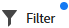

# Uitgebreide lijsten gebruiken

Uitgebreide lijsten zijn beschikbaar in sommige gebieden van Adobe Workfront. Deze lijsten gebruiken een lijstformaat voor het tonen van de lijstitems, en zij hebben een verschillend uiterlijk dan de standaardlijsten. Het beheer van weergaven wordt ook verbeterd, zoals filteren, groeperen, kolommen beheren en zoeken.

Voor informatie over de standaardlijsten, zie [&#x200B; begonnen worden met lijsten in Adobe Workfront &#x200B;](/help/quicksilver/workfront-basics/navigate-workfront/use-lists/view-items-in-a-list.md).

>[!NOTE]
>
>Elke verbeterde lijst kan verschillend worden gevormd om u te helpen de gegevens tonen die u nodig hebt. In elke lijst worden niet alle functies gebruikt die in dit artikel worden beschreven. Sommige lijsten kunnen speciale functies hebben die alleen op die lijst van toepassing zijn.

## Toegangsvereisten

+++ Breid uit om de toegangseisen voor de functionaliteit in dit artikel weer te geven.

<table style="table-layout:auto">
 <col> 
 <col>
 <tbody> 
  <tr> 
   <td>Adobe Workfront-pakket</td> 
   <td>
Alle
</td> 
  </tr> 
  <tr> 
   <td>Adobe Workfront-licentie</td> 
   <td>
   
Medewerker of hoger

   
Aanvraag of hoger
</td>
  </tr>
 </tbody> 
</table>

Voor informatie, zie [&#x200B; vereisten van de Toegang in de documentatie van Workfront &#x200B;](/help/quicksilver/administration-and-setup/add-users/access-levels-and-object-permissions/access-level-requirements-in-documentation.md).

+++

## Objecten met uitgebreide lijsten

Hieronder vindt u een aantal typen Workfront-objectlijsten die gebruikmaken van de uitgebreide lijstopmaak en enkele gebieden waarin deze standaard worden weergegeven wanneer u rechten hebt om het object te bekijken.

>[!NOTE]
>
>Deze lijst is niet uitgebreid. Elk van deze objecten lijsten kan ook op een rapport of een dashboard verschijnen. Bijvoorbeeld, toont een rapport van het Project of een dashboard dat een rapport van het Project bevat ook een lijst van projecten.

| Workfront-lijst | Locatie van objectlijst |
|--- |--- |
| Prioriteiten | <ul><li>Home > selecteer het pictogram Prioriteiten in het linkermenu</li><li>Hoofdmenu > Prioriteiten</li></ul> |
| Lijst van verzoeken | <ul><li>Verzoeken (alleen nieuwe ervaring)</li><li>Widget Mijn verzoeken bij Home</li></ul> |
| Lijsten met statussen, prioriteiten, ernst en wisselkoersen in Setup | <ul><li>Setup > Projectvoorkeuren > Statussen</li><li>Setup > Projectvoorkeuren > Prioriteiten</li><li>Setup > Projectvoorkeuren > Ernsten</li><li>Setup > Project Preferences > Exchange Rates</li></ul> |

## Items in een verbeterde lijst toevoegen en bewerken

Afhankelijk van de configuratie van de verbeterde lijst, zouden er twee manieren kunnen zijn om een punt aan de lijst toe te voegen:

* Klik op een knop boven de lijst. Met deze optie opent u een dialoogvenster waarin u gegevens kunt invoeren en opslaan.
* Klik **Nieuwe rij** bij de bodem van de lijst. Met deze optie voegt u een nieuwe rij toe aan de tabel en voert u in elke cel gegevens in.

  Uitgebreide lijsten ondersteunen deze veldtypen:

   * Tekst
   * Getal
   * Valuta
   * Datum
   * Datum en tijd
   * Enkele/meerdere downloads
   * Typeahead
   * Alinea
   * Ontvanger (één of meerdere)
   * Kleurkiezer

  Wanneer u een cel bewerkt, heeft elk veldtype zijn eigen bewerkingsopties.

Als u een item in de lijst wilt bewerken, dubbelklikt u in de cel die u wilt bewerken en typt u de gegevens. Sommige cellen kunnen alleen-lezen zijn.

## De actiebalk en het menu Meer in een verbeterde lijst gebruiken

Op de actiebalk staan acties die u kunt uitvoeren op een lijstitem. Sommige acties kunnen specifiek zijn voor die lijst en komen niet voor in andere lijsten.

1. Schakel het selectievakje naast een item in de uitgebreide lijst in.

   De actiebalk wordt onder aan het scherm weergegeven.

   >[!NOTE]
   >
   >Met verschillende uitgebreide lijsten kunt u één item selecteren, meerdere items bulksgewijs bewerken (meerdere items selecteren) of geen item selecteren.

1. Klik op een knop op de actiebalk om die actie uit te voeren, zoals het weergeven van het lijstitem, het verwijderen van het item of het bewerken van het item.

   Als er geen acties beschikbaar zijn voor het geselecteerde item, staat op de actiebalk &quot;Geen beschikbare acties&quot;.

   

1. Beweeg over een primair gebied op een lijstitem om **Meer** menu te zien. (Het primaire veld is de kolom helemaal links in de tabel.)

1. Klik op het menu om extra handelingen voor het item weer te geven. Sommige acties kunnen specifiek zijn voor die lijst en komen niet voor in andere lijsten.

   

## Kolommen in een uitgebreide lijst aanpassen

Met sommige verbeterde lijsten kunt u kolommen verbergen en weergeven en de kolommen opnieuw ordenen.

1. Klik **Kolommen** boven de lijst.

   

1. Met de schakelopties kunt u kolommen in de lijst weergeven of verbergen.
1. Om de kolommen opnieuw in orde te brengen, klik het **pictogram van de Belemmering** en beweeg een kolom aan uw gewenste plaats. Als u kolommen verplaatst, wordt de lijst automatisch gewijzigd.

   >[!NOTE]
   >
   >Het primaire veld is de kolom helemaal links in de tabel. De kolom staat op de eerste positie en u kunt de kolom niet wijzigen. Als het aantal kolommen groot is, wordt het primaire veld naar links bevroren en als u horizontaal schuift, ziet u het altijd.
   >
   >Het pictogram naast een veldnaam geeft het veldtype aan, zoals tekst of datumveld.

   Een indicator verschijnt op de **knoop van Kolommen** wanneer de kolommen worden verborgen. De indicator wordt niet weergegeven wanneer u de kolommen opnieuw ordent.

   

## Kolommen toevoegen aan en verwijderen uit een lijst met Kolombeheer

Sommige verbeterde lijsten bieden de **manager van de Kolom** aan, die u toestaat om kolommen aan de lijst gemakkelijk toe te voegen en kolommen te verwijderen. Native en aangepaste velden zijn beide beschikbaar om als kolommen te selecteren. Er moeten aangepaste velden in het systeem aanwezig zijn voordat u deze als lijstkolommen kunt toevoegen.

Kolommen toevoegen en verwijderen:

1. Klik + pictogram op het hoogste recht van de lijst om de **manager van de Kolom** doos te openen.
1. Onderzoek naar een bestaand objecten gebied in de **Beschikbare** kolom, dan klik + aan het recht van de gebiedsnaam het om het aan de **Geselecteerde** kolom toe te voegen.
1. Klik - rechts van een gebied in de **Geselecteerde** kolom om het uit de lijst te verwijderen.

   >[!NOTE]
   >
   >Sommige velden zijn mogelijk vast en kunnen niet worden verwijderd.

1. Klik **sparen**.

   

<!-- Add info about Properties and KPIs when something gets released with those options -->

## Gegevens weergeven met weergaven in een verbeterde lijst

Een weergave is een gepersonaliseerde set kolomregelingen en filters die u op een lijst kunt toepassen. U kunt nieuwe weergaven maken en bestaande weergaven bewerken.

### Weergaven toepassen en maken

Om een mening toe te passen, klik de **drop-down Meningen** en selecteer de mening u op de lijst wilt toepassen.

Een nieuwe weergave maken:

1. Klik de **drop-down Meningen** en selecteer **Nieuwe mening**.
1. Ga een naam voor de mening in, en klik **creeer**.
1. (Optioneel) U kunt de kolommen verbergen, weergeven of opnieuw rangschikken. Voor meer informatie, zie [&#x200B; kolommen in een verbeterde lijst &#x200B;](#customize-columns-in-an-enhanced-list) aanpassen.
1. (Optioneel) Filter en groepeer de lijstitems. Voor meer informatie, zie [&#x200B; de punten van de Filter en van de groep in een verbeterde lijst &#x200B;](#filter-and-group-items-in-an-enhanced-list).

   Wijzigingen in weergaven worden automatisch opgeslagen en de wijzigingen zijn zichtbaar voor iedereen die de weergave gebruikt.

   De volgende keer dat u deze weergave toepast, blijven de kolom- en filterinstellingen behouden zoals u ze instelt.

### Een weergave delen

In **Meningen** dropdown, kunt u drie categorieën van meningen zien:

* **de Kijken van het Systeem**: Meningen die de systeembeheerder aan u toewees.
* **Gedeelde Meningen**: De meningen die met u door andere gebruikers zijn gedeeld.
* **Mijn Weergaven**: De meningen die u creeerde en met anderen kunt delen. U kunt weergaven delen met andere gebruikers, teams of groepen.

Een weergave delen:

1. In **Meningen** dropdown, houd over de mening in **Mijn Meningen** die u wilt delen, dan klik op het drie-puntenmenu wanneer het verschijnt.
1. Selecteer **Aandeel**.
1. Voer in het dialoogvenster Delen de namen in van de gebruikers, teams of groepen waarmee u de weergave wilt delen en selecteer ze in de lijst wanneer ze worden weergegeven.

   U kunt de volgende machtigingen aan de ontvangers geven:

   * **Mening**: De gebruikers kunnen de mening op de lijst toepassen maar het niet delen.
   * **leidt**: De gebruikers kunnen de mening anders noemen, het met anderen delen, en het schrappen.

1. Klik **sparen**.

## Items in een verbeterde lijst filteren en groeperen

Met filters vermindert u de hoeveelheid informatie die u in de lijst weergeeft. Groepen scheiden de objecten in de lijst in gebieden op basis van specifieke criteria.

### Filters gebruiken

1. Klik **Filter** boven de lijst.
1. In de doos van de Filter, klik **toevoegt voorwaarde**.
1. Selecteer een veld waarop u wilt filteren.
1. Selecteer een filtermodifier, zoals &quot;Heeft een van de opties,&quot; &quot;Heeft geen van de opties&quot;, &quot;Is ervoor&quot; of &quot;Is erna&quot;. De opties voor wijzigingstoetsen zijn afhankelijk van het type veld waarop u filtert.
1. Selecteer de veldwaarde(n). Afhankelijk van het veldtype waarop u filtert, wordt u mogelijk gevraagd het item in een lijst te selecteren, ernaar te zoeken of een kalender te gebruiken om een datumbereik te selecteren.

   

   Het filter wordt automatisch toegepast op de lijst.

   >[!TIP]
   >
   >Om een huidig gebruikersvervanging toe te passen, selecteer **me (het programma geopende gebruiker)** als gebiedswaarde. Het filter wordt vervolgens toegepast op de gebruiker die de lijst bekijkt. Dit jokerteken is beschikbaar in velden waarin de waarde een gebruiker is.

1. Klik **toevoegen voorwaarde** om een andere voorwaarde aan de filter als OF verklaring toe te voegen.
1. Wanneer de filter wordt toegepast, kunt u de **opties van de Filter** opnieuw openen om de filteropties te veranderen of alle filters te ontruimen.

   Een indicator verschijnt op de **knoop van de Filter** wanneer een filter op de lijst wordt toegepast.

   

### Groepen gebruiken

1. Klik **Groep** boven de lijst.
1. Selecteer een groepering om uw lijst te organiseren.

   

1. Wanneer de groepering wordt toegepast, kunt u de opties van de Groep opnieuw openen om alle groeperingen in één keer samen te vouwen of uit te breiden, de groepering te veranderen om te groeperen door een verschillend gebied, of alle groeperingen te ontruimen.

   

   Een indicator verschijnt op de **knoop van de Groep** wanneer het groeperen wordt toegepast op de lijst.

   

## Sorteren en zoeken in een uitgebreide lijst

Afzonderlijke kolommen sorteren:

1. Ga naar de kolom en klik op de pijl omlaag.

   Een pictogram naast een kolomnaam geeft aan dat de lijst wordt gesorteerd op de waarden in die kolom en op de richting van de sortering.

   >[!NOTE]
   >
   >Sommige kolommen kunnen niet sorteerbaar zijn, afhankelijk van de lijst.

   

Uw werk in een groep sorteren:

1. Klik **Groep** en selecteer als u in het stijgen of dalende orde wilt sorteren.

   

Zoeken:

1. Typ uw zoekterm in het zoekveld boven de lijst. De resultaten worden tijdens het typen in de lijst gemarkeerd.

   
