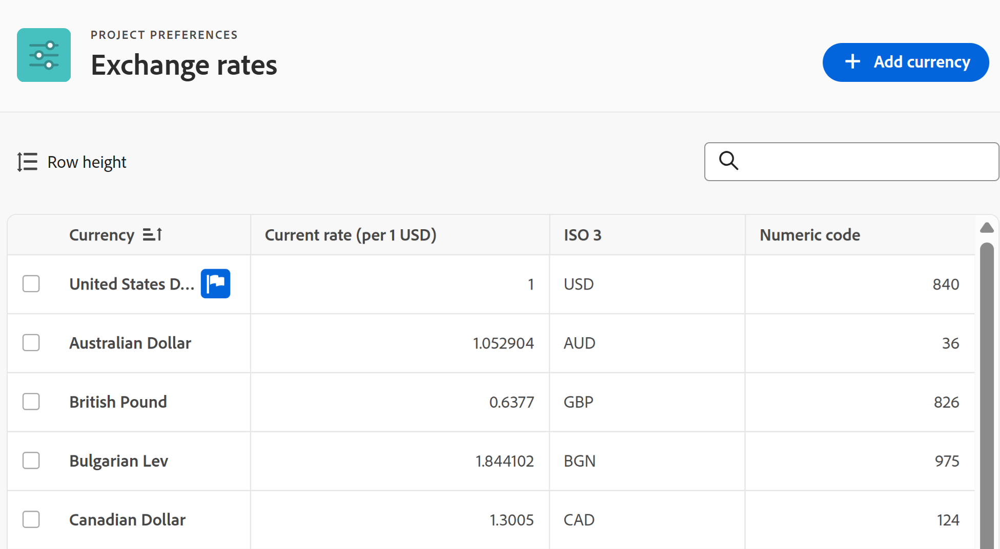
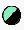
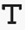
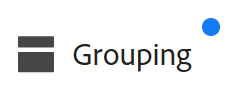

# Uitgebreide lijsten gebruiken

{{preview-fast-release-general}}

Uitgebreide lijsten zijn beschikbaar in sommige gebieden van Adobe Workfront. Deze lijsten gebruiken een lijstformaat voor het tonen van de lijstitems, en zij hebben een verschillend uiterlijk dan de standaardlijsten. Het beheer van weergaven wordt ook verbeterd, zoals filteren, groeperen, kolommen beheren en zoeken.

Voor informatie over de standaardlijsten, zie [&#x200B; begonnen worden met lijsten in Adobe Workfront &#x200B;](/help/quicksilver/workfront-basics/navigate-workfront/use-lists/view-items-in-a-list.md).

>[!NOTE]
>
>Elke verbeterde lijst kan verschillend worden gevormd om u te helpen de gegevens tonen die u nodig hebt. In elke lijst worden niet alle functies gebruikt die in dit artikel worden beschreven. Sommige lijsten kunnen speciale functies hebben die alleen op die lijst van toepassing zijn.

## Toegangsvereisten

+++ Breid uit om de toegangseisen voor de functionaliteit in dit artikel weer te geven.

<table style="table-layout:auto">
 <col> 
 <col>
 <tbody> 
  <tr> 
   <td>Adobe Workfront-pakket</td> 
   <td>
Alle
</td> 
  </tr> 
  <tr> 
   <td>Adobe Workfront-licentie</td> 
   <td>
   
Medewerker of hoger

   
Aanvraag of hoger
</td>
  </tr>
 </tbody> 
</table>

Voor informatie, zie [&#x200B; vereisten van de Toegang in de documentatie van Workfront &#x200B;](/help/quicksilver/administration-and-setup/add-users/access-levels-and-object-permissions/access-level-requirements-in-documentation.md).

+++

## Objecten met uitgebreide lijsten

Hieronder vindt u een aantal typen Workfront-objectlijsten die gebruikmaken van de uitgebreide lijstopmaak en enkele gebieden waarin deze standaard worden weergegeven wanneer u rechten hebt om het object te bekijken.

>[!NOTE]
>
>Deze lijst is niet uitgebreid. Elk van deze objecten lijsten kan ook op een rapport of een dashboard verschijnen. Bijvoorbeeld, toont een rapport van het Verzoek of een dashboard dat een rapport van het Verzoek bevat ook een lijst van verzoeken.

| Workfront-lijst | Locatie van objectlijst |
| --- | --- |
| Prioriteiten | <ul><li>Home > selecteer het pictogram Prioriteiten in het linkermenu</li><li>Hoofdmenu > Prioriteiten</li></ul> |
| Lijst van verzoeken | <ul><li>Verzoeken (alleen nieuwe ervaring)</li><li>Widget Mijn verzoeken bij Home</li></ul> |
| Lijsten met statussen, prioriteiten, ernst en wisselkoersen in Setup | <ul><li>Setup > Projectvoorkeuren > Statussen</li><li>Setup > Projectvoorkeuren > Prioriteiten</li><li>Setup > Projectvoorkeuren > Ernsten</li><li>Setup > Project Preferences > Exchange Rates</li></ul> |
|  Lijst van rapporten  |  Rapporten (**Gebruik deelbare omslagen** moet worden aangezet)  |
|  Lijst van baanrollen en tarieven in Opstelling  |  Opstelling > de Kaarten van het Tarief > selecteer een tariefkaart > de Rollen en Tarieven van de Baan  |
|  Lijst van vertalingen  |  Opstelling > Localization  |
|  Lijst van momentopnamen  |  Project > Momentopnamen  |
|  Lijst van middelen voor het factureren  |  Project > Middel voor het Factureren  |
|  Nieuwe Geavanceerde Taken op een taak  |  Taak > Toewijzingen > Geavanceerd  |

## Items toevoegen aan een verbeterde lijst

Voer een van de volgende handelingen uit afhankelijk van de verbeterde lijst die u weergeeft:

1. Klik op de blauwe knop rechtsboven in de lijst. Met deze optie wordt een dialoogvenster geopend waarin u gegevens kunt invoeren. De gegevens worden als een nieuwe rij in de tabel opgeslagen.

   OF

1. Klik **Nieuwe rij** bij de bodem van de lijst. Met deze optie voegt u een nieuwe rij toe aan de tabel. Dubbelklik in een cel om informatie in te voeren. Elke cel vertegenwoordigt een veld voor het lijstitem. Velden moeten bestaan voordat u ze in de lijst ziet.

   Uitgebreide lijsten ondersteunen deze veldtypen:

   * Tekst
   * Getal
   * Valuta
   * Datum
   * Datum en tijd
   * Enkele/meerdere downloads
   * Typeahead
   * Alinea
   * Ontvanger (één of meerdere)
   * Kleurkiezer

   >[!NOTE]
   >
   >Elk veldtype heeft zijn eigen bewerkingsopties. Sommige velden zijn mogelijk alleen-lezen.

## Items bewerken met de actiebalk

U kunt de actiebalk in een uitgebreide lijst gebruiken om items in de lijst te bewerken. Niet alle actiebalken hebben dezelfde opties. In sommige lijsten kunt u bovendien geen items selecteren en is de actiebalk niet beschikbaar.

1. Schakel het selectievakje naast een item in een uitgebreide lijst in.

   De actiebalk wordt onder aan het scherm weergegeven.

   >[!NOTE]
   >
   >Afhankelijk van de lijst die u bewerkt, kunt u een of meerdere items selecteren om de actiebalk te gebruiken.

1. Klik op een handeling op de balk om items te bewerken. Voorbeelden van handelingen die u kunt kiezen zijn:

   * Weergave
   * Bewerken
   * Verwijderen
   * Kopiëren
   * Verplaatsen naar map
   * Delen

   Als er geen acties beschikbaar zijn voor het geselecteerde item, wordt op de actiebalk &#39;&#39;Geen beschikbare acties&#39;&#39; weergegeven.

   

1. Beweeg over het primaire gebied van een lijstitem, dan klik **Meer** menu  om extra acties te zien. Sommige acties kunnen specifiek zijn voor die lijst.

   >[!TIP]
   >
   >Het primaire veld wordt weergegeven in de eerste kolom van de lijst.

   

## Kolommen aanpassen

Afhankelijk van de objecten die u in een uitgebreide lijst weergeeft, kunt u kolommen in de lijst verbergen, weergeven of opnieuw ordenen.

1. Klik **Kolommen** boven de lijst.

   

1. Met de schakelopties kunt u kolommen in de lijst weergeven of verbergen.
1. Om de kolommen opnieuw in orde te brengen, klik het **pictogram van de Belemmering** pictogram  Als u kolommen verplaatst, wordt de lijst automatisch gewijzigd.

   >[!NOTE]
   >
   >Het primaire veld is de eerste kolom in de lijst. De kolom staat op de eerste positie en u kunt de kolom niet wijzigen. Als het aantal kolommen groot is, wordt het primaire veld naar links bevroren en als u horizontaal schuift, ziet u het altijd.
   >
   >Het pictogram naast een veldnaam geeft het veldtype aan, zoals tekst of datumveld.

   Een indicator verschijnt op de **knoop van Kolommen** wanneer de kolommen worden verborgen. De indicator wordt niet weergegeven wanneer u de kolommen opnieuw ordent.

   

### Kolommen hernoemen

In sommige kolommen kunt u een aangepaste naam voor de kolomtitel opslaan.

1. Beweeg over de kolom, dan klik de benedenpijl en selecteer **anders noemen**.

   

1. Op **anders noem** dialoog, typ de naam voor de kolom in het **etiket** gebied van de Douane, en klik **sparen**.

   De nieuwe kolomnaam wordt in de lijst weergegeven.

### Kolommen toevoegen en verwijderen met Kolombeheer

U kunt de **manager van de Kolom** in sommige verbeterde lijsten gebruiken om kolommen op de lijst gemakkelijk toe te voegen en te verwijderen. U kunt zowel systeem- als aangepaste velden die al in Workfront als kolommen bestaan, toevoegen aan of verwijderen uit een verbeterde lijst.

Kolommen toevoegen en verwijderen:

1. Klik + pictogram op de hoger-juiste hoek van de lijst om de **manager van de Kolom** doos te openen.
1. Onderzoek naar een bestaand objecten gebied in de **Beschikbare** kolom, dan klik + aan het recht van de gebiedsnaam het om het aan de **Geselecteerde** kolom toe te voegen.
1. Klik - rechts van een gebied in de **Geselecteerde** kolom om het uit de lijst te verwijderen.

   >[!NOTE]
   >
   >Sommige velden zijn mogelijk vast en kunnen niet worden verwijderd.

   <!-- Add info about Properties and KPIs when something gets released with those options -->

1. Klik **sparen**.

   

   De lijst werkt de kolommen bij volgens de keuzes die u hebt gemaakt.

### De rijhoogte wijzigen in een weergave

>[!NOTE]
>
>Niet alle uitgebreide lijsten bevatten alle elementen die in deze sectie worden beschreven.

1. Klik het **pictogram van de de hoogte van de Rij** 

   Hiermee werkt u de verticale lengte van een rij bij. Kies een van de volgende opties:
   * Kort
   * Standaard. Dit is de standaardoptie.
   * Medium
   * Lang

## Uitgebreide lijstelementen bijwerken

De volgende elementen zijn componenten van een verbeterde lijst:

* **Mening**: Bepaalt de kolommen, de filters, en de groeperingen in de lijst met vooraf ingestelde montages
* **Filters**: Beperkt de hoeveelheid informatie die in de lijst wordt getoond
* **Groepen**: Organiseer de lijstpunten volgens gemeenschappelijke gebieden
* **Soort**: Rangschikt de punten in een lijst volgens de orde u voor een bepaald gebied identificeert
* **Onderzoek**: vindt snel een punt gebruikend een sleutelwoord van het onderzoek

### Weergaven toepassen en maken

>[!NOTE]
>
>Niet alle uitgebreide lijsten bevatten alle elementen die in deze sectie worden beschreven.

Een weergave toepassen of maken:

1. Klik de **drop-down Meningen** en selecteer een bestaande mening om het op de lijst toe te passen

   OF

   Klik **Nieuwe mening** om te creëren.

1. (Voorwaardelijk) voor het toevoegen van een nieuwe mening, ga een naam voor de mening in, dan klik **creeer**.
1. (Optioneel) U kunt de kolommen verbergen, weergeven of opnieuw rangschikken. Voor meer informatie, zie [&#x200B; kolommen in een verbeterde lijst &#x200B;](#customize-columns-in-an-enhanced-list) aanpassen.
1. (Optioneel) Filter de lijst. Voor meer informatie, zie [&#x200B; punten van de Filter in een verbeterde lijst &#x200B;](#filter-items-in-an-enhanced-list).
1. (Optioneel) Groepeer de items in de lijst. Voor meer informatie, zie [&#x200B; de punten van de Groep in een verbeterde lijst &#x200B;](#group-items-in-an-enhanced-list).

   Wijzigingen in weergaven worden automatisch opgeslagen. De volgende keer dat u deze weergave toepast, blijven de kolom- en filterinstellingen behouden zoals u ze instelt.

### Een weergave delen

>[!NOTE]
>
>Niet alle uitgebreide lijsten bevatten alle elementen die in deze sectie worden beschreven.

In **Meningen** dropdown, kunt u drie categorieën van meningen zien:

* **de Kijken van het Systeem**: Meningen die de systeembeheerder aan u toewees. U kunt de systeemweergaven niet delen.
* **Gedeelde Meningen**: De meningen die met u door andere gebruikers zijn gedeeld.
* **Mijn Weergaven**: De meningen die u creeerde en met anderen kunt delen. U kunt weergaven delen met andere gebruikers, teams of groepen.

Wanneer u een weergave deelt, worden alle weergave-elementen (kolommen, filters en groepen) opgenomen.

Een weergave delen:

1. In **Meningen** dropdown, houd over de mening in **Mijn Meningen** die u wilt delen, klik **Meer** menu , en klik **Deel**.
1. Voer in het dialoogvenster Delen de namen in van de gebruikers, teams, groepen, bedrijven of taakrollen waarmee u de weergave wilt delen, en selecteer deze vervolgens in de lijst wanneer ze worden weergegeven.

   U kunt de volgende machtigingen aan de ontvangers geven:

   * **Mening**: De gebruikers kunnen de mening op de lijst toepassen maar het niet delen.

      wanneer de de toegangsgebruikers van de Mening de mening bijwerken, worden die veranderingen bewaard aan de persoonlijke voorkeur van de gebruiker. Een blauwe punt op de meningsnaam (in de 0&rbrace; Gedeelde Meningen van de gebruiker **) toont aan dat de persoonlijke updates op de mening worden toegepast.**

   * **leidt**: De gebruikers kunnen, de mening anders noemen delen of schrappen, en de elementen van de mening uitgeven.

      wanneer Manage de toegangsgebruikers veranderingen in de mening aanbrengen, zullen alle gebruikers die de mening hebben met hen wordt gedeeld die updates zien wanneer de mening op de lijst wordt toegepast.

1. Klik **sparen**.

    als u een mening met een gebruiker deelt en dan verwijdert die toegang, wordt de mening verwijderd uit de 1&rbrace; Gedeelde Meningen van de gebruiker **.** Als de gebruiker de gedeelde mening op de lijst had wordt toegepast wanneer hun toegang wordt verwijderd, dan wordt de systeem standaardmening toegepast.

### Een weergave kopiëren

>[!NOTE]
>
>Niet alle uitgebreide lijsten bevatten alle elementen die in deze sectie worden beschreven.

Wanneer een weergave met u wordt gedeeld en u hiervoor geen machtiging hebt, kunt u de weergave kopiëren en opslaan onder een andere naam. U moet eerst wijzigingen aanbrengen in de weergave voordat u deze kunt kopiëren.

1. In het drop-down Meningen, houd over de mening in **Gedeelde Meningen** dat u de montages van wijzigde en die willen kopiëren, **Meer** menu  klikken, en **Exemplaar met voorkeur** klikken.

   Er wordt automatisch een nieuwe weergave gemaakt. De naam van de gekopieerde mening volgt het volgende patroon: `Original view name (copy)` en het toont in de **Mijn 2&rbrace; sectie van Meningen &lbrace;van meningen.**

   U bent de eigenaar van deze weergave en u kunt de weergave hernoemen, bewerken, delen of verwijderen. Als de eigenaar van de oorspronkelijke weergave de gedeelde toegang tot die weergave verwijdert, hebt u nog steeds toegang tot de weergave die u hebt gemaakt door het gedeelde origineel te kopiëren.

   >[!NOTE]
   >
   >Het **Exemplaar met voorkeur** optie is slechts beschikbaar wanneer u veranderingen in een mening hebt aangebracht die met u werd gedeeld.

### Een weergave opnieuw instellen

>[!NOTE]
>
>Niet alle uitgebreide lijsten bevatten alle elementen die in deze sectie worden beschreven.

Wanneer een weergave met u wordt gedeeld die u niet mag bewerken en u die weergave bijwerkt, kunt u de weergave herstellen naar de oorspronkelijke weergave.

1. In **Meningen** dropdown, houd over de mening in **Gedeelde Meningen** die u wilt terugstellen, klikt **Meer** menu , en klik **Teruggesteld aan gebrek**.

   De weergave-elementen (kolommen, filters en groepen) worden teruggezet op de oorspronkelijke instellingen die met u zijn gedeeld.

   >[!NOTE]
   >
   >Het **Terugstellen aan gebrek** optie is slechts beschikbaar wanneer u veranderingen in een mening hebt aangebracht die met u werd gedeeld.

    terug

### Voorwaardelijke opmaak toepassen in een weergave

>[!NOTE]
>
>Niet alle uitgebreide lijsten bevatten alle elementen die in deze sectie worden beschreven.

Met voorwaardelijke opmaak kunt u belangrijke informatie in de weergave benadrukken op basis van algemene criteria.

1. Klik het **pictogram** de cellen van het Formaat { Het **vakje van het Formaat** opent.

1. Klik **toevoegen voorwaarde**.
1. In **als** lijn, selecteer een gebied en kies een gebiedswaarde en voeg een bepaling toe. De opties veranderen, afhankelijk van het gebiedstype u kiest.

   >[!TIP]
   >
   >Alleen velden die zichtbaar zijn in de uitgebreide lijst, zijn beschikbaar voor voorwaardelijke opmaak.

1. (Facultatief) in plaats van het toevoegen van een gebiedswaarde, klik **vergelijken met een ander gebied** pictogram  en kies een gebied de waarvan waarde u met de waarde van uw geselecteerd gebied wilt vergelijken. U kunt bijvoorbeeld de velden Onderwerp en Beschrijving vergelijken op aanvraagitems.

   >[!TIP]
   >
   >Alleen velden die zichtbaar zijn in de lijstweergave zijn beschikbaar voor voorwaardelijke opmaak. De velden die u vergelijkt, moeten van hetzelfde type zijn.

1. (Facultatief) klik **toevoegen voorwaarde** in **als** lijn om meer voorwaarden aan de zelfde regel toe te voegen.

   >[!TIP]
   >
   >U kunt maximaal 10 voorwaarden toevoegen aan een conditioneringsregel en u kunt maximaal 20 regels toepassen op een veld.

1. Klik de **of** schakelaar tussen voorwaarden om in **en** te veranderen en erop te wijzen dat de veelvoudige voorwaarden tezelfdertijd moeten worden vervuld. **Of** is de standaardschakelaar.
1. In de **lijn van het Formaat**, selecteer een gebied om erop te wijzen welke kolom zal worden geformatteerd.
1. (Facultatief) klik het **pictogram van de kleurencirkel** het formaatpictogram van de Kleur  Vullingsgebied van de Cel te kiezen **om de kleur van de achtergrond in een cel te veranderen of een kleur van het** de kleur van de Tekst **gebied te kiezen om de kleur van tekst in een cel te veranderen.**
1. Klik het **pictogram van het formaat van de Tekst 1&rbrace; van de Tekst** 
   * Vet
   * Cursief

1. Zet **toe is op rij** het plaatsen om het formatteren op de volledige rij van het gebied toe te passen dat aan de voorwaarden voldoet.

1. (Facultatief) klik **toevoegen voorwaarde** in het **vakje van het Formaat** om een andere regel voor een ander gebied toe te voegen en de herhaling hierboven de stappen.
1. (Optioneel) Klik op **Alles wissen** om alle opmaak te verwijderen.
1. Klik buiten het **vakje van het Formaat** om het te sluiten.

   Hiermee keert u terug naar de lijstweergave.
De opmaak wordt direct toegepast op de lijstweergave.
Er is een blauw punt naast het **pictogram van de Cellen van het Formaat** om erop te wijzen dat de mening speciale toegepaste het formatteren heeft.

### Items in een verbeterde lijst filteren

>[!NOTE]
>
>Niet alle uitgebreide lijsten bevatten alle elementen die in deze sectie worden beschreven.

Met filters vermindert u de hoeveelheid informatie die u in de lijst weergeeft.

1. Klik **Filter** boven de lijst.
1. In de doos van de Filter, klik **toevoegt voorwaarde**.
1. Selecteer een veld waarop u wilt filteren.
1. Selecteer een filtermodifier, zoals &quot;Heeft een van de opties,&quot; &quot;Heeft geen van de opties&quot;, &quot;Is ervoor&quot; of &quot;Is erna&quot;. De opties voor wijzigingstoetsen zijn afhankelijk van het type veld waarop u filtert.
1. Selecteer de veldwaarde(n). Afhankelijk van het veldtype waarop u filtert, wordt u mogelijk gevraagd het item in een lijst te selecteren, ernaar te zoeken of een kalender te gebruiken om een datumbereik te selecteren.

   

   Het filter wordt automatisch toegepast op de lijst.

   >[!TIP]
   >
   > om een gepersonaliseerd filter toe te passen, selecteer één van de volgende opties voor een gebiedswaarde:
   >
   >

   >
   >* **me (het programma geopende gebruiker)** om naar de het programma geopende gebruiker op gebieden te verwijzen die naar gebruikers verwijzen.
   >
   >* **Mijn teams** of **Mijn huisteam** om naar uw teams op gebieden te verwijzen die naar teams verwijzen.
   >
   >* **Mijn groepen** of **Mijn huisgroep** om naar uw groepen in gebieden te verwijzen die naar groepen verwijzen.
   >
   >* **Mijn bedrijf** om naar uw bedrijf op gebieden te verwijzen die naar bedrijven verwijzen.
   > 
   >* **Mijn rollen** of **Mijn primaire rol** om naar uw baanrollen op gebieden te verwijzen die naar rollen verwijzen.
   >
   >

1. Klik **toevoegen voorwaarde** om een andere voorwaarde aan de filter toe te voegen.

   U kunt veelvoudige filters door EN of een OF schakelaar aansluiten.

1. Wanneer de filter wordt toegepast, kunt u de **opties van de Filter** opnieuw openen om de filteropties te veranderen of alle filters te ontruimen.

   Een indicator verschijnt op de **knoop van de Filter** wanneer een filter op de lijst wordt toegepast.

   

### Items in een verbeterde lijst groeperen

>[!NOTE]
>
>Niet alle uitgebreide lijsten bevatten alle elementen die in deze sectie worden beschreven.

De groepen scheiden de voorwerpen op de lijst in gebieden die op specifieke criteria worden gebaseerd.

Workfront biedt een beperkt aantal vooraf gedefinieerde groepen en u kunt deze niet wijzigen.

1. Klik **Groepering** boven de lijst.
1. Selecteer een groepering om uw lijst te organiseren.

   

1. Klik **samenvouwen allen** om de lijst met alle samengevouwen groeperingen te tonen. De standaardoptie is om de lijst met alle uitgevouwen groepen weer te geven.
1. Wanneer de groepering wordt toegepast, kunt u de opties van de Groep opnieuw openen om alle groeperingen in één keer samen te vouwen of uit te breiden, de groepering te veranderen om te groeperen door een verschillend gebied, of alle groeperingen te ontruimen.

   

   Een indicator verschijnt op de **Groeperende** knoop wanneer het groeperen wordt toegepast op de lijst.

   

### Sorteren in een verbeterde lijst

>[!NOTE]
>
>Niet alle uitgebreide lijsten bevatten alle elementen die in deze sectie worden beschreven.

Afzonderlijke kolommen sorteren:

1. Beweeg over de kolom, dan klik de benedenpijl en selecteer **Soort**.

   Een pictogram naast een kolomnaam geeft aan dat de lijst wordt gesorteerd op de waarden in die kolom en op de richting van de sortering.

   >[!NOTE]
   >
   >Sommige kolommen kunnen niet sorteerbaar zijn, afhankelijk van de lijst.

   

1. (Facultatief) om uw werk binnen een groepering te sorteren, **Groepering** te klikken, naar de lijn van de toegepaste groepering te gaan, op sorteerdropdown te klikken, en een oplopende of dalende orde te selecteren.

   

   >[!TIP]
   >
   >De sorteervolgorde verschilt op basis van het veldtype waarop u sorteert.

### Zoeken in een uitgebreide lijst

>[!NOTE]
>
>Niet alle uitgebreide lijsten bevatten alle elementen die in deze sectie worden beschreven.

1. Typ een trefwoord waarop u wilt zoeken in het vak Zoeken rechtsboven in de lijst. De resultaten worden tijdens het typen in de lijst gemarkeerd.

   

   >[!NOTE]
   >
   >De zoekopdracht zoekt naar alle kolommen in alle lijstitems. Als de lijst lang is, bevat de zoekopdracht items die u mogelijk moet schuiven om deze weer te geven. Wanneer de lijst wordt gefilterd, kijkt het onderzoek slechts naar wat momenteel wordt getoond.

