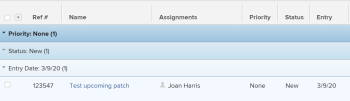

# Aan de slag met lijsten in [!DNL Adobe Workfront]

<!--Audited: 11/2024-->

U kunt lijsten met objecten weergeven in [!DNL Adobe Workfront] voor meer informatie over deze objecten, zoals de begin- en vervaldatum, de gebruikers die eraan zijn toegewezen en andere objecten die eraan zijn gekoppeld.

Hier volgen enkele kenmerken van lijsten in [!DNL Workfront] :

* Lijsten verfrissen zich automatisch om de vijf minuten om informatie bij te werken die andere gebruikers in het systeem elders bijwerken.
* Sommige gebieden in [!DNL Workfront] zijn vooraf geconfigureerd met standaardlijsten met objecten.

  U kunt de meeste van deze vooraf geconfigureerde lijsten aanpassen.

* Een [!DNL Workfront] -beheerder kan aangepaste lijsten maken die op verschillende gebieden van [!DNL Workfront] worden toegepast.

  Voor meer informatie over het creëren van systeem-vlakke lijsten, zie het artikel [&#x200B; creëren, uitgeven, en delen standaardfilters, meningen, en groeperingen &#x200B;](../../../administration-and-setup/set-up-workfront/configure-system-defaults/create-and-share-default-fvgs.md).

## Toegangsvereisten

+++ Breid uit om de toegangseisen voor de functionaliteit in dit artikel weer te geven.

U moet de volgende toegang hebben om de stappen in dit artikel uit te voeren:

<table style="table-layout:auto"> 
 <col> 
 <col> 
 <tbody> 
  <tr> 
   <td role="rowheader">Adobe Workfront-plan</td> 
   <td> 
Alle
 </td> 
  </tr> 
  <tr> 
   <td role="rowheader">Adobe Workfront-licentie*</td> 
   <td> 
    
Nieuw:

   <ul><li>
Medewerker of hoger 
</li>
   </ul>

Huidige:

   <ul><li>
Aanvraag of hoger
</li>
    </ul></td> 
  </tr> 
  <tr> 
   <td role="rowheader">Configuraties op toegangsniveau</td> 
   <td> 
Toegang tot filters, weergaven, groepen bewerken 
 </td> 
  </tr> 
  <tr> 
   <td role="rowheader">Objectmachtigingen</td> 
   <td> 
Machtigingen weergeven of hoger voor een filter, weergave of groep met toegang tot delen 
  </td> 
  </tr> 
 </tbody> 
</table>

*For informatie, zie [&#x200B; vereisten van de Toegang in de documentatie van Workfront &#x200B;](/help/quicksilver/administration-and-setup/add-users/access-levels-and-object-permissions/access-level-requirements-in-documentation.md).

+++

<!--Old access: 

You must have the following access to perform the steps in this article:

<table style="table-layout:auto"> 
 <col> 
 <col> 
 <tbody> 
  <tr> 
   <td role="rowheader"><strong>[!DNL Adobe Workfront] plan*</strong></td> 
   <td> 
Any
 </td> 
  </tr> 
  <tr> 
   <td role="rowheader"><strong>[!DNL Adobe Workfront] license*</strong></td> 
   <td> 
[!UICONTROL Request] or higher
 </td> 
  </tr> 
  <tr> 
   <td role="rowheader"><strong>Access level configurations*</strong></td> 
   <td> 
[!UICONTROL View] or higher access to filters, views, groupings
 
For items in the [!UICONTROL Setup] area, you need administrative access for the item or the [!UICONTROL System Administrator] access level.
 
Note: If you still don't have access, ask your [!DNL Workfront] administrator if they set additional restrictions in your access level. For information on how a [!DNL Workfront] administrator can change your access level, see <a href="../../../administration-and-setup/add-users/configure-and-grant-access/create-modify-access-levels.md" class="MCXref xref">Create or modify custom access levels</a>.
 </td> 
  </tr> 
  <tr> 
   <td role="rowheader"><strong>Object permissions</strong></td> 
   <td> 
[!UICONTROL View] or higher permissions with access to share
 
For information on requesting additional access, see <a href="../../../workfront-basics/grant-and-request-access-to-objects/request-access.md" class="MCXref xref">Request access to objects </a>.
 </td>
  </tr> 
 </tbody> 
</table>

To find out what plan, license type, or access you have, contact your [!DNL Workfront] administrator.
-->

## Objectlijsten

Hieronder vindt u een aantal objectlijsten die u kunt vinden in [!DNL Workfront] en een aantal gebieden waarin deze standaard worden weergegeven wanneer u rechten hebt om een object te bekijken.

>[!NOTE]
>
>* Deze lijst is niet uitgebreid. Elk van deze objecten lijsten kan ook op een rapport of een dashboard verschijnen. Bijvoorbeeld, toont een rapport van het Project of een dashboard dat een rapport van het Project bevat ook een lijst van projecten.
>* In deze lijst betekent &quot;selecteren&quot; dat u op de naam van het item moet klikken en niet op het selectievakje links van de naam.

<table style="table-layout:auto"> 
 <col> 
 <col> 
 <thead> 
  <tr> 
   <th><strong>[!DNL Workfront] list</strong></th> 
   <th><strong>Locatie van objectlijst</strong></th> 
  </tr> 
 </thead> 
 <tbody> 
  <tr> 
   <td>Lijst van portefeuilles</td> 
   <td> 
    <ul> 
     <li> 
[!UICONTROL Portfolios]
 </li> 
    </ul> </td> 
  </tr> 
  <tr> 
   <td>Lijst van programma's</td> 
   <td> 
    <ul> 
     <li> 
[!UICONTROL Portfolios] &gt;[!UICONTROL select a portfolio] &gt;[!UICONTROL Programs]
 </li> 
     <li data-mc-conditions="QuicksilverOrClassic.Quicksilver"> 
[!UICONTROL Programs]
 </li> 
    </ul> </td> 
  </tr> 
  <tr> 
   <td>Lijst van projecten</td> 
   <td> 
    <ul> 
     <li> 
[!UICONTROL Projects]
 </li> 
     <li> 
[!UICONTROL Portfolios] &gt;[!UICONTROL select a portfolio] &gt;[!UICONTROL Projects]
 </li> 
     <li> 
[!UICONTROL Portfolios] &gt;[!UICONTROL select a portfolio] &gt;[!UICONTROL Programs] &gt;[!UICONTROL select a program] &gt;[!UICONTROL Projects]
 </li> 
    </ul> </td> 
  </tr> 
  <tr> 
   <td>Lijst met taken</td> 
   <td> 
    <ul> 
     <li> 
[!UICONTROL Projects] &gt;[!UICONTROL select a project] &gt; [!UICONTROL Tasks]
 </li> 
     <li> 
[!UICONTROL Projects] &gt;[!UICONTROL select a project] &gt;[!UICONTROL Tasks] &gt;[!UICONTROL select a task] &gt;[!UICONTROL Subtasks]
 </li> 
     <li> 
[!UICONTROL Projects] &gt;[!UICONTROL select a project] &gt;[!UICONTROL Tasks] &gt;[!UICONTROL select a task] &gt; [!UICONTROL Predecessors*]
 </li> 
    </ul> </td> 
  </tr> 
  <tr> 
   <td>Lijst met problemen</td> 
   <td> 
    <ul> 
     <li> 
[!UICONTROL Projects] &gt; [!UICONTROL select] een project &gt;[!UICONTROL Issues]
 </li> 
     <li> 
[!UICONTROL Projects] &gt;[!UICONTROL select a project] &gt;[!UICONTROL Tasks] &gt;[!UICONTROL select a task] &gt; [!UICONTROL Issues]
 </li> 
     <li> 
[!UICONTROL Projects] &gt;[!UICONTROL select a project] &gt;[!UICONTROL Tasks] &gt;[!UICONTROL select a task] &gt;[!UICONTROL Subtasks] &gt;[!UICONTROL select a task] &gt; [!UICONTROL Issues]
 </li> 
    </ul> </td> 
  </tr> 
  <tr> 
   <td>Lijst van verslagen</td> 
   <td> 
    <ul> 
     <li> 
  [!UICONTROL Reports]  
 </li> 
    </ul> </td> 
  </tr> 
  <tr> 
   <td>Lijst met dashboards</td> 
   <td> 
    <ul> 
     <li> 
[!UICONTROL Dashboards]
 </li> 
    </ul> </td> 
  </tr> 
  <tr> 
   <td>Lijst met herhalingen</td> 
   <td> 
    <ul> 
     <li> 
[!UICONTROL Teams] &gt; [!UICONTROL Iterations]
 </li> 
    </ul> </td> 
  </tr> 
  <tr> 
   <td>Lijst met gebruikers</td> 
   <td> 
    <ul> 
     <li> 
[!UICONTROL Users]
 </li> 
    </ul> </td> 
  </tr> 
  <tr> 
   <td>Lijst van documenten</td> 
   <td> 
    <ul> 
     <li> 
[!UICONTROL Documents]
 </li> 
     <li> 
[!UICONTROL Portfolios] &gt;[!UICONTROL select a portfolio] &gt; [!UICONTROL Documents]
 </li> 
     <li> 
[!UICONTROL Portfolios] &gt; [!UICONTROL select a portfolio] &gt; [!UICONTROL Programs] &gt; [!UICONTROL select a program] &gt;[!UICONTROL Documents]
 </li> 
     <li> 
[!UICONTROL Projects] &gt;[!UICONTROL select a project] &gt;[!UICONTROL Documents]
 </li> 
     <li> 
[!UICONTROL Projects] &gt;[!UICONTROL select a project] &gt;[!UICONTROL Tasks] &gt;[!UICONTROL select a task] &gt; [!UICONTROL Documents]
 </li> 
     <li> 
[!UICONTROL Projects] &gt; [!UICONTROL select] een project &gt; [!UICONTROL Issues] &gt; [!UICONTROL select an issue] &gt; [!UICONTROL Documents]
 </li> 
    </ul> </td> 
  </tr> 
  <tr> 
   <td>Lijst van tijdbladen</td> 
   <td> 
    <ul> 
     <li> 
[!UICONTROL Timesheet] s &gt; [!UICONTROL All Timesheets]*
 </li> 
    </ul> </td> 
  </tr> 
  <tr> 
   <td>Lijst van factureringssnelheden</td> 
   <td> 
    <ul> 
     <li> 
[!UICONTROL Projects] &gt;[!UICONTROL select a project] &gt;[!UICONTROL Billing Rates*]
 </li> 
    </ul> </td> 
  </tr> 
  <tr> 
   <td>Lijst met factureringsgegevens</td> 
   <td> 
    <ul> 
     <li> 
[!UICONTROL Projects] &gt; [!UICONTROL select a project] &gt; [!UICONTROL Billing Records]
 </li> 
    </ul> </td> 
  </tr> 
  <tr> 
   <td>Lijst van risico's</td> 
   <td> 
    <ul> 
     <li> 
[!UICONTROL Projects] &gt;[!UICONTROL select a project] &gt;[!UICONTROL Risks]
 </li> 
    </ul> </td> 
  </tr> 
  <tr> 
   <td>Lijst van uitgaven</td> 
   <td> 
    <ul> 
     <li> 
[!UICONTROL Projects] &gt;[!UICONTROL select] een project &gt;[!UICONTROL Expenses]
 </li> 
     <li> 
[!UICONTROL Projects] &gt; [!UICONTROL select a project] &gt; [!UICONTROL Tasks] &gt; [!UICONTROL select a task] &gt;[!UICONTROL Expenses]
 </li> 
    </ul> </td> 
  </tr> 
  <tr> 
   <td>Lijst met uurwaarden</td> 
   <td> 
    <ul> 
     <li> 
[!UICONTROL Projects] &gt;[!UICONTROL select] een project
 </li> 
     <li> 
[!UICONTROL Projects] &gt;[!UICONTROL select a project] &gt;[!UICONTROL Tasks] &gt;[!UICONTROL select a task] &gt;[!UICONTROL Hours]
 </li> 
     <li> 
[!UICONTROL Projects] &gt; [!UICONTROL select] een project &gt; [!UICONTROL Issues] &gt; [!UICONTROL select] een kwestie &gt;[!UICONTROL Hours]
 </li>
    </ul> </td> 
  </tr>
  <tr> 
   <td>Lijst met aangepaste formulieren</td> 
   <td> 
    <ul> 
     <li>[!UICONTROL Setup] &gt;[!UICONTROL Custom Forms] </li> 
    </ul> </td> 
  </tr> 
  <tr> 
    <td>Lijst van groepen of subgroepen</td> 
   <td> 
    <ul> 
     <li> 
[!UICONTROL Setup] &gt;[!UICONTROL Groups]
 </li>
     <li> 
[!UICONTROL Setup] &gt;[!UICONTROL Groups] &gt;[!UICONTROL select the parent group] &gt;[!UICONTROL Subgroups] </li> 
    </ul> </td> 
  </tr> 
  <tr> 
   <td>Lijst van teams</td> 
   <td> 
    <ul> 
     <li> 
[!UICONTROL Setup] &gt;[!UICONTROL Teams]
 </li> 
    </ul> </td> 
  </tr>
  <tr> 
   <td>Lijst van ondernemingen</td> 
   <td> 
    <ul> 
     <li> 
[!UICONTROL Setup] &gt;[!UICONTROL Companies]
 </li> 
    </ul> </td> 
  </tr>
  <tr> 
   <td>Lijst van dienstregelingen</td> 
   <td> 
    <ul> 
     <li> 
[!UICONTROL Setup] &gt;[!UICONTROL Schedules]
 </li> 
    </ul> </td> 
  </tr>
  <tr> 
   <td>Lijst met lay-outsjablonen</td> 
   <td> 
    <ul> 
     <li> 
[!UICONTROL Setup] &gt;[!UICONTROL Layout Templates]
 </li> 
    </ul> </td> 
  </tr>
 </tbody> 
</table>

U kunt de lijst in het opgegeven gebied niet aanpassen. Een [!DNL Workfront] beheerder kan een aangepaste lijst op systeemniveau bouwen, of u kunt een rapport voor dit voorwerp bouwen als uw toegangsniveau u toegang toestaat om rapporten uit te geven.

## Lijstelementen

Een lijst bevat bepaalde elementen die zijn formaat en de informatie bepalen die toont. U kunt verschillende elementen van de systeemlijst vinden die standaard beschikbaar zijn. U kunt ook aangepaste elementen maken die aan uw behoeften voldoen.

>[!NOTE]
>
>Wanneer u een nieuw filter, een nieuwe weergave of een nieuwe groep in een lijst selecteert, blijft die selectie behouden, zelfs als u zich afmeldt bij [!DNL Workfront] of de browser sluit.

Hieronder vindt u de elementen van een lijst:

<table style="table-layout:auto"> 
 <col> 
 <col> 
 <thead> 
  <tr> 
   <th><strong>Element</strong></th> 
   <th><strong>Toelichting</strong></th> 
  </tr> 
 </thead> 
 <tbody> 
  <tr> 
   <td><strong>[!UICONTROL Filter]</strong></td> 
   <td> 
De filters houden onnodige informatie uit een lijst, die op de criteria wordt gebaseerd die u specificeert. 
 
Voor meer informatie, zie <a href="../../../reports-and-dashboards/reports/reporting-elements/filters-overview.md" class="MCXref xref"> Overzicht van Filters </a>.
 </td> 
  </tr> 
  <tr> 
   <td><strong>[!UICONTROL View]</strong></td> 
   <td> 
Weergaven definiëren welke velden (kolommen) u op het scherm weergeeft.
 
Zie <a href="../../../reports-and-dashboards/reports/reporting-elements/views-overview.md" class="MCXref xref"> Overzicht van weergaven in [!DNL Adobe Workfront]</a> voor meer informatie.
 </td> 
  </tr> 
  <tr> 
   <td><strong>[!UICONTROL Grouping]</strong></td> 
   <td> 
Groepen scheiden de objecten in de lijst in gebieden op basis van de criteria die u opgeeft.
 
De problemen in een lijst kunnen bijvoorbeeld in secties worden weergegeven op basis van status of prioriteit.
 
U kunt maximaal drie lagen groepering in een standaardgroepering hebben, en u kunt een vierde laag toevoegen als u een groepering op tekstwijze vormt.
 
Voor meer informatie over groeperingen, zie <a href="../../../reports-and-dashboards/reports/reporting-elements/groupings-overview.md" class="MCXref xref"> Overzicht van Groepen in [!DNL Adobe Workfront]</a>.
 
Voor meer informatie over tekstwijze, zie <a href="../../../reports-and-dashboards/reports/text-mode/understand-text-mode.md" class="MCXref xref"> Overzicht van de Wijze van de Tekst </a>.
 </td> 
  </tr> 
 </tbody> 
</table>

Deze elementen worden standaard boven aan elke lijst weergegeven. Ze zijn vast en bewegen niet als u door de lijst schuift. Plaats de muis boven het pictogram voor elk element om het te identificeren.

U kunt lijstelementen in de volgende gebieden aanpassen en hen met andere gebruikers delen:

* Om het even welk systeem standaardlijst die in de sectie [&#x200B; wordt gevonden wordt begonnen met lijsten in  [!DNL Adobe Workfront]](#default-workfront-lists) in dit artikel
* Elk rapport dat met u wordt gedeeld

De bouwelementen voor lijsten zijn het zelfde als de bouwstenen voor rapporten.

Voor meer informatie over het creëren van en het aanpassen van de bouwselementen van lijsten en rapporten, zie [&#x200B; Meldend elementen: filters, meningen, en groeperingen &#x200B;](../../../reports-and-dashboards/reports/reporting-elements/reporting-elements-filters-views-groupings.md).

## Handelingen weergeven

U kunt de volgende handelingen in een lijst uitvoeren:

<table style="table-layout:auto"> 
 <col> 
 <col> 
 <thead> 
  <tr> 
   <th><strong>Handeling</strong></th> 
   <th><strong>Informatie</strong></th> 
  </tr> 
 </thead> 
 <tbody> 
  <tr> 
   <td><strong> Inline geeft uit </strong> </td> 
   <td> 
Objecten en hun gegevens rechtstreeks in de lijst bewerken.
 
Voor meer informatie, zie <a href="../../../workfront-basics/navigate-workfront/use-lists/inline-edit-objects.md" class="MCXref xref"> gealigneerde geef punten in een lijst in [!DNL Adobe Workfront]</a> uit.
 
   
<b>OPMERKING:</b>

   
Inline bewerken is niet mogelijk in een groep.

</td> 
  </tr> 
  <tr data-mc-conditions="QuicksilverOrClassic.Quicksilver"> 
   <td><strong> Update met [!UICONTROL Summary]</strong> </td> 
   <td> 
Werk taken en problemen op projectniveau bij met het deelvenster [!UICONTROL Summary] .
 
<b>TIP:</b>
 
De samenvatting is niet beschikbaar voor alle objecten en is niet beschikbaar in taak- of Issue-rapporten.
 
Voor meer informatie, zie <a href="../../../workfront-basics/the-new-workfront-experience/summary-overview.md" class="MCXref xref"> Overzicht van de Samenvatting </a>.
 </td> 
  </tr> 
  <tr> 
   <td><strong> pas lijstvertoning </strong> aan </td> 
   <td> 
Pas de vormgeving van een lijst, kolomindeling, sorteervolgorde van items of het aantal items dat wordt weergegeven aan.
 
<b>OPMERKING:</b>
 
Wijzigingen die u aanbrengt in het aantal items dat op een pagina wordt weergegeven, worden ongedaan gemaakt wanneer u zich afmeldt bij [!DNL Workfront] of de browser sluit. Wijzigingen kunnen ook na een periode van 8 uur worden teruggedraaid.
 
Voor meer informatie, zie <a href="../../../workfront-basics/navigate-workfront/use-lists/modify-list-display.md" class="MCXref xref"> wijzigen zich hoe een lijstvertoningen </a>.
 </td> 
  </tr> 
  <tr> 
   <td><strong> Snelle filter </strong> </td> 
   <td> 
Pas een snel filter toe om alleen items te zoeken die voor u van belang zijn, zodat u deze snel kunt bekijken, bijwerken of met anderen kunt delen.
 
<b>BELANGRIJK:</b>
 
 U kunt zoeken naar items die een zoekwoord bevatten met behulp van het snelfilter, of dat item zichtbaar is op het scherm of wordt weergegeven nadat u naar de onderkant van de pagina hebt geschoven. Wanneer u de zoekmogelijkheden van uw browser gebruikt, kunt u alleen items vinden die al op het scherm zichtbaar zijn. Als uw lijst meerdere pagina's bevat, worden met snelfilters alleen de items op de huidige pagina gevonden.
 
Voor meer informatie, zie <a href="../../../workfront-basics/navigate-workfront/use-lists/apply-quick-filter-list.md" class="MCXref xref"> de snelle filter op een lijst </a> toepassen.
 </td> 
  </tr> 
  <tr> 
   <td><strong> Uitvoer </strong> </td> 
   <td> 
Een lijst met objecten exporteren uit [!DNL Workfront] . Als een lijst meer dan 2000 items bevat, is het exporteren van de lijst de enige manier om alle items op één pagina te bekijken.
 
Voor meer informatie over het uitvoeren van een lijst, zie <a href="../../../workfront-basics/navigate-workfront/use-lists/export-lists.md" class="MCXref xref"> Uitvoer een lijst </a>. Voor meer informatie over de uitvoerformaten en grenzen, zie <a href="../../../reports-and-dashboards/reports/creating-and-managing-reports/export-data.md" class="MCXref xref"> Gegevens van de Uitvoer </a>.
 </td> 
  </tr> 
 </tbody> 
</table>

### Lijst, werkbalk

In de volgende tabel staan veel van de pictogrammen die beschikbaar zijn op de werkbalk en wordt aangegeven wat er gebeurt wanneer u erop klikt:

<table style="table-layout:auto"> 
 <col> 
 <col> 
 <col> 
 <tbody> 
  <tr> 
   <td><strong>Pictogram</strong></td> 
   <td><strong>Beschrijving</strong></td> 
   <td><strong>Bij klikken</strong></td> 
  </tr> 
  <tr> 
   <td>  </td> 
   <td>[!UICONTROL Add item or user]</td> 
   <td>Open meer opties, zoals het toevoegen van een nieuw item of een nieuwe gebruiker.</td> 
  </tr> 
  <tr> 
   <td>  </td> 
   <td>[!UICONTROL Insert task above]</td> 
   <td> 
Voeg een taak in boven de geselecteerde taak.
 
Dit is alleen beschikbaar voor taken. 
 </td> 
  </tr> 
  <tr> 
   <td>  </td> 
   <td>[!UICONTROL Insert task below]</td> 
   <td> 
Voeg een taak in onder de geselecteerde taak.
 
Dit is alleen beschikbaar voor taken. 
 </td> 
  </tr> 
  <tr> 
   <td>  </td> 
   <td>[!UICONTROL Edit]</td> 
   <td>Het geselecteerde item bewerken.</td> 
  </tr> 
  <tr> 
   <td>  </td> 
   <td>[!UICONTROL Copy]</td> 
   <td>Kopieer het geselecteerde item.</td> 
  </tr> 
  <tr> 
   <td>  </td> 
   <td>[!UICONTROL Delete]</td> 
   <td>Verwijder het geselecteerde item.</td> 
  </tr> 
  <tr> 
   <td>  </td> 
   <td>[!UICONTROL Add to]</td> 
   <td> 
Open het dialoogvenster om de geselecteerde uitgave aan een herhaling toe te voegen.
 
Dit is alleen beschikbaar voor problemen.
 </td> 
  </tr> 
  <tr> 
   <td>  </td> 
   <td>[!UICONTROL Share]</td> 
   <td>Deel het geselecteerde item.</td> 
  </tr> 
  <tr> 
   <td>  </td> 
   <td>[!UICONTROL Indent and outdent tasks] </td> 
   <td> 
De geselecteerde taak laten inspringen of uitspringen. 
 
Dit is alleen beschikbaar voor taken. 
 </td> 
  </tr> 
  <tr> 
   <td></a> </td> 
   <td>[!UICONTROL More]</td> 
   <td>Open aanvullende opties voor het geselecteerde item.</td> 
  </tr> 
  <tr> 
   <td> 
  
 </td> 
   <td> 
[!UICONTROL Quick filter] 
 </td> 
   <td> 
Open het snelle vakje van de filteronderzoek voor het vinden van punten in de getoonde lijst.
 </td> 
  </tr> 
  <tr> 
   <td>  </td> 
   <td>[!UICONTROL Export]</td> 
   <td>Exporteer de lijst naar PDF, Excel of bestanden met tabs als scheidingsteken.</td> 
  </tr> 
  <tr> 
   <td>  </td> 
   <td>[!UICONTROL Agile View]</td> 
   <td>Geef de lijst weer in de weergave Gelijk.  dit is beschikbaar slechts voor taken.</td> 
  </tr> 
  <tr> 
   <td>  </td> 
   <td>[!UICONTROL Gantt Chart]</td> 
   <td> 
Geef de lijst weer in de weergave [!UICONTROL Gantt Chart] .
 
Dit is alleen beschikbaar voor projecten en taken.
 </td> 
  </tr> 
  <tr data-mc-conditions=""> 
   <td>  
  
 </td> 
   <td>[!UICONTROL Filter] vervolgkeuzemenu</td> 
   <td> 
Geef een lijst weer met filters en extra opties voor het beheer van filters, waaronder het maken van filters. 
 
Op een klein scherm wordt de naam van het filter vervangen door het filterpictogram. Er wordt een blauwe stip weergegeven op het pictogram Filter wanneer u een ander filter toepast dan "[!UICONTROL All]".
 </td> 
  </tr> 
  <tr data-mc-conditions=""> 
   <td>  
  
 </td> 
   <td>[!UICONTROL View] vervolgkeuzemenu</td> 
   <td> 
Geef een lijst weer met weergaven en extra opties voor het beheren van weergaven, waaronder het maken van weergaven. 
 
Op een klein scherm wordt de weergavenaam vervangen door het pictogram [!UICONTROL view] . Er wordt een blauwe stip weergegeven op het pictogram [!UICONTROL View] wanneer u een andere weergave dan "[!UICONTROL Standard]" toepast.
 </td> 
  </tr> 
  <tr data-mc-conditions=""> 
   <td>  
  
 </td> 
   <td>[!UICONTROL Grouping] vervolgkeuzemenu</td> 
   <td> 
Geef een lijst weer met groepen en extra opties voor het beheer van groepen, waaronder het maken van groepen. 
 
Op een klein scherm wordt de naam van de groepering vervangen door het pictogram [!UICONTROL grouping] . Er wordt een blauwe stip weergegeven op het pictogram [!UICONTROL Grouping] wanneer u een andere groepering toepast dan "[!UICONTROL Nothing]".
 </td> 
  </tr> 
  <tr data-mc-conditions=""> 
   <td>  </td> 
   <td> 
[!UICONTROL Plan mode]
 </td> 
   <td> 
Kies of u de wijzigingen die u in een takenlijst aanbrengt, automatisch of handmatig wilt opslaan. 
 
Voor informatie over het uitgeven van taken in een lijst, zie <a href="/help/quicksilver/manage-work/tasks/manage-tasks/edit-tasks-in-a-list.md" class="MCXref xref"> taken in een lijst </a> uitgeven. 
 
Dit is alleen beschikbaar voor taken.
 </td> 
  </tr> 
  <tr> 
   <td>  </td> 
   <td>[!UICONTROL Summary]</td> 
   <td> 
Het vak [!UICONTROL Summary] voor het geselecteerde item weergeven of verbergen.
 
Dit is alleen beschikbaar voor taken en problemen.
 
Voor informatie over het [!UICONTROL Summary] paneel, zie <a href="/help/quicksilver/workfront-basics/the-new-workfront-experience/summary-overview.md" class="MCXref xref"> Overzicht van de Samenvatting </a>.
 </td> 
  </tr> 
  <tr> 
   <td>  </td> 
   <td>[!UICONTROL Remove]</td> 
   <td>Verwijder iets uit de lijst. Bijvoorbeeld, als groepsbeheerder die groep of subgroeplidmaatschap beheren, verwijder een groepslid zoals die in <a href="/help/quicksilver/administration-and-setup/manage-groups/create-and-manage-groups/view-and-manage-a-groups-memberships.md" class="MCXref xref"> wordt verklaard Mening en beheer het lidmaatschap van een groep </a>.</td> 
  </tr> 
  <tr> 
   <td>  </td> 
   <td>[!UICONTROL Comment] /[!UICONTROL Update]</td> 
   <td> 
Typ een opmerking of update.
 </td> 
  </tr> 
 </tbody> 
</table>

## Het verschil tussen lijsten en rapporten

Zowel lijsten als rapporten zijn rasters die informatie over een type object bevatten.

In de volgende tabel worden de overeenkomsten en verschillen tussen lijsten en rapporten beschreven:

<table style="table-layout:auto"> 
 <col> 
 <col> 
 <col> 
 <thead> 
  <tr> 
   <th><strong> Functionaliteit </strong> </th> 
   <th><strong> Lijst </strong> </th> 
   <th><strong> Rapport </strong> </th> 
  </tr> 
 </thead> 
 <tbody> 
  <tr> 
   <td> 
Iedereen kan ze maken
 </td> 
   <td> ✓*  </td> 
   <td> </td> 
  </tr> 
  <tr> 
   <td> 
Alleen een [!DNL Workfront] beheerder en gebruikers met een [!UICONTROL Plan] -licentie kunnen deze maken
 </td> 
   <td> </td> 
   <td>✓**</td> 
  </tr> 
  <tr> 
   <td> 
Een standaardset is beschikbaar via [!DNL Workfront]
 </td> 
   <td>✓</td> 
   <td>✓</td> 
  </tr> 
  <tr> 
   <td> 
Aanpasbaar in de standaardmodus
 </td> 
   <td>✓</td> 
   <td>✓</td> 
  </tr> 
  <tr> 
   <td> 
Aanpasbaar in tekstmodus
 </td> 
   <td>✓</td> 
   <td>✓</td> 
  </tr> 
  <tr> 
   <td> 
U kunt deze delen met andere gebruikers
 </td> 
   <td>✓</td> 
   <td>✓</td> 
  </tr> 
  <tr> 
   <td> 
U kunt ze op het hele systeem delen
 </td> 
   <td>✓</td> 
   <td> ✓ </td> 
  </tr> 
  <tr> 
   <td> 
U kunt ze buiten het systeem delen
 </td> 
   <td> </td> 
   <td>✓ </td> 
  </tr> 
  <tr> 
   <td> 
U kunt exporteren naar de indelingen .pdf, [!DNL Excel] en Door tabs gescheiden
 </td> 
   <td>✓</td> 
   <td> ✓ </td> 
  </tr> 
  <tr> 
   <td> 
U kunt ze plannen voor levering in een e-mail
 </td> 
   <td> </td> 
   <td>✓ </td> 
  </tr> 
  <tr> 
   <td> 
U kunt een lay-outsjabloon toevoegen
 </td> 
   <td>✓</td> 
   <td> </td> 
  </tr> 
  <tr> 
   <td> 
U kunt ze toevoegen aan aangepaste secties 
 </td> 
   <td> </td> 
   <td>✓</td> 
  </tr> 
  <tr> 
   <td> 
U kunt ze toevoegen aan een dashboard
 </td> 
   <td> ✓** </td> 
   <td>✓</td> 
  </tr> 
  <tr> 
   <td> 
U kunt herinneringen gebruiken om aan te passen wat zij tonen
 </td> 
   <td> </td> 
   <td>✓</td> 
  </tr> 
  <tr> 
   <td> 
U kunt ze in een grafiek weergeven
 </td> 
   <td> </td> 
   <td>✓</td> 
  </tr> 
  <tr> 
   <td> 
U kunt objecten daarin inline bewerken
 </td> 
   <td>✓</td> 
   <td>✓</td> 
  </tr> 
 </tbody> 
</table>

U moet toegang hebben tot filters, weergaven en groepen om deze te kunnen maken. Voor meer informatie, zie [&#x200B; toegang van de Verlening tot filters, meningen, en groeperingen &#x200B;](../../../administration-and-setup/add-users/configure-and-grant-access/grant-access-fvg.md).

U moet toegang hebben tot filters, weergaven en groepen, maar ook tot rapporten, dashboards en kalenders om deze te kunnen maken. Voor meer informatie, zie [&#x200B; toegang van de Verlening tot rapporten, dashboards, en kalenders &#x200B;](../../../administration-and-setup/add-users/configure-and-grant-access/grant-access-reports-dashboards-calendars.md).

U kunt lijsten voor rapporten aanpassen die op een dashboard worden geplaatst slechts als de schepper van het rapport de lijstelementen heeft gevormd om op het dashboard zichtbaar te zijn.

>[!NOTE]
>
>U kunt geen lijst aan een dashboard toevoegen zonder eerst een rapport te creëren en het toe te voegen aan het dashboard.

Voor meer informatie over de bouw van een rapport, zie [&#x200B; een douanerapport &#x200B;](../../../reports-and-dashboards/reports/creating-and-managing-reports/create-custom-report.md) creëren. Voor informatie over het creëren van douanesecties, zie [&#x200B; douanetabellen of secties &#x200B;](../../../workfront-basics/manage-your-account-and-profile/configuring-your-user-profile/create-custom-tabs.md) creëren.

## Het verschil tussen de bijgewerkte en de oudere lijsten

[!DNL Workfront] bevat twee typen lijsten:

* Oudere lijsten

  

* Bijgewerkte lijsten

  

In de volgende tabel ziet u een aantal verschillen tussen de verouderde en bijgewerkte lijsten in [!DNL Workfront] :

<!--
 [Legacy does not equal Classic. Legacy lists appear in NWE and Classic. Updated lists appear in NWE and Classic.]
-->

<table style="table-layout:auto"> 
 <col> 
 <col> 
 <tbody> 
  <tr> 
   <td><b>Oudere lijsten</b></td> 
   <td><b>Bijgewerkte lijsten</b></td> 
  </tr> 
  <td> 
Vertoning <strong> 100 </strong> punten door gebrek
 </td> 
   <td> 
Toon <strong> allen </strong> of tot <strong> 2000 </strong> punten door gebrek
 </td> 
  </tr> 
  <tr> 
   <td> 
CTRL+F gebruiken om items in een lijst te zoeken
 </td> 
   <td> 
Gebruik snelle filters om snel informatie in een grote lijst te zoeken
 
Voor informatie over het gebruiken van snelle filters in lijsten, zie <a href="../../../workfront-basics/navigate-workfront/use-lists/apply-quick-filter-list.md" class="MCXref xref"> de snelle filter op een lijst </a> toepassen.
 </td> 
  </tr> 
  <tr> 
   <td>U kunt aangepaste velden met tekstopmaak niet inline bewerken.</td> 
   <td> 
Tekst in aangepaste velden met opmaak kan worden geconfigureerd om vette, cursieve, onderstreepte, opsommingstekens, nummering, hyperlinks en blokaanhalingstekens toe te staan.
 
Voor meer informatie, zie <a href="/help/quicksilver/administration-and-setup/customize-workfront/create-manage-custom-forms/form-designer/design-a-form/design-a-form.md"> een douaneformulier </a> creëren.
 </td> 
  </tr> 
  <tr> 
   <td>Met voorwaardelijke opmaak kunt u de tekstkleur van koppelingen in een lijst wijzigen</td> 
   <td>Kan tekstkleurwijzigingen niet toepassen op koppelingen in een lijst</td> 
  </tr> 
 </tbody> 
</table>
