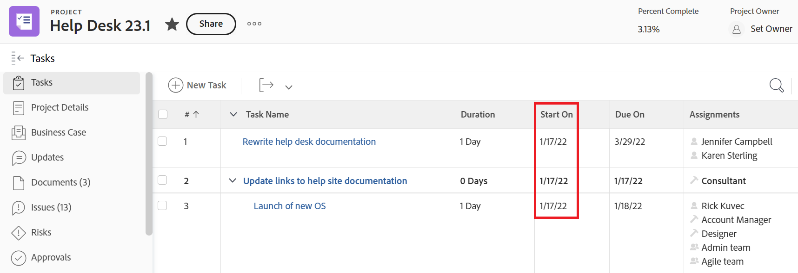

# Overzicht van de project-, taak- en uitgiftedatums in [!DNL Workfront]

<!-- Audited: 05/2024 -->

<!--

(NOTE: consider expanding on this article with ALL dates for PTIs - Hand off dates, Approval Dates, etc) 

-->

Dit artikel bevat definities voor de meest voorkomende datums die worden geassocieerd met projecten, taken en problemen in [!DNL Adobe Workfront]. De afbeeldingen die hier worden weergegeven, zijn voorbeelden van plaatsen waar de datums in Workfront worden weergegeven en zijn niet uitputtend. Er zijn andere gebieden die de datums weergeven. Alle datums zijn ook zichtbaar in project-, taak- en uitgifterapporten en lijsten.

Zie de volgende artikelen voor informatie over rapporten en lijsten:

* [Aan de slag met lijsten in [!DNL Adobe Workfront]](../../../workfront-basics/navigate-workfront/use-lists/view-items-in-a-list.md)
* [Aan de slag met rapporten](../../../reports-and-dashboards/reports/reporting/get-started-reports-workfront.md)

Zie voor meer informatie over project-, taak- en probleemgebieden [Verklarende woordenlijst [!DNL Adobe Workfront] terminologie](../../../workfront-basics/navigate-workfront/workfront-navigation/workfront-terminology-glossary.md).

## [!UICONTROL Planned Start Date]

De [!UICONTROL Planned Start Date] Dit is de datum waarop een project, taak of uitgave moet worden gestart.

Afhankelijk van de [!UICONTROL Task Constraint], kunt u de [!UICONTROL Planned Start Date] van een taak. Afhankelijk van de [!UICONTROL Schedule Mode] van het project, kunt u misschien niet het [!UICONTROL Planned Start Date] van een project.

Zie voor meer informatie [Overzicht van het project [!UICONTROL Planned Start Date]](../../../manage-work/projects/planning-a-project/project-planned-start-date.md).

## [!UICONTROL Planned Completion Date]

De [!UICONTROL Planned Completion Date] of de [!UICONTROL Due On] date is de datum waarop een project, een taak, of een kwestie wordt gepland om te voltooien.

Afhankelijk van de [!UICONTROL Task Constraint], kunt u de [!UICONTROL Planned Completion Date] van een taak. Afhankelijk van de [!UICONTROL Schedule Mode] van het project, kunt u misschien niet het [!UICONTROL Planned Completion Date] van een project.

De [!UICONTROL Planned Completion Date] wordt weergegeven als de datum Verouderd op bepaalde gebieden van [!DNL Workfront].

Raadpleeg de volgende artikelen voor meer informatie:

* [Overzicht van de taak [!UICONTROL Planned Completion Date]](../../../manage-work/tasks/task-information/task-planned-completion-date.md)
* [Het project instellen [!UICONTROL Planned Completion Date]](../../../manage-work/projects/planning-a-project/project-planned-completion-date.md)
* [Overzicht van de kwestie [!UICONTROL Planned Completion Date]](../../../manage-work/issues/issue-information/issue-planned-completion-date.md)

## [!UICONTROL Entry Date]

De [!UICONTROL Entry Date] Dit is de datum waarop een project, taak of uitgave in Workfront is gemaakt.

De [!UICONTROL Entry Date] heeft geen invloed op de tijdlijn van projecten, taken of problemen, maar is wel belangrijk voor het bijhouden en rapporteren van gegevens. [!DNL Workfront] genereert automatisch de [!UICONTROL Entry Date] als het object is gemaakt en u het niet handmatig kunt bewerken.

## [!UICONTROL Actual Start Date]

De [!UICONTROL Actual Start Date] is de datum waarop een gebruiker begint te werken aan een project, taak of uitgave. De [!UICONTROL Actual Start Date] is leeg wanneer het project, de taak, of de kwestie wordt gecreeerd.

U kunt handmatig aangeven wanneer u aan een taak of een probleem bent begonnen, of [!UICONTROL Actual Start Date] wordt automatisch ingevuld wanneer de taak of uitgiftestatus verandert van [!UICONTROL New] tot [!UICONTROL In Progress] of [!UICONTROL Complete]. De [!UICONTROL Actual Start Date] van een project samenvalt met de datum waarop de eerste taak van het project begint.

>[!TIP]
>
>De [!UICONTROL Actual Start Date] komt mogelijk niet overeen met [!UICONTROL Planned Start Date] van een project, taak of probleem omdat de gebruiker later of eerder kan beginnen met werken dan de geplande datum.

Zie voor meer informatie [Overzicht van het project [!UICONTROL Actual Start Date]](../../../manage-work/projects/planning-a-project/project-actual-start-date.md).

>[!NOTE]
>
>De [!UICONTROL Must Start On] De taak of de Vaste Datumbeperkingen beïnvloeden [!UICONTROL Planned Start Date] van een taak, niet de [!UICONTROL Actual Start Date]. Hiermee werkt u de [!UICONTROL Planned Start Date] op een datum die u opgeeft. De [!UICONTROL Actual Start Date] wordt onafhankelijk van de [!UICONTROL Planned Start Date], zoals hierboven beschreven.

## [!UICONTROL Actual Completion Date]

De [!UICONTROL Actual Completion Date] is de datum een gebruiker eigenlijk een project voltooit, een taak, of een kwestie. De [!UICONTROL Actual Completion Date] is leeg wanneer het project, de taak, of de kwestie wordt gecreeerd.

U kunt handmatig aangeven wanneer een taak of een probleem is voltooid, of [!UICONTROL Actual Completion Date] wordt automatisch gevuld wanneer een van de volgende gebeurtenissen plaatsvindt:

* Het project, de taak, of de veranderingen van de uitgiftestatus in [!UICONTROL Complete], [!UICONTROL Closed], of [!UICONTROL Resolved].
* De taak of het projectpercentage voltooid is 100%.

De [!UICONTROL Actual Completion Date] van een project samenvalt met de datum waarop u de laatste taak van het project hebt voltooid.

>[!TIP]
>
>De [!UICONTROL Actual Completion Date] komt mogelijk niet overeen met [!UICONTROL Planned Completion Date].

Zie voor meer informatie [Overzicht van het project [!UICONTROL Actual Completion Date]](../../../manage-work/projects/planning-a-project/project-actual-completion-date.md).

## [!UICONTROL Commit Date]

De [!UICONTROL Commit Date] Dit is de datum waarop een gebruiker die aan een taak of een uitgave is toegewezen, toezegt de taak of de uitgave te voltooien. Dit is anders dan de [!UICONTROL Planned Completion Date], aangezien het een realistischere schatting is van de einddatum die alleen door de met het werk belaste gebruiker wordt gegeven. Zie voor meer informatie [[!UICONTROL Commit Date] overzicht](../../../manage-work/projects/updating-work-in-a-project/overview-of-commit-dates.md).

>[!NOTE]
>
>Het wijzigen van [!UICONTROL Commit Date] de [!UICONTROL Projected Completion Date] maar niet de [!UICONTROL Planned Completion Date] van een taak of een kwestie. De projectmanager kan de veranderingen gebruiken een toegewezen persoon op [!UICONTROL Commit Date] om de [!UICONTROL Planned Completion Date] van een taak of een kwestie.

## [!UICONTROL Projected Start Date]

De [!UICONTROL Projected Start Date] is een datum in real time van wanneer het project, de taak, of de kwestie beginnen en rekening houdt met alle vertragingen. Dit is een nauwkeurigere Begindatum voor het project, de taak of de uitgave dan de [!UICONTROL Planned Start Date]. De [!UICONTROL Planned Start Date] geen rekening houdt met vertragingen of achterstallige data.

Wanneer u voor het eerst een project plant, [!UICONTROL Planned Start Date] en de [!UICONTROL Projected Start Date] van de taken en van het project identiek zijn. Aangezien vertragingen kunnen gebeuren of de taken vroeger zouden kunnen worden voltooid, [!UICONTROL Projected Start Date] kan anders worden dan de [!UICONTROL Planned Start Date].

Voor een taak [!UICONTROL Projected Start Date] kan ook verschillen van [!UICONTROL Planned Start Date] wanneer een van zijn voorgangers achter het schema loopt.

>[!TIP]
>
>U kunt de [!UICONTROL Projected Start Date] alleen in een lijst of rapport.

Zie voor meer informatie [Overzicht van het project [!UICONTROL Projected Start Date]](../../../manage-work/projects/planning-a-project/project-projected-start-date.md).

## [!UICONTROL Projected Completion Date]

De [!UICONTROL Projected Completion Date] is een real-time, berekende indicator van wanneer het project, de taak, of de kwestie zullen worden voltooid. Wanneer het project, de taak, of de kwestie zoals Voltooid duidelijk zijn, [!UICONTROL Projected Completion Date] wijzigingen in de datum van de [!UICONTROL Actual Completion Date].

Als alles soepel en volgens plan verloopt, [!UICONTROL Projected Completion date] moet overeenkomen met de [!UICONTROL Planned Completion Date]. Als gevolg van vertragingen bij de voorgaande taken, kan de [!UICONTROL Projected Completion Date] kan anders worden dan de [!UICONTROL Planned Completion Date].

Zie voor meer informatie [Overzicht van de [!UICONTROL Projected Completion Date] voor projecten, taken en kwesties](../../../manage-work/projects/planning-a-project/project-projected-completion-date.md).

## [!UICONTROL Hour Entry Date]

Wanneer u tijd voor projecten, taken, en kwesties registreert om erop te wijzen hoeveel daadwerkelijke tijd (in uren) u het werken aan het project, de taak, of de kwestie doorbrengt, wordt de tijd u registreert [!UICONTROL Actual Hours] van het project, de taak of de uitgave.

De datum waarvoor u de tijd registreert is [!UICONTROL Hour Entry Date] veld op de uurvermelding. Sommige uurlijsten en rapporten tonen de Datum van de Ingang van het Uur als Datum.

>[!TIP]
>
>De [!UICONTROL Hour Entry Date] is anders dan de [!UICONTROL Entry Date] in die zin is het niet de datum waarop het uurlogboek werd gecreeerd, maar eerder de datum waaraan u de uren verbonden wilt.

U kunt de tijd in de volgende gebieden van Workfront registreren en bekijken:

* De tijd van het logboek en van de mening in [!UICONTROL project], [!UICONTROL task], of [!UICONTROL issue Updates] of in de [!UICONTROL Hours] sectie. Wanneer het registreren tijd in [!UICONTROL Hours] in de sectie kunt u handmatig de datum van het Uur-item opgeven en de gebruiker tot waar de uren horen.

  

  Zie voor meer informatie [Logtijd](../../../timesheets/create-and-manage-timesheets/log-time.md).

  >[!TIP]
  >
  >Wij adviseren registrerentijd op het werken taken en kwesties, eerder dan oudertaken of projecten. De tijd die op de het werk taken wordt geregistreerd rolt omhoog aan de oudertaken en het project als [!UICONTROL Actual Hours] voor de bovenliggende taken en het project. De tijd die op kwesties wordt geregistreerd rolt omhoog aan het project als [!UICONTROL Actual Hours] voor het project.

* Logtijd in de updatestroom van een taak of kwestie.

  

* De weergave [!UICONTROL Hour Entry Dates] in uurrapporten en lijsten.

  
