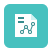

# Overzicht van [!DNL Adobe Workfront] objecten

<!--Audited: 12/2023-->

<!--
<***Linked to several articles, do not remove/ change. 
-->

De informatie die u in [!DNL Adobe Workfront] weergeeft, wordt vertegenwoordigd door objecten die in de [!DNL Workfront] -database zijn opgeslagen. De objecten zijn de objecten die de informatie in [!DNL Workfront] aandrijven.

Het is belangrijk te begrijpen hoe de objecten in [!DNL Workfront] worden gedefinieerd, zodat u het juiste object kunt gebruiken voor de behoeften die in uw organisatie nodig zijn.

Wanneer u bijvoorbeeld een grote hoeveelheid werk wilt plannen, moet u het object [!UICONTROL Project] gebruiken om dat werk te definiëren. Als u dit werk in kleinere geplande stappen wilt verdelen, kunt u het object [!UICONTROL Task] gebruiken. Voor een kleinere hoeveelheid werk die niet gepland is en onverwacht kan voorkomen, kunt u het voorwerp van de Uitgave gebruiken. Als u de voortgang en de naleving van het budget en de tijdlijn van een groep projecten wilt bijhouden, kunt u deze ordenen in [!UICONTROL Portfolios] en [!UICONTROL Programs] . Als u andere elementen wilt definiëren die u helpen uw werk op te lossen, wilt u andere objecten gebruiken die zijn opgeslagen onder [!UICONTROL Projects] , [!UICONTROL Tasks] , [!UICONTROL Issues] of [!UICONTROL Portfolios] , zoals [!UICONTROL Documents] , [!UICONTROL Updates] , [!UICONTROL Hours] , [!UICONTROL Users] of [!UICONTROL Job Roles] .

[!UICONTROL Reports] en [!UICONTROL Dashboards] zijn een ander voorbeeld van objecten waarmee u de hoeveelheid gegevens die u in [!DNL Workfront] hebt visueel kunt ordenen, zodat deze gemakkelijk toegankelijk is voor alle gebruikers.

Voor een volledige lijst van voorwerpen in [!DNL Workfront], zie [ API Ontdekkingsreiziger ](../../../wf-api/general/api-explorer.md).

## Interdependentie en hiërarchie van objecten

Objecten zijn in [!UICONTROL Workfront] aan elkaar gekoppeld. Een taak of een probleem kan bijvoorbeeld nooit zelfstandig buiten een project bestaan. [!UICONTROL Tasks] en [!UICONTROL issues] zijn voorbeelden van objecten die zijn opgeslagen in het [!UICONTROL project] -object. [!UICONTROL Tasks] en [!UICONTROL issues] worden beschouwd als onderliggende objecten voor projecten.

Hieronder ziet u een aantal van de meestgebruikte objecten in [!DNL Workfront] en de bijbehorende bovenliggende en onderliggende objecten:

| **Voorwerp** | **Ouderlijke voorwerpen** | **de voorwerpen van het Kind** |
|---|---|---|
| [!UICONTROL Portfolios] |  | [!UICONTROL Programs], [!UICONTROL Projects], [!UICONTROL Documents], [!DNL Notes], [!UICONTROL Users] |
| [!UICONTROL Programs] | [!UICONTROL Portfolios] | [!UICONTROL Projects], [!UICONTROL Documents], [!UICONTROL Notes], [!UICONTROL Users] |
| [!UICONTROL Projects] | [!UICONTROL Portfolios], [!UICONTROL Programs] | [!UICONTROL Tasks], [!UICONTROL Issues], [!UICONTROL Documents], [!UICONTROL Notes], [!UICONTROL Hours], [!UICONTROL Users] |
| [!UICONTROL Tasks] | [!UICONTROL Projects] | [!UICONTROL Issues], [!UICONTROL Children Tasks], [!UICONTROL Documents], [!UICONTROL Notes], [!UICONTROL Hours], [!UICONTROL Users] |
| [!UICONTROL Issues] | [!UICONTROL Tasks], [!UICONTROL Projects] | [!UICONTROL Documents], [!UICONTROL Notes], [!UICONTROL Hours], [!UICONTROL Users] |
| [!UICONTROL Dashboards] |  | [!UICONTROL Reports], externe pagina&#39;s |
| [!UICONTROL Reports] | [!UICONTROL Dashboards] |  |
| [!UICONTROL Groups] |  | [!UICONTROL Users] |
| [!UICONTROL Teams] |  | [!UICONTROL Users] |
| [!UICONTROL Users] | [!UICONTROL Groups], [!UICONTROL Teams], [!UICONTROL Companies] | [!UICONTROL Job Roles] |
| [!UICONTROL Companies] |  | [!UICONTROL Users] |
| [!UICONTROL Documents] | [!UICONTROL Tasks], [!UICONTROL Issues], [!UICONTROL Projects], [!UICONTROL Portfolios], [!UICONTROL Programs], [!UICONTROL Users] |  |
| [!UICONTROL Plans]* |  | [!UICONTROL Initiatives] |
| [!DNL Goals]* |  | [!UICONTROL Results], [!UICONTROL Activities] |

Voor een volledige lijst van voorwerpen in [!DNL Workfront], zie [ API Ontdekkingsreiziger ](../../../wf-api/general/api-explorer.md).

*Plannen zijn de objecten van de [!DNL Adobe Workfront Scenario Planner] . Voor informatie over [!DNL Scenario Planner], zie [ het [!UICONTROL Scenario Planner] overzicht ](../../../scenario-planner/scenario-planner-overview.md).

*[!UICONTROL Goals] zijn de objecten van [!DNL Adobe Workfront Goals] . Voor informatie over [!DNL Workfront Goals], zie [[!DNL Adobe Workfront Goals]  overzicht ](../../../workfront-goals/goal-management/wf-goals-overview.md).

## Objectnamen aanpassen

Als [!DNL Workfront] -beheerder kunt u objectnamen in [!DNL Workfront] aanpassen met een [!UICONTROL Layout Template] .

Voor meer informatie over hoe te om objecten namen aan te passen gebruikend a [!UICONTROL Layout Template], zie [ lay-outmalplaatjes ](../../../administration-and-setup/customize-workfront/use-layout-templates/create-and-manage-layout-templates.md) creëren en beheren.

Nadat u een lay-outmalplaatje aanpast en u het aan gebruikers toewijst, zien die gebruikers de aangepaste namen voor de voorwerpen. De gebruikers die aan het lay-outmalplaatje zijn toegewezen zien niet meer de standaardnamen voor de voorwerpen overal in de Webtoepassing.

Bijvoorbeeld, als de grotere hoeveelheid werk in uw organisatie als &quot;Betrokkenheid&quot;bekend is, kunt u de naam &quot;[!UICONTROL Project]&quot;met &quot;Betrokkenheid&quot;vervangen. Uw [!DNL Workfront] interface toont &quot;Betrokkenheid&quot;in plaats van &quot;[!UICONTROL Project]&quot;overal waar de naam &quot;[!UICONTROL Project]&quot;zou verschijnen.

>[!NOTE]
>
>Als u wilt dat de nieuwe namen van de objecten zichtbaar zijn voor de gebruikers, moeten ze zich afmelden en zich weer aanmelden bij [!DNL Workfront] nadat u de [!UICONTROL Layout Template] hebt opgeslagen.

>[!IMPORTANT]
>
>De documentatie van [!DNL Workfront] verwijst altijd naar de standaardnamen van de voorwerpen. Als [!DNL Workfront] -beheerder moet u ervoor zorgen dat u gebruikers op de hoogte brengt van de wijzigingen in objectnamen, zodat zij weten hoe de [!DNL Workfront] -documentatie moet worden gebruikt en welke gebieden van de toepassingen de wijzigingen in de namen van de objecten niet weerspiegelen.

* [Objectnamen die kunnen worden aangepast met een [!UICONTROL Layout Template]](#object-names-that-can-be-customized-using-a-layout-template)
* [Gebieden van  [!DNL Workfront]  die op de aangepaste objecten namen wijzen](#areas-of-workfront-that-reflect-the-customized-object-names)
* [Gebieden van  [!DNL Workfront]  die niet op de aangepaste objecten namen wijzen](#areas-of-workfront-that-do-not-reflect-the-customized-object-names)

### Objectnamen die kunnen worden aangepast met een [!UICONTROL Layout Template]

Als [!DNL Workfront] beheerder kunt u de namen van de volgende objecten aanpassen aan de terminologie in uw organisatie:

* [!UICONTROL Portfolio]
* [!UICONTROL Program]
* [!UICONTROL Project]
* [!UICONTROL Task]
* [!UICONTROL Issue]
* [!UICONTROL Goal]*
* [!UICONTROL Result]*
* [!UICONTROL Activity]*

  *[!UICONTROL Goals] , [!UICONTROL results] en [!UICONTROL activities] zijn alleen beschikbaar als uw bedrijf [!DNL Workfront Goals] heeft aangeschaft. Voor informatie over [!DNL Workfront Goals], zie [[!DNL Adobe Workfront Goals]  overzicht ](../../../workfront-goals/goal-management/wf-goals-overview.md).

* [!UICONTROL Initiative]**
* [!UICONTROL Scenario]**
* [!UICONTROL Plan]**

  **[!UICONTROL Initiatives] , [!UICONTROL scenarios] en [!UICONTROL plans] zijn alleen beschikbaar als uw bedrijf [!DNL Workfront Scenario Planner] heeft aangeschaft. Voor informatie over [!DNL Scenario Planner], zie [ begonnen worden met  [!DNL Scenario Planner]](../../../scenario-planner/get-started-with-scenario-planning.md).

Voor meer informatie over hoe u objecten namen kunt aanpassen gebruikend [!UICONTROL Layout Templates], zie [ lay-outmalplaatjes ](../../../administration-and-setup/customize-workfront/use-layout-templates/create-and-manage-layout-templates.md) creëren en beheren.

U kunt de namen van andere objecten in Workfront niet aanpassen. Voor een volledige lijst van voorwerpen in [!DNL Workfront], zie [ API Ontdekkingsreiziger ](../../../wf-api/general/api-explorer.md).

Wanneer u de naam van een object aanpast, wordt de nieuwe naam voor dat object weergegeven in de meeste gebieden van de [!DNL Workfront] -toepassing waarin de naam van dat object wordt weergegeven.

### Gebieden van [!DNL Workfront] die de aangepaste objectnamen weerspiegelen

In de volgende gebieden wordt de bijgewerkte naam van de objecten weergegeven:

* Bovenste navigatie
* Alle secties in de navigatie van het linkerpaneel
* Alle menu&#39;s
* Meldingen in apps
* De bouwer van het rapport en rapporteringselementen (meningen, filters, en groeperingen)
* [!UICONTROL Save] knoppen
* Geëxporteerde bestanden
* E-mails
* Mobiele apps

### Gebieden van [!DNL Workfront] die de aangepaste objectnamen niet weerspiegelen

In de volgende gebieden wordt de bijgewerkte naam van de objecten niet weergegeven:

<!--
  <li data-mc-conditions="QuicksilverOrClassic.Draft mode"> 
Referenced Object Type selection for a Typeahead field in a Custom Form 
 
(NOTE: drafting this because I don't think this is true)
 </li>
  -->

* [!DNL Outlook] Add-in

### Implicaties van het aanpassen van objectnamen

Let op het volgende wanneer u objectnamen aanpast in [!DNL Workfront] :

* Er kunnen fouten optreden in het weergeven van systemen met een stilistische of grammaticale werking. Bijvoorbeeld, als u &quot;[!UICONTROL Issue]&quot;aan &quot;Verzoek&quot;anders noemt en u overal in het systeem de uitdrukking &quot;een verzoek&quot;ziet, functioneert dit zoals bedoeld en zou niet als insect moeten worden beschouwd.
* Uw aangepaste namen voor de objecten kunnen niet worden vertaald. Alleen de standaardnamen van [!DNL Workfront] kunnen in de ondersteunde talen worden vertaald. Voor meer informatie over talen die in [!DNL Workfront] worden gesteund, zie [ Gesteunde talen in  [!DNL Adobe Workfront]](../../../workfront-basics/supported-languages-in-workfront.md). De naamvelden van aangepaste objecten ondersteunen vreemde tekens, zodat u in elke taal terminologie kunt invoeren.
* Wanneer u objectnamen aanpast met een [!UICONTROL Layout Template] , wordt u aangeraden [!UICONTROL Layout Templates] toe te wijzen op basis van uw bedrijfseenheden (teams of groepen).\
   Wij adviseren dat u namen gebruikt die duidelijk door de gebruikers van deze bedrijfseenheden worden begrepen, om verwarring te vermijden.
* E-mailberichten en geleverde rapporten bevatten altijd objectnamen zoals gedefinieerd door de [!UICONTROL Layout Template] van de gebruiker die de e-mail genereert. Uw gebruikers moeten voorbereid zijn om objectnamen in hun e-mailberichten te zien die niet gerelateerd zijn aan hun groep of team, als ze e-mailmeldingen ontvangen van gebruikers in andere teams en groepen.\
   Als [!DNL Workfront] beheerder, adviseer gebruikers om de pictogrammen op te merken verbonden aan elk voorwerp. De pictogrammen blijven consistent tussen verschillende objectnamen en zijn consistent met het standaardobject, zoals dat in de database wordt weergegeven. Voor een lijst van alle [!DNL Workfront] pictogrammen verbonden aan voorwerpen, zie [ pictogrammen van Objecten ](#object-icons).

  >[!TIP]
  >
  >Voor gemeenschappelijke taken in uw organisatie, denk na creërend douanedocumentatie om uw terminologie te weerspiegelen.

## Objectpictogrammen

De documentatie van [!DNL Workfront] verwijst altijd naar de standaardnamen van voorwerpen. Als de namen van uw objecten zijn aangepast, kunt u ervan uitgaan dat het bijbehorende pictogram aangeeft welk aangepast object overeenkomt met welk standaardobject van [!DNL Workfront] .

Voor meer informatie over welke voorwerpen aangepaste namen in [!DNL Workfront] kunnen hebben, zie [ namen van Objecten die kunnen worden aangepast gebruikend a [!UICONTROL Layout Template]](#object-names-that-can-be-customized-using-a-layout-template).

Hieronder volgt een lijst met objecten en de bijbehorende pictogrammen in Workfront.

| **Voorwerp** | **Pictogram** | **Aanpasbare objecten naam** |
|---|---|---|
| [!UICONTROL Company] |  ,  |  |
| [!UICONTROL Dashboard] |  ,  |  |
| [!UICONTROL Goal] |  | ✔ |
| [!UICONTROL Group] |  ,  |  |
| [!UICONTROL Issue] |  ,  | ✔ |
| [!UICONTROL Job Role] | , , ,  |  |
| [!UICONTROL Plan] | ,  |  |
| [!UICONTROL Portfolio] |  ,  | ✔ |
| [!UICONTROL Program] |  ,  | ✔ |
| [!UICONTROL Project] |  ,  | ✔ |
| [!UICONTROL Report] |  ,  |  |
| [!UICONTROL Task] |  ,  | ✔ |
| [!UICONTROL Team] | ,  ,  |  |
| [!UICONTROL Template] |  ,  |  |
| [!UICONTROL User] |  ,  ,  ,  ,  |  |

## Referentienummers van objecten

Aan elk object dat in [!DNL Workfront] wordt gemaakt, wordt een uniek referentienummer toegewezen. Referentienummers zijn handig voor het maken van onderscheid tussen twee overigens vergelijkbare objecten (zoals taken met dezelfde naam). U kunt naar objecten zoeken met hun referentienummers en u kunt referentienummers opnemen in rapporten.

Voor informatie over hoe te om naar voorwerpen door verwijzingsaantal te zoeken, zie [ Gebruik het verwijzingsaantal voorwerpen ](../../../workfront-basics/navigate-workfront/search/reference-number-of-objects.md).

## Objectspecifieke zoekopdrachten

U kunt zoeken in alle objecten die doorzoekbaar zijn in [!DNL Workfront] , of u kunt een specifiek object selecteren waarnaar u wilt zoeken in uw standaard en geavanceerde zoekopdrachten.

Niet alle objecten kunnen worden doorzocht in [!DNL Workfront] . U kunt standaard- en geavanceerd zoeken naar de volgende objecten uitvoeren in [!DNL Workfront] :

| **Voorwerp** | **BasisOnderzoek** | **Geavanceerd Onderzoek** |
|---|---|---|
| [!UICONTROL Projects] | ✓ | ✓ |
| [!UICONTROL Tasks] | ✓ | ✓ |
| [!UICONTROL Issues] | ✓ | ✓ |
| [!UICONTROL Reports] | ✓ | ✓ |
| [!UICONTROL Users] | ✓ | ✓ |
| [!UICONTROL Templates] | ✓ | ✓ |
| [!UICONTROL Documents] | ✓ | ✓ |
| [!UICONTROL Portfolios] | ✓ | ✓ |
| [!UICONTROL Programs] | ✓ | ✓ |
| [!UICONTROL Dashboards] | ✓ | ✓ |
| [!UICONTROL Companies] | ✓ | ✓ |
| [!UICONTROL Notes] (of [!UICONTROL Updates]) | ✓ |  |

Voor meer informatie over het runnen van basis en geavanceerde onderzoeken in [!DNL Workfront], zie [ Onderzoek  [!DNL Adobe Workfront]](../../../workfront-basics/navigate-workfront/search/search-workfront.md).

## Beperkte toegang tot objecten

Wanneer een gebruiker geen toegang tot een object heeft, ziet de gebruiker &quot;Geen toegang&quot; op een willekeurige plaats die de objectnaam in Workfront weergeeft.

De toegang tot objecten kan worden beperkt in het toegangsniveau of in de machtigingen van een specifiek object.

Dit is op alle voorwerpen en kindvoorwerpen van toepassing die in [ worden vermeld Interdependentie en hiërarchie van voorwerpen ](#interdependency-and-hierarchy-of-objects) sectie in dit artikel. Dit geldt niet voor Team- en Gebruikersobjecten.

## Objecten rapporteren

Kennis van de hiërarchie en de onderlinge afhankelijkheid van objecten is uiterst belangrijk voordat u rapporten gaat samenstellen in [!DNL Workfront] . Rapporten zijn objectspecifiek. U moet het correcte voorwerp voor uw rapport selecteren alvorens u de gegevens kunt tonen die u wilt.

>[!IMPORTANT]
>
>U kunt alleen het object rapporteren dat u selecteert en de bovenliggende objecten in hetzelfde rapport. U kunt geen informatie over de kindvoorwerpen in een ouderobjecten rapport hebben. Bijvoorbeeld, kunt u projectinformatie in een taakrapport tonen, maar niet taakinformatie in een projectrapport.

U kunt alle objecten in de database rapporteren met de geopende API. Voor een volledige lijst van alle voorwerpen in het gegevensbestand, zie [ API Ontdekkingsreiziger ](../../../wf-api/general/api-explorer.md).

>[!NOTE]
>
> * Als u de namen van uw voorwerpen gebruikend een lay-outmalplaatje hebt aangepast, zijn de namen voor het voorwerp in de rapportbouwer ook aangepast. Zorg ervoor u weet welke voorwerpen zijn aangepast en zoek de aangepaste naam in de rapportbouwer. Voor meer informatie over welke voorwerpen aangepaste namen in [!DNL Workfront] kunnen hebben, zie [ namen van Objecten die kunnen worden aangepast gebruikend a [!UICONTROL Layout Template]](#object-names-that-can-be-customized-using-a-layout-template) in dit artikel.
> * Als u de tekstmodus in uw rapporten gebruikt, zijn de namen van de objecten in tekstmodusexpressies de standaardnamen in [!DNL Workfront] en niet de aangepaste objectnamen. Voor meer informatie over het gebruiken van tekstwijze in rapporten, zie [ Overzicht van de Wijze van de Tekst ](../../../reports-and-dashboards/reports/text-mode/understand-text-mode.md).

Voor meer informatie over de bouw van een rapport, zie [ een douanerapport ](../../../reports-and-dashboards/reports/creating-and-managing-reports/create-custom-report.md) creëren.\
Voor meer informatie over onze API, zie [ API Ontdekkingsreiziger ](../../../wf-api/general/api-explorer.md).

### Objecten beschikbaar voor rapporten

U kunt de volgende objecten rapporteren wanneer u de rapportbuilder in de [!DNL Workfront] -webtoepassing gebruikt. Ingesprongen opsommingstekens geven meer informatie over het object en vertegenwoordigen geen aanvullende objecten.

* [!UICONTROL Project]
* [!UICONTROL Task]
* [!UICONTROL Hour]
* [!UICONTROL Issue]
* [!UICONTROL User]
* [!UICONTROL Access] Niveau
* [!UICONTROL Approval]
* [!UICONTROL Approval Process]
* [!UICONTROL Assignment]
* [!UICONTROL Baseline]
* [!UICONTROL Baseline Task]
* [!UICONTROL Billing Record]
* [!UICONTROL Budgeted Hour]
   * Dit is de [!UICONTROL Budgeted Hours] , zoals deze worden weergegeven in de oudere, verouderde hulpmiddelen voor bronnenbeheer.
   * The &quot;Bud. Het veld Uren in het [!UICONTROL Budgeted Hour] -rapport verwijst naar de uren die in de begroting zijn opgenomen voor de functies in [!UICONTROL Resource Planner] . Voor meer informatie, zie [ Begrijp [!UICONTROL Budgeted Labor Cost] en [!UICONTROL Budgeted Hours] voor projecten ](../../../manage-work/projects/project-finances/budgeted-labor-cost.md).

* [!UICONTROL Calendar Event]
* [!UICONTROL Company]
* [!UICONTROL Custom Form]
* [!UICONTROL Dashboard]
* [!UICONTROL Document]
* [!UICONTROL Document Approval]
* [!UICONTROL Document Version]
   * U kunt informatie weergeven over de versie van het document, het document waaraan de versie is gekoppeld, wie de versie heeft gemaakt en de gebruiker die de proefdruk heeft gemaakt op de documentversie, als deze bestaat (Maker van proef).
* [!UICONTROL Email Template]
* [!UICONTROL Expense]
* [!UICONTROL Expense Type]
* [!UICONTROL External Page]
* [!UICONTROL Favorite]
* [!UICONTROL Filter]
* [!UICONTROL Goal]
   * U kunt een rapport voor strategische doelstellingen bouwen of u kunt op doel betrekking hebbende informatie in een projectrapport tonen wanneer de projecten met doelstellingen als doelactiviteiten worden geassocieerd. U kunt strategische doelen maken en projecten alleen verbinden als uw organisatie een [!DNL Workfront Goals] -licentie heeft aangeschaft. Voor informatie over [!DNL Workfront Goals], zie [[!DNL Workfront Goals]  overzicht ](../../../workfront-goals/goal-management/wf-goals-overview.md). Voor informatie over het verbinden van projecten met strategische doelstellingen, zie [ projecten aan doelstellingen in de Doelen van Adobe Workfront ](../../../workfront-goals/results-and-activities/connect-projects-to-goals-overview.md) toevoegen.
*U kunt geen rapport uitbrengen over projectdoelstellingen die met een [!UICONTROL Business Case] worden geassocieerd. Voor informatie over projectdoelstellingen vs strategische doelstellingen, zie [ Verklarende woordenlijst van  [!DNL Adobe Workfront]  terminologie ](../../../workfront-basics/navigate-workfront/workfront-navigation/workfront-terminology-glossary.md).

* [!UICONTROL Group]
* [!UICONTROL Grouping]
* [!UICONTROL Hour Type]
* [!UICONTROL Initiative]
   * U kunt alleen een rapport maken voor initiatieven die de onderliggende objecten van een plan zijn als uw bedrijf een [!DNL Workfront Scenario Planner] -licentie heeft aangeschaft. Voor informatie over initiatieven, zie [ Overzicht van Initiatieven in  [!DNL Workfront Scenario Planner]](../../../scenario-planner/initiatives-overview.md).

* Rol initiatieftaak
   * U kunt alleen een rapport voor de functies van de initiatieven in een abonnement maken als uw bedrijf een [!DNL Workfront Scenario Planner] -licentie heeft aangeschaft. Voor informatie over het creëren van initiatieven en het associëren van hen met baanrollen, zie [ initiatieven in  [!DNL Workfront Scenario Planner]](../../../scenario-planner/create-and-edit-initiatives.md) creëren en uitgeven.

* [!UICONTROL Iteration]
* [!UICONTROL Job Role]
* [!UICONTROL Journal Entry]
   * U kunt meldingen weergeven over bijgehouden systeemupdates in het [!UICONTROL Updates] -gebied van objecten zoals taken, projecten, problemen, enzovoort. Voor meer informatie, zie [ Rapport over het gebied van Updates met een rapport van de Ingang van het Dagboek ](../../../reports-and-dashboards/reports/creating-and-managing-reports/create-journal-entry-report.md).

* [!UICONTROL Layout Template]
* [!UICONTROL Milestone]
* [!UICONTROL Milestone Path]
* [!UICONTROL Note] of [!UICONTROL Updates]
   * U kunt opmerkingen rapporteren die door individuele gebruikers zijn toegevoegd.

* [!UICONTROL Parameter] (of [!UICONTROL Custom Field])
* [!UICONTROL Parameter Group] (of [!UICONTROL Section Break])
* [!UICONTROL Portfolio]
* [!UICONTROL Program]
* [!UICONTROL Project (Financial Data)]
   * Financiële informatie wordt alleen in [!UICONTROL Project (Financial Data)] -rapporten ingevuld als de bijbehorende gegevens jonger zijn dan 5 jaar. Als bijvoorbeeld een functie in januari 2015 aan een taak is toegewezen en vandaag september 2021 is, wordt een financieel veld als [!UICONTROL Allocation Date] voor de functie niet ingevuld in het [!UICONTROL Project (Financial Data)] -rapport.

  >[!CAUTION]
  >
  >Wanneer u een projectrapport (Financial Data) uitvoert, worden uw financiële gegevens opnieuw berekend, waardoor eerdere financiële gegevens kunnen worden overschreven en een aanzienlijke hoeveelheid tijd in beslag kan nemen. Voor meer informatie over de gevolgen van financiële gegevensherberekening, zie [ projectfinanciën ](/help/quicksilver/manage-work/projects/project-finances/recalculate-project-finances.md) opnieuw berekenen.

* [!UICONTROL Proof Approval]
   * Hiermee kunt u verschillende informatie weergeven over de proefdrukgoedkeuring, zoals: het bewijs dat ter goedkeuring is ingediend, informatie over [!UICONTROL Approver], informatie over de aanvrager (als de aanvrager een [!DNL Workfront] -gebruiker met licentie is), versiegegevens, de proefdrukid en de aanmaakdatum van de proefdruk.\
      [!UICONTROL Proof Approval] -rapporten bevatten alleen proefdrukken die beschikbaar zijn in Mijn werkgebieden van gebruikers waar nog geen beslissingen zijn genomen.\
   * De goedkeuringen van het bewijs worden toegewezen in [!DNL Workfront] zoals beschreven [ gebruikers aan een proef ](../../../review-and-approve-work/proofing/managing-proofs-within-workfront/share-a-proof-in-workfront.md#add) in [ deel een proef binnen  [!DNL Adobe Workfront]](../../../review-and-approve-work/proofing/managing-proofs-within-workfront/share-a-proof-in-workfront.md).

* [!UICONTROL Queue]
* [!UICONTROL Queue Topic]
* [!UICONTROL Rate] (hiermee wordt informatie over de taakrol [!UICONTROL Billing Rate] weergegeven)
* [!UICONTROL Reminder Notification]
* [!UICONTROL Report]
* [!UICONTROL Resource Pool]
* [!UICONTROL Risk]
* [!UICONTROL Risk Type]
* [!UICONTROL Schedule]
* [!UICONTROL Scorecard]
* [!UICONTROL Team]
* [!UICONTROL Template]
* [!UICONTROL Template Task]
* [!UICONTROL Time Off]
   * U kunt melding maken van de time-out van een gebruiker, zoals deze door de gebruiker in het profiel wordt aangegeven.

* [!UICONTROL Timesheet]
* [!UICONTROL Timesheet Profile]
* [!UICONTROL Topic Group]
* [!UICONTROL User Approval]
* [!UICONTROL User Delegation]

   * U kunt rapporteren over gebruikers die zijn gedelegeerd om taken en problemen van anderen uit te voeren terwijl ze buiten het kantoor zijn. Dit rapport toont de gebruiker die uit het bureau evenals de gebruiker is die hun taken vervult terwijl zij uit zijn.

* [!UICONTROL Users Decisions]

   * U kunt rapporteren hoeveel besluiten gebruikers hebben genomen op proefdrukken en documenten in de huidige maand.

* [!UICONTROL View]
* [!UICONTROL Work Item] (dit levert een rapport op voor taken en problemen)
