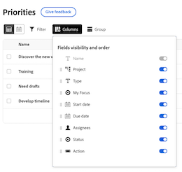

# De kolommen in de werklijst Prioriteiten aanpassen

 de benadrukte informatie op deze pagina verwijst naar functionaliteit nog niet algemeen beschikbaar. Het is beschikbaar slechts in het milieu van de Sandbox van de Voorproef.

U kunt de kolommen in de werklijst Prioriteiten aanpassen om de manier te steunen u werkt.

>[!NOTE]
>
>U kunt momenteel geen aangepaste gegevens aan kolommen toevoegen.

## Toegangsvereisten

+++ Breid uit om de toegangseisen voor de functionaliteit in dit artikel weer te geven.

U moet de volgende toegang hebben om de stappen in dit artikel uit te voeren:

<table style="table-layout:auto"> 
 <col> 
 </col> 
 <col> 
 </col> 
 <tbody> 
  <tr> 
   <td role="rowheader"><strong>Adobe Workfront-plan</strong></td> 
   <td> 
Alle
 </td> 
  </tr> 
  <tr> 
   <td role="rowheader"><strong>Adobe Workfront-licentie*</strong></td> 
   <td> 
   
Huidig: Revisor of hoger

   
Nieuw: Licht of hoger
 
   </td> 
  </tr> 
  <tr> 
   <td role="rowheader"><strong>Configuraties op toegangsniveau</strong></td> 
   <td> 
Toegang weergeven of bewerken voor het object waarop de update betrekking heeft
</td> 
  </tr> 
  <tr> 
   <td role="rowheader"><strong>Objectmachtigingen</strong></td> 
   <td> 
Toegang tot het object weergeven
</td> 
  </tr> 
 </tbody> 
</table>

*Voor meer informatie, zie [ vereisten van de Toegang in de documentatie van Workfront ](/help/quicksilver/administration-and-setup/add-users/access-levels-and-object-permissions/access-level-requirements-in-documentation.md).

+++

## De kolommen in de werklijst Prioriteiten aanpassen in productie

### Kolommen in- of uitschakelen

{{step1-to-priorities}}

1. Klik **Kolommen** op de rechterkant van het scherm.
   
1. Met de schakelopties kunt u kolommen in de werklijst in- of uitschakelen.

### De kolommen opnieuw ordenen

{{step1-to-priorities}}

1. Klik **Kolommen** op de rechterkant van het scherm.
1. Klik het **pictogram van de Belemmering** en beweeg de kolom aan uw gewenste plaats. Kolommen automatisch bijwerken in de werklijst verplaatsen.
   

### Kolombreedten opnieuw instellen

{{step1-to-priorities}}

1. Klik **Kolommen** op de rechterkant van het scherm.
1. Klik **Meer** pictogram , en kies **de kolombreedten van het Terugstellen**.
   

## De kolommen in de werklijst Prioriteiten aanpassen in Voorvertoning

### Kolommen in- of uitschakelen

{{step1-to-priorities}}

1. Klik **Kolommen** op de linkerkant van het scherm.
   
1. Met de schakelopties kunt u kolommen in de werklijst in- of uitschakelen.

### De kolommen opnieuw ordenen

{{step1-to-priorities}}

1. Klik **Kolommen** op de linkerkant van het scherm.
1. Klik het **pictogram van de Belemmering** en beweeg de kolom aan uw gewenste plaats. Kolommen automatisch bijwerken in de werklijst verplaatsen.
   

>[!NOTE]
>
>De kolom Naam is vast en kan niet worden verplaatst.

