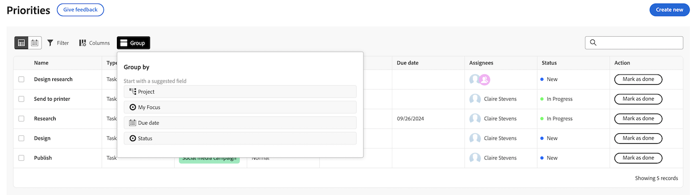

# Filter en groepeer uw werk met Prioriteiten

U kunt filters gebruiken om het werk te vinden u zoekt en dan een groepering toepast om het te houden georganiseerd.

## Toegangsvereisten

+++ Breid uit om de toegangseisen voor de functionaliteit in dit artikel weer te geven.

U moet de volgende toegang hebben om de stappen in dit artikel uit te voeren:

<table style="table-layout:auto"> 
 <col> 
 </col> 
 <col> 
 </col> 
 <tbody> 
  <tr> 
   <td role="rowheader"><strong>Adobe Workfront-plan</strong></td> 
   <td> 
Alle
 </td> 
  </tr> 
  <tr> 
   <td role="rowheader"><strong>Adobe Workfront-licentie*</strong></td> 
   <td> 
   
Huidig: Verzoek of hoger

   
Nieuw: Medewerker of hoger
 
   </td> 
  </tr> 
  <tr> 
   <td role="rowheader"><strong>Configuraties op toegangsniveau</strong></td> 
   <td> 
Toegang weergeven of bewerken voor het object waarop de update betrekking heeft
</td> 
  </tr> 
  <tr> 
   <td role="rowheader"><strong>Objectmachtigingen</strong></td> 
   <td> 
Toegang tot het object weergeven
</td> 
  </tr> 
 </tbody> 
</table>

*Voor meer informatie, zie [ vereisten van de Toegang in de documentatie van Workfront ](/help/quicksilver/administration-and-setup/add-users/access-levels-and-object-permissions/access-level-requirements-in-documentation.md).

+++

## Uw werk filteren met standaardfilters

U kunt taken en kwesties filtreren die aan u worden toegewezen.

{{step1-to-priorities}}

1. Klik **Filters** in de hoogste linkerzijde van de werklijst.
1. klik **Standaardfilters**.
1. Selecteer een of meerdere filters om uw werkitems te beperken.
   

+++Uitbreiden om gedetailleerde informatie over beschikbare filters te zien
<table>
  <tbody>
   <tr>
   <th>Filter</th>
   <th>Beschrijving</th>
   </tr>
    <tr>
      <td>eraan werken</td>
      <td>Hiermee geeft u items weer waaraan u momenteel werkt</td>
    </tr>
    <tr>
      <td>Gereed om te starten</td>
      <td>Items weergeven met 
      <ul>
      <li>Geen onvolledige voorgangers of taakbeperkingen</li>
      
en

      <li>De geplande begindatum ligt in het verleden of maximaal twee weken in de toekomst</li>
      </ul>
      </td>
    </tr>
    <tr>
      <td>Niet klaar</td>
      <td>Hiermee geeft u items weer die
       <ul>
      <li>Onvolledige voorgangers of taakbeperkingen die verhinderen dat het item wordt bewerkt</li>
      
of

      <li>De geplande begindatum meer dan twee weken in de toekomst</li>
      </ul>
       </td>
    </tr>
    <tr>
      <td>Gevraagd</td>
      <td>Hier worden problemen weergegeven waaraan u nog niet hebt gewerkt</td>
    </tr>
      <td>Gereed</td>
      <td>Hiermee geeft u werk weer dat in de laatste twee weken is voltooid. Deze filteroptie omvat geen goedkeuringen.</td>
    </tr>
    <tr>
    <td>Project</td>
    <td>De projecten van vertoningen die taken of kwesties bevatten u aan bent toegewezen</td>
    </tr>
    <tr>
    <td>Vervaldatum</td>
    <td>Hiermee wordt het werk weergegeven op de geplande voltooiingsdatum</td>
    </tr>
    <tr>
    <td>Status</td>
    <td>Hiermee geeft u taken of problemen in nieuwe, actieve en volledige status weer</td>
    </tr>
    <tr>
    <td>Mijn focus</td>
    <td>Hiermee worden taken of problemen weergegeven waaraan focusniveaus zijn toegewezen. Focusniveaus worden toegewezen en beheerd door de individuele gebruiker.</td>
    </tr>
  </tbody>
</table>

+++

1. (Facultatief) klik **terug aan gebrek** om uw selectie terug te stellen.

## Uw werk filteren met slimme filters

Gebruik natuurlijke taal om werk snel te filteren. Uw instantie van Workfront moet op een nieuw plan van Workfront zijn en op de Adobe Verenigde Ervaring worden toegelaten. Voor meer informatie, zie [ Adobe Verenigde Ervaring voor Workfront ](/help/quicksilver/workfront-basics/navigate-workfront/workfront-navigation/adobe-unified-experience.md).

{{step1-to-priorities}}

1. Klik **Filters** in de hoogste linkerzijde van de werklijst.
1. Klik **Slimme filters**.
1. Typ hoe u uw werk wilt filteren.

   U kunt dingen als

   * Laatste taken weergeven
   * Mijn topprioriteiten tonen
   * Werk dat vandaag verschuldigd is tonen

## Uw werk groeperen

{{step1-to-priorities}}

1. Klik **Groepen** in de hoogste linkerzijde van de werklijst.
1. Selecteer een groep om uw werklijst te ordenen
   

+++Uitbreiden om gedetailleerde informatie over beschikbare groepen te zien

| Groep | Beschrijving |
|-----------|-------------|
| Project | Dit groepeert punten door project. |
| Mijn focus | Hiermee worden items gegroepeerd op basis van het focusniveau dat u toewijst. |
| Te betalen week | Deze groepeert items op basis van de week waarin ze verschuldigd zijn. Vervaldata worden bepaald door de geplande afsluitdatum. |
| Status | Deze groepeert items op de volgende statussen: Nieuw, Bezig, Voltooid.   Nota: U kunt douanestatus op dit ogenblik niet gebruiken in Prioriteiten. |

+++

### De belemmering en laat vallen het werkpunten wanneer het groeperen door Mijn Prioriteit of Status

U kunt individuele het werkpunten tussen categorieën slepen en laten vallen wanneer het groeperen door Mijn Prioriteit of Status.

1. Groepeer uw werk door **Status** of **Mijn Prioriteit**.
2. Houd de muisaanwijzer boven het werkitem om het verplaatsingspictogram te zoeken en sleep het naar de gewenste categorie.
   

## Uw werk sorteren

### Sorteren in groepen

Om uw werk binnen een groep te sorteren, open **Groep** en klik **Soort oplopend** of **Soort aflopend**.

### Kolommen sorteren

Als u afzonderlijke kolommen wilt sorteren, gaat u naar de kolom en klikt u op de pijl omlaag.

### Alle groepssecties uitvouwen of samenvouwen

Om alle groepssecties uit te breiden of te doen ineenstorten, open **Groep** en klik **breid allen uit** of **samen allen**.

