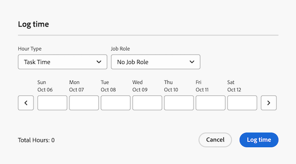

# Logtijd in prioriteiten

U kunt de tijd voor het werk in Adobe Workfront registreren om op het aantal uren te wijzen u het werken aan hen doorwerkt. De tijd u registreert toont in uw timesheet.

## Toegangsvereisten

+++ Breid uit om de toegangseisen voor de functionaliteit in dit artikel weer te geven.

U moet de volgende toegang hebben om de stappen in dit artikel uit te voeren en de Specifieke uren van het Project te registreren:

<table style="table-layout:auto"> 
 <col> 
 <col> 
 <tbody> 
  <tr> 
   <td role="rowheader">Adobe Workfront-plan</td> 
   <td> 
Alle
 </td> 
  </tr> 
  <tr> 
   <td role="rowheader">Adobe Workfront-licentie</td> 
   <td> 
Nieuw: 

   
Licht of hoger om uren op een taak of kwestie te registreren

   
Huidige: 
   
Werk of hoger om uren aan een taak of kwestie te registreren
 </td> 
  </tr> 
  <tr> 
   <td role="rowheader">Configuraties op toegangsniveau</td> 
   <td> 
Geef toegang tot het type van het werkpunt uit u tijd voor registreert 
 
U hebt bijvoorbeeld toegang tot problemen bewerken nodig om u aan te melden bij problemen
 </td> 
  </tr> 
  <tr> 
   <td role="rowheader">Objectmachtigingen</td> 
   <td> 
Contribute- of hogere machtigingen voor het werkitem waarvoor u de tijd registreert, zijn onder andere geldig voor het aantal loguren
 </td> 
  </tr> 
 </tbody> 
</table>

Voor meer detail over de informatie in deze lijst, zie [ vereisten van de Toegang in de documentatie van Workfront ](/help/quicksilver/administration-and-setup/add-users/access-levels-and-object-permissions/access-level-requirements-in-documentation.md).

+++

## Logtijd in de werklijst

U kunt de tijd van het logboek rechtstreeks van de werklijst registreren:

{{step1-to-priorities}}

1. Beweeg over de naam, dan klik **tijd van het Logboek**.
   
1. In het **drop-down menu van het Type van 1 uur**, selecteer het aangewezen uurtype. De types van uren zijn beschikbaar afhankelijk van wat op het systeem, het project, en gebruikersniveaus is bepaald, zoals die in Define uurtypes en beschikbaarheid wordt beschreven.

1. (Voorwaardelijk) Als uw Workfront of groepsbeheerder de optie Taak toewijzen aan uren handmatig heeft ingeschakeld, selecteert u een taakrol in het keuzemenu. De rol die wordt gespecificeerd wanneer u aan de het werkpuntvertoningen door gebrek wordt toegewezen. Als u geen rol op het voorwerp wordt toegewezen, toont uw Primaire Rol als gebrek. Als u geen primaire rol hebt toegewezen, wordt de rol Geen taak weergegeven.

1. Ga de tijd in u wilt registreren, dan klik **tijd van het Logboek**.

   

## Tijd vastleggen in een werkitem

U kunt de tijd in een individueel het werkpunt registreren:

{{step1-to-priorities}}

1. Klik op de naam van een tijdelijk item om de pagina Overzicht te openen.
1. In de **Snelle acties** sectie, klik **tijd van het Logboek**.
1. In het **drop-down menu van het Type van 1 uur**, selecteer het aangewezen uurtype. De types van uren zijn beschikbaar afhankelijk van wat op het systeem, het project, en gebruikersniveaus is bepaald, zoals die in Define uurtypes en beschikbaarheid wordt beschreven.
1. (Voorwaardelijk) Als uw Workfront of groepsbeheerder de optie Taak toewijzen aan uren handmatig heeft ingeschakeld, selecteert u een taakrol in het keuzemenu. De rol die wordt gespecificeerd wanneer u aan de het werkpuntvertoningen door gebrek wordt toegewezen. Als u geen rol op het voorwerp wordt toegewezen, toont uw Primaire Rol als gebrek. Als u geen primaire rol hebt toegewezen, wordt de rol Geen taak weergegeven.

1. Ga de tijd in u wilt registreren, dan klik **tijd van het Logboek**.

   
