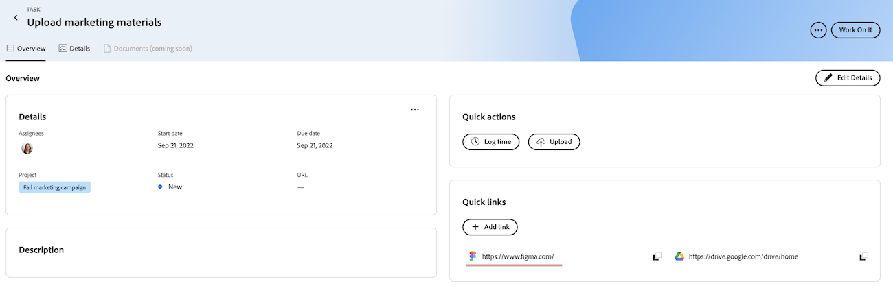

# Snelle koppelingen toevoegen en beheren in Prioriteiten

U kunt koppelingen die u vaak in een taak of uitgave bezoekt, opslaan en openen via het tabblad Overzicht in Prioriteiten.

Prioriteiten geven de werkitems weer die aan u zijn toegewezen. U kunt geen werkitems zien die aan uw team zijn toegewezen.

## Toegangsvereisten

+++ Breid uit om de toegangseisen voor de functionaliteit in dit artikel weer te geven.

<table style="table-layout:auto"> 
 <col> 
 </col> 
 <col> 
 </col> 
 <tbody> 
  <tr> 
   <td role="rowheader"><strong>Adobe Workfront-pakket</strong></td> 
   <td> 
Alle
 </td> 
  </tr> 
  <tr> 
   <td role="rowheader"><strong>Adobe Workfront-licentie</strong></td> 
   <td> 
   
Aanvraag of hoger voor problemen; werk of hoger voor taken

   
Medewerker of hoger of hoger; licht of hoger voor taken
 
   </td> 
  </tr> 
  <tr> 
   <td role="rowheader"><strong>Configuraties op toegangsniveau</strong></td> 
   <td> 
Toegang weergeven of bewerken voor het object waarop de update betrekking heeft
</td> 
  </tr> 
  <tr> 
   <td role="rowheader"><strong>Objectmachtigingen</strong></td> 
   <td> 
Toegang tot het object weergeven
</td> 
  </tr> 
 </tbody> 
</table>

Voor meer informatie, zie [ vereisten van de Toegang in de documentatie van Workfront ](/help/quicksilver/administration-and-setup/add-users/access-levels-and-object-permissions/access-level-requirements-in-documentation.md).

+++

## Snel koppelingen toevoegen aan prioriteiten

{{step1-to-priorities}}

1. Klik op de naam van een het werkpunt om de **pagina van het Overzicht** te openen.
1. In de **Snelle verbindingen** sectie, klik **verbinding** toevoegen.
1. Plak URL in **voeg verbinding** doos toe.
1. Klik **sparen**.
    toe

## Een snelle koppeling naar het klembord kopiëren

{{step1-to-priorities}}

1. Klik op de naam van een het werkpunt om de **pagina van het Overzicht** te openen.
1. In de **Snelle verbindingen** sectie, vind de verbinding u wilt kopiëren.
1. Klik het **pictogram van het Exemplaar 1} van het Exemplaar**
   

## Een snelkoppeling openen

{{step1-to-priorities}}

1. Klik op de naam van een het werkpunt om de **pagina van het Overzicht** te openen.
1. In de **Snelle verbindingen** sectie, vind de verbinding u wilt openen.
1. Klik op de koppeling. De koppeling wordt geopend op een nieuw tabblad.
   

## Snelle koppelingen verwijderen

{{step1-to-priorities}}

1. Klik op de naam van een het werkpunt om de **pagina van het Overzicht** te openen.
1. Klik **uitgeven Details** in de hoger-juiste hoek van het scherm.
    uit
1. Vind de verbinding die u wilt verwijderen, dan klikken **Schrapping**  pictogram.
