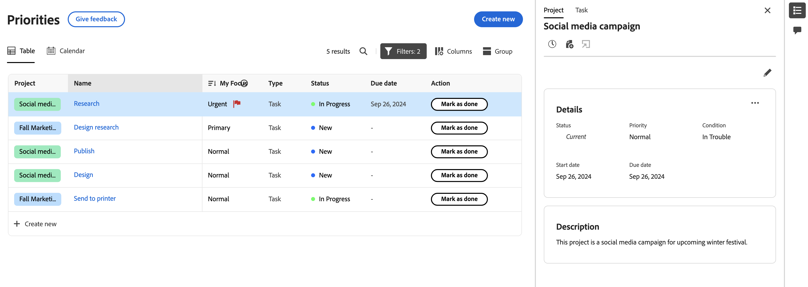
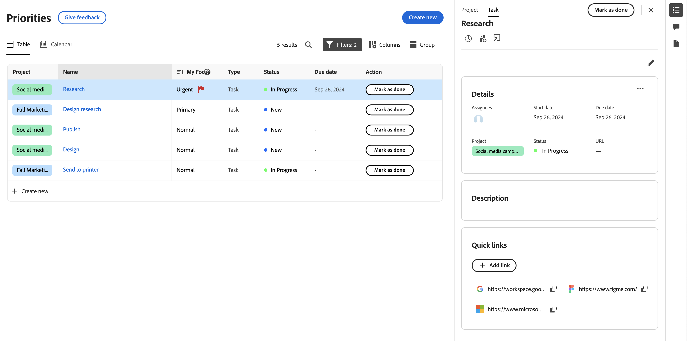

# Details van project- en werkitems weergeven in Prioriteiten

 de benadrukte informatie op deze pagina verwijst naar functionaliteit nog niet algemeen beschikbaar. Het is beschikbaar slechts in het milieu van de Sandbox van de Voorproef.

U kunt project, taak, en uitgeeft details in de prioriteitenwerklijst bekijken.

>[!IMPORTANT]
>
>De projecten moeten in Huidige status of een status zijn die huidig om projecten evenals hun kindtaken en kwesties te tonen vergelijkt.

## Toegangsvereisten

+++ Breid uit om de toegangseisen voor de functionaliteit in dit artikel weer te geven.

U moet de volgende toegang hebben om de stappen in dit artikel uit te voeren:

<table style="table-layout:auto"> 
 <col> 
 </col> 
 <col> 
 </col> 
 <tbody> 
  <tr> 
   <td role="rowheader"><strong>Adobe Workfront-plan</strong></td> 
   <td> 
Alle
 </td> 
  </tr> 
  <tr> 
   <td role="rowheader"><strong>Adobe Workfront-licentie*</strong></td> 
   <td> 
   
Huidig: Revisor of hoger

   
Nieuw: Licht of hoger
 
   </td> 
  </tr> 
  <tr> 
   <td role="rowheader"><strong>Configuraties op toegangsniveau</strong></td> 
   <td> 
Toegang weergeven of bewerken voor het object waarop de update betrekking heeft
</td> 
  </tr> 
  <tr> 
   <td role="rowheader"><strong>Objectmachtigingen</strong></td> 
   <td> 
Toegang tot het object weergeven
</td> 
  </tr> 
 </tbody> 
</table>

*Voor meer informatie, zie [ vereisten van de Toegang in de documentatie van Workfront ](/help/quicksilver/administration-and-setup/add-users/access-levels-and-object-permissions/access-level-requirements-in-documentation.md).

+++

## Details weergeven in het deelvenster aan de zijkant van de werklijst

### Projectdetails weergeven

{{step1-to-priorities}}

1. In de werklijst, houd over de naam van het het werkpunt, dan klik **pictogram van de Samenvatting .**
1. Klik **Project** bij de bovenkant van het Summiere paneel. Hier kunt u
   * Projectdetails en beschrijving weergeven en bewerken
   * Opmerkingen over het project weergeven en toevoegen
   * Logtijd
   * Een bestand toevoegen
   *  ga direct naar het project 

   
   <!--new screen for prod -->

### Taakdetails weergeven

{{step1-to-priorities}}

1. In de werklijst, houd over de het werknaam, dan klik **pictogram van de Samenvatting .**
1. Taak is standaard geselecteerd. Hier kunt u
   * Projectgegevens en taakdetails en beschrijving weergeven en bewerken
   * Opmerkingen over het project weergeven en toevoegen
   *  Mening en voeg documenten  toe
   *  creeer een proef 
   * Logtijd
   * Een bestand toevoegen
   * Snelle koppelingen toevoegen

   
   <!--new screen for prod -->

### Uitgavendetails weergeven

{{step1-to-priorities}}

1. In de werklijst, houd over de het werknaam, dan klik **pictogram van de Samenvatting .**
1. Uitgave is standaard geselecteerd. Hier kunt u
   * Projectgegevens en beschrijving weergeven en bewerken
   * Opmerkingen over het project weergeven en toevoegen
*  Mening en voeg documenten  toe
*  creeer een proef 
   * Logtijd
   * Een bestand toevoegen
   * Snelle koppelingen toevoegen

  <!--new screen for prod -->

## Details weergeven op de pagina Details

 u kunt updates in real time op de pagina van Details van een taak of een kwestie bekijken. U kunt ook zien of anderen de pagina tezelfdertijd zoals u met aanwezigheidsindicatoren in real time bekijken.

## Details van werkonderdelen weergeven

{{step1-to-priorities}}

1. Klik in de werklijst op de naam van het werkitem. Op de pagina Details kunt u

* Projectdetails en beschrijving weergeven en bewerken
* Opmerkingen over het project weergeven en toevoegen
*  Mening en voeg documenten  toe
*  creeer een proef 
* Logtijd
* Een bestand toevoegen
* Snelle koppelingen toevoegen

<!-- screenshot for prod-->