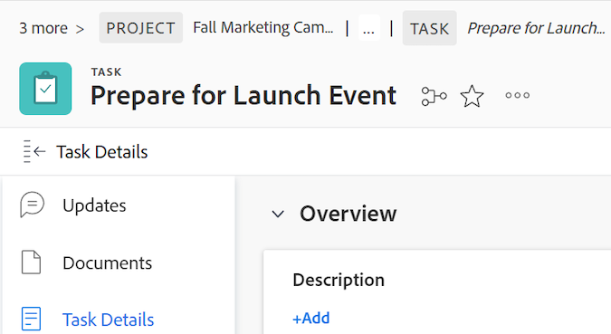

# Overzicht van Broodkruimels

Met de optie Breadcrubs wordt de volledige navigatiehiërarchie voor alle objecttypen weergegeven. Elk object in het pad van de broodkruimel heeft een label dat het objecttype weergeeft. De pagina die u momenteel hebt, wordt cursief weergegeven in de paginakoptekst en aan het einde van het pad van de broodkruimel. In het onderstaande voorbeeld is dit de taak &quot;[!UICONTROL Share with Brand Team]&quot;.

Wanneer er te veel objecten in het pad van de broodkruimel staan of wanneer de schermbreedte de volledige navigatiehiërarchie niet toestaat weer te geven, vouwt het pad enkele van de broodkruimels samen en groepeert deze objecten aan het begin van het pad van de broodkruimel. Zowel het project als de huidige objecten pagina zijn altijd zichtbaar in de broodkruimelweg.

In de bovenstaande afbeelding geeft &#39;3 meer&#39; bijvoorbeeld aan dat 3 objecten niet worden weergegeven. Deze items bevinden zich boven het projectniveau of tussen het project en de huidige pagina.

Als u op &quot;[!UICONTROL more]&quot; klikt, kunt u de volledige hiërarchie uitbreiden. U kunt &quot;[!UICONTROL Less]&quot;klikken om de broodkruimelweg opnieuw samen te vouwen.

U kunt ook de volgende toetsen gebruiken om door de broodkruimels te navigeren:

<table style="table-layout:auto"> 
 <col> 
 <col> 
 <tbody> 
  <tr> 
   <td role="rowheader"><strong> Lusje </strong> </td> 
   <td> 
Naar elk item in de broodkruimels navigeren
 </td> 
  </tr> 
  <tr> 
   <td role="rowheader"><strong> ga </strong> binnen </td> 
   <td> 
Een samengevouwen pad voor de broodkruimel uitvouwen, een uitgevouwen pad voor de broodkruimel samenvouwen en een nieuwe pagina openen wanneer deze zich op een objectkoppeling bevindt
 </td> 
  </tr> 
 </tbody> 
</table>

<!--drafted: this is no longer possible, since we removed Campaigns, but it might come back as part of Maestro: 

## Multi-object breadcrumbs

>[!NOTE]
>
>The information in this article is available only in the Preview environment when you participate in the [!UICONTROL Campaigns] beta program. The functionality described here might not be fully available yet. For more information about current available features and how to enroll, see [Campaigns beta].

Some objects can belong to multiple parent objects. For example, a project can belong to multiple campaigns. In this case, all the campaigns that the project belongs to display in the breadcrumb.

The multi-object listing in the breadcrumb (for example, the campaigns) displays the number of parent objects which expands into a list to display all the campaigns that the project is associated with. For more information, see [Add objects to a campaign](../../manage-work/campaigns/add-objects-to-a-campaign.md).

-->

## Een bovenliggend object openen vanuit de breadcrumbs

Voor informatie over oudervoorwerpen in [!DNL Workfront], zie [&#x200B; voorwerpen in  [!DNL Adobe Workfront]](../../workfront-basics/navigate-workfront/workfront-navigation/understand-objects.md) begrijpen.

1. (Voorwaardelijk) Als u het object waarnaar u wilt navigeren niet ziet in een samengevouwen pad met de broodkruimel, klikt u op **[!UICONTROL more]** en zoekt u het object.

   >[!NOTE]
   >
   >Als je geen toestemming hebt voor een object, is het niet zichtbaar in de broodkruimels.

1. Klik op een object in het pad van de broodkruimel om dat object te openen.

   De objectpagina wordt geopend.
