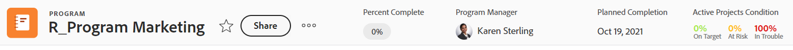
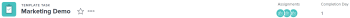

# Overzicht van objectkoppen

U kunt informatie over objecten in [!DNL Adobe Workfront] in één oogopslag weergeven wanneer u de koptekst van objecten bekijkt.

Naast de naam van het object kan de header de eigenaar van het object, de status of het percentage voltooid bevatten.

[!DNL Workfront] geeft prioriteit aan de naam van het object en wijst er zoveel mogelijk ruimte aan toe in de koptekst. Wanneer een objectnaam te lang is, wordt deze afgekapt. Als u de volledige naam van een object wilt weergeven, plaatst u de cursor boven het object.

## De koptekst van een object openen

De toegang tot de koptekst van een object in [!DNL Workfront] is identiek voor alle objecten die deze bevatten.

Bijvoorbeeld, om tot de kopbal van een project toegang te hebben:

1. Ga naar een project.\
   De kopbal toont bij de bovenkant van de pagina en bevat de naam van het project.

   

## [!UICONTROL Home] koptekstoverzicht

De volgende headers zijn beschikbaar in Home:

* Taak: Voor meer informatie over hoe u deze kopbal kunt gebruiken, zie het [ overzicht van de kopbal van de Taak ](#task-header-overview) in dit artikel.
* Uitgave: Voor meer informatie over hoe u deze kopbal kunt gebruiken, zie het [ de kopbaloverzicht van de Uitgave ](#issue-header-overview) in dit artikel.

## Aanpasbare koppen

Uw [!DNL Workfront] of groepsbeheerder kan de kopbal van projecten, taken, en kwesties aanpassen door een lay-outmalplaatje te gebruiken.

Dit artikel beschrijft de standaardkopballen voor alle voorwerpen, met inbegrip van projecten en taken en kwesties.

Voor informatie over het aanpassen van informatie over de kopbal van een voorwerp, zie [ objecten kopballen aanpassen gebruikend een lay-outmalplaatje ](../../administration-and-setup/customize-workfront/use-layout-templates/customize-object-headers.md).

## Overzicht van de projectheader

De projectheader toont de volgende informatie, door gebrek:

<table style="table-layout:auto"> 
 <col> 
 <col> 
 <thead> 
  <tr> 
   <th>Koptekstgegevens</th> 
   <th>Notities</th> 
  </tr> 
 </thead> 
 <tbody> 
  <tr> 
   <td role="rowheader">Broodkruimel met bovenliggende objecten</td> 
   <td>Als het project met een programma of een portefeuille wordt geassocieerd, tonen zij in de broodkruimel in de upper-left hoek van de kopbal. Wanneer u op de naam van het bovenliggende object klikt, wordt dat bovenliggende object geopend.</td> 
  </tr> 
  <tr data-mc-conditions=""> 
   <td role="rowheader">Object, pictogram </td> 
   <td> 
Het paarse pictogram [!UICONTROL Project]  wordt links van de projectnaam weergegeven.
 </td> 
  </tr> 
  <tr> 
   <td role="rowheader">Naam van het project</td> 
   <td>U kunt de projectnaam in de kopbal uitgeven.</td> 
  </tr> 
  <tr> 
   <td role="rowheader">Naam van het objecttype</td> 
   <td> 
De tekst "[!UICONTROL PROJECT]"toont boven de projectnaam in de kopbal.
 </td> 
  </tr> 
  <tr> 
   <td role="rowheader">Het actiegebied van de taak</td> 
   <td> 
Naast de naam van het project wordt het actiegebied weergegeven.
 
  
  </td> 
  </tr> 
  <tr> 
   <td role="rowheader">[!UICONTROL Percent Complete]</td> 
   <td>U kunt niet het projectpercentage uitgeven volledig in de kopbal.</td> 
  </tr> 
  <tr> 
   <td role="rowheader">[!UICONTROL Project Owner]</td> 
   <td> 
U kunt de [!UICONTROL Project Owner] in de koptekst bewerken.
 </td> 
  </tr> 
  <tr> 
   <td role="rowheader">[!UICONTROL Planned Completion Date] </td> 
   <td> 
U kunt het project [!UICONTROL Planned Completion Date] en de tijd in de kopbal uitgeven als het project van [!UICONTROL Completion Date] gepland is. Als het project van [!UICONTROL Start Date] gepland is, wordt deze informatie bijgewerkt van de taken in het project.
 </td> 
  </tr> 
  <tr> 
   <td role="rowheader">[!UICONTROL Condition] </td> 
   <td> 
Wanneer u [!UICONTROL Condition Type] van het project aan Hand plaatst, kunt u het project [!UICONTROL Condition] in de kopbal bijwerken.
</td> 
  </tr> 
  <tr> 
   <td role="rowheader">[!UICONTROL Status]</td> 
   <td>U kunt het project [!UICONTROL Status] in de kopbal uitgeven.</td> 
  </tr> 
  <tr> 
   <td role="rowheader">Het [!UICONTROL Approvals] -gebied</td> 
   <td> 
Wanneer u een van de fiatteurs bent, gebruikt u de volgende pictogrammen om de goedkeuringen voor het project te beheren:
 
  </img> [!UICONTROL Approve]
 
  </img> [!UICONTROL Reject]
 
  </img> [!UICONTROL Recall]
 
Als u geen fiatteur bent, klikt u op het pictogram [!UICONTROL More]  om informatie over de huidige goedkeuringsstap weer te geven.
 
Meer over goedkeuringen leren, zie <a href="../../review-and-approve-work/manage-approvals/approval-process-in-workfront.md" class="MCXref xref"> overzicht van het proces van de Goedkeuring </a>.
 </td> 
  </tr> 
 </tbody> 
</table>

## Overzicht van de taakkoptekst

De taakkopbal omvat standaard de volgende informatie:

<table style="table-layout:auto"> 
 <col> 
 <col> 
 <thead> 
  <tr> 
   <th>Koptekstgegevens</th> 
   <th>Notities</th> 
  </tr> 
 </thead> 
 <tbody> 
  <tr> 
   <td role="rowheader">Broodkruimel met bovenliggende objecten</td> 
   <td> 
De bovenliggende objecten van de taak worden weergegeven in de breadcrumb. Wanneer u op de naam van het bovenliggende object klikt, wordt dat bovenliggende object geopend.
 
Voor meer informatie, zie <a href="../../workfront-basics/the-new-workfront-experience/breadcrumb-overview.md" class="MCXref xref"> Overzicht van Broodkruimels </a>.
 </td> 
  </tr> 
  <tr data-mc-conditions=""> 
   <td role="rowheader">Object, pictogram </td> 
   <td> 
Het groene [!UICONTROL Task] pictogram  wordt links van de taaknaam weergegeven.
 </td> 
  </tr> 
  <tr> 
   <td role="rowheader">Naam van de taak</td> 
   <td>U kunt de taaknaam in de koptekst bewerken.</td> 
  </tr> 
  <tr> 
   <td role="rowheader">Naam van het objecttype</td> 
   <td> 
De tekst "[!UICONTROL TASK]"toont boven de taaknaam in de kopbal.
 </td> 
  </tr> 
  <tr> 
   <td role="rowheader">Het actiegebied van de taak</td> 
   <td> 
Naast de naam van de taak wordt het gebied [!UICONTROL actions] weergegeven.
 
  
 
Als het pictogram Afhankelijkheid wordt weergegeven, kunt u op het pictogram klikken om eventuele voorgangers of opvolgers voor de taak weer te geven.
 </td> 
  </tr> 
  <tr> 
   <td role="rowheader">[!UICONTROL Percent Complete]</td> 
   <td>U kunt het taakpercentage dat is voltooid in de koptekst bewerken.</td> 
  </tr> 
  <tr> 
   <td role="rowheader">[!UICONTROL Assignments]</td> 
   <td>U kunt de taaktoewijzingen bewerken in de koptekst.</td> 
  </tr> 
  <tr> 
   <td role="rowheader"> 
[!UICONTROL Work on It], [!UICONTROL Done] of [!UICONTROL Start Task] knop
 </td> 
   <td> 
Als de taak aan u is toegewezen, kunt u op de knop [!UICONTROL Work on It]  of [!UICONTROL Start Task] klikken om aan te geven dat u nu aan de taak werkt of op de knop [!UICONTROL Done] om aan te geven dat u de taak hebt voltooid.
 
 voor informatie over het vervangen van de [!UICONTROL Work On It] knoop met a [!UICONTROL Start Task] knoop, zie <a href="../../people-teams-and-groups/create-and-manage-teams/work-on-it-button-to-start-button.md" class="MCXref xref"> de [!UICONTROL Work On It] knoop met a [!UICONTROL Start] vervangen </a> .
 </td> 
  </tr> 
  <tr> 
   <td role="rowheader">[!UICONTROL Planned Completion Date]</td> 
   <td> 
U kunt de taak [!UICONTROL Planned Completion Date]  en de tijd  in de kopbal uitgeven.
 
Tip: de [!UICONTROL Commit Date] is niet zichtbaar in de koptekst. U kunt deze weergeven op de pagina [!UICONTROL Details] .
 </td> 
  </tr> 
  <tr> 
   <td role="rowheader">[!UICONTROL Status]</td> 
   <td>U kunt de taak [!UICONTROL Status] in de koptekst bewerken.</td> 
  </tr> 
  <tr> 
   <td role="rowheader">Het [!UICONTROL Approvals] -gebied</td> 
   <td> 
Als u een van de fiatteurs bent, gebruikt u de volgende pictogrammen om de goedkeuringen voor de taak te beheren:
 
  </img> [!UICONTROL Approve]
 
  </img> [!UICONTROL Reject]
 
  </img> [!UICONTROL Recall]
 
Als u geen fiatteur bent, klikt u op het pictogram [!UICONTROL More]  om informatie over de huidige goedkeuringsstap weer te geven.
 
Meer over goedkeuringen leren, zie <a href="../../review-and-approve-work/manage-approvals/approval-process-in-workfront.md" class="MCXref xref"> overzicht van het proces van de Goedkeuring </a>.
 </td> 
  </tr> 
 </tbody> 
</table>

## Overzicht van de koptekst van uitgave

De uitgiftheader bevat standaard de volgende informatie:

<table style="table-layout:auto"> 
 <col> 
 <col> 
 <thead> 
  <tr> 
   <th>Koptekstgegevens</th> 
   <th>Notities</th> 
  </tr> 
 </thead> 
 <tbody> 
  <tr> 
   <td role="rowheader">Broodkruimel met bovenliggende objecten</td> 
   <td> 
De bovenliggende objecten van de uitgave worden weergegeven in de breadcrumb. Wanneer u op de naam van het bovenliggende object klikt, wordt dat bovenliggende object geopend.
 
Voor meer informatie, zie <a href="../../workfront-basics/the-new-workfront-experience/breadcrumb-overview.md" class="MCXref xref"> Overzicht van Broodkruimels </a>.
 </td> 
  </tr> 
  <tr> 
   <td role="rowheader">Object, pictogram </td> 
   <td> 
Het roze [!UICONTROL Issue] pictogram  wordt links van de naam van de uitgave weergegeven.
 </td> 
  </tr> 
  <tr> 
   <td role="rowheader">Naam van de uitgave</td> 
   <td>U kunt de naam van de uitgave bewerken in de koptekst.</td> 
  </tr> 
  <tr> 
   <td role="rowheader">Naam van het objecttype</td> 
   <td> 
De tekst "[!UICONTROL ISSUE]"toont boven de uitgiftenaam in de kopbal.
 </td> 
  </tr> 
  <tr> 
   <td role="rowheader">Het actiegebied van de kwestie</td> 
   <td> 
Naast de naam van de uitgave wordt het gebied [!UICONTROL actions] weergegeven.
 
  
 
Als het pictogram [!UICONTROL Dependency] wordt weergegeven, kunt u op het pictogram klikken om eventuele voorgangers of opvolgers voor de uitgave weer te geven.
  </td> 
  </tr> 
  <tr> 
   <td role="rowheader">[!UICONTROL Percent Complete]</td> 
   <td> 
U kunt het volledige percentage van de uitgave bewerken in de koptekst.
 </td> 
  </tr> 
  <tr> 
   <td role="rowheader">[!UICONTROL Assignments]</td> 
   <td>U kunt de toewijzingen van een uitgave bewerken in de koptekst.</td> 
  </tr> 
  <tr> 
   <td role="rowheader">[!UICONTROL Work on It], [!UICONTROL Done],  of [!UICONTROL Start Issue] knoop </td> 
   <td>Als de kwestie aan u wordt toegewezen, kunt u [!UICONTROL Work on It] klikken  of [!UICONTROL Start Issue] knoop om erop te wijzen dat u nu aan de kwestie werkt, of [!UICONTROL Done] knoop om erop te wijzen dat u de kwestie voltooide. voor informatie over het vervangen van de [!UICONTROL Work On It] knoop met a [!UICONTROL Start Task] knoop, zie  <a href="../../people-teams-and-groups/create-and-manage-teams/work-on-it-button-to-start-button.md" class="MCXref xref"> de [!UICONTROL Work On It] knoop met a [!UICONTROL Start] knoop </a> vervangen .</td> 
  </tr> 
  <tr> 
   <td role="rowheader">[!UICONTROL Planned Completion Date]</td> 
   <td> 
U kunt de kwestie [!UICONTROL Planned Completion Date]  en de tijd  in de kopbal uitgeven.
 
Tip: de [!UICONTROL Commit Date] is niet zichtbaar in de koptekst. U kunt deze weergeven op de pagina [!UICONTROL Details] .
 </td> 
  </tr> 
  <tr> 
   <td role="rowheader">[!UICONTROL Status]</td> 
   <td>U kunt de uitgave [!UICONTROL Status] in de koptekst bewerken.</td> 
  </tr> 
  <tr> 
   <td role="rowheader">Het [!UICONTROL Approvals] -gebied</td> 
   <td> 
Als u een van de fiatteurs bent, gebruikt u de volgende pictogrammen om de goedkeuringen voor de uitgave te beheren:
 
  [!UICONTROL Approve]
 
  [!UICONTROL Reject]
 
  [!UICONTROL Recall]
 
Als u geen fiatteur bent, klikt u op het pictogram [!UICONTROL More]  om informatie over de huidige goedkeuringsstap weer te geven.
 
Meer over goedkeuringen leren, zie <a href="../../review-and-approve-work/manage-approvals/approval-process-in-workfront.md" class="MCXref xref"> overzicht van het proces van de Goedkeuring </a>.
 </td> 
  </tr> 
 </tbody> 
</table>

## Overzicht van de programmakoptekst

De programmakoptekst bevat de volgende informatie:

<table style="table-layout:auto"> 
 <col> 
 <col> 
 <thead> 
  <tr> 
   <th>Koptekstgegevens</th> 
   <th>Notities</th> 
  </tr> 
 </thead> 
 <tbody> 
  <tr> 
   <td role="rowheader">Broodkruimel met de naam van het Portfolio</td> 
   <td> 
U hebt toegang tot de [!UICONTROL Portfolio] via de koptekst van de [!UICONTROL Program] . Wanneer u op de naam van het bovenliggende object klikt, wordt dat bovenliggende object geopend.
 
Voor meer informatie, zie <a href="../../workfront-basics/the-new-workfront-experience/breadcrumb-overview.md" class="MCXref xref"> Overzicht van Broodkruimels </a>.
 </td> 
  </tr> 
  <tr> 
   <td role="rowheader">Object, pictogram </td> 
   <td> 
Het oranje [!UICONTROL Program] pictogram  wordt links van de programmanaam weergegeven.
 </td> 
  </tr> 
  <tr> 
   <td role="rowheader">Naam van het programma</td> 
   <td>U kunt de naam van het programma bewerken in de koptekst.</td> 
  </tr> 
  <tr> 
   <td role="rowheader">Naam van het objecttype</td> 
   <td> 
Als het programma is gemarkeerd als [!UICONTROL Active] , wordt de tekst " [!UICONTROL PROGRAM]" boven de naam van het programma weergegeven in de koptekst.
 </td> 
  </tr> 
  <tr> 
   <td role="rowheader">Activeringsstatus</td> 
   <td> 
Als het programma wordt gedeactiveerd, de tekst "[!UICONTROL PROGRAM DEACTIVATED]"toont boven de programmanaam in de kopbal.
 </td> 
  </tr> 
  <tr> 
   <td role="rowheader">Het actiegebied van het programma</td> 
   <td> 
Naast de naam van het programma wordt het gebied [!UICONTROL actions] weergegeven.
 
  
 </td> 
  </tr> 
  <tr> 
   <td role="rowheader">[!UICONTROL Percent Complete]</td> 
   <td> 
U kunt de [!UICONTROL Percent Complete] van het programma niet bewerken in de koptekst. Deze informatie wordt bijgewerkt op basis van de projecten in het programma.
 
Tip: standaard is het percentage dat is voltooid van het programma een gemiddelde van de percentages van de volledige waarden van de projecten in een [!UICONTROL Current] of [!UICONTROL Approved Status] die tot het programma behoren.
 </td> 
  </tr> 
  <tr> 
   <td role="rowheader">[!UICONTROL Program Manager]</td> 
   <td> 
U kunt de [!UICONTROL Program Manager] in de koptekst bewerken. Dit is het zelfde als [!UICONTROL Program Owner].
 </td> 
  </tr> 
  <tr> 
   <td role="rowheader">[!UICONTROL Planned Completion Date]</td> 
   <td>U kunt het programma [!UICONTROL Planned Completion Date] niet bewerken in de koptekst. Deze informatie wordt bijgewerkt via [!UICONTROL Planned Completion Date] van de projecten in het programma.</td> 
  </tr> 
  <tr> 
   <td role="rowheader">[!UICONTROL Active Projects Condition]</td> 
   <td>Dit is een berekening van het percentage actieve projecten in het programma waarvoor de eigenschap [!UICONTROL Condition] is ingesteld op [!UICONTROL On Target] , [!UICONTROL At Risk] of [!UICONTROL In Trouble] .</td> 
  </tr> 
 </tbody> 
</table>

## Overzicht van koptekst van Portfolio {#portfolio-header-overview}

De portfoliokop van het portfolio bevat de volgende informatie:

<table style="table-layout:auto"> 
 <col> 
 <col> 
 <thead> 
  <tr> 
   <th>Koptekstgegevens</th> 
   <th>Notities</th> 
  </tr> 
 </thead> 
 <tbody> 
  <tr> 
   <td role="rowheader">Object, pictogram </td> 
   <td> 
Het blauwe [!UICONTROL Portfolio] pictogram  toont links van de portefeuillenaam.
 </td> 
  </tr> 
  <tr> 
   <td role="rowheader">Naam van de portefeuille</td> 
   <td>U kunt de naam van het portfolio bewerken in de koptekst.</td> 
  </tr> 
  <tr> 
   <td role="rowheader">Naam van het objecttype</td> 
   <td> 
Als het portfolio is gemarkeerd als actief, wordt de tekst "[!UICONTROL PORTFOLIO]" weergegeven boven de naam van het portfolio in de koptekst.
 </td> 
  </tr> 
  <tr> 
   <td role="rowheader">Activeringsstatus</td> 
   <td> 
Als het portfolio is gedeactiveerd, wordt de tekst "[!UICONTROL PORTFOLIO DEACTIVATED]" weergegeven boven de naam van het portfolio in de koptekst.
 </td> 
  </tr> 
  <tr> 
   <td role="rowheader">Het [!UICONTROL actions] -gebied van het portfolio</td> 
   <td> 
Naast de naam van het portfolio wordt het gebied [!UICONTROL actions] weergegeven.
 
  
</td> 
  </tr> 
  <tr> 
   <td role="rowheader">[!UICONTROL Portfolio Manager]</td> 
   <td>U kunt de [!UICONTROL Portfolio Manager] in de koptekst bewerken. Dit is het zelfde als [!UICONTROL Portfolio Owner].</td> 
  </tr> 
  <tr> 
   <td role="rowheader">[!UICONTROL On Time]</td> 
   <td>Dit is een berekening van het percentage projecten in de portefeuille dat momenteel op tijd is.</td> 
  </tr> 
  <tr> 
   <td role="rowheader">[!UICONTROL On Budget]</td> 
   <td>Dit is een berekening van het percentage projecten in de portefeuille dat momenteel op de begroting staat.</td> 
  </tr> 
  <tr> 
   <td role="rowheader">[!UICONTROL Aligned]</td> 
   <td>Dit is een berekening van welk percentage van de projecten in de portefeuille met de portefeuille worden in overeenstemming gebracht.</td> 
  </tr> 
  <tr> 
   <td role="rowheader">[!UICONTROL ROI]</td> 
   <td>Dit is de [!UICONTROL Return on Investment] berekening voor alle projecten in de portefeuille.</td> 
  </tr> 
  <tr> 
   <td role="rowheader">[!UICONTROL Net Value]</td> 
   <td>Dit is de [!UICONTROL Net Value] berekening voor alle projecten in de portefeuille.</td> 
  </tr> 
 </tbody> 
</table>

## Overzicht van sjabloonkoptekst {#template-header-overview}

De sjabloonkoptekst bevat de volgende informatie:

<table style="table-layout:auto"> 
 <col> 
 <col> 
 <thead> 
  <tr> 
   <th>Koptekstgegevens</th> 
   <th>Opmerkingen</th> 
  </tr> 
 </thead> 
 <tbody> 
  <tr> 
   <td role="rowheader">Object icon </td> 
   <td> 
Het groene [!UICONTROL Template] pictogram  toont links van de malplaatjenaam.
 </td> 
  </tr> 
  <tr> 
   <td role="rowheader">Naam van de sjabloon</td> 
   <td>U kunt de sjabloonnaam in de koptekst bewerken.</td> 
  </tr> 
  <tr> 
   <td role="rowheader">Naam van het objecttype</td> 
   <td> 
Als het malplaatje zoals actief duidelijk is, toont de tekst "[!UICONTROL TEMPLATE]"boven de naam van het Malplaatje in de kopbal.
 </td> 
  </tr> 
  <tr> 
   <td role="rowheader">Activeringsstatus</td> 
   <td> 
Als de sjabloon is gedeactiveerd, wordt de tekst "[!UICONTROL TEMPLATE DEACTIVATED]" weergegeven boven de sjabloonnaam in de koptekst.
 </td> 
  </tr> 
  <tr> 
   <td role="rowheader">Het actiegebied van de sjabloon</td> 
   <td> 
Naast de naam van de sjabloon wordt het actiegebied weergegeven.
 
  
 </td> 
  </tr> 
  <tr> 
   <td role="rowheader">[!UICONTROL Template Owner]</td> 
   <td>U kunt het veld [!UICONTROL Template Owner] in de koptekst bewerken.</td> 
  </tr> 
  <tr> 
   <td role="rowheader">[!UICONTROL Duration]</td> 
   <td>De duur van de sjabloon. U kunt dit veld niet bewerken in de koptekst.</td> 
  </tr> 
 </tbody> 
</table>

## Overzicht van sjabloontaakkoptekst

De kopbal van de malplaatjetaak toont de volgende informatie:

<table style="table-layout:auto"> 
 <col> 
 <col> 
 <thead> 
  <tr> 
   <th>Koptekstgegevens</th> 
   <th>Notities</th> 
  </tr> 
 </thead> 
 <tbody> 
  <tr> 
   <td role="rowheader">Broodkruimel naar bovenliggende objecten</td> 
   <td> 
De bovenliggende objecten van de sjabloontaak worden in de breadcrumb weergegeven. Wanneer u op de naam van een bovenliggend object klikt, wordt dat bovenliggende object geopend.
 
Voor meer informatie, zie <a href="../../workfront-basics/the-new-workfront-experience/breadcrumb-overview.md" class="MCXref xref"> Overzicht van Broodkruimels </a>.
 </td> 
  </tr> 
  <tr> 
   <td role="rowheader">Object, pictogram </td> 
   <td> 
Het groene [!UICONTROL Task] pictogram  toont links van de naam van de malplaatjetaak.
 </td> 
  </tr> 
  <tr> 
   <td role="rowheader">Naam van de sjabloontaak</td> 
   <td>U kunt de naam van de sjabloontaak bewerken in de koptekst.</td> 
  </tr> 
  <tr> 
   <td role="rowheader">Naam van het objecttype</td> 
   <td> 
De tekst "[!UICONTROL TEMPLATE TASK]"toont boven de naam van de malplaatjetaak in de kopbal.
 </td> 
  </tr> 
  <tr> 
   <td role="rowheader">Het actiegebied van de sjabloontaak</td> 
   <td> 
Naast de naam van de sjabloontaak wordt het actiegebied weergegeven.
 
  
 </td> 
  </tr> 
  <tr> 
   <td role="rowheader">[!UICONTROL Assignments]</td> 
   <td>U kunt de [!UICONTROL Assignments] van de sjabloontaak in de koptekst bewerken.</td> 
  </tr> 
  <tr> 
   <td role="rowheader">[!UICONTROL Completion Day]</td> 
   <td>Dit is de dag in de duur van het malplaatje wanneer de malplaatjetaak zou moeten voltooien.</td> 
  </tr> 
 </tbody> 
</table>

## Overzicht van de koptekst van Opname factureren

De koptekst van de factureringsrecord bevat de volgende informatie:

<table style="table-layout:auto"> 
 <col> 
 <col> 
 <thead> 
  <tr> 
   <th>Koptekstgegevens</th> 
   <th>Notities</th> 
  </tr> 
 </thead> 
 <tbody> 
  <tr> 
   <td role="rowheader">Broodkruimel naar bovenliggende objecten</td> 
   <td> 
De bovenliggende objecten van de factureringsrecord worden weergegeven in de breadcrumb. Wanneer u op de naam van een bovenliggend object klikt, wordt dat bovenliggende object geopend.
 
Voor meer informatie, zie <a href="../../workfront-basics/the-new-workfront-experience/breadcrumb-overview.md" class="MCXref xref"> Overzicht van Broodkruimels </a>.
 </td> 
  </tr> 
  <tr> 
   <td role="rowheader">Object, pictogram </td> 
   <td> 
Het blauwe [!UICONTROL Billing Record] pictogram  wordt links van de naam van de factureringsrecord weergegeven.
 </td> 
  </tr> 
  <tr> 
   <td role="rowheader">Naam van het factureringsrecord</td> 
   <td>U kunt de naam van de factureringsrecord in de koptekst bewerken.</td> 
  </tr> 
  <tr> 
   <td role="rowheader">Naam van het objecttype</td> 
   <td> 
De tekst "[!UICONTROL BILLING RECORD]"toont boven de het facturerings verslagnaam in de kopbal.
 </td> 
  </tr> 
  <tr> 
   <td role="rowheader">Het actiegebied van het factureringsverslag</td> 
   <td> 
Naast de naam van de factureringsrecord wordt het [!UICONTROL More] menu  weergegeven. Hierin kunt u de volgende opties selecteren:
 
    <ul> 
     <li> 
[!UICONTROL Edit]
 </li> 
     <li> 
 
 </li> 
    </ul> </td> 
  </tr> 
  <tr> 
   <td role="rowheader">[!UICONTROL Billing Record Total]</td> 
   <td>Dit is de totale hoeveelheid factureringsrecord. U kunt dit veld niet bewerken.</td> 
  </tr> 
  <tr> 
   <td role="rowheader">[!UICONTROL Billing Date]</td> 
   <td>Dit is de datum waarop het factureringsverslag werd gecreeerd, tenzij het manueel werd veranderd toen het het facturerings verslag werd gecreeerd. U kunt de [!UICONTROL Billing Date] in de koptekst bewerken.</td> 
  </tr> 
  <tr> 
   <td role="rowheader">[!UICONTROL Status]</td> 
   <td> 
Wanneer de factureringsrecord de status [!UICONTROL Billed] heeft, kunt u deze niet meer bewerken.
 
U kunt de status van de factureringsrecord in de koptekst bewerken.
 </td> 
  </tr> 
 </tbody> 
</table>

## Overzicht van gebruikersheader

De gebruikerskopbal toont de volgende informatie:

<table style="table-layout:auto"> 
 <col> 
 <col> 
 <thead> 
  <tr> 
   <th>Koptekstgegevens</th> 
   <th>Notities</th> 
  </tr> 
 </thead> 
 <tbody> 
  <tr> 
   <td role="rowheader">Profielafbeelding van gebruiker</td> 
   <td>U kunt de profielafbeelding in de koptekst niet bijwerken.</td> 
  </tr> 
  <tr> 
   <td role="rowheader">Naam van de gebruiker en titel</td> 
   <td> 
 De titel van de gebruiker wordt in alle hoofdletters boven de naam weergegeven. U kunt de naam van de gebruiker in de koptekst niet bewerken.
 </td> 
  </tr> <!--
   <tr> 
    <td role="rowheader">Name of the object type</td> 
    <td> 
The name of the object type does not display.
 </td> 
   </tr>
  --> 
  <tr> 
   <td role="rowheader">Activeringsstatus</td> 
   <td> 
Als de gebruiker is gedeactiveerd, worden alle tekst en het profielbeeld in de koptekst grijs weergegeven.
 </td> 
  </tr> 
  <tr> 
   <td role="rowheader">Het actiegebied van de gebruiker</td> 
   <td> 
Naast de naam van de gebruiker wordt het actiegebied weergegeven.
 
  
</td> 
  </tr> 
  <tr> 
   <td role="rowheader">E-mailadres</td> 
   <td>U kunt het e-mailadres in de koptekst niet bewerken. Dit is gewoonlijk ook de gebruikersnaam.</td> 
  </tr> 
  <tr> 
   <td role="rowheader">Telefoonnummer</td> 
   <td>U kunt het telefoonnummer in de koptekst niet bewerken.</td> 
  </tr> 
  <tr> 
   <td role="rowheader">Teams</td> 
   <td> 
U kunt de teams bekijken waartoe de gebruiker behoort. Plaats de muis boven een teamavatar om de naam van het team weer te geven. U kunt de teams in de koptekst niet bewerken.
 </td> 
  </tr> 
 </tbody> 
</table>

## Overzicht van teamkopteksten

De teamkopbal toont de volgende informatie:

<table style="table-layout:auto"> 
 <col> 
 <col> 
 <thead> 
  <tr> 
   <th>Koptekstgegevens</th> 
   <th>Notities</th> 
  </tr> 
 </thead> 
 <tbody> 
  <tr> 
   <td role="rowheader">Object, pictogram </td> 
   <td> 
Het paarse [!UICONTROL Team] pictogram  wordt links van de teamnaam weergegeven.
 </td> 
  </tr> 
  <tr> 
   <td role="rowheader">Naam van het team</td> 
   <td>U kunt de naam van het team bewerken in de koptekst.</td> 
  </tr> 
  <tr> 
   <td role="rowheader">Naam van het objecttype</td> 
   <td> 
De tekst "[!UICONTROL TEAM]"toont boven de teamnaam in de kopbal.
 </td> 
  </tr> 
  <tr> 
   <td role="rowheader">Het actiegebied van het team</td> 
   <td> 
Naast de naam van het team wordt het gebied [!UICONTROL actions] weergegeven.
 
  
</td> 
  </tr> 
  <tr> 
   <td role="rowheader">Profielen van teamleden</td> 
   <td>De profielafbeeldingen van de teamleden. Plaats de muis boven een afbeelding om de naam van de gebruiker weer te geven.</td> 
  </tr> 
  <tr> 
   <td role="rowheader">Beschrijving</td> 
   <td>Dit is een korte beschrijving van de leden van het team. U kunt de beschrijving van het team niet bewerken in de koptekst.</td> 
  </tr> 
 </tbody> 
</table>

## Overzicht van de iteratiekoptekst

In de iteratiekop wordt de volgende informatie weergegeven:

<table style="table-layout:auto"> 
 <col> 
 <col> 
 <thead> 
  <tr> 
   <th>Koptekstgegevens</th> 
   <th>Notities</th> 
  </tr> 
 </thead> 
 <tbody> 
  <tr> 
   <td role="rowheader">Object, pictogram </td> 
   <td> 
Het oranje [!UICONTROL Iteration] pictogram  wordt links van de iteratienaam weergegeven.
 </td> 
  </tr> 
  <tr> 
   <td role="rowheader">Naam van de herhaling</td> 
   <td>U kunt de naam van de iteratie in de koptekst bewerken.</td> 
  </tr> 
  <tr> 
   <td role="rowheader">Naam van het objecttype</td> 
   <td> 
De tekst "[!UICONTROL ITERATION]"toont boven de herhalingsnaam in de kopbal.
 </td> 
  </tr> 
  <tr> 
   <td role="rowheader">Het actiegebied van de herhaling</td> 
   <td> 
In de rechterbovenhoek van de koptekst wordt het actiegebied weergegeven.
 
  
</td> 
  </tr> 
  <tr> 
   <td role="rowheader">Eigenaar</td> 
   <td>Dit is de [!UICONTROL Owner] van de herhaling. U kunt de [!UICONTROL Owner] in de koptekst niet bewerken.</td> 
  </tr> 
  <tr> 
   <td role="rowheader">[!UICONTROL Timeline]</td> 
   <td>In [!UICONTROL Timeline] worden de begin- en einddatum van de herhaling weergegeven. U kunt de [!UICONTROL Timeline] in de koptekst niet bewerken.</td> 
  </tr> 
  <tr> 
   <td role="rowheader">[!UICONTROL Team]</td> 
   <td>U kunt het team van de herhaling in de koptekst niet bewerken. Als u op de teamnaam klikt, gaat u naar de teampagina.</td> 
  </tr> 
 </tbody> 
</table>

## Overzicht van de groepsheader

De groepsheader toont de volgende informatie:

<table style="table-layout:auto"> 
 <col> 
 <col> 
 <thead> 
  <tr> 
   <th>Koptekstgegevens</th> 
   <th>Notities</th> 
  </tr> 
 </thead> 
 <tbody> 
  <tr> 
   <td role="rowheader">Object, pictogram </td> 
   <td> 
Het oranje [!UICONTROL Group] pictogram  wordt links van de groepsnaam weergegeven.
 </td> 
  </tr> 
  <tr> 
   <td role="rowheader">Naam van de groep</td> 
   <td>U kunt de groepsnaam in de koptekst bewerken.</td> 
  </tr> 
  <tr> 
   <td role="rowheader">Naam van het objecttype</td> 
   <td> 
De tekst "[!UICONTROL GROUP]"toont boven de groepsnaam in de kopbal.
 </td> 
  </tr> 
  <tr> 
   <td role="rowheader">Het [!UICONTROL actions] -gebied van de groep</td> 
   <td> 
Naast de naam van de groep wordt het menu [!UICONTROL More]  weergegeven. Hierin kunt u de volgende opties selecteren:
 
    <ul> 
     <li> 
[!UICONTROL Edit]
 </li> 
     <li> 
[!UICONTROL Copy]
 </li> 
     <li> 
[!UICONTROL Delete]
 </li> 
    </ul> </td> 
  </tr> 
  <tr> 
   <td role="rowheader">[!UICONTROL Business Leader]</td> 
   <td>U kunt de [!UICONTROL Business Leader] in de koptekst bewerken.</td> 
  </tr> 
  <tr> 
   <td role="rowheader">[!UICONTROL Licenses in use] </td> 
   <td> 
In het vak [!UICONTROL Licenses in use] ziet u het aantal [!UICONTROL Plan] - en [!UICONTROL Work] -gebruikers in de groep en de bijbehorende subgroepen. U kunt op de nummers klikken om deze informatie weer te geven voor alle vijf de licentietypen.
 
Voor meer informatie, zie <a href="../../administration-and-setup/manage-groups/create-and-manage-groups/view-number-licenses-allocated-used-group.md" class="MCXref xref"> Mening het aantal vergunningen die in een groep in de nieuwe [!DNL Adobe Workfront] ervaring </a> worden toegewezen en worden gebruikt.
 </td> 
  </tr> 
  <tr> 
   <td role="rowheader">[!UICONTROL Group Administrators]</td> 
   <td>U kunt de groepsbeheerders in de koptekst bewerken.</td> 
  </tr> 
 </tbody> 
</table>

## Overzicht van documentkoptekst

In de koptekst van het document wordt de volgende informatie weergegeven:

<table style="table-layout:auto"> 
 <col> 
 <col> 
 <thead> 
  <tr> 
   <th>Koptekstgegevens</th> 
   <th>Notities</th> 
  </tr> 
 </thead> 
 <tbody> 
  <tr> 
   <td role="rowheader">Broodkruimel met bovenliggende objecten</td> 
   <td> 
De bovenliggende objecten van het document worden in de breadcrumb weergegeven. Wanneer u op de naam van een bovenliggend object klikt, wordt dat bovenliggende object geopend.
 
Voor meer informatie, zie <a href="../../workfront-basics/the-new-workfront-experience/breadcrumb-overview.md" class="MCXref xref"> overzicht van Broodkruimels </a>.
 </td> 
  </tr> 
  <tr> 
   <td role="rowheader">Object, pictogram </td> 
   <td> 
Het blauwe pictogram [!UICONTROL Document]  wordt links van de documentnaam weergegeven.
 </td> 
  </tr> 
  <tr> 
   <td role="rowheader">Naam van het document</td> 
   <td>U kunt de documentnaam in de koptekst bewerken.</td> 
  </tr> 
  <tr> 
   <td role="rowheader">Naam van het objecttype</td> 
   <td> 
De tekst "[!UICONTROL DOCUMENT]"toont boven de documentnaam in de kopbal.
 </td> 
  </tr> 
  <tr> 
   <td role="rowheader">Het actiegebied van het document</td> 
   <td> 
Naast de naam van het document wordt het actiegebied weergegeven.
 
  
</td> 
  </tr> 
  <tr> 
   <td role="rowheader">Het goedkeuringsgebied [!UICONTROL Decision]</td> 
   <td> Het gebied [!UICONTROL Decisions] wordt in de rechterbovenhoek van de koptekst van het document weergegeven. Dit gebied verschilt op basis van de goedkeuringsfase en of u een fiatteur, revisor of geen van beide bent. <ul><li> 
Als u een fiatteur bent, kunt u de volgende pictogrammen gebruiken om de goedkeuringen voor het document te beheren:
 
  [!UICONTROL Approve]
 
  [!UICONTROL Recall]
 
  [!UICONTROL Reject]
 
Voor meer informatie over goedkeuringsbesluiten, zie <a href="../../review-and-approve-work/manage-approvals/approving-work.md" class="MCXref xref"> goedkeurend het werk </a>.</li><li>
Als u een revisor bent, kunt u op de knop Mijn revisie voltooien klikken om aan te geven dat u het document hebt gereviseerd.

Voor meer informatie bij het herzien van een document, zie <a href="../../review-and-approve-work/document-reviews-and-approvals/review-and-approve-documents/review-a-document.md" class="MCXref xref"> Overzicht een document </a>.
</li><li>Anders wordt in dit gebied de huidige revisie- en goedkeuringsstatus voor het document weergegeven.</li><ul>
 </td> 
  </tr> 
 </tbody> 
</table>

## Overzicht van de koptekst van het bedrijf {#company-header-overview}

De bedrijfsheader toont de volgende informatie:

<table style="table-layout:auto"> 
 <col> 
 <col> 
 <thead> 
  <tr> 
   <th>Koptekstgegevens</th> 
   <th>Notities</th> 
  </tr> 
 </thead> 
 <tbody> 
  <tr> 
   <td role="rowheader">Object, pictogram </td> 
   <td> 
Het blauwe pictogram [!UICONTROL Company]  wordt links van de bedrijfsnaam weergegeven.
 </td> 
  </tr> 
  <tr> 
   <td role="rowheader">Naam van de onderneming</td> 
   <td>U kunt de naam van het bedrijf in de koptekst bewerken.</td> 
  </tr> 
  <tr> 
   <td role="rowheader">Naam van het objecttype</td> 
   <td> 
De tekst "[!UICONTROL COMPANY]"toont boven de bedrijfsnaam in de kopbal.
 </td> 
  </tr> 
  <tr> 
   <td role="rowheader">Het actiegebied van de onderneming</td> 
   <td> 
Naast de naam van het bedrijf wordt het [!UICONTROL More] menu  weergegeven. Hierin kunt u de volgende opties selecteren:
 
    <ul> 
     <li> 
[!UICONTROL Edit]
 </li> 
     <li> 
[!UICONTROL Delete Company]
 </li> 
    </ul> </td> 
  </tr> 
 </tbody> 
</table>

## Overzicht van de koptekst van het abonnement

Plannen zijn de objecten van de [!DNL Workfront Scenario Planner] . Voor informatie over [!DNL Scenario Planner], zie [ het  [!DNL Scenario Planner]  overzicht ](../../scenario-planner/scenario-planner-overview.md).

De plankopbal toont de volgende informatie:

<table style="table-layout:auto"> 
 <col> 
 <col> 
 <thead> 
  <tr> 
   <th>Koptekstgegevens</th> 
   <th>Notities</th> 
  </tr> 
 </thead> 
 <tbody> 
  <tr> 
   <td role="rowheader">Terug naar plannen</td> 
   <td>Als u op deze koppeling klikt, gaat u naar de lijst [!UICONTROL Plans] .</td> 
  </tr> 
  <tr> 
   <td role="rowheader">Object, pictogram </td> 
   <td> 
Het blauwe [!UICONTROL Plan] pictogram  toont links van de plannaam.
 </td> 
  </tr> 
  <tr> 
   <td role="rowheader">Naam van het plan</td> 
   <td>U kunt de naam van het abonnement in de koptekst bewerken.</td> 
  </tr> 
  <tr> 
   <td role="rowheader">Naam van het objecttype</td> 
   <td> 
De tekst "[!UICONTROL PLAN]"toont boven de plannaam in de kopbal.
 </td> 
  </tr> 
  <tr> 
   <td role="rowheader">Het actiegebied van het plan</td> 
   <td> 
Naast de naam van het plan wordt het actiegebied weergegeven.
 
  
</td> 
  </tr> 
  <tr> 
   <td role="rowheader">Aanvullende abonnementsacties</td> 
   <td> 
Onder de naam van het plan en het actiegebied, kunt u de volgende acties voltooien:
 
    <ul> 
     <li> 
<strong>[!UICONTROL Show conflicts]</strong>: Als u op deze schakeloptie klikt, worden conflicten in de initiatieven weergegeven of verborgen.
 </li> 
     <li> 
<strong>[!UICONTROL Compare scenarios]</strong>: Als u op deze koppeling klikt, ziet u een vergelijking naast elkaar van de scenario's die u hebt gemaakt.
 </li> 
     <li> 
<strong>[!UICONTROL Scenario selection]</strong>: In dit vervolgkeuzemenu kunt u een scenario kopiëren of selecteren om een ander scenario weer te geven.
 </li> 
    </ul> </td> 
  </tr> 
  <tr> 
   <td role="rowheader">Taakrolinformatie</td> 
   <td>In het vak [!UICONTROL Job Role] kunt u zien hoeveel taakrollen beschikbaar zijn voor het abonnement in vergelijking met hoeveel er zijn vereist. Als u op het vak klikt, kunt u de beschikbare taakrollen aanpassen.</td> 
  </tr> 
  <tr> 
   <td role="rowheader">[!UICONTROL Financial] informatie</td> 
   <td>In het vak [!UICONTROL Financial] ziet u het budget, de kosten en het gebruikspercentage voor het abonnement. Als u op het vakje klikt, kunt u het begrotingsbedrag aanpassen en bepalen of de kosten voor personen in het lidmaatschap zijn opgenomen.</td> 
  </tr> 
  <tr> 
   <td role="rowheader">[!UICONTROL Net Value]</td> 
   <td>In het vak [!UICONTROL Net Value] ziet u de nettowaarde van het abonnement op basis van het budget en de kosten die u voor het lidmaatschap hebt ingevoerd.</td> 
  </tr> 
  <tr> 
   <td role="rowheader">[!UICONTROL Shared with] informatie</td> 
   <td>De gebruikers die toegang hebben om de planvertoning in de hoger-juiste hoek van de kopbal te bekijken of te beheren. Als u de muis boven de profielfoto houdt, worden de namen van de afbeeldingen weergegeven.</td> 
  </tr> 
  <tr> 
   <td role="rowheader">[!UICONTROL Go to Publish]</td> 
   <td>Wanneer u op [!UICONTROL Go to Publish] klikt, kunt u een project maken of bijwerken dat is gekoppeld aan een initiatief in het scenario dat u bekijkt.</td> 
  </tr> 
 </tbody> 
</table>

## Overzicht van de koptekst van het doel

Je kunt strategische doelen maken wanneer je bedrijf toegang heeft tot Workfront Goals. Voor meer informatie over [!DNL Workfront Goals], zie [ begonnen worden met  [!DNL Adobe Workfront Goals]](../../workfront-goals/goal-management/getting-started-with-wf-goals.md).

De doelkoptekst bevat de volgende informatie:

<table style="table-layout:auto"> 
 <col> 
 <col> 
 <thead> 
  <tr> 
   <th>Koptekstgegevens</th> 
   <th>Notities</th> 
  </tr> 
 </thead> 
 <tbody> 
  <tr> 
   <td role="rowheader">Object, pictogram </td> 
   <td> 
Het paarse [!UICONTROL Goal] pictogram  wordt links van de doelnaam weergegeven.
 </td> 
  </tr> 
  <tr> 
   <td role="rowheader">Naam van het doel</td> 
   <td>U kunt de doelnaam in de koptekst bewerken.</td> 
  </tr> 
  <tr> 
   <td role="rowheader">Naam van het objecttype</td> 
   <td> 
De tekst "[!UICONTROL GOAL]"toont boven de doelnaam in de kopbal.
 </td> 
  </tr> 
  <tr> 
   <td role="rowheader">Het actiegebied van het doel</td> 
   <td> 
Naast de naam van het doel wordt het actiegebied weergegeven.
 
  

   U kunt de volgende acties van het actiegebied van het doel uitvoeren:
   <ul><li>[!UICONTROL Edit]</li>
   <li>[!UICONTROL Copy goal]</li>
   <li>[!UICONTROL Delete goal]</li>
   <li>[!UICONTROL Share]</li>
   <li>[!UICONTROL Activate] of [!UICONTROL Deactivate]</li>
   <li>[!UICONTROL Close] of [!UICONTROL Reopen]</li>
   </td> 
  </tr> 
  <tr> 
   <td role="rowheader">[!UICONTROL Progress]</td> 
   <td>Het percentage van de voortgangsdoelstelling dat aangeeft hoeveel van het doel is bereikt. U kunt de voortgang van het doel niet bijwerken. Workfront berekent deze op basis van de voortgang van elke voortgangsindicator met betrekking tot het doel.</td> 
  </tr> 
  <tr> 
   <td role="rowheader">[!UICONTROL Owner]</td> 
   <td>Dit is de eigenaar van het doel. U kunt de eigenaar van het doel handmatig bijwerken. Gebruikers, teams, groepen of uw organisatie kunnen eigenaars van doelen zijn.</td> 
  </tr> 
  <tr> 
   <td role="rowheader">[!UICONTROL Period]</td> 
   <td>Het tijdkader waarin het doel moet worden voltooid. </td> 
  </tr> 
  <tr> 
   <td role="rowheader">[!UICONTROL Condition]</td> 
   <td>De doelvoorwaarde wijst erop of het doel op doel is op tijd te voltooien, of het achterloopt achterop </td> 
  </tr> 
  <tr> 
   <td role="rowheader">[!UICONTROL Status]</td> 
   <td>Geeft aan of het doel actief, nieuw of gesloten is. U kunt de status van het doel niet handmatig bijwerken. Voor meer informatie, zie <a href="../../workfront-goals/goal-management/goal-status-overview.md" class="MCXref xref"> Overzicht van de Status van het Doel in [!DNL Adobe Workfront Goals]</a></td> 
  </tr> 
 </tbody> 
</table>