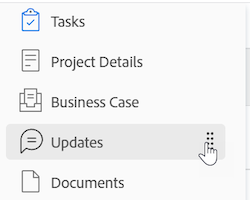

# Linkernavigatie in [!DNL Adobe Workfront]

De meeste gebieden en objecten in SWF maken gebruik van een eenvoudig navigatievenster aan de linkerkant van het scherm. Hieronder ziet u de voordelen van navigatie in het linkerdeelvenster:

* Hierdoor wordt de schermruimte beter beheerd.
* Uw [!DNL Workfront] de beheerder kan om het even welke sectie in het linkerpaneel behalve de details van objecten verbergen gebruikend lay-outmalplaatjes.

   Zie het artikel voor informatie over het gebruik van lay-outsjablonen [Lay-outsjablonen maken en beheren](../../administration-and-setup/customize-workfront/use-layout-templates/create-and-manage-layout-templates.md).

* U kunt de volgorde van de secties in de linkernavigatie eenvoudig wijzigen zonder extra schermen te openen door deze in de gewenste volgorde te slepen.

   Zie de volgende sectie in dit artikel voor meer informatie: [Het linkernavigatievenster gebruiken](#use-the-left-navigation-panel).

* U kunt het linkerdeelvenster aanpassen door een dashboard toe te voegen.

## Toegangsvereisten

U moet de volgende toegang hebben om de stappen in dit artikel uit te voeren:

<table style="table-layout:auto"> 
 <col> 
 </col> 
 <col> 
 </col> 
 <tbody> 
  <tr> 
   <td role="rowheader"><strong>[!DNL Adobe Workfront] plan*</strong></td> 
   <td> 
Alle
 </td> 
  </tr> 
  <tr> 
   <td role="rowheader"><strong>[!DNL Adobe Workfront] licentie*</strong></td> 
   <td> 
[!UICONTROL Request] of hoger
 </td> 
  </tr> 
 </tbody> 
</table>

&#42;Neem contact op met uw [!DNL Workfront] beheerder.

## Standaardsecties in het linkernavigatievenster

Via het linkerdeelvenster hebt u toegang tot meer informatie over objecten of gebieden voor verschillende objecten of gebieden in Adobe Workfront.

Afhankelijk van het object of het gebied waarnaar u hebt genavigeerd, zijn de secties in het linkerdeelvenster anders.

Het linkerdeelvenster is beschikbaar voor de volgende objecten:

* Project
* Taak
* Probleem
* Portfolio
* Programma
* Sjabloon
* Sjabloontaak
* Iteratie
* Gebruiker
* Team
* Groep
* Goal

>[!IMPORTANT]
>
>Als in het linkerdeelvenster standaard slechts één sectie wordt weergegeven, bijvoorbeeld **[!UICONTROL All Projects]** in de **[!UICONTROL Projects]** gebied—a [!DNL Workfront] de beheerder moet minstens één douanesectie aan dit gebied toevoegen wanneer het bouwen van een Malplaatje van de Lay-out en u toewijzen aan dat malplaatje alvorens het linkerpaneel in dat gebied toont.\
>Voor informatie over hoe een [!DNL Workfront] de beheerder past het linkerpaneel in een lay-outmalplaatje aan, zie [Het linkerdeelvenster aanpassen met een lay-outsjabloon](../../administration-and-setup/customize-workfront/use-layout-templates/customize-left-panel.md).

Het linkerdeelvenster is beschikbaar voor de volgende gebieden:

* [Standaardsecties in het dialoogvenster [!UICONTROL Dashboards] gebied](#default-sections-in-the-dashboards-area)
* [Standaardsecties in het dialoogvenster [!UICONTROL Requests] gebied](#default-sections-in-the-requests-area)
* [Standaardsecties in het dialoogvenster [!UICONTROL Resourcing] gebied](#default-sections-in-the-resourcing-area)
* [Standaardsecties in het dialoogvenster [!UICONTROL Projects] gebied](#default-sections-in-the-projects-area)
* [Standaardsecties in het dialoogvenster [!UICONTROL Timesheets] gebied](#default-sections-in-the-timesheets-area)
* [Standaardsecties in het dialoogvenster [!DNL Goals] gebied](#default-sections-in-the-goals-area)

### Standaardsecties in het dialoogvenster [!UICONTROL Dashboards] gebied

De volgende secties worden in het linkerdeelvenster weergegeven voor de **[!UICONTROL Dashboards]** gebied:

<table style="table-layout:auto">
    <tr>
        <td><strong>[!UICONTROL My Dashboards]</strong></td>
        <td>Hiermee geeft u de dashboards weer die u hebt gemaakt.</td>
    </tr>
    <tr>
        <td><strong>[!UICONTROL Shared Dashboards]</strong></td>
        <td>Hiermee geeft u de dashboards weer die door andere gebruikers zijn gemaakt en met u zijn gedeeld.</td>
    </tr>
    <tr>
        <td><strong>[!UICONTROL All Dashboards]</strong></td>
        <td>Toont de dashboards die u of andere gebruikers hebben gecreeerd, en die u toestemmingen aan minstens Mening hebt.</td>
    </tr>
</table>

Zie de sectie voor meer informatie over het gebruik van het linkerdeelvenster in het gebied Dashboards [Het linkernavigatievenster gebruiken](#use-the-left-navigation-panel) in dit artikel.

### Standaardsecties in het dialoogvenster [!UICONTROL Requests] gebied

<table style="table-layout:auto">
    <tr>
        <td><strong>[!UICONTROL Submitted]</strong></td>
        <td>De verzoeken van vertoningen die u of andere gebruikers hebben voorgelegd, en die u toestemmingen aan minstens Mening hebt. Gebruik de filters in de rechterbovenhoek van de aanvraaglijst om uw verzoeken of verzoeken te bekijken die anderen hebben ingediend en u hebt toegang tot mening.</td>
    </tr>
    <tr>
        <td><strong>[!UICONTROL Drafts]</strong></td>
        <td>De verzoeken van vertoningen die u bent begonnen maar u hebt hen nog niet voorgelegd. [!DNL Workfront] slaat automatisch om het even welk nieuw verzoek in de omslag Concepts op, nadat u uw rijonderwerp hebt geselecteerd.</td>
    </tr>
</table>

Leer hoe u het linkerdeelvenster in het dialoogvenster [!UICONTROL Requests] gebied, zie de sectie [Het linkernavigatievenster gebruiken](#use-the-left-navigation-panel) in dit artikel.

### Standaardsecties in het dialoogvenster [!UICONTROL Resourcing] gebied

De volgende secties worden in het linkerdeelvenster weergegeven voor de **[!UICONTROL Resourcing]** gebied:

<table style="table-layout:auto"> 
 <col> 
 <col> 
 <tbody> 
  <tr> 
   <td role="rowheader"><strong>Planner</strong></td> 
   <td>Toont de Planner van het Middel. Gebruik dit gebied om uw middelen over veelvoudige projecten te plannen. Voor informatie over het gebruiken van de Planner van het Middel, zie <a href="../../resource-mgmt/resource-planning/get-started-resource-planning.md" class="MCXref xref">Aan de slag met bronnenplanning</a>.</td> 
  </tr> 
  <tr> 
   <td role="rowheader"><strong>[!UICONTROL Workload Balancer]</strong></td> 
   <td>Hiermee geeft u de werklastverdeling weer. Gebruik dit gebied om werkelijk werk aan uw middelen toe te wijzen.  
   Voor informatie over het gebruiken van het plannen van middelen, zie <a href="../../resource-mgmt/workload-balancer/assign-work-in-workload-balancer.md" class="MCXref xref">Overzicht van het toewijzen van werk in de werklastverdeler</a>.</td> 
  </tr> 
  <tr> 
   <td role="rowheader"><strong>Gebruik</strong></td> 
   <td>Toont het Rapport van het Gebruik. Voor informatie over hoe te om het Rapport van het Gebruik te lezen, zie <a href="../../reports-and-dashboards/reports/using-built-in-reports/resource-utilization-report.md" class="MCXref xref">Overzicht van het verslag over het gebruik van hulpbronnen</a>.</td> 
  </tr> 
  <tr> 
   <td role="rowheader"><strong>Brongroepen</strong></td> 
   <td>Hiermee worden alle bronnenpools in Workfront weergegeven. Voor informatie over Brongroepen raadpleegt u <a href="../../resource-mgmt/resource-planning/resource-pools/work-with-resource-pools.md" class="MCXref xref"> Overzicht van bronnenpools </a>.</td>
  </tr> 
 </tbody> 
</table>

Leer hoe u het linkerdeelvenster in het dialoogvenster [!UICONTROL Resourcing] gebied, zie de sectie [Het linkernavigatievenster gebruiken](#use-the-left-navigation-panel) in dit artikel.

### Standaardsecties in het dialoogvenster [!UICONTROL Projects] gebied

De volgende secties worden in het linkerdeelvenster weergegeven voor de **[!UICONTROL Projects]** gebied:

<table style="table-layout:auto">
    <tr>
        <td><strong>[!UICONTROL All Projects]</strong></td>
        <td>Toont alle projecten die u toegang tot mening hebt. Gebruik de [!UICONTROL Filter] vervolgkeuzemenu om te wijzigen welke projecten u wilt weergeven</td>
    </tr>
    <tr>
        <td><strong>[!UICONTROL Custom sections]</strong></td>
        <td>U kunt alle aangepaste secties weergeven die uw [!DNL Workfront] de beheerder heeft aan het linkerpaneel voor toegevoegd [!UICONTROL Projects] in uw lay-outsjabloon. Aangepaste secties hebben namen die zijn aangepast voor uw omgeving.</td>
    </tr>
</table>

Leer hoe u het linkerdeelvenster in het dialoogvenster [!UICONTROL Projects] gebied, zie de sectie [Het linkernavigatievenster gebruiken](#use-the-left-navigation-panel) in dit artikel.

### Standaardsecties in het dialoogvenster [!UICONTROL Timesheets] gebied

De volgende secties worden in het linkerdeelvenster weergegeven voor de **[!UICONTROL Timesheets]** gebied:

<table style="table-layout:auto">
    <tr>
        <td><strong>[!UICONTROL My Timesheets]</strong></td>
        <td>Hiermee geeft u standaard al uw actieve tijdbladen weer. Selecteer [!UICONTROL Submitted] of [!UICONTROL All] van de [!UICONTROL Filter] vervolgkeuzemenu.</td>
    </tr>
    <tr>
        <td><strong>[!UICONTROL Timesheets I Approve]</strong></td>
        <td>Hier worden de tijdbladen weergegeven die standaard ter goedkeuring zijn ingediend. Selecteer [!UICONTROL Active] of App in het keuzemenu Filter.</td>
    </tr>
    <tr>
        <td><strong>[!UICONTROL All Timesheets]</strong></td>
        <td>Hiermee geeft u alle tijdbladen weer die u kunt bekijken, op basis van de filters die u hebt geselecteerd in het linkergebied van Filter.</td>
    </tr>
</table>

Leer hoe u het linkerdeelvenster in het dialoogvenster [!UICONTROL Timesheets] gebied, zie de sectie [Het linkernavigatievenster gebruiken](#use-the-left-navigation-panel) in dit artikel.

### Standaardsecties in het dialoogvenster [!DNL Goals] gebied

>[!NOTE]
>
>Voor toegang tot doelen is een extra licentie vereist. Voor informatie over [!DNL Workfront Goals], zie [[!DNL Adobe Workfront Goals] overzicht](../../workfront-goals/goal-management/wf-goals-overview.md).

De volgende secties worden in het linkerdeelvenster weergegeven voor de **[!UICONTROL Goals]** gebied:

<table style="table-layout:auto">
    <tr>
        <td><strong>[!UICONTROL Goal List]</strong></td>
        <td>Toont alle doelstellingen die u toegang tot mening hebt. Zie voor meer informatie <a href="../../workfront-goals/goal-review-and-workfront-goals-sections/manage-goals-in-goal-list.md">Doelen beheren in het dialoogvenster [!UICONTROL Goal List] van [!DNL Adobe Workfront Goals]</a>.</td>
    </tr>
    <tr>
        <td><strong>[!UICONTROL Graphs]</strong></td>
        <td>Toont de prestaties van uw doelstellingen in grafieken. Zie voor meer informatie <a href="../../workfront-goals/goal-review-and-workfront-goals-sections/review-goal-graphs.md">Grafieken bekijken om trends in de voortgang van het doel te begrijpen [!DNL Adobe Workfront] Doelen</a>.</td>
    </tr>
    <tr>
        <td><strong>[!UICONTROL Goal Alignment]</strong></td>
        <td>Geeft de uitlijning van doelen met elkaar in een hiërarchie weer. Zie voor meer informatie <a href="../../workfront-goals/goal-alignment/goal-alignment-overview.md">Overzicht van uitlijning van doelstellingen in [!DNL Adobe Workfront Goals]</a>.</td>
    </tr>
    </table>

<!--
   Drafted - removed from UI 
   <table>
    <tr>
        <td><strong>[!UICONTROL Pulse]</strong></td>
        <td>Displays a quick overview of all active goals and their progress. For more information, see <a href="../../workfront-goals/goal-review-and-workfront-goals-sections/review-goals-in-pulse.md">Review goals in the [!UICONTROL [!DNL Adobe Workfront Goals] Pulse] section</a>.
        
This section has been removed from the Preview environment.

        </td>
    </tr>
    <tr>
        <td><strong>[!UICONTROL Check-in]</strong></td>
        <td>Displays a quick overview of your active goals and their progress. For more information, see <a href="../../workfront-goals/goal-review-and-workfront-goals-sections/check-in-goals.md">Update goal progress in [!DNL Adobe Workfront Goals]</a>.
        
This section has been removed from the Preview environment.

        </td>
    </tr>
</table>
-->
Leer hoe u het linkerdeelvenster in het dialoogvenster [!UICONTROL Goals] gebied, zie de sectie [Het linkernavigatievenster gebruiken](#use-the-left-navigation-panel) in dit artikel.

## Het linkernavigatievenster gebruiken

Het zoeken naar en bewerken van informatie in het linkerdeelvenster is vergelijkbaar voor deze objecten. Welke opties beschikbaar zijn in het linkerdeelvenster, is afhankelijk van het object dat u opent.

Als u wilt weten welke secties beschikbaar zijn voor specifieke gebieden, raadpleegt u [[!UICONTROL Default sections] in het linkernavigatievenster](#default-sections-in-the-left-navigation-panel).

1. Klik op de knop **[!UICONTROL Main menu]** pictogram klikt u vervolgens op de naam van een object om dit te openen.

   De objectpagina wordt weergegeven.

1. (Voorwaardelijk) Als u een gebied hebt geselecteerd dat een lijst met objecten bevat, zoals **[!UICONTROL Projects]** of **[!UICONTROL Portfolios]**—u moet het volgende doen om tot de linkerpaneelnavigatie toegang te hebben:

   1. Klik op een object in de lijst.
   1. (Optioneel) In de navigatie in het linkerdeelvenster kunt u een ander object selecteren, bijvoorbeeld **[!UICONTROL Tasks]** of **[!UICONTROL Issues]** in een project—in het linkerdeelvenster om een lijst met objecten te openen en klik vervolgens op de naam van het specifieke object.\

      De objectpagina wordt weergegeven.

1. Klik op een van de secties in het linkerdeelvenster op de objectpagina om de informatie in die sectie weer te geven of te bewerken.

   U moet over machtigingen beschikken om het object te bewerken voordat u de gegevens kunt bewerken.

   

1. (Optioneel) Klik op **[!UICONTROL Show More]** onder aan het linkerdeelvenster om meer secties weer te geven.

   >[!NOTE]
   >
   >Deze optie is niet beschikbaar als alle secties standaard in het linkerdeelvenster worden weergegeven.

1. (Optioneel) Klik op **[!UICONTROL Add Dashboard]** Voer onder aan het linkerdeelvenster de volgende handelingen uit:

   1. Typ een naam voor het dashboard in het dialoogvenster **[!UICONTROL Quick link name]** veld.
   1. Typ de naam van een bestaand dashboard in het dialoogvenster **[!UICONTROL Choose a Dashboard]** en klikt u op het dashboard wanneer dit in de lijst wordt weergegeven.

      >[!TIP]
      >
      >U moet het dashboard bouwen alvorens het in de lijst verschijnt.

   1. Klik op **[!UICONTROL Add]**.

      De dashboardkoppeling wordt onder in het linkerdeelvenster weergegeven.

1. (Optioneel) Als u de volgorde van een sectie in het linkerdeelvenster wilt wijzigen, klikt u op de knop **[!UICONTROL Drag]** pictogram  rechts van een sectie en sleep deze omhoog of omlaag.

   

1. (Optioneel) Als u het linkervenster wilt sluiten, klikt u op de knop **[!UICONTROL Collapse]** pictogram .

   >[!NOTE]
   >
   >Wanneer u het linkerpaneel samenvouwt, [!DNL Workfront] behoudt uw voorkeur, zelfs wanneer u naar een andere navigeert [!DNL Workfront] object. Als u het linkerdeelvenster opnieuw wilt uitvouwen, klikt u op de knop **[!UICONTROL Expand]** pictogram .
