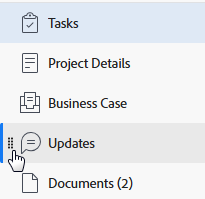

# Linkernavigatie in [!DNL Adobe Workfront]

De meeste gebieden en objecten in SWF maken gebruik van een eenvoudig navigatievenster aan de linkerkant van het scherm. Hieronder ziet u de voordelen van navigatie in het linkerdeelvenster:

* Hierdoor is een beter beheer van de schermruimte mogelijk.
* Uw [!DNL Workfront] -beheerder kan elke sectie in het linkerdeelvenster verbergen, behalve de objectdetails met behulp van lay-outsjablonen.

  Voor informatie over het gebruiken van lay-outmalplaatjes, zie artikel [&#x200B; lay-outmalplaatjes &#x200B;](../../administration-and-setup/customize-workfront/use-layout-templates/create-and-manage-layout-templates.md) creëren en leiden.

* U kunt de volgorde van de secties in de linkernavigatie eenvoudig wijzigen zonder extra schermen te openen door deze in de gewenste volgorde te slepen.

  Voor meer informatie, zie de volgende sectie in dit artikel: [&#x200B; Gebruik het linkernavigatievenster &#x200B;](#use-the-left-navigation-panel).

* U kunt het linkerdeelvenster aanpassen door een dashboard toe te voegen.

## Toegangsvereisten

U moet de volgende toegang hebben om de stappen in dit artikel uit te voeren:

<table style="table-layout:auto"> 
 <col> 
 </col> 
 <col> 
 </col> 
 <tbody> 
  <tr> 
   <td role="rowheader"><strong>[!DNL Adobe Workfront] plan*</strong></td> 
   <td> 
Alle
 </td> 
  </tr> 
  <tr> 
   <td role="rowheader"><strong>[!DNL Adobe Workfront] licentie*</strong></td> 
   <td> 
[!UICONTROL Request] of hoger
 </td> 
  </tr> 
 </tbody> 
</table>

&#42; om te weten te komen welk plan of vergunningstype u hebt, contacteer uw [!DNL Workfront] beheerder.

## Standaardsecties in het linkernavigatievenster

Via het linkerdeelvenster hebt u toegang tot meer informatie over objecten of gebieden voor verschillende objecten of gebieden in Adobe Workfront.

Afhankelijk van het object of het gebied waarnaar u hebt genavigeerd, zijn de secties in het linkerdeelvenster anders.

Het linkerdeelvenster is beschikbaar voor de volgende objecten:

* Project
* Taak
* Probleem
* Portfolio
* Programma
* Sjabloon
* Sjabloontaak
* Iteratie
* Gebruiker
* Team
* Groep
* Goal

>[!IMPORTANT]
>
>Als in het linkerdeelvenster standaard slechts één sectie wordt weergegeven, bijvoorbeeld **[!UICONTROL All Projects]** in het **[!UICONTROL Projects]** -gebied, moet een [!DNL Workfront] -beheerder ten minste één dashboard aan dit gebied toevoegen wanneer een lay-outsjabloon wordt gemaakt en u aan die sjabloon toewijzen voordat het linkerdeelvenster in dat gebied wordt weergegeven.
>&#x200B;>Voor informatie over hoe een [!DNL Workfront] beheerder het linkerpaneel in een lay-outmalplaatje aanpast, zie [&#x200B; het linkerpaneel aanpassen gebruikend een lay-outmalplaatje &#x200B;](../../administration-and-setup/customize-workfront/use-layout-templates/customize-left-panel.md).

Het linkerdeelvenster is beschikbaar voor de volgende gebieden:

* [Standaardsecties in het gebied [!UICONTROL Dashboards]](#default-sections-in-the-dashboards-area)
* [Standaardsecties in het gebied [!UICONTROL Requests]](#default-sections-in-the-requests-area)
* [Standaardsecties in het gebied [!UICONTROL Resourcing]](#default-sections-in-the-resourcing-area)
* [Standaardsecties in het gebied [!UICONTROL Projects]](#default-sections-in-the-projects-area)
* [Standaardsecties in het gebied [!UICONTROL Timesheets]](#default-sections-in-the-timesheets-area)
* [De standaardsecties in het  [!DNL Goals]  gebied](#default-sections-in-the-goals-area)

### Standaardsecties in het gebied [!UICONTROL Dashboards]

De volgende secties worden in het linkerdeelvenster voor het **[!UICONTROL Dashboards]** -gebied weergegeven:

<table style="table-layout:auto">
    <tr>
        <td><strong>[!UICONTROL My Dashboards]</strong></td>
        <td>Hiermee geeft u de dashboards weer die u hebt gemaakt.</td>
    </tr>
    <tr>
        <td><strong>[!UICONTROL Shared Dashboards]</strong></td>
        <td>Hiermee geeft u de dashboards weer die door andere gebruikers zijn gemaakt en met u zijn gedeeld.</td>
    </tr>
    <tr>
        <td><strong>[!UICONTROL All Dashboards]</strong></td>
        <td>Toont de dashboards die u of andere gebruikers hebben gecreeerd, en die u toestemmingen aan minstens Mening hebt.</td>
    </tr>
</table>

Leren hoe te om het linkerpaneel in het gebied van Dashboards te gebruiken, zie het sectie [&#x200B; Gebruik het linkernavigatievenster &#x200B;](#use-the-left-navigation-panel) in dit artikel.

### Standaardsecties in het gebied [!UICONTROL Requests]

<table style="table-layout:auto">
    <tr>
        <td><strong>[!UICONTROL Submitted]</strong></td>
        <td>De verzoeken van vertoningen die u of andere gebruikers hebben voorgelegd, en die u toestemmingen aan minstens Mening hebt. Gebruik de filters in de rechterbovenhoek van de aanvraaglijst om uw verzoeken of verzoeken te bekijken die anderen hebben ingediend en u hebt toegang tot mening.</td>
    </tr>
    <tr>
        <td><strong>[!UICONTROL Drafts]</strong></td>
        <td>De verzoeken van vertoningen die u bent begonnen maar u hebt hen nog niet voorgelegd. [!DNL Workfront] slaat automatisch om het even welk nieuw verzoek in de omslag Concepts op, nadat u uw rijonderwerp hebt geselecteerd.</td>
    </tr>
</table>

Leren hoe te om het linkerpaneel in het [!UICONTROL Requests] gebied te gebruiken, zie de sectie [&#x200B; Gebruik het linkernavigatievenster &#x200B;](#use-the-left-navigation-panel) in dit artikel.

### Standaardsecties in het gebied [!UICONTROL Resourcing]

De volgende secties worden in het linkerdeelvenster voor het **[!UICONTROL Resourcing]** -gebied weergegeven:

<table style="table-layout:auto"> 
 <col> 
 <col> 
 <tbody> 
  <tr> 
   <td role="rowheader"><strong>Planner</strong></td> 
   <td>Toont de Planner van het Middel. Gebruik dit gebied om uw middelen over veelvoudige projecten te plannen. Voor informatie over het gebruiken van de Planner van het Middel, zie <a href="../../resource-mgmt/resource-planning/get-started-resource-planning.md" class="MCXref xref"> begonnen met de Planning van het Middel </a>.</td> 
  </tr> 
  <tr> 
   <td role="rowheader"><strong>[!UICONTROL Workload Balancer]</strong></td> 
   <td>Hiermee geeft u de werklastverdeling weer. Gebruik dit gebied om werkelijk werk aan uw middelen toe te wijzen.  
   Voor informatie over het gebruiken van het plannen van middelen, zie <a href="../../resource-mgmt/workload-balancer/assign-work-in-workload-balancer.md" class="MCXref xref"> Overzicht van het toewijzen van het werk in de Balancer van de Werklast </a>.</td> 
  </tr> 
  <tr> 
   <td role="rowheader"><strong>Gebruik</strong></td> 
   <td>Toont het Rapport van het Gebruik. Voor informatie over hoe te om het Rapport van het Gebruik te lezen, zie <a href="../../reports-and-dashboards/reports/using-built-in-reports/resource-utilization-report.md" class="MCXref xref"> Overzicht van het rapport van het Gebruik van het Middel </a>.</td> 
  </tr> 
  <tr> 
   <td role="rowheader"><strong>Brongroepen</strong></td> 
   <td>Hiermee worden alle bronnenpools in Workfront weergegeven. Zie <a href="../../resource-mgmt/resource-planning/resource-pools/work-with-resource-pools.md" class="MCXref xref"> Overzicht van bronnenpools </a> voor informatie over bronnenpools.</td>
  </tr> 
 </tbody> 
</table>

Leren hoe te om het linkerpaneel in het [!UICONTROL Resourcing] gebied te gebruiken, zie de sectie [&#x200B; Gebruik het linkernavigatievenster &#x200B;](#use-the-left-navigation-panel) in dit artikel.

### Standaardsecties in het gebied [!UICONTROL Projects]

De volgende secties worden in het linkerdeelvenster voor het **[!UICONTROL Projects]** -gebied weergegeven:

<table style="table-layout:auto">
    <tr>
        <td><strong>[!UICONTROL All Projects]</strong></td>
        <td>Toont alle projecten die u toegang tot mening hebt. Gebruik het vervolgkeuzemenu [!UICONTROL Filter] om te wijzigen welke projecten u wilt weergeven</td>
    </tr>
    <tr>
        <td><strong>[!UICONTROL Dashboards]</strong></td>
        <td>U kunt alle dashboards bekijken die uw [!DNL Workfront] beheerder aan het linkerpaneel voor het [!UICONTROL Projects] gebied in uw Malplaatje van de Lay-out heeft toegevoegd. Deze dashboards hebben namen die voor uw milieu zijn aangepast.</td>
    </tr>
</table>

Leren hoe te om het linkerpaneel in het [!UICONTROL Projects] gebied te gebruiken, zie de sectie [&#x200B; Gebruik het linkernavigatievenster &#x200B;](#use-the-left-navigation-panel) in dit artikel.

### Standaardsecties in het gebied [!UICONTROL Timesheets]

De volgende secties worden in het linkerdeelvenster voor het **[!UICONTROL Timesheets]** -gebied weergegeven:

<table style="table-layout:auto">
    <tr>
        <td><strong>[!UICONTROL My Timesheets]</strong></td>
        <td>Hiermee geeft u standaard al uw actieve tijdbladen weer. Als u verzonden of gesloten tijdbladen wilt weergeven, selecteert u [!UICONTROL Submitted] of [!UICONTROL All] in de vervolgkeuzelijst [!UICONTROL Filter] .</td>
    </tr>
    <tr>
        <td><strong>[!UICONTROL Timesheets I Approve]</strong></td>
        <td>Hier worden de tijdbladen weergegeven die standaard ter goedkeuring zijn ingediend. Selecteer [!UICONTROL Active] of App in het keuzemenu Filter als u actieve of alle tijdbladen wilt weergeven waarin u de fiatteur bent.</td>
    </tr>
    <tr>
        <td><strong>[!UICONTROL All Timesheets]</strong></td>
        <td>Hiermee geeft u alle tijdbladen weer die u kunt bekijken, op basis van de filters die u hebt geselecteerd in het linkergebied van Filter.</td>
    </tr>
</table>

Leren hoe te om het linkerpaneel in het [!UICONTROL Timesheets] gebied te gebruiken, zie de sectie [&#x200B; Gebruik het linkernavigatievenster &#x200B;](#use-the-left-navigation-panel) in dit artikel.

### Standaardsecties in het gebied [!DNL Goals]

>[!NOTE]
>
>Voor toegang tot doelen is een extra licentie vereist. Voor informatie over [!DNL Workfront Goals], zie [[!DNL Adobe Workfront Goals]  overzicht &#x200B;](../../workfront-goals/goal-management/wf-goals-overview.md).

De volgende secties worden in het linkerdeelvenster voor het **[!UICONTROL Goals]** -gebied weergegeven:

<table style="table-layout:auto">
    <tr>
        <td><strong>[!UICONTROL Goal List]</strong></td>
        <td>Toont alle doelstellingen die u toegang tot mening hebt. Voor meer informatie, zie <a href="../../workfront-goals/goal-review-and-workfront-goals-sections/manage-goals-in-goal-list.md"> leiden doelstellingen in [!UICONTROL Goal List] van [!DNL Adobe Workfront Goals]</a>.</td>
    </tr>
    <tr>
        <td><strong>[!UICONTROL Graphs]</strong></td>
        <td>Toont de prestaties van uw doelstellingen in grafieken. Voor meer informatie, zie <a href="../../workfront-goals/goal-review-and-workfront-goals-sections/review-goal-graphs.md"> grafieken van het Overzicht om de tendensen van de doelvooruitgang in [!DNL Adobe Workfront] Doelen </a> te begrijpen.</td>
    </tr>
    <tr>
        <td><strong>[!UICONTROL Goal Alignment]</strong></td>
        <td>Geeft de uitlijning van doelen met elkaar in een hiërarchie weer. Voor meer informatie, zie <a href="../../workfront-goals/goal-alignment/goal-alignment-overview.md"> Goal groeperingsoverzicht in [!DNL Adobe Workfront Goals]</a>.</td>
    </tr>
    </table>

<!--
   Drafted - removed from UI 
   <table>
    <tr>
        <td><strong>[!UICONTROL Pulse]</strong></td>
        <td>Displays a quick overview of all active goals and their progress. For more information, see <a href="../../workfront-goals/goal-review-and-workfront-goals-sections/review-goals-in-pulse.md">Review goals in the [!UICONTROL [!DNL Adobe Workfront Goals] Pulse] section</a>.
        
This section has been removed from the Preview environment.

        </td>
    </tr>
    <tr>
        <td><strong>[!UICONTROL Check-in]</strong></td>
        <td>Displays a quick overview of your active goals and their progress. For more information, see <a href="../../workfront-goals/goal-review-and-workfront-goals-sections/check-in-goals.md">Update goal progress in [!DNL Adobe Workfront Goals]</a>.
        
This section has been removed from the Preview environment.

        </td>
    </tr>
</table>
-->
Leren hoe te om het linkerpaneel in het [!UICONTROL Goals] gebied te gebruiken, zie de sectie [&#x200B; Gebruik het linkernavigatievenster &#x200B;](#use-the-left-navigation-panel) in dit artikel.

## Het linkernavigatievenster gebruiken

Het zoeken naar en bewerken van informatie in het linkerdeelvenster is vergelijkbaar voor deze objecten. Welke opties beschikbaar zijn in het linkerdeelvenster, is afhankelijk van het object dat u opent.

Om te leren welke secties voor specifieke gebieden beschikbaar zijn, zie [[!UICONTROL Default sections] in het linkernavigatievenster &#x200B;](#default-sections-in-the-left-navigation-panel).

{{step1-click-main-menu}}

1. Klik op de naam van een object om dit te openen.

   De objectpagina wordt weergegeven.

1. (Voorwaardelijk) Als u een gebied hebt geselecteerd dat een lijst met objecten bevat, zoals **[!UICONTROL Projects]** of **[!UICONTROL Portfolios]** , moet u het volgende doen om toegang te krijgen tot de navigatie in het linkerdeelvenster:

   1. Klik op een object in de lijst.
   1. (Optioneel) In de navigatie in het linkerdeelvenster kunt u in het linkerdeelvenster een ander object selecteren (zoals **[!UICONTROL Tasks]** of **[!UICONTROL Issues]** in een project) om een lijst met objecten te openen en vervolgens op de naam van het specifieke object te klikken.

      De objectpagina wordt weergegeven.

1. Klik op een van de secties in het linkerdeelvenster op de objectpagina om de informatie in die sectie weer te geven of te bewerken.

   U moet over machtigingen beschikken om het object te bewerken voordat u de gegevens kunt bewerken.

   

1. (Optioneel) Als u een snelle koppeling naar een dashboard wilt toevoegen, klikt u op **[!UICONTROL Add a Dashboard]** onder in het linkerdeelvenster en voert u de volgende handelingen uit:

   1. Typ een naam voor het dashboard in het veld **[!UICONTROL Quick link name]** .
   1. Typ de naam van een bestaand dashboard in het veld **[!UICONTROL Choose a dashboard]** en klik vervolgens op het dashboard wanneer dit in de lijst wordt weergegeven.

      >[!TIP]
      >
      >U moet het dashboard bouwen alvorens het in de lijst verschijnt.

1. (Facultatief) om een dashboard snelle verbinding te verwijderen, beweegt zich over het dashboard in de linkernavigatie, dan klikt **verwijdert** pictogram  wanneer het verschijnt.

1. (Optioneel) Als u de volgorde van een sectie in het linkerdeelvenster wilt wijzigen, klikt u op het pictogram **[!UICONTROL Drag]**  naast een sectie en sleept u deze omhoog of omlaag.

   

1. (Optioneel) Als u het linkerdeelvenster wilt sluiten, klikt u op het pictogram **[!UICONTROL Collapse]**  .

   >[!NOTE]
   >
   >Wanneer u het linkerdeelvenster samenvouwt, behoudt [!DNL Workfront] uw voorkeur, zelfs wanneer u naar een ander [!DNL Workfront] -object navigeert. Als u het linkerdeelvenster opnieuw wilt uitvouwen, klikt u op het pictogram **[!UICONTROL Expand]**  .
