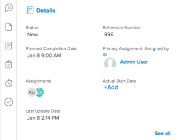

# [!UICONTROL Summary] overzicht

U kunt de [!UICONTROL Summary] om de gegevens van het werkitem rechtstreeks vanuit een lijst met taakproblemen, documenten of andere gebieden van [!DNL Adobe Workfront] die taken en problemen weergeven.

In de volgende tabel worden de gebieden weergegeven waar u de [!UICONTROL Summary] paneel:

<table style="table-layout:auto"> 
 <col data-mc-conditions=""> 
 <tbody> 
  <tr> 
   <td>Taken</td> 
  </tr> 
  <tr> 
   <td> 
Taaklijsten binnen een
 
    <ul> 
     <li>Project</li> 
     <li>Subtaak</li> 
    </ul> </td> 
  </tr> 
  <tr> 
   <td>Taken in de [!UICONTROL Unassigned] en [!UICONTROL Assigned] Werkgebieden van de [!DNL Workload Balancer]</td> 
  </tr> 
  <tr data-mc-conditions=""> 
   <td>Problemen</td> 
  </tr> 
  <tr data-mc-conditions=""> 
   <td> 
Uitgiftenlijsten binnen een
 
    <ul> 
     <li>Project</li> 
     <li>Taak</li> 
     <li>Subtaak</li> 
    </ul> </td> 
  </tr> 
  <tr data-mc-conditions=""> 
   <td>Problemen in de [!UICONTROL Assigned Work] gebied van de [!DNL Workload Balancer]</td> 
  </tr> 
  <tr data-mc-conditions=""> 
   <td>Problemen in de [!UICONTROL Submitted] van de [!UICONTROL Requests] gebied</td> 
  </tr> 
  <tr data-mc-conditions=""> 
   <td>Documenten</td> 
  </tr> 
  <tr data-mc-conditions=""> 
   <td>[!UICONTROL Documents] gebied</td> 
  </tr> 
  <tr data-mc-conditions=""> 
   <td>[!UICONTROL Documents] sectie van om het even welk voorwerp (project, taak, kwestie, programma, portefeuille, malplaatje, malplaatjetaak, gebruiker)</td> 
  </tr> 
 </tbody> 
</table>

<!--

Workfront administrators can customize the Summary in the Layout Template. For more information, see <a href="../../administration-and-setup/customize-workfront/use-layout-templates/create-and-manage-layout-templates.md" class="MCXref xref">Create and manage layout templates</a>.

-->

In dit artikel wordt beschreven hoe u het dialoogvenster [!UICONTROL Summary] voor taken en problemen in lijsten.

Voor informatie over de toegang tot [!UICONTROL Summary] in de [!DNL Workload Balancer], zie [Werk-items bij in het dialoogvenster [!DNL Workload Balancer] met de [!UICONTROL Summary]](../../resource-mgmt/workload-balancer/update-items-in-summary-panel-in-workload-balancer.md).

Voor informatie over de toegang tot [!UICONTROL Summary] voor documenten, zie [[!UICONTROL Summary] voor documentoverzicht](../../documents/managing-documents/summary-for-documents.md).

## Toegangsvereisten

U moet de volgende toegang hebben om de stappen in dit artikel uit te voeren:

<table style="table-layout:auto"> 
 <col> 
 <col> 
 <tbody> 
  <tr> 
   <td role="rowheader"><strong>[!DNL Adobe Workfront] plan*</strong></td> 
   <td> 
Alle
 </td> 
  </tr> 
  <tr> 
   <td role="rowheader"><strong>[!DNL Adobe Workfront] licentie*</strong></td> 
   <td> 
[!UICONTROL Request] of hoger
 </td> 
  </tr> 
  <tr> 
   <td role="rowheader"><strong>Configuraties op toegangsniveau*</strong></td> 
   <td> 
[!UICONTROL View] of betere toegang tot Taken, Kwesties, Documenten
 
[!UICONTROL View] of betere toegang tot objecten waarvoor u documenten wilt bekijken.' [!UICONTROL Summary]
 
Opmerking: Als u nog steeds geen toegang hebt, vraagt u [!DNL Workfront] beheerder als zij extra beperkingen in uw toegangsniveau plaatsen. Voor informatie over hoe een [!DNL Workfront] de beheerder kan uw toegangsniveau wijzigen, zie <a href="../../administration-and-setup/add-users/configure-and-grant-access/create-modify-access-levels.md" class="MCXref xref">Aangepaste toegangsniveaus maken of wijzigen</a>.
 </td> 
  </tr> 
  <tr> 
   <td role="rowheader"><strong>Objectmachtigingen</strong></td> 
   <td> 
[!UICONTROL View] of hogere machtigingen voor een taak, uitgave of document
 
Voor informatie over het aanvragen van aanvullende toegang raadpleegt u <a href="../../workfront-basics/grant-and-request-access-to-objects/request-access.md" class="MCXref xref">Toegang tot objecten aanvragen </a>.
 </td> 
  </tr> 
 </tbody> 
</table>

&#42;Neem contact op met uw [!DNL Workfront] beheerder.

## De weergave van [!UICONTROL Summary] in een lijst met taken of problemen

1. Ga naar een taak of kwestie en selecteer een punt in de lijst.
1. Klik op de knop **[!UICONTROL Summary]** pictogram 

   of

   Klik op de knop **[!UICONTROL Open Summary]** pictogram  in de [!UICONTROL Submitted] van de [!UICONTROL Requests] gebied.

   Nadat u het Overzicht opent, blijft het open aangezien u klikt of andere taken of kwesties selecteert en blijft open tot u het manueel sluit.

   >[!TIP]
   >
   >U kunt slechts één taak of één uitgave tegelijk selecteren om hun details in te zien in de [!UICONTROL Summary] deelvenster.

   

1. (Optioneel) Als u het dialoogvenster [!UICONTROL Summary] voert u een van de volgende handelingen uit:

   * Klik in een taak- of uitgavelijst op de knop **[!UICONTROL Open Summary]** pictogram 

      of

      Klik op de knop **X** in de rechterbovenhoek van het dialoogvenster [!UICONTROL Summary] deelvenster.

   * In de [!UICONTROL Submitted] van de [!UICONTROL Requests] gebied, klikt u op **[!UICONTROL Close Summary]** pictogram 

      of

      Klik op de knop **X** in de rechterbovenhoek van het deelvenster Overzicht.

## [!UICONTROL Percent Complete]

Gebruik de voortgangsbalk boven aan het dialoogvenster [!UICONTROL Summary] om het percentage bij te werken volledig voor de taak of kwestie die u hebt geselecteerd. Voer een getal in of sleep de balk naar het juiste percentage.

## [!UICONTROL Updates]

Gebruik de [!UICONTROL Updates] van de [!UICONTROL Summary] om recente updates weer te geven en updates uit te voeren over de taak of uitgave die u hebt geselecteerd. Klikken **[!UICONTROL See all]** om rechtstreeks naar de [!UICONTROL Updates] op de taak.

## [!UICONTROL Documents]

Gebruik de [!UICONTROL Documents] van de [!UICONTROL Summary] als u documenten wilt bekijken die zijn gekoppeld aan de geselecteerde taak of uitgave. Klik op de miniatuur om een documentvoorbeeld te openen. Ga rechtstreeks naar de [!UICONTROL Documents] op de taak of uitgave klikt u op de knop **[!UICONTROL Documents]** titel.

## [!UICONTROL Details]

Gebruik de [!UICONTROL Details] van de [!UICONTROL Summary] als u de details van het werkitem op hoog niveau wilt weergeven, toewijzingen wilt maken of begindatums wilt toevoegen. Klikken **[!UICONTROL See all]** om rechtstreeks naar de [!UICONTROL Details] op de taak of uitgave.

>[!NOTE]
>
>De velden in deze sectie zijn dezelfde velden die in het rechterdeelvenster van Home worden weergegeven. U kunt deze velden aanpassen [Aanpassen [!UICONTROL Home] en [!UICONTROL Summary] een lay-outsjabloon gebruiken](../../administration-and-setup/customize-workfront/use-layout-templates/customize-home-summary-layout-template.md).

## [!UICONTROL Subtasks]

Deze sectie is alleen beschikbaar voor taken. Gebruik de [!UICONTROL Subtasks] van de [!UICONTROL Summary] om weer te geven [!UICONTROL New], [!UICONTROL In Progress], en [!UICONTROL Closed] subtaken op de taak u selecteerde. Klik op de knop **[!UICONTROL Status]** vervolgkeuzemenu voor het schakelen tussen statussen. Ga rechtstreeks naar de [!UICONTROL Subtasks] klikt u op de knop **[!UICONTROL Subtasks]**&#x200B; titel.

Als u geen subtaken aan de taak hebt toegevoegd, klikt u op **[!UICONTROL Add one here]** om rechtstreeks naar de [!UICONTROL Subtasks] op de taak.

## [!UICONTROL Hours]

Gebruik de [!UICONTROL Hours] van de [!UICONTROL Summary] om uren te registreren op de taak of kwestie u selecteerde. Klikken **[!UICONTROL Log Time]** en voer uw uren in. Als u rechtstreeks naar het tabblad Uren van de taak of uitgave wilt gaan, klikt u op de knop **[!UICONTROL Hours]** titel.

Het aantal uren in de [!UICONTROL Summary] geeft de uren weer die u zich aanmeldt. Andere gebruikers hebben verschillende totalen per uur in het dialoogvenster [!UICONTROL Summary] afhankelijk van de tijd die zij aan de taak registreren.

Als er geen plannen zijn [!UICONTROL hours] op de taak of de kwestie en u hebt het programma geopend, toont de urenbar rood.

## Goedkeuringen

Gebruik de [!UICONTROL Approvals] van de [!UICONTROL Summary] om goedkeuringen weer te geven die zijn gekoppeld aan de geselecteerde taak of uitgave. Als u geen goedkeuring hebt toegevoegd, selecteert u een bestaande goedkeuring in het keuzemenu of klikt u op **[!UICONTROL Create single-use approval process]** om rechtstreeks naar de [!UICONTROL Approvals] op de taak of uitgave.

Ga rechtstreeks naar de [!UICONTROL Approvals] op de taak of uitgave klikt u op de knop **[!UICONTROL Approvals]** titel.

