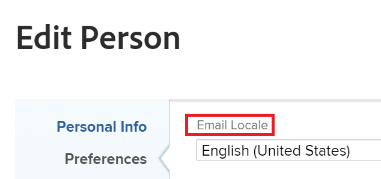

# De datumnotatie wijzigen in [!DNL Adobe Workfront]

<!--this article used to be called "Change the date format in Adobe Workfront when using Chrome". The team decieded to make it more generic and hide the steps. Also see drafted content below-->

>[!IMPORTANT]
>
> De informatie in dit artikel is slechts op organisaties van toepassing die nog niet aan de Adobe Verenigde Ervaring zijn ingezien.
> Als uw organisatie aan de Adobe Verenigde Ervaring is genegeerd, wordt uw datumvoorkeur gecontroleerd door uw taalvoorkeur die in Adobe Verenigde Shell wordt geplaatst. De standaardtaalinstelling en dus de standaarddatuminstelling is `en-US` .
> Voor meer informatie, zie [[!DNL Adobe Unified Experience]  voor  [!DNL Workfront]](/help/quicksilver/workfront-basics/navigate-workfront/workfront-navigation/adobe-unified-experience.md/#access-your-profile-and-preferences).

U kunt de datumnotatie van datums wijzigen in [!DNL Adobe Workfront], zoals [!UICONTROL Planned Completion Date] , [!UICONTROL Actual Completion Date] of [!UICONTROL Projected Completion Date] .

Bijvoorbeeld, kunt u een datumformaat van _veranderen DD/MM/YYYY_ aan _MM/DD/YYYY_ of vice versa.
Of, kunt u het datumformaat van _MM/DD/JJ_ veranderen in _Mon DD, JJJJ_.

U kunt datumnotaties op de volgende manieren wijzigen in Workfront, afhankelijk van de wijzigingen die u wilt zien en van de plaats waar u de wijzigingen wilt zien.

* Als u alle datumnotaties voor alle pagina&#39;s in [!DNL Workfront] wilt wijzigen op basis van uw locatie en taal, moet u de taalinstellingen in uw browser wijzigen.

  Als de standaardtaal in uw browser bijvoorbeeld is ingesteld op *[!UICONTROL English (United States)]* , worden de datums weergegeven in de volgende notaties:

   * MM/DD/YYYY
   * Mon DD, YYYY

  Als u de taalinstellingen in [!DNL Chrome] of een andere browser wilt wijzigen, moet u de instellingen van die browser wijzigen. De stappen voor het wijzigen van de browserinstellingen variëren van browser tot browser. Raadpleeg de gebieden [!UICONTROL Help] , [!UICONTROL Preferences] of [!UICONTROL Settings] van uw browser voor informatie over het wijzigen van de instellingen.

* Als u de datumnotatie alleen in rapporten en weergaven wilt wijzigen, moet u de instelling [!UICONTROL Field Format] in het [!UICONTROL Advanced Options] -gebied van een kolom bijwerken wanneer u het rapport of de weergave maakt. Hiermee wijzigt u de datumnotatie niet op basis van de locatie of taal. De datumnotatie wordt gewijzigd in de context van dezelfde locatie of taal.

  

  Voor meer informatie, zie [&#x200B; een douanerapport &#x200B;](../../reports-and-dashboards/reports/creating-and-managing-reports/create-custom-report.md) creëren.

* Als u de datumnotatie wilt wijzigen in alle uitgaande e-mailmeldingen voor uw hele organisatie, moet u de instelling [!UICONTROL Default Email Locale] bijwerken in het [!UICONTROL Customer Info] -gebied in [!UICONTROL Setup] .

  

  Voor meer informatie, zie [&#x200B; basisinformatie voor uw systeem &#x200B;](../../administration-and-setup/get-started-wf-administration/configure-basic-info.md) vormen.

* Als u de indeling van alle datums in alle uitgaande e-mailberichten voor één gebruiker wilt wijzigen, moet u de instelling [!UICONTROL Email Locale] in het vak [!UICONTROL Edit Person] bijwerken wanneer u het profiel van een gebruiker bewerkt.

  

  Voor meer informatie, zie [&#x200B; het profiel van een gebruiker &#x200B;](../../administration-and-setup/add-users/create-and-manage-users/edit-a-users-profile.md) uitgeven.

<!--drafted because we should not document steps for a third-party application

To change your language settings in Chrome:

1. Click the 3-dots in the top right corner of your Chrome interface, then click **Settings**.
1. On the left area of the Settings page, expand **Advanced**, then click **Languages**.  
   Or  
   Search for *language*  at the top of the Settings page, then click **Languages**.

1. In the **Language** list, locate the language and region that use your preferred date format.

   **Example:** If you speak English and you want the date format to be MM/DD/YYYY, you would select **English (United States)**. If you speak English and you want the date format to be DD/MM/YYY, you would select **English (United Kingdom)**.

1. (Conditional) If the language and region you want to use are not visible in the list, click **Add languages** to add it to the list.
1. Click the 3-dot menu next to the language and region you want to use, then click **Move to the top**.
1. Return to the Workfront interface, then refresh the page.  
   The date format is now updated in projects and other areas of Workfront that use MM/DD/YYYY or DD/MM/YYYY format when displaying dates.

   -->
