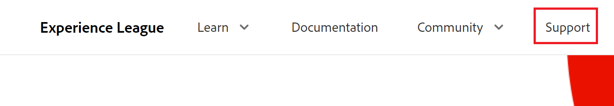

# Contact opnemen met Klantenondersteuning

<!--Audited: 12/2023-->

<!--

(We need to keep this as a standalone article. It is linked in multiple articles and FAQs.)

-->

Als klant van [!DNL Adobe Workfront] kunt u telefonisch contact opnemen met het klantenondersteuningsteam van [!DNL Workfront] of een ticket online verzenden.

>[!NOTE]
>
>Neem voor kritieke problemen telefonisch contact op met de [!DNL Workfront] Klantenondersteuning.

## Toegangsvereisten

+++ Vouw uit om de vereisten voor toegang weer te geven.

<table style="table-layout:auto"> 
 <col> 
 <col> 
 <tbody> 
  <tr> 
   <td role="rowheader">Adobe Workfront-plan</td> 
   <td>Alle</td> 
  </tr> 
  <tr> 
  <tr> 
   <td role="rowheader">Adobe Workfront-licentie</td> 
   <td>
Standaard

       
Plan
</td>
  </tr> 
  </tr> 
  <tr> 
   <td role="rowheader">Configuraties op toegangsniveau</td> 
   <td>U moet systeembeheerder zijn.</td>
  </tr> 
 </tbody> 
</table>

Voor meer detail over de informatie in deze lijst, zie [&#x200B; vereisten van de Toegang in de documentatie van Workfront &#x200B;](/help/quicksilver/administration-and-setup/add-users/access-levels-and-object-permissions/access-level-requirements-in-documentation.md).

+++

## Telefoon

U kunt [!DNL Workfront Customer Support] 7 dagen per week, 24 uur per dag, door de volgende aantallen contacteren:

* VS: 866-329-5273
* EMEA: +44 800 169 0454
* Australië: +61 180 035 8683

<!--Old numbers - before 2/10/2025:

* US: 844-306-HELP(4357)
* EMEA: +44 1256 274200
* Australia: +61 1800 849259

-->

## Web

U kunt een ondersteuningsticket verzenden via de portal voor zelfbediening [!DNL Experience League] .

>[!IMPORTANT]
>
>Alleen geoorloofde supportcontactpersonen (of gebruikers met een ondersteuningsbevoegdheid) kunnen online ondersteuningstickets indienen.

1. Klik op de [[!DNL Experience League] &#x200B;](https://experienceleague.adobe.com/nl) -website **[!UICONTROL Support]** boven aan de pagina.

   

   De pagina [!UICONTROL Support] wordt geopend.

   Vanuit de [!UICONTROL Support] -startpagina kunt u naar de geopende ondersteuningsgevallen navigeren, een nieuw geval registreren, de bovenste [!UICONTROL Support] -artikelen weergeven of aanvullende leerbronnen openen.

   Voor meer informatie over Workfront het leren, zie [&#x200B; het Centrum van de Hulp &#x200B;](https://learning.adobe.com/resources/help-center.html).

<!--1. To submit a case, select the option **[!UICONTROL Open a support case]**, then click **[!UICONTROL Sign] In**.-->

1. Klik op **[!UICONTROL Open Ticket]** in de linkerzijbalk.
De pagina [!UICONTROL case creation] wordt geopend waar u de productnaam ([!DNL Adobe Workfront], [!DNL Adobe Workfront Fusion], enz.), de titel van het geval en de beschrijving van het geval kunt invoeren.

   >[!TIP]
   >
   >Wees zo beschrijvend mogelijk wanneer u het probleem beschrijft waarmee u wordt geconfronteerd om ons te helpen het het oplossen van problemenproces te versnellen.

1. Vul de gegevens in voor de volgende velden om ons meer specifieke details te geven:

   * **[!UICONTROL Case Priority]** ([!UICONTROL Low] , [!UICONTROL Medium] , [!UICONTROL High] , [!UICONTROL Critical])
   * **[!UICONTROL Case Product]** ([!UICONTROL DAM] , [!DNL Fusion] , [!DNL Goals] , enzovoort)
   * **[!UICONTROL Environment]** ([!UICONTROL Production] , [!UICONTROL Preview] , [!UICONTROL Sandbox] , enzovoort)
   * **[!UICONTROL Customer Region]** (Amerika, EMEA, APAC)

1. Upload relevante bestanden en klik op **[!UICONTROL Submit case]** .

   Het hoofdlettergebruik wordt verzonden en de pagina [!UICONTROL My cases] wordt weergegeven.

   <!--
   
   -->

Als u vragen hebt of problemen hebt met het indienen van een aanvraag, belt u het klantenondersteuningsteam.

## Bekijk en beheer uw ondersteuningszaken

1. Navigeer naar de pagina **[!UICONTROL My Cases]** . Deze pagina wordt geopend wanneer u een kwestie verzendt, of u kunt het openen door **[!UICONTROL My Cases]** in de linkernavigatie te klikken.

1. (Facultatief) gebruik de opties bij de bovenkant van de pagina aan filter door **Product ([!DNL Experience Cloud] oplossing)** of geval **[!UICONTROL Status]** ([!UICONTROL Open] of Cl  gebruikt). U kunt ook het vak [!UICONTROL search] gebruiken om te zoeken naar trefwoorden die betrekking hebben op ondersteuningsgevallen.

1. (Facultatief) om meer details op een geval te bekijken, klik het **Aantal van het Geval** om tot het toegang te hebben.

   De weergave Hoofd-kleine letter wordt geopend.

1. (Optioneel) Controleer in de weergave Case de meest recente opmerkingen met de toegewezen eigenaar van het geval en voeg aanvullende bijlagen of reacties toe.

1. (Optioneel) Als u het hoofdlettergebruik wilt laten escaleren, klikt u op **[!UICONTROL Escalate to management]** aan de rechterkant van de pagina onder **[!UICONTROL Case Detail]** .

1. (Optioneel) Klik op de knop **[!UICONTROL Close case]** om het hoofdlettergebruik te sluiten.

<!--drafted: I took the information above from this blog post by Jon Chen (on September 13, 2022): https://experienceleaguecommunities.adobe.com/t5/workfront-blogs/how-to-submit-a-support-ticket-on-experience-league/ba-p/461737?profile.language=nl)

- this is the information that was there before - pointing to WorkfrontOne: 

If you are logged in as an Authorized Support Contact, you can contact Workfront Customer Support through the Workfront One site and create a case, formally called a ticket.

1. Log in to [**one.workfront.com**](https://one.workfront.com/) as an Authorized Support Contact.
1. On the **Home** page, click **Support**.

   

   The Customer Support page displays.

   >[!NOTE]
   >
   >If you don't see the Support option on the Home page, you are not an Authorized Support Contact. Your Workfront administrator can contact Workfront Customer Support and request you be added an Authorized Support Contact. If you are the only Workfront administrator for your organization, contact the Workfront Support team by phone.

1. Complete the fields in the **Create a Support Case** form. All fields are required.  

   <table style="table-layout:auto">
    <tr>
        <td><strong>Subject</strong></td>
        <td>Type a brief question or explanation of the issue you are experiencing.</td>
    </tr>
    <tr>
        <td><strong>Description</strong></td>
        <td>Type a detailed description of the issue. Include as much information as possible.</td>
    </tr>
    <tr>
        <td><strong>Priority</strong></td>
        <td> </td>
    </tr>
    <tr>
        <td><strong>Case Product</strong></td>
        <td>Select the product in which you are experiencing the issue. If the issue is not related to a specific product, select None.</td>
    </tr>
    <tr>
        <td><strong>Product Area</strong></td>
        <td>Select the area of the product that best relates to the issue. If the related area is not listed in the drop-down menu, select Not Listed.</td>
    </tr>
    <tr>
        <td><strong>Environment</strong></td>
        <td>Select the environment in which the issue occurs. If you are seeing the issue in both the Production and Sandbox environments, please select Production.</td>
    </tr>
    <tr>
        <td><strong>Customer Region</strong></td>
        <td> </td>
    </tr>
   </table>

1. (Optional) Attach a file, such as an image or video file.

   1. At the bottom of the form, click **Upload File**.
   1. Click **Upload File**, then browse for and select the desired file.

      

   1. Click **Done** to upload the file to the case.

1. Click **Submit** to submit the case to Workfront Customer Support.

-->

