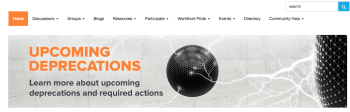
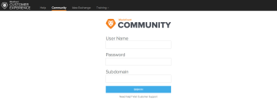

# De [!DNL Adobe Workfront] -community

De Adobe [!DNL Workfront] -community is een onlinegroep met meer dan 10.000 [!DNL Workfront] -gebruikers. Via de community kunt u up-to-date blijven op productreleases, informatie krijgen over klantgebeurtenissen en met andere gebruikers praten over [!DNL Workfront] -producten en -services. U zult antwoorden aan vragen vinden en verbindingen met andere [!DNL Workfront] klanten vestigen.

<!--

-->

## Aanmelden

* [Contactpersoon geautoriseerde ondersteuning](#authorized-support-contact)
* [Contact met niet-geautoriseerde ondersteuning zonder SSO-aanmelding](#non-authorized-support-contact-without-sso-login)
* [Contact met SSO-aanmelding voor niet-geautoriseerde ondersteuning](#non-authorized-support-contact-with-sso-login)

### Contactpersoon geautoriseerde ondersteuning {#authorized-support-contact}

Als u een geautoriseerde contactpersoon voor ondersteuning (ASC) bent, hebt u aanmeldingsgegevens voor de [!UICONTROL Help Desk] en [!UICONTROL Innovation Lab] . U kunt dezelfde gegevens gebruiken om u aan te melden bij de [!DNL Workfront] -community. In dit geval laat u het subdomein leeg.

### Contact met niet-geautoriseerde ondersteuning zonder SSO-aanmelding {#non-authorized-support-contact-without-sso-login}

Als u geen geautoriseerde contactpersoon voor ondersteuning bent, kunt u zich aanmelden met uw gewone referenties voor een [!DNL Workfront] -instantie. Gebruik hetzelfde subdomein als uw [!DNL Workfront] -instantie.

>[!NOTE]
>
>Deze optie werkt alleen als uw bedrijf SSO (Single Sign-On) niet gebruikt om zich aan te melden bij Workfront.

### Contact met SSO-aanmelding voor niet-geautoriseerde ondersteuning {#non-authorized-support-contact-with-sso-login}

Als uw bedrijf SSO gebruikt, moet u via telefoon contact opnemen met de [!DNL Workfront] Klantenondersteuning om een account aan te vragen. Als u geen ticket kunt verzenden of geen live chat kunt beginnen, neemt u contact op met uw geautoriseerde [!DNL Workfront] contactpersoon voor klantenondersteuning.

Als u uw wachtwoord voor de communautaire site niet meer onthoudt, kunt u contact opnemen met [!DNL Workfront Customer Support] .

## Veelgestelde vragen

* [Wat is mijn subdomein?](#what-s-my-subdomain)
* [Mijn gebruikersnaam of wachtwoord vergeten. Hoe kan ik mijn gebruikersnaam of wachtwoord opnieuw instellen?](#i-forgot-my-username-or-password-how-do-i-reset-my-username-or-password)

### Wat is de URL voor de [!DNL Workfront] community?

De [!DNL Workfront] Gemeenschap is beschikbaar op de [!DNL Adobe Experience League] website bij volgende URL: [[!DNL Workfront]  Gemeenschap &#x200B;](https://experienceleaguecommunities.adobe.com/t5/workfront/ct-p/workfront?profile.language=nl).

### Wat is mijn subdomein? {#what-s-my-subdomain}

Als u niet bekend bent met het subdomein, kunt u het gemakkelijk vinden. Als u in [!DNL Workfront] wordt geregistreerd, is uw subdomain het tekstkoord of het woord voorafgaand aan *.workfront.com* of *my.workfront.com* in URL. Bijvoorbeeld, als uw Workfront URL *appetite.workfront.com leest,* dan *trek* is uw subdomein. Zie markering C in het onderstaande diagram.

### Mijn gebruikersnaam of wachtwoord vergeten. Hoe kan ik mijn gebruikersnaam of wachtwoord opnieuw instellen? {#i-forgot-my-username-or-password-how-do-i-reset-my-username-or-password}

Als u uw gebruikersnaam of wachtwoord bent vergeten, neemt u contact op met de technische ondersteuning en een vertegenwoordiger om uw gegevens opnieuw in te stellen.
