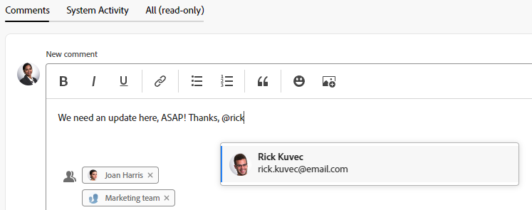

# Andere tags toepassen op updates

{{highlighted-preview}}

<!--take new commenting and legacy commenting out when we remove the legacy commenting and the new one is the only experience-->

<!--

The highlighted information on this page refers to functionality not yet generally available. It is available only in the Preview environment for all customers. After the monthly releases to Production, the same features are also available in the Production environment for customers who enabled fast releases.   
For information about fast releases, see [Enable or disable fast releases for your organization](../../administration-and-setup/set-up-workfront/configure-system-defaults/enable-fast-release-process.md)  

For information about the current release schedule, see [Fourth Quarter 2023 release overview](../../product-announcements/product-releases/23-q4-release-activity/23-q4-release-overview.md) 
-->

>[!IMPORTANT]
>
>De ervaring met opmerkingen wordt momenteel opnieuw ontworpen in Adobe Workfront.
>
>Afhankelijk van de objecten waarvoor u de opmerkingervaring opent, ziet u mogelijk de volgende functionaliteit voor de sectie Updates:
>* De nieuwe ervaring
>* De oudere ervaring
>* De nieuwe en oudere ervaring
>
>Ga voor meer informatie over de nieuwe opmerkingervaring en de beschikbaarheid ervan naar [Nieuwe ervaring met opmerkingen](../../product-announcements/betas/new-commenting-experience-beta/unified-commenting-experience.md).
>
>De nieuwe ervaring met opmerkingen is alleen beschikbaar voor de sectie Updates van Workfront-objecten. Deze ervaring is niet beschikbaar wanneer u de objecten vanuit de volgende gebieden opent:
>
> * Home
> * Samenvattingspaneel in lijsten
> * Samenvattingspaneel in tijdbladen
> * Het deelvenster Overzicht in het deelvenster Werklastverdeling
>
>De nieuwe ervaring met opmerkingen is beschikbaar in het deelvenster Samenvatting in lijsten, tijdbladen en werklastbalans in de voorvertoningsomgeving.<!--and in the Production environment for customers who have opted for the fast release process. For information about fast releases, see [Enable or disable fast releases for your organization](/help/quicksilver/administration-and-setup/set-up-workfront/configure-system-defaults/enable-fast-release-process.md). For information about the current release schedule, see [First Quarter 2024 release overview](/help/quicksilver/product-announcements/product-releases/24-q2-release-activity/24-q2-release-overview.md).-->

U kunt gebruikers tags toewijzen wanneer u een update uitvoert naar een object als u de aandacht wilt vestigen op een object dat ze anders wellicht niet volgen.

In plaats van deze gebruikers op het object te plaatsen door ze eraan toe te wijzen of door ze ertoe te brengen zich erop te abonneren, kunt u ze in de update labelen om het met hen te delen. Gelabelde gebruikers ontvangen een melding over de update die u invoert.

## Overwegingen over het coderen van gebruikers in updates

* Gebruikers die updates hebben gecodeerd, moeten een persoonlijke melding inschakelen in hun profiel om de e-mailmelding te ontvangen. Zie voor meer informatie [Uw eigen e-mailmeldingen wijzigen](../../workfront-basics/using-notifications/activate-or-deactivate-your-own-event-notifications.md).

  Voor informatie over het toevoegen van updates aan Workfront-objecten raadpleegt u [Werk bijwerken](../../workfront-basics/updating-work-items-and-viewing-updates/update-work.md).

* Wanneer een kwestie in een project of een taak wordt omgezet, worden de updates gekopieerd aan het nieuwe project of de taak, maar de geëtiketteerde gebruikers niet. Om het gesprek voort te zetten, moet u de deelnemers opnieuw etiketteren.

## Toegangsvereisten

U moet de volgende toegang hebben om de stappen in dit artikel uit te voeren:

<table style="table-layout:auto"> 
 <col> 
 </col> 
 <col> 
 </col> 
 <tbody> 
  <tr> 
   <td role="rowheader"><strong>Adobe Workfront-abonnement*</strong></td> 
   <td> 
Alle
 </td> 
  </tr> 
  <tr> 
   <td role="rowheader"><strong>Adobe Workfront-licentie*</strong></td> 
   <td> 
Vragen of hoger voor problemen en documenten; controleren of hoger voor alle andere objecten
 </td> 
  </tr> 
  <tr> 
   <td role="rowheader"><strong>Configuraties op toegangsniveau*</strong></td> 
   <td> 
Aanvrager of hoger voor uitgaven en documenten; revisor of hoger voor alle andere objecten
 
   
<b>OPMERKING</b>

Als u nog steeds geen toegang hebt, vraagt u de Workfront-beheerder of deze aanvullende beperkingen op uw toegangsniveau instelt. Voor informatie over hoe een beheerder van Workfront uw toegangsniveau kan wijzigen, zie <a href="../../administration-and-setup/add-users/configure-and-grant-access/create-modify-access-levels.md" class="MCXref xref">Aangepaste toegangsniveaus maken of wijzigen</a>.
 </td>
</tr> 
  <tr> 
   <td role="rowheader"><strong>Objectmachtigingen</strong></td> 
   <td> 
Toegang tot het object weergeven
 
Voor informatie over het aanvragen van aanvullende toegang raadpleegt u <a href="../../workfront-basics/grant-and-request-access-to-objects/request-access.md" class="MCXref xref">Toegang tot objecten aanvragen </a>.
 </td> 
  </tr> 
 </tbody> 
</table>

*Neem contact op met uw Workfront-beheerder om te weten te komen welk abonnement, licentietype of toegang u hebt.

## Andere tags toepassen op updates

Het labelen van anderen in een update is afhankelijk van de ervaring en het object dat u selecteert.

### Andere tags toepassen op updates in de nieuwe opmerkingervaring

U kunt op de volgende manieren tags toewijzen aan andere updates in de nieuwe opmerkingervaring:

* **Automatisch**: Wanneer een gebruiker een thread start, een opmerking toevoegt of een antwoord toevoegt, worden deze automatisch gelabeld en toegevoegd aan het gebied Tagpersonen of -teams van het opmerkingvak. <!--remove the tip below when the new commenting stream is the only stream and the legacy commenting is removed-->

  >[!TIP]
  >
  >Wanneer de draad in de erfenis het becommentariëren ervaring begint, worden de draaddeelnemers niet automatisch geëtiketteerd.

* **Handmatig**: Wanneer u handmatig een gebruiker toevoegt aan het gebied Tagpersonen van het opmerkingsvak.

U kunt ook gebruikers verwijderen die per ongeluk zijn gelabeld wanneer u een opmerking bewerkt of erop reageert.

1. Beginnen met het bijwerken van een tijdelijk item, zoals beschreven in [Werk bijwerken](../../workfront-basics/updating-work-items-and-viewing-updates/update-work.md). Als eigenaar van de opmerking wordt u automatisch gelabeld en toegevoegd aan het gebied Tagpersonen of -teams in het opmerkingvak.

   >[!TIP]
   >
   >De eigenaar van de opmerking kan zijn of haar eigen naam niet zien in het gebied Tagpersonen of -teams van het opmerkingvak.

1. In de **Tags toewijzen aan personen of teams** typt u de naam van de gebruiker of het team dat u wilt opnemen en klikt u op de naam wanneer deze wordt weergegeven in de vervolgkeuzelijst.

   of

   Typ het @-symbool in het dialoogvenster **Een opmerking schrijven** typt u de naam van de gebruiker of het team dat u in de update wilt opnemen en klikt u vervolgens op de naam wanneer deze wordt weergegeven in de vervolgkeuzelijst.

   >[!TIP]
   > 
   >Als u de juiste gebruiker wilt identificeren wanneer er gebruikers met vergelijkbare of identieke namen zijn, ziet u de avatar, de primaire rol van de gebruiker of hun e-mailadres.
   > 
   >Gebruikers moeten aan ten minste één taakrol zijn gekoppeld om deze te kunnen bekijken terwijl u ze in een update codeert.
   > 
   >De instelling Contactinfo weergeven moet zijn ingeschakeld op uw toegangsniveau zodat gebruikers de e-mails van gebruikers kunnen bekijken. Zie voor meer informatie [Toegang verlenen aan gebruikers](../../administration-and-setup/add-users/configure-and-grant-access/grant-access-other-users.md).

   

   

   

1. (Optioneel) Schakel de optie **Privé voor mijn bedrijf** in de rechterbenedenhoek van het updatevak. Hierdoor is de update alleen zichtbaar voor gebruikers in uw bedrijf. De **Privé voor mijn bedrijf** Deze optie is alleen beschikbaar wanneer een bedrijf is opgegeven in uw Workfront-profiel.

   >[!NOTE]
   >
   >* Deze optie toont slechts wanneer de gebruiker met een Bedrijf wordt geassocieerd.
   >* Gelabelde gebruikers buiten het bedrijf konden nog steeds een melding in de app of een e-mail ontvangen, ook al zullen ze de persoonlijke opmerkingen op het tabblad Updates niet zien. We raden u aan geen tags toe te wijzen aan externe gebruikers tijdens een update als u de gegevens niet met hen wilt delen.

1. (Optioneel) Herhaal stap 2 om meerdere gebruikers en teams toe te voegen. <!--insure this stays accurate-->

   >[!NOTE]
   >
   >Alle gebruikers en teamleden die in het veld &quot;Tagpersonen of -teams&quot; worden vermeld, ontvangen een melding in de app voor de update en ontvangen mogelijk een e-mail, afhankelijk van de configuratie van hun instellingen voor e-mailmeldingen. Gebruikers die zichzelf in een opmerking of antwoord labelen, ontvangen een melding voor die opmerking of reactie en kunnen hun naam als lid van de thread voor de rest van de thread zien, maar ontvangen geen andere melding tenzij ze zichzelf opnieuw labelen. Zie voor meer informatie [Uw eigen e-mailmeldingen wijzigen](../../workfront-basics/using-notifications/activate-or-deactivate-your-own-event-notifications.md) en [Gebeurtenismeldingen configureren voor iedereen in het systeem](../../administration-and-setup/manage-workfront/emails/configure-event-notifications-for-everyone-in-the-system.md).

1. Klikken **Verzenden**.\
   Aan gebruikers die zijn opgenomen in de update, wordt automatisch weergavemachtiging toegekend aan het object en deze gebruikers kunnen updates die aan het object zijn toegevoegd, weergeven en erop reageren.

   De namen van de getagde entiteiten worden naast hun avatars (maximaal twee entiteiten) weergegeven. Als er meerdere entiteiten zijn gelabeld, wordt de naam van de eerste entiteit weergegeven, plus het aantal extra entiteiten dat is gelabeld.

   

   Wanneer u in de opmerkingstekst bent gelabeld, wordt uw naam gemarkeerd in die opmerkingen.

   Voor informatie over de extra functionaliteit die beschikbaar is wanneer het bijwerken van een het werkpunt, zie [Werk bijwerken](../../workfront-basics/updating-work-items-and-viewing-updates/update-work.md).

1. (Optioneel) Klik op de knop **Meer** menu  in de rechterbovenhoek van de opmerking klikt u op **Bewerken**. Verwijder alle getagde gebruikers en klik vervolgens op **Verzenden**. U kunt een opmerking pas bewerken binnen 15 minuten nadat u deze hebt ingevoerd. U kunt alleen de opmerkingen bewerken die u hebt toegevoegd.

   >[!TIP]
   >
   >Wanneer u de ervaring van oudere opmerkingen gebruikt om opmerkingen en reacties toe te voegen, kunnen eigenaars van opmerkingen die niet specifiek zijn gecodeerd, niet handmatig worden verwijderd door personen die de nieuwe opmerkingervaring gebruiken.

### Andere tags toepassen op updates in de sectie Oudere updates

U kunt gebruikers handmatig labelen in de sectie Updates van oudere versies.

1. Beginnen met het bijwerken van een tijdelijk item, zoals beschreven in [Werk bijwerken](../../workfront-basics/updating-work-items-and-viewing-updates/update-work.md).
1. In de **Waarschuwen** typt u de naam van de gebruiker of het team dat u wilt opnemen en klikt u op de naam wanneer deze wordt weergegeven in de vervolgkeuzelijst.

   of

   Typ het @-symbool in het dialoogvenster **Een nieuwe update starten** typt u de naam van de gebruiker of het team dat u in de update wilt opnemen en klikt u vervolgens op de naam wanneer deze wordt weergegeven in de vervolgkeuzelijst.

   >[!TIP]
   >
   >Als u de juiste gebruiker wilt identificeren wanneer er gebruikers met vergelijkbare of identieke namen zijn, ziet u de avatar, de primaire rol van de gebruiker of hun e-mailadres.
   >
   >Gebruikers moeten aan ten minste één taakrol zijn gekoppeld om deze te kunnen bekijken terwijl u ze in een update codeert.
   >
   >De instelling Contactinfo weergeven moet zijn ingeschakeld op uw toegangsniveau zodat gebruikers de e-mails van gebruikers kunnen bekijken. Zie voor meer informatie [Toegang verlenen aan gebruikers](../../administration-and-setup/add-users/configure-and-grant-access/grant-access-other-users.md).

   

1. (Optioneel) Schakel de optie **Privé voor mijn bedrijf** in de rechterbenedenhoek van het updatevak. Hierdoor is de update alleen zichtbaar voor gebruikers in uw bedrijf. De **Privé voor mijn bedrijf** Deze optie is alleen beschikbaar wanneer een bedrijf is opgegeven in uw Workfront-profiel.

   >[!NOTE]
   >
   >Gelabelde gebruikers buiten het bedrijf konden nog steeds een melding in de app of een e-mail ontvangen, ook al zullen ze de persoonlijke opmerkingen op het tabblad Updates niet zien. We raden u aan geen tags toe te wijzen aan externe gebruikers tijdens een update als u de gegevens niet met hen wilt delen.

1. (Optioneel) Herhaal stap 2 om meerdere gebruikers en teams toe te voegen.

   >[!NOTE]
   >
   >Alle gebruikers en teamleden die in het veld Waarschuwen worden vermeld, ontvangen een melding in de app voor de update en ontvangen mogelijk een e-mail, afhankelijk van de configuratie van hun instellingen voor e-mailmeldingen. Gebruikers die zichzelf in een opmerking of antwoord labelen, ontvangen een melding voor die opmerking of reactie en kunnen hun naam voor de rest van de thread in het veld Waarschuwen weergeven, maar ontvangen geen andere melding tenzij ze zichzelf opnieuw labelen. Zie voor meer informatie [Uw eigen e-mailmeldingen wijzigen](../../workfront-basics/using-notifications/activate-or-deactivate-your-own-event-notifications.md) en [Gebeurtenismeldingen configureren voor iedereen in het systeem](../../administration-and-setup/manage-workfront/emails/configure-event-notifications-for-everyone-in-the-system.md).

1. Klikken **Bijwerken**.\
   Aan gebruikers die zijn opgenomen in de update, wordt automatisch weergavemachtiging toegekend aan het object en deze gebruikers kunnen updates die aan het object zijn toegevoegd, weergeven en erop reageren.

   U kunt zien wie in elk antwoord bij de bovenkant van de updatedraad is geëtiketteerd. Deze gebruikers ontvangen, samen met gebruikers die op het object zijn geabonneerd, een melding wanneer het object wordt bijgewerkt of geantwoord.

   

   Voor informatie over de extra functionaliteit die beschikbaar is wanneer het bijwerken van een het werkpunt, zie [Werk bijwerken](../../workfront-basics/updating-work-items-and-viewing-updates/update-work.md).

