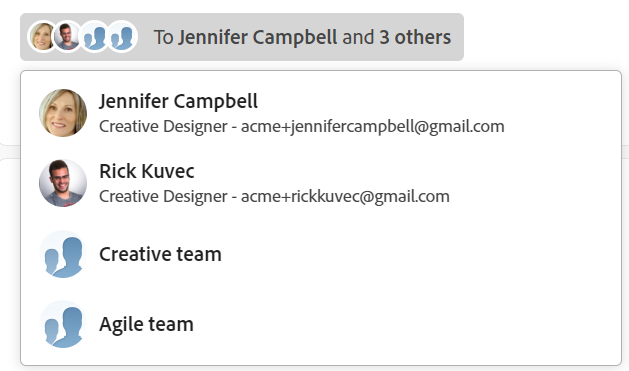
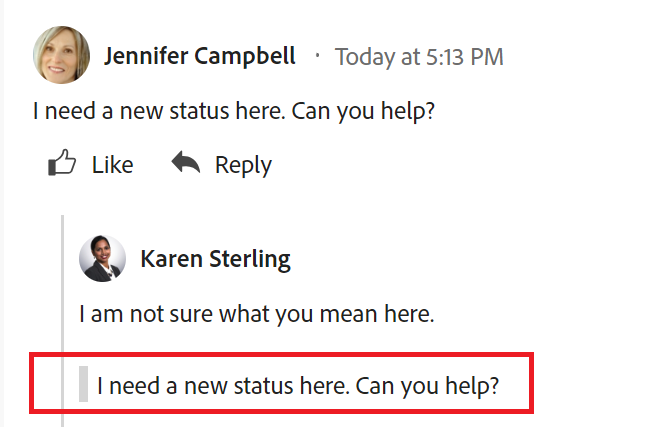

# Werk bijwerken

<!-- Audited: 4/2025 -->

<!--The highlighted information on this page refers to functionality not yet generally available. It is available only in the Preview environment for all customers. After the monthly releases to Production, the same features are also available in the Production environment for customers who enabled fast releases.    

For information about fast releases, see [Enable or disable fast releases for your organization](/help/quicksilver/administration-and-setup/set-up-workfront/configure-system-defaults/enable-fast-release-process.md). -->

<!--info for April 11: hide the "Important" box below-->

<!--
>[!IMPORTANT]
>
>We are currently redesigning the commenting experience in Adobe Workfront.
>
>Depending on what objects you access the commenting experience for, you might see the following functionality for the Updates section:
>* The new experience
>* The legacy experience
>* The new and the legacy experience
>
>For more information about the new commenting experience and its availability, see [New commenting experience](../../product-announcements/betas/new-commenting-experience-beta/unified-commenting-experience.md). 
>
>The legacy commenting experience has been removed from projects, tasks, issues, and documents in the Preview environment. 
>
>The new commenting experience is available only for the Updates section of Workfront objects, and it is not available when you access updates from the following areas:
>
> * Home
> * Summary panel in lists
> * Summary panel in timesheets 
> * Summary panel in the Workload Balancer
>
>The new commenting experience is available in the Summary panel in lists, timesheets, and the Workload Balancer in the Preview environment and in the Production environment for customers who have opted for the fast release process. 
-->

U kunt een update aan een Adobe Workfront-object toevoegen door er een opmerking aan toe te voegen om anderen te informeren over de status of de voortgang van het object, of om meer informatie of aanvullende bronnen te vragen.

Voor meer informatie over welke voorwerpen u updates aan in Workfront kunt toevoegen, zie [ overzicht van de sectie van de Update ](/help/quicksilver/workfront-basics/updating-work-items-and-viewing-updates/updates-tab-overview.md).

De informatie in dit artikel beschrijft hoe u op projecten, taken, en kwesties kunt commentaren. Gebruikers die zijn toegewezen aan of geabonneerd op het object, kunnen uw update weergeven. U kunt gebruikers ook labelen om de update onder de aandacht te brengen.

Het toevoegen van opmerkingen aan andere Workfront-objecten lijkt op het bijwerken van projecten, taken en problemen.

Zie ook de volgende artikelen voor meer informatie over opmerkingen over kaarten, doelen en records in Workfront Planning:

* [ beheer doelcommentaren in de Doelen van Adobe Workfront ](../../workfront-goals/goal-management/manage-goal-comments.md).

* [Een ad-hockaart aan een kaart toevoegen](/help/quicksilver/agile/get-started-with-boards/add-card-to-board.md)

* [Gekoppelde kaarten op borden gebruiken](/help/quicksilver/agile/get-started-with-boards/connected-cards.md)

* [Opnameopmerkingen beheren](/help/quicksilver/planning/records/manage-record-comments.md)

## Toegangsvereisten

+++ Breid uit om de toegangseisen voor de functionaliteit in dit artikel weer te geven.

<table style="table-layout:auto"> 
 <col> 
 </col> 
 <col> 
 </col> 
 <tbody> 
  <tr> 
   <td role="rowheader"><strong>Adobe Workfront-pakket</strong></td> 
   <td> 
Alle
 </td> 
  </tr> 
  <tr> 
   <td role="rowheader"><strong>Adobe Workfront-licentie</strong></td> 
   <td> 
Voor uitgaven en documenten:

<ul><li>
Medewerker of hoger
</li>
   <li>
Aanvraag of hoger
</li></ul>

Voor alle andere objecten:

   <ul><li>
Licht of hoger
</li>
   <li>
Controleren of hoger
</li></ul>

</td> 
  </tr> 
  <tr> 
   <td role="rowheader"><strong>Configuraties op toegangsniveau</strong></td> 
   <td> 
Toegang weergeven of bewerken voor het object waarop de update betrekking heeft
</td> 
  </tr> 
  <tr> 
   <td role="rowheader"><strong>Objectmachtigingen</strong></td> 
   <td> 
Toegang tot het object weergeven
</td> 
  </tr> 
 </tbody> 
</table>

Voor meer informatie, zie [ vereisten van de Toegang in de documentatie van Workfront ](/help/quicksilver/administration-and-setup/add-users/access-levels-and-object-permissions/access-level-requirements-in-documentation.md).

+++

<!--Old:
<table style="table-layout:auto"> 
 <col> 
 </col> 
 <col> 
 </col> 
 <tbody> 
  <tr> 
   <td role="rowheader"><strong>Adobe Workfront plan</strong></td> 
   <td> 
Any
 </td> 
  </tr> 
  <tr> 
   <td role="rowheader"><strong>Adobe Workfront license*</strong></td> 
   <td> 
   
New: Contributor or higher for issues and documents: Light or higher for all other objects

   
Current: Request or higher for issues and documents; Review or higher for all other objects

   </td> 
  </tr> 
  <tr> 
   <td role="rowheader"><strong>Access level configurations</strong></td> 
   <td> 
View or Edit access for the object the update is on
</td> 
  </tr> 
  <tr> 
   <td role="rowheader"><strong>Object permissions</strong></td> 
   <td> 
View access to the object
</td> 
  </tr> 
 </tbody> 
</table>
-->

## Overwegingen bij opmerkingen over objecten

* In de sectie Updates kunt u opmerkingen toevoegen aan de meeste objecten in Adobe Workfront. Voor meer informatie over welke voorwerpen de sectie van Updates tonen, zie [ het sectieoverzicht van Updates ](../updating-work-items-and-viewing-updates/updates-tab-overview.md).

* U kunt opmerkingen toevoegen aan Workfront-objecten vanuit andere toepassingen die zijn geïntegreerd met Workfront of vanuit de mobiele app Workfront.

  Niet alle toepassingen die zijn geïntegreerd met Workfront kunnen opmerkingen toevoegen aan Workfront-objecten.

  Niet alle functies die beschikbaar zijn in de sectie Updates van een object in Workfront zijn beschikbaar in andere toepassingen wanneer u Workfront-objecten opent vanuit de toepassing. Bijvoorbeeld, kunnen de Rich Text mogelijkheden of het maken van een commentaar privé aan het Bedrijf van iemand niet beschikbaar zijn wanneer het toevoegen van commentaren aan een voorwerp van Workfront van een derdetoepassing.

* U kunt tijdens het toevoegen van opmerkingen over het object communiceren over de voortgang van een Workfront-object (project, taak of uitgave). Gebruikers die zijn toegewezen aan of geabonneerd op het object, kunnen een melding over uw update ontvangen. Iedereen met View-toegang tot het object kan de update bekijken.

* U kunt gebruikers een tag toewijzen om hun aandacht te vestigen op de update. Gelabelde gebruikers ontvangen een melding in de app en een e-mail over uw update.

  >[!TIP]
  >
  >Eigenaars van opmerkingen worden automatisch gecodeerd. Voor meer informatie, zie [ Tags anderen op updates ](../../workfront-basics/updating-work-items-and-viewing-updates/tag-others-on-updates.md).

* U kunt een opmerking toevoegen aan een object dat u kunt weergeven of u kunt zich aanmelden als Workfront of groepsbeheerder en namens een andere gebruiker een opmerking toevoegen. Voor meer informatie, zie [ Login als een andere gebruiker ](../../administration-and-setup/add-users/create-and-manage-users/log-in-as-another-user.md).

* U kunt een update toevoegen aan projecten, taken en problemen in de volgende Workfront-regio&#39;s:

   * Vanuit een Workfront-object, in de sectie Updates (voor projecten, taken en problemen)
   * Vanuit het thuisgebied (voor taken en problemen)

     Voor informatie, zie [ uw werk met Mijn widget van het Werk ](/help/quicksilver/workfront-basics/using-home/using-the-home-area/my-work-widget.md) leiden.
   * Vanuit het deelvenster Samenvatting op de volgende gebieden (voor taken, problemen en documenten):

      * Een lijst met objecten
      * Een tijdschema
      * Startpagina
      * De werklastbalans

     Raadpleeg de volgende artikelen voor meer informatie:

      * [Overzicht van samenvattingen](/help/quicksilver/workfront-basics/the-new-workfront-experience/summary-overview.md)
      * [Werk de werkitems in de werklastbalans bij met de samenvatting](/help/quicksilver/resource-mgmt/workload-balancer/update-items-in-summary-panel-in-workload-balancer.md)

<!--info for April 11: hide the section below: add an update to a work item-->

<!--
## Add an update to a work item

Adding an update to a work item differs depending on what version of the Updates section you use.

You can add updates to the following objects: 

* Projects
* Tasks
* Issues
* Programs
* Portfolios
* Templates
* Template tasks
* Users
* Timesheets
* Teams
* Goals
* Cards in the Boards area
* Iterations
-->

<!--info for April 11: hide the section below completely:-->

<!--
### Add an update to a work item in the legacy Updates section

>[!IMPORTANT]
>
>The information on this page describes how you update projects, tasks, and issues.

1. Go to the work item for which you want to provide an update (such as a project, task, or issue).
1. Click the **Updates** section.
1. (Conditional) If it is enabled, click the **New commenting** option in the upper-right corner of the Updates section to disable it and enable the legacy commenting experience.
1. Click **Start a new update,** then type your update.  
1. (Optional) Use the options in the Rich Text toolbar to format your text, add emojis, links, or images to your update, to enhance your content. For more information, see the [Use Rich Text in a Workfront update](#use-rich-text-in-a-workfront-update) section in this article.
1. (Optional) Update any of the following information about the work item:

   <table style="table-layout:auto"> 
    <col> 
    <col> 
    <tbody> 
     <tr> 
      <td role="rowheader"><strong>Notify</strong></td> 
      <td>Identify users who must be notified of the update. Users assigned or subscribed to the object automatically receive notification when an update is made. 
For information about how to include others on an update, see <a href="../../workfront-basics/updating-work-items-and-viewing-updates/tag-others-on-updates.md" class="MCXref xref">Tag others on updates</a>.
</td> 
     </tr> 
     <tr> 
      <td role="rowheader"><strong>Commit Date</strong></td> 
      <td>In the date picker, select the date that you commit to complete the work item. For information about Commit Date, see <a href="../../manage-work/projects/updating-work-in-a-project/overview-of-commit-dates.md" class="MCXref xref">Commit Date overview</a>.</td> 
     </tr> 
     <tr> 
      <td role="rowheader"><strong>Condition</strong></td> 
      <td>Select a new condition for the task or issue. For information about selecting a condition, see <a href="../../manage-work/projects/updating-work-in-a-project/update-condition-for-tasks-and-issues.md" class="MCXref xref">Update Condition for tasks and issues</a>.</td> 
     </tr> 
     <tr> 
      <td role="rowheader"><strong>Status</strong></td> 
      <td>Click the arrow beside the current status, then select the desired status from the drop-down menu. For information about setting a Status, see <a href="../../manage-work/projects/updating-work-in-a-project/update-task-status.md" class="MCXref xref">Update task status</a>.
Updating the status of a work item does not automatically change the status of a project. Depending on how your project is set up, you might make updates to the project status separately. For more information on the various project update types, see <a href="../../manage-work/projects/manage-projects/select-project-update-type.md" class="MCXref xref">Select the project Update Type </a>.

<b>NOTE</b>
      
      You cannot change the status of a work item while it is in a Pending Approval status.
</td> 
     </tr> 
     <tr> 
      <td role="rowheader"><strong>Completion Bar</strong></td> 
      <td>(Only available on tasks) Indicate the percentage of work completed by sliding the progress bar to the desired percentage. You can also double-click the completion bar and enter the percent complete.</td> 
     </tr> 
     <tr> 
      <td role="rowheader"><strong>Private to my company</strong></td> 
      <td> 
Disable this option to prevent users outside your company from having access to view this update.
 
      
<b>NOTE</b>

      
This option displays only when the user is associated with a Company.

      
This option is not available in all areas where you can add updates from. For example, this is not available in third-party applications where you can add updates from. 

      </td> 
     </tr> 
    </tbody> 
   </table>

1. Click **Update** to add the update to the Workfront object.

   >[!NOTE]
   >
   >A small pop-up window will appear for seven seconds after clicking **Update**, allowing you to undo the update and return to the editing pane before the update is posted. The update is posted if you dismiss the undo pop-up, wait for it to disappear, or navigate away from the page. 
   >
   >If your Workfront administrator selects the "Never allow users to delete comments" setting in your access level, you cannot undo a comment. For more information, see [Create and modify custom access levels](../../administration-and-setup/add-users/configure-and-grant-access/create-modify-access-levels.md).

1. To reply to an update, see [Reply to updates](../../workfront-basics/updating-work-items-and-viewing-updates/reply-to-updates.md).
-->

<!--info for April 11: reword the title of this section to: "Add an update to a work item"; take out the step that says you need to enable the "New commenting" toggle (I think it is step 3??)-->

## Een opmerking toevoegen aan een tijdelijk item

In dit artikel wordt beschreven hoe u projecten, taken of problemen kunt bijwerken. Het bijwerken van de meeste andere objecten is vergelijkbaar.

1. Zoek het object waaraan u een opmerking wilt toevoegen en klik op de naam van het object om de objectpagina te openen.
1. Klik **Updates** in het linkerpaneel.
Het **lusje van Commentaren** wordt geselecteerd door gebrek.

1. Begin een commentaar in de **Nieuwe commentaardoos** in te gaan.

   

   >[!TIP]
   >
   >Als u weg navigeert uit de sectie Updates voordat u klaar bent met het typen en verzenden van een opmerking, wordt de opmerking op de pagina in de conceptmodus bewaard, zelfs nadat u zich hebt afgemeld en u weer hebt aangemeld. Afbeeldingen die aan de opmerking worden toegevoegd, worden ook in het concept opgeslagen. Concepten worden 7 dagen bewaard waarna ze worden verwijderd en kunnen niet worden hersteld. Getekende opmerkingen zijn alleen zichtbaar voor de gebruiker die ze invoert.

1. (Optioneel) Als u een wijziging ongedaan wilt maken of opnieuw wilt uitvoeren, gebruikt u de volgende sneltoetsen:
   * CTRL + Z (⌘ + z voor Mac) om een wijziging ongedaan te maken
   * CTRL + Y (⌘ + y voor Mac) om een wijziging opnieuw uit te voeren

1. (Facultatief) in het **mensen of de teams van de Markering** gebied, begin de naam of e-mail van een gebruiker, of een team te typen dat u in deze commentaar zou willen omvatten, of het te selecteren wanneer het in de lijst toont.
1. (Optioneel) Gebruik de opties op de werkbalk RTF om de tekst op te maken, emoties, koppelingen of afbeeldingen aan de update toe te voegen om de inhoud te verbeteren. Voor meer informatie, zie de [ Rijke Tekst van het Gebruik in een update van Workfront ](#use-rich-text-in-a-workfront-update) sectie in dit artikel.

   >[!TIP]
   >
   >Als een andere gebruiker een opmerking verzendt naar hetzelfde item dat u bijwerkt, wordt er een rode lijn weergegeven met de indicator &quot;Nieuw&quot; om u op de hoogte te brengen van de nieuwere opmerkingen.
   >
   >De indicator wordt alleen weergegeven nadat de opmerking op het item is verzonden, en niet wanneer de opmerking nog steeds wordt samengesteld.
   >
   >De indicator &quot;Nieuw&quot;toont slechts wanneer zowel de gebruiker die een nieuwe update inging als de gebruiker die momenteel een update ingaat de nieuwe opmerkingervaring gebruikt.
   >

1. Klik **voorleggen** om de update aan het voorwerp van Workfront toe te voegen.
1. (Facultatief) om een commentaar uit te geven, klik **Meer** menu  in de hoger-juiste hoek van de commentaar, dan klik **uitgeven**.

   >[!IMPORTANT]
   >
   >Je kunt je opmerking alleen binnen 15 minuten bewerken nadat je deze hebt verzonden.

1. Bewerk de informatie in de opmerking, voeg afbeeldingen toe of verwijder afbeeldingen of verwijder een van de getagde gebruikers. Een indicator &quot;Bewerkt&quot; wordt toegevoegd links van de datumstempel die wordt weergegeven wanneer de opmerking is ingevoerd.

   >[!TIP]
   >
   >Opmerkingen van het lopende jaar worden niet in het datumstempel weergegeven. Als u de muis boven een tijdstempel houdt, wordt de volledige datum weergegeven, inclusief het jaar.

   

   >[!TIP]
   >
   >* Er wordt een e-mail gegenereerd om gebruikers alleen van uw update op de hoogte te stellen wanneer u de oorspronkelijke update verzendt. Er wordt geen e-mail gegenereerd nadat u de update hebt bewerkt.
   >* De datumstempel naast de opmerking is de datum van de oorspronkelijke opmerking en niet de datum van de laatste bewerking.
   >* Wanneer u een opmerking toevoegt namens een andere gebruiker (wanneer u zich aanmeldt als een andere gebruiker als Workfront of groepsbeheerder), kunt u de opmerking niet bewerken als u bent aangemeld als de andere gebruiker. U kunt de opmerking alleen bewerken nadat u zich hebt afgemeld als de gebruiker en u weer hebt aangemeld.

1. (Facultatief) klik **Reageren** of beginnen een commentaar in **te typen toevoegt antwoord...** gebied, om op een bestaande commentaar te antwoorden, dan stappen 3-7 hierboven te volgen. <!--(**************insure this stays accurate***********)--> voor informatie over het antwoorden op een update, zie [ Antwoord op updates ](../../workfront-basics/updating-work-items-and-viewing-updates/reply-to-updates.md).

1. (Voorwaardelijk en facultatief) als andere gebruikers commentaren hebben toegevoegd die buiten het zichtbare gebied in de sectie van Updates tonen terwijl u uw commentaren toevoegde, **Mening** binnen de blauwe **nieuwe commentaarbanner** bij de bodem van het scherm klikken om deze commentaren te tonen.

   

   Aanvullende opmerkingen worden onder in het scherm weergegeven.

1. (Facultatief) klik **als** pictogram . Het pictogram wordt bijgewerkt met het aantal ‘like’.
1. (Voorwaardelijk en optioneel) Als u extra personen hebt toegevoegd aan uw opmerking, klikt u op het aantal leden dat is opgenomen in de update om een lijst weer te geven met entiteiten waarmee de opmerking die u hebt ingevoerd, wordt gedeeld.

   

   >[!TIP]
   >
   >De namen van de eerste twee getagde entiteiten worden naast hun avatars weergegeven. Als meer dan twee entiteiten zijn gelabeld, worden alleen de naam van de eerste entiteit en het aantal andere entiteiten weergegeven.

1. (Optioneel) Klik op de naam van een opmerking om de naam, de rol en het e-mailadres van de persoon of persoon weer te geven in een informatievak. Klik nogmaals op de naam van de opmerking in het informatievak om het gebruikersprofiel te openen.
1. (Facultatief) klik het **lusje van de Activiteit van het Systeem** om updates te bekijken die door het systeem worden geregistreerd. Wanneer het object of een van de onderliggende items wordt bijgewerkt, genereert Workfront een notitie over die update en geeft deze weer op het tabblad Systeemactiviteit.

   Voor meer informatie, zie [ het sectieoverzicht van Updates ](../updating-work-items-and-viewing-updates/updates-tab-overview.md).

   >[!TIP]
   >
   >U kunt geen opmerking toevoegen aan een systeemupdate. Nochtans, werden om het even welke antwoorden die aan de verslagen van de systeemactiviteit in de erfenis het becommentariëren ervaring werden gemaakt toegevoegd aan het lusje van de Activiteit van het Systeem als read-only. De ervaringen met opmerkingen uit het verleden zijn op 11 april 2024 uit Workfront verwijderd.

1. (Facultatief) klik het **Al** lusje om zowel gebruikerscommentaren als de commentaren van de systeemactiviteit in één plaats te bekijken. Dit is een alleen-weergeven tabblad.

   >[!TIP]
   >
   >U kunt niet reageren op opmerkingen of andere gebruikers tags toewijzen aan bestaande opmerkingen op het tabblad Alles. Om op een commentaar op het Al lusje te antwoorden, klik **Reageren in Commentaren** om de commentaar in de Commentaren tabel te openen.

## RTF-commentaar gebruiken in een Workfront-commentaar{#use-rich-text-in-a-workfront-comment}

U kunt uw commentaren verbeteren door RTF te gebruiken, of diverse punten toe te voegen aan het, zoals emojis, verbindingen, of beelden.

1. Ga naar het **gebied van Updates** van een voorwerp van Workfront, open het **3} lusje van Commentaren {en begin een commentaar te typen.**
1. (Facultatief) om Rich Tekst het formatteren aan uw commentaar toe te voegen, gebruik om het even welke attributen op de **Rich Text** toolbar aangezien u typt.

   

   | **Attribuut** | **Toolbar knoop** | **de kortere wegsleutels van Mac** | **de kortere wegsleutels van Vensters** |
   |---|---|---|---|
   | Vet |  | ⌘+b | Ctrl+B |
   | Cursief |  | ⌘+i | Ctrl+I |
   | Onderstrepen |  | ⌘+u | Ctrl+U |
   | Hyperlink |  |   om de Add doos van verbindingen te openen: ⌘ + K     om een verbinding over de geselecteerde tekst te kleven: ⌘+V   |   om Add de doos van verbindingen te openen: Ctrl+K     om een verbinding over de geselecteerde tekst te kleven: Ctrl+V   |
   | Lijst met opsommingstekens |  | ⌘+Shift+8 | Ctrl+Shift+8 |
   | Genummerde lijst |  | ⌘+Shift+7 | Ctrl+Shift+7 |

   <!--| Block Quote | |⌘+Shift+9 | Ctrl+Shift+9   This is not available in the new commenting experience.   |-->

   <!--remove the last row when we remove legacy from the system-->

   Ophouden formatterend tekst, schrap de attributen op de **Rijke toolbar van de Tekst**.

   <!-- in the table above: take "Create Links" verbiage from the hyperlink when the old commenting is removed and the commenting beta is the only way to comment - with October 2023-->

   >[!NOTE]
   >
   >* Opmaak wordt ook weergegeven in e-mailberichten die gebruikers ontvangen met uw update.
   >* Opmaak van RTF-gegevens die wordt toegepast op een update in een e-mailbericht, wordt niet weergegeven in de update wanneer deze wordt weergegeven op het tabblad Updates.
   >* Als uw organisatie Workfront met Internet Explorer gebruikt, verliest alle opgemaakte tekst die in een update wordt geplakt zijn RTF-opmaak en wordt deze als onbewerkte tekst weergegeven. U kunt de tekst opnieuw opmaken met de kenmerken op de werkbalk RTF.
   >* Opmaak van RTF-tekst is niet beschikbaar voor updates die worden uitgevoerd in het gedeelte Timesheets of voor notitie- en laatste-voorwaardenobjecten die worden weergegeven in een rapport.

   <!--1. (Optional and conditional) If you want to include text from previous updates or from other sources and distinguish it from your own update, you can mark it as a Block Quote. Click the **Block Quote** icon  and type the text you want to quote. The quoted text displays marked with a vertical gray line. Click the **Block Quote** icon again to return to normal formatting. This is not available in the new commenting experience.-->

   <!--remove this picture below and the bullet above when we remove legacy-->

   <!---->

1. (Facultatief) klik het **pictogram Moji** pictogram Emoji 

   >[!NOTE]
   >
   >* Workfront vervangt leestekens zoals :) niet door emojis.
   >* Emojis is niet beschikbaar voor de voorwerpen van de Nota en van de Laatste Voorwaarde die in een rapport worden bekeken.
   >* De functie emoji in Workfront gebruikt Unicode-tekens en wordt als zodanig alleen weergegeven in browsers en besturingssystemen die Unicode-codepunten ondersteunen. Gebruikers van een ander platform, browser of besturingssysteem hebben mogelijk geen toegang tot hetzelfde domein.
   >* Een niet-ondersteunde emoji wordt weergegeven door een zwarte of witte doos.
   >* Windows 7 biedt alleen ondersteuning voor zwart-witafbeeldingen.
   >* Mojs die worden toegepast op een update die via e-mail wordt uitgevoerd, worden niet weergegeven in de update wanneer deze wordt weergegeven in het gedeelte Updates.

1. (Optioneel) Een URL-koppeling toevoegen aan extra informatiebronnen:

   1. Klik in de update op de plaats waar u een koppeling wilt invoegen.
   1. Op de **Rijke toolbar van de Tekst**, klik het **pictogram van de Hyperlink** .

   1. In **creeer de doos van de Verbinding**, onder **URL**, type of kleef URL van de bron waaraan u wilt verbinden.

   1. Onder **Tekst om** te tonen, typ of kleef de verbindingstekst.
   1. Klik **sparen**.

1. (Optioneel) Koppel een afbeelding aan een update.

   >[!WARNING]
   >
   >U kunt geen afbeelding aan het updategebied van de volgende objecten koppelen:
   >
   >* Doelen
   >* Ad-hockaarten op borden
   >* Records in Workfront Planning. Voor informatie, zie [ begonnen worden met de Planning van Adobe Workfront ](/help/quicksilver/planning/general/planning-overview.md)
   >

   Voer een van de volgende handelingen uit om een afbeelding aan de update toe te voegen:

   * Sla de afbeelding op onze computer op en sleep deze naar het gebied Nieuwe opmerking.
   * Kopieer een schermafbeelding van uw computer en plak deze vervolgens in de opmerking.
   * Klik **toevoegen beeld** pictogram  en doorblader aan het beeld op uw computer.

   >[!IMPORTANT]
   >
   >
   >* U kunt geen afbeeldingen toevoegen aan doelen of ad-hockaarten op borden.
   >
   >* Uw Workfront-beheerder moet het toevoegen van afbeeldingen inschakelen in het gedeelte Voorkeuren voor feeds bijwerken van het gebied Workfront Interface voordat u de pictogrammen Afbeelding of Bijlage toevoegen kunt zien. Voor informatie, zie [ voorkeur voor gebruikersupdates ](../../administration-and-setup/set-up-workfront/system-tracked-update-feeds/configure-preferences-user-updates.md) vormen.
   >* De maximale bestandsgrootte voor afbeeldingen is 7 MB. Ondersteunde bestandstypen zijn .jpg, .gif en .png.
   >* Afbeeldingen zijn toegankelijk vanuit de sectie Updates van een object en zijn ook beschikbaar in het gebied Documenten onder het hoofdmenu.
   >U kunt een schermafbeelding van uw computer kopiëren met behulp van een toetsenbordcombinatie, of bijvoorbeeld de functie Scherm afdrukken (op Windows-computers).
   >* U kunt het beeld door in de nieuwe commentaar met de rechtermuisknop aan te klikken dan **Deeg**, of door CTRL + V voor Vensters (of ⌘ + V voor Mac) op uw toetsenbord te drukken.
   >* U kunt een update verzenden met een afbeelding en geen tekst.
   >* Wanneer u een opmerking verwijdert die een afbeelding bevat, wordt de afbeelding verwijderd uit de sectie Updates en uit het gebied Documenten. De afbeelding wordt ook verwijderd uit het gebied Documenten wanneer u een opmerking bewerkt en de afbeelding verwijdert.
   >* Wanneer iemand een afbeelding verwijdert die is gekoppeld aan een opmerking in het gebied Documenten, wordt deze ook uit de opmerking verwijderd.

   <!--remove the statement above about legacy, when we remove the legacy environment.-->

1. (Optioneel) Voer een van de volgende handelingen uit om een afbeelding weer te geven in de bestaande update:

   * Klik het **pictogram van de Voorproef** pictogram van de  op de beeldduimnagel om het volledig-groottebeeld in een nieuwe browser tabel te openen.
   * Klik het **pictogram van de Download** download  {om het beeld te downloaden.

1. Klik **voorleggen** om uw commentaar toe te voegen.

## Zoeken naar een update

U kunt een opmerking of antwoord zoeken in de sectie Updates van een object.

1. Ga naar de **sectie van Updates** van een voorwerp.
1. Begin het typen van een sleutelwoord <!--or a user's name --> in het **vakje van het Onderzoek** in de hoger-juiste hoek van **Commentaren** tabel.

   <!--Add this tip or note instead of the note below - when it'll be possible: You can search for users who have been tagged or for comment owners.-->

   >[!NOTE]
   >
   >U kunt alleen zoeken naar woorden die bij de tekst van een opmerking of antwoord horen. U kunt niet zoeken naar namen van gebruikers of teams die in een update zijn getagd.

   

   Het trefwoord <!--or user--> waarnaar u hebt gezocht, wordt gemarkeerd en de opmerkingen waarin het trefwoord staat, worden boven in de sectie Updates weergegeven.

   Workfront zoekt naar de volledige updatestream van het object, buiten de opmerkingen die op het scherm zichtbaar zijn.

1. Klik het **x** pictogram op het onderzoeksgebied om de onderzoeksresultaten te ontruimen en op alle commentaren terug te keren.

<!-- when we release search to production, check above and make sure you don't have to add that the users tagged/ owners are also searchable-->

## Opmerkingen kopiëren

U kunt een opmerking op verschillende manieren kopiëren.

U kunt een koppeling naar de opmerking kopiëren of de inhoud van de opmerking kopiëren en deze gebruiken in een nieuwe update.

<!--Copying an update differs depending on which commenting experience you use.-->

<!--info for April 11: take the sentence above out and reword the section title below to: Copy an update-->

### Een opmerking kopiëren

U kunt informatie uit een bestaande opmerking kopiëren door een van de volgende handelingen uit te voeren:

* [Offerteantwoord](#quote-reply)
* [Koppeling kopiëren](#copy-link)
* [Platte tekst kopiëren](#copy-body-text)

#### Offerteantwoord

Met de antwoordoptie Citaat kopieert u de oorspronkelijke opmerking naar een nieuw antwoord als een blokcitaat.

1. Ga naar de opmerking of het antwoord dat u wilt kopiëren.
1. Klik het **Meer** menu, dan klik **antwoord van het Citaat**.

   Er wordt een nieuw opmerkingsvak geopend en het geciteerde antwoord wordt opgenomen in de nieuwe opmerking en gemarkeerd als een blokcitaat.

   

1. Ga verder toevoegend uw update en klik **voorleggen** om de commentaar toe te voegen.

#### Koppeling naar opmerking kopiëren

Met de koppelingsoptie Kopiëren kopieert u de opmerking of de koppeling naar het klembord, zodat u de opmerking of de volledige verbinding met andere gebruikers kunt delen.

1. Ga naar de opmerking waarvan u de koppeling wilt kopiëren.

1. Klik het **Meer** menu, dan klik **verbinding van het Exemplaar**.

1. Plak de koppeling die u in de vorige stap hebt gekopieerd in een e-mail of een andere toepassing om deze met anderen te delen. Met de gedeelde koppeling wordt de opmerking geopend waaruit u de koppeling hebt gedeeld.

   >[!TIP]
   >
   >Wanneer u de verbinding van een gesprek over een kindvoorwerp van een hoger-rangschikkend voorwerp deelt, opent de verbinding de draad in het hoger-rangschikkende gebied van de Updates van objecten.
   >
   >Bijvoorbeeld, als u de verbinding van een taakcommentaar van het gebied van Updates van het project kopieert, opent de commentaar de projectpagina.

#### Platte tekst kopiëren

Met de tekstoptie Kopiëren kopieert u de tekst van een bepaalde opmerking naar het klembord.

1. Ga naar de opmerking of het antwoord dat u wilt kopiëren.
1. Klik het **Meer** menu, dan klik **lichaamstekst van het Exemplaar**.

<!--info for April 11: hide the entire section below - notice that there are several sub-sub sections below this main section - hide them all, all the way up to "Delete an update"-->

<!--
### Copy an update in the legacy commenting experience

* [Copy the update](#copy-the-update) 
* [Copy the thread link](#copy-the-thread-link) 
* [Copy the update link](#copy-the-update-link)
* [Quote Reply](#quote-reply)

   >[!TIP]
   >
   >When you copy and share the link of a conversation on a child object from a higher-ranking object, the link opens the thread in the child object's Updates area. 
   >
   >For example, if you copy the link of a task comment from the project's Updates area, the comment opens the task page.

#### Copy the update {#copy-the-update}

This option copies the text from a specific update to the clipboard.

1. Go to the update or reply you want to copy.
1. Click the **More** menu, then click **Copy body text**.

   

#### Copy the thread link {#copy-the-thread-link}

This option copies the full thread link to the clipboard so you can share the thread with other users.

1. Go to the update thread you want to copy.

1. Click the **More** menu, then click **Copy thread link**.

    

1. Paste the link you copied in the previous step in an email or another application to share it with others. The shared link opens the comment you shared the link from. 

#### Copy the update link {#copy-the-update-link}

This option copies a specific update link to the clipboard. When you share the update link, the user who follows it sees a border around the update.

1. Go to the update or reply you want to copy.
1. Click the **More** menu next to the individual update, then click **Copy update link**.

   

1. Paste the link you copied in the previous step in an email or another application to share it with others. The shared link opens the comment you shared the link from. 

#### Quote Reply  

The Quote Reply option copies the original comment to a new reply as a block quote. 

1. Go to the update or reply you want to copy.
1. Click the **More** menu, then click **Quote Reply**.

   A new comment box opens and the quoted reply is included in the new comment and marked as a block quote.

1. Continue adding your update and click **Reply** to add the comment.
-->

## Een opmerking of antwoord verwijderen

Afhankelijk van de toegang die uw Workfront-beheerder u biedt, kunt u mogelijk opmerkingen verwijderen die u hebt toegevoegd in de sectie Updates van een object.

Voor meer informatie, zie [ tot douanetoegangsniveaus ](../../administration-and-setup/add-users/configure-and-grant-access/create-modify-access-levels.md#creating-a-new-access-from-scratch) in het artikel [ leiden of wijzigen tot douanetoegangsniveaus ](../../administration-and-setup/add-users/configure-and-grant-access/create-modify-access-levels.md).

Geen enkele Workfront-gebruiker (inclusief de Workfront-beheerder) kan updates van een andere gebruiker verwijderen. Nochtans, als het de toegangsniveau van een gebruiker hen toestaat om hun eigen updates te schrappen, kan de beheerder van Workfront login als die gebruiker en schrapt updates zij aanbrachten. Voor meer informatie, zie [ tot douanetoegangsniveaus ](../../administration-and-setup/add-users/configure-and-grant-access/create-modify-access-levels.md#creating-a-new-access-from-scratch) leiden of wijzigen en [ login als een andere gebruiker ](../../administration-and-setup/add-users/create-and-manage-users/log-in-as-another-user.md).

1. Ga naar de opmerking of het antwoord dat u wilt verwijderen.
1. Klik het **Meer** menu naast de commentaar of het antwoord u wenst om te schrappen, dan **Schrapping** te klikken.

   

1. In het bericht dat verschijnt, klik **Schrapping**.

   >[!NOTE]
   >
   >Als u een update met een bijgevoegde afbeelding verwijdert, worden zowel de opmerking als de afbeelding verwijderd. Voor meer informatie, zie de [ Rijke Tekst van het Gebruik in een update van Workfront ](#use-rich-text-in-a-workfront-update) sectie in dit artikel.

   Wanneer aan de opmerking die u verwijdert, reacties zijn gekoppeld, wordt aangegeven dat de opmerking is verwijderd met de naam van de gebruiker die de opmerking heeft verwijderd.

   

   Verwijderde opmerkingen worden direct uit Workfront verwijderd. Een gebruiker die de sectie van Updates gebruikt ziet een commentaar dat door een andere gebruiker in echt - tijd wordt geschrapt.

## Systeemupdates controleren

In de sectie Updates van een Workfront-object worden twee soorten gegevens weergegeven:

* **de updates van de Gebruiker:** de updates van de Gebruiker zijn commentaren die u en andere gebruikers in uw systeem ingaan. De gebruikersupdates worden weergegeven in de tabbladen Opmerkingen en Alle van de sectie Updates.

  

* **de updates van het Systeem:** de updates van het Systeem verwijderen taken of kwesties, toevoegend of schrappend documentversies, vastmakend of verwijderend een goedkeuringsverzoek, evenals om het even welke uitgeeft of veranderingen die aan het voorwerp worden aangebracht. De updates van het systeem tonen in de Activiteit van het Systeem en de Alle lusjes van de sectie van Updates.

  

  De beheerders van Workfront kunnen bepalen wat in systeemupdates wordt gevolgd, zoals die in [ systeem-geleide updates ](../../administration-and-setup/set-up-workfront/system-tracked-update-feeds/system-tracked-update-feeds.md) wordt verklaard. U kunt ook systeemupdates of -activiteiten uitfilteren, zodat alleen gebruikersupdates voor alle objecten worden weergegeven.

  De volgende objecten hebben geen door het systeem gegenereerde updates:

   * Team
   * Sjabloon
   * Sjabloontaak
   * Ad-hockaart op een kaart

Voor meer informatie over gebruiker en systeemupdates en hoe zij in de sectie van Updates van de voorwerpen van Workfront tonen, zie [ het sectieoverzicht van Updates ](../updating-work-items-and-viewing-updates/updates-tab-overview.md).

<!--
After the monthly releases to Production, the same features are also available in the Production environment for customers who enabled fast releases.   
For information about fast releases, see [Enable or disable fast releases for your organization](../../administration-and-setup/set-up-workfront/configure-system-defaults/enable-fast-release-process.md)  
-->

<!-- with October 26 release: add somewhere this, and decide where we need to keep information about the legacy commenting. Should we create an article about iterations comments like we have for goals and cards?!:

>[!NOTE]
>
>Iterations display the legacy commenting experience.-->

<!--old message, before Auhust 17: 

>[!NOTE]
>
>We are currently redesigning the commenting experience in Adobe Workfront.
>
>For more information about the new commenting experience, see [New commenting experience](../../product-announcements/betas/new-commenting-experience-beta/unified-commenting-experience.md). 
>
>You can access the new experience for the following objects:
> * Issues, projects, tasks, and documents.
>
>     This is available when you enable the commenting Beta experience.
>
>     This functionality is available only for the Updates section, and it is not available for the following areas:
>
>     * Home
>     * Summary panel in lists
>     * Summary panel in timesheets
>
> * Goals, cards in the Boards area
>
>   The new commenting experience is the only experience for goals and cards. You must have an additional license to access Workfront Goals. For more information, see [Requirements to use Workfront Goals](../../workfront-goals/goal-management/access-needed-for-wf-goals.md). 
>
>     You can add and view updates to cards in the Boards area when you enable the Comments and System Activity sections on a card. For more information, see [Add an ad hoc card to a board](../../agile/get-started-with-boards/add-card-to-board.md).
-->
