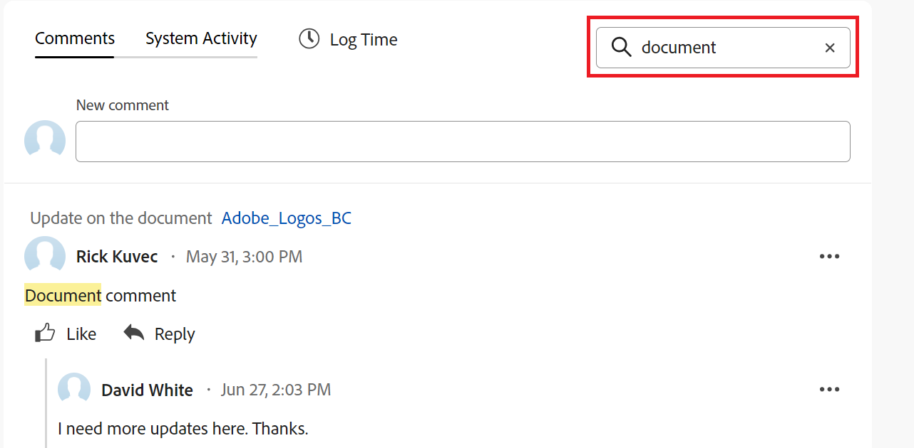

# Werk bijwerken

{{highlighted-preview}}

<!-- Audited: 1/2024 -->

<!--take "legacy" and "new commenting" references out when we remove the legacy - April 2024???-->

<!--The highlighted information on this page refers to functionality not yet generally available. It is available only in the Preview environment for all customers. 

For information about the current release schedule, see [First Quarter 2024 release overview](../../product-announcements/product-releases/24-q1-release-activity/24-q1-release-overview.md). -->

<!--
After the monthly releases to Production, the same features are also available in the Production environment for customers who enabled fast releases.   
For information about fast releases, see [Enable or disable fast releases for your organization](../../administration-and-setup/set-up-workfront/configure-system-defaults/enable-fast-release-process.md)  
-->

>[!IMPORTANT]
>
>De ervaring met opmerkingen wordt momenteel opnieuw ontworpen in Adobe Workfront.
>
>Afhankelijk van de objecten waarvoor u de opmerkingervaring opent, ziet u mogelijk de volgende functionaliteit voor de sectie Updates:
>* De nieuwe ervaring
>* De oudere ervaring
>* De nieuwe en oudere ervaring
>
>Ga voor meer informatie over de nieuwe opmerkingervaring en de beschikbaarheid ervan naar [Nieuwe ervaring met opmerkingen](../../product-announcements/betas/new-commenting-experience-beta/unified-commenting-experience.md).
>
>De nieuwe ervaring met opmerkingen is alleen beschikbaar voor de sectie Updates van Workfront-objecten. Deze ervaring is niet beschikbaar wanneer u updates opent vanuit de volgende gebieden:
>
> * Home
> * Samenvattingspaneel in lijsten
> * Samenvattingspaneel in tijdbladen
> * Het deelvenster Overzicht in het deelvenster Werklastverdeling
>
>De nieuwe ervaring met opmerkingen is beschikbaar in het deelvenster Samenvatting in lijsten, tijdbladen en werklastbalans in de voorvertoningsomgeving.

<!-- with October 26 release: add somewhere this, and decide where we need to keep information about the legacy commenting. Should we create an article about iterations comments like we have for goals and cards?!:

>[!NOTE]
>
>Iterations display the legacy commenting experience.-->

<!--old message, before Auhust 17: 

>[!NOTE]
>
>We are currently redesigning the commenting experience in Adobe Workfront.
>
>For more information about the new commenting experience, see [New commenting experience](../../product-announcements/betas/new-commenting-experience-beta/unified-commenting-experience.md). 
>
>You can access the new experience for the following objects:
> * Issues, projects, tasks, and documents.
>
>     This is available when you enable the commenting Beta experience.
>
>     This functionality is available only for the Updates section, and it is not available for the following areas:
>
>     * Home
>     * Summary panel in lists
>     * Summary panel in timesheets
>
> * Goals, cards in the Boards area
>
>   The new commenting experience is the only experience for goals and cards. You must have an additional license to access Workfront Goals. For more information, see [Requirements to use Workfront Goals](../../workfront-goals/goal-management/access-needed-for-wf-goals.md). 
>
>     You can add and view updates to cards in the Boards area when you enable the Comments and System Activity sections on a card. For more information, see [Add an ad hoc card to a board](../../agile/get-started-with-boards/add-card-to-board.md).
-->

## Overwegingen bij het bijwerken van werkzaamheden

* In de sectie Updates kunt u opmerkingen toevoegen aan de meeste objecten in Adobe Workfront. Zie voor meer informatie over welke objecten de sectie Updates weergeven [Overzicht van de sectie Updates](../updating-work-items-and-viewing-updates/updates-tab-overview.md).

* U kunt opmerkingen toevoegen aan Workfront-objecten vanuit andere toepassingen die zijn geïntegreerd met Workfront of vanuit de mobiele app Workfront.

  Niet alle toepassingen die zijn geïntegreerd met Workfront kunnen opmerkingen toevoegen aan Workfront-objecten.

  Niet alle functies die beschikbaar zijn in de sectie Updates van een object in Workfront zijn beschikbaar in andere toepassingen wanneer u Workfront-objecten opent vanuit de toepassing. Bijvoorbeeld, kunnen de Rich Text mogelijkheden of het maken van een commentaar privé aan het Bedrijf van iemand niet beschikbaar zijn wanneer het toevoegen van commentaren aan een voorwerp van Workfront van een derdetoepassing.

* U kunt tijdens het toevoegen van opmerkingen over het object communiceren over de voortgang van een Workfront-object (project, taak of uitgave). Gebruikers die zijn toegewezen aan of geabonneerd op het object, kunnen een melding over uw update ontvangen. Iedereen met View-toegang tot het object kan de update bekijken.

* U kunt gebruikers een tag toewijzen om hun aandacht te vestigen op de update. Gelabelde gebruikers ontvangen een melding in de app en een e-mail over uw update.

  >[!TIP]
  >
  >   In de nieuwe opmerkingervaring worden eigenaars van opmerkingen automatisch gelabeld. Zie voor meer informatie [Andere tags toepassen op updates](../../workfront-basics/updating-work-items-and-viewing-updates/tag-others-on-updates.md).
  <!--take the "in the new commenting experience" out when this is the only experience-->

* U kunt een opmerking toevoegen aan een object dat u kunt weergeven of u kunt zich aanmelden als Workfront of groepsbeheerder en namens een andere gebruiker een opmerking toevoegen. Zie voor meer informatie [Aanmelden als een andere gebruiker](../../administration-and-setup/add-users/create-and-manage-users/log-in-as-another-user.md).

* U kunt een update toevoegen aan projecten, taken en problemen in de volgende Workfront-regio&#39;s:

   * Vanuit een Workfront-object, in de sectie Updates
   * Vanuit het thuisgebied (voor taken en problemen)
   * Van het paneel van de Samenvatting in een lijst van voorwerpen, een timesheet, of van de Balancer van de Werkbelasting (voor taken en kwesties)

In de informatie op deze pagina wordt beschreven hoe u opmerkingen kunt maken over Workfront-objecten en hoe u projecten, taken en problemen kunt bijwerken terwijl u opmerkingen toevoegt.

<!--take this out (below) when we remove legacy out of the application-->

Zie voor informatie over opmerkingen over doelen [Doelopmerkingen beheren in Adobe Workfront-doelen](../../workfront-goals/goal-management/manage-goal-comments.md). U moet een extra licentie hebben om toegang te krijgen tot Workfront Goals.

Zie voor meer informatie over opmerkingen over kaarten in het gebied Boards [Een ad-hockaart aan een kaart toevoegen](../../agile/get-started-with-boards/add-card-to-board.md).

## Toegangsvereisten

U moet de volgende toegang hebben om de stappen in dit artikel uit te voeren:

<table style="table-layout:auto"> 
 <col> 
 </col> 
 <col> 
 </col> 
 <tbody> 
  <tr> 
   <td role="rowheader"><strong>Adobe Workfront-plan</strong></td> 
   <td> 
Alle
 </td> 
  </tr> 
  <tr> 
   <td role="rowheader"><strong>Adobe Workfront-licentie</strong></td> 
   <td> 
   
Huidig: Verzoek of hoger voor uitgaven en documenten; Controleren of hoger voor alle andere objecten

   
Nieuw: Medewerker of hoger voor uitgaven en documenten: licht of hoger voor alle andere objecten
 
   </td> 
  </tr> 
  <tr> 
   <td role="rowheader"><strong>Configuraties op toegangsniveau</strong></td> 
   <td> 
Toegang weergeven of bewerken voor het object waarop de update betrekking heeft
</td> 
  </tr> 
  <tr> 
   <td role="rowheader"><strong>Objectmachtigingen</strong></td> 
   <td> 
Toegang tot het object weergeven
</td> 
  </tr> 
 </tbody> 
</table>

Zie voor meer informatie over de informatie in deze tabel [Toegangsvereisten in Workfront-documentatie](/help/quicksilver/administration-and-setup/add-users/access-levels-and-object-permissions/access-level-requirements-in-documentation.md).

## Een update toevoegen aan een werkitem

Het toevoegen van een update aan een tijdelijk item hangt af van de versie van de sectie Updates die u gebruikt.

U kunt updates toevoegen aan de volgende objecten:

* Projecten
* Taken
* Problemen
* Programma&#39;s
* Portfolio&#39;s
* Sjablonen
* Sjabloontaken
* Gebruikers
* Timesheets
* Teams
* Doelen
* Kaarten in het gebied van de kamers
* Herhalingen

### Een update toevoegen aan een werkitem in de sectie Oudere updates

>[!IMPORTANT]
>
>De informatie op deze pagina beschrijft hoe u projecten, taken, en kwesties bijwerkt.

1. Ga naar het het werkpunt waarvoor u een update (zoals een project, een taak, of een kwestie) wilt verstrekken.
1. Klik op de knop **Updates** sectie.
1. (Voorwaardelijk) Als deze optie is ingeschakeld, klikt u op de knop **Nieuwe opmerkingen** in de rechterbovenhoek van de sectie Updates om deze uit te schakelen en de ervaring voor oudere opmerkingen in te schakelen.
1. Klikken **Een nieuwe update starten,** typ vervolgens de update.
1. (Optioneel) Gebruik de opties op de werkbalk RTF om de tekst op te maken, emoties, koppelingen of afbeeldingen aan de update toe te voegen om de inhoud te verbeteren. Zie de klasse [RTF-bestanden gebruiken in een Workfront-update](#use-rich-text-in-a-workfront-update) in dit artikel.
1. (Optioneel) Werk een van de volgende gegevens bij over het werkitem:

   <table style="table-layout:auto"> 
    <col> 
    <col> 
    <tbody> 
     <tr> 
      <td role="rowheader"><strong>Waarschuwen</strong></td> 
      <td>Identificeer gebruikers die van de update moeten worden op de hoogte gebracht. Gebruikers die zijn toegewezen aan of geabonneerd op het object, ontvangen automatisch een melding wanneer een update wordt uitgevoerd. 
Voor informatie over het opnemen van anderen in een update raadpleegt u <a href="../../workfront-basics/updating-work-items-and-viewing-updates/tag-others-on-updates.md" class="MCXref xref">Andere tags toepassen op updates</a>.
</td> 
     </tr> 
     <tr> 
      <td role="rowheader"><strong>Vastlegdatum</strong></td> 
      <td>Selecteer in de datumkiezer de datum die u hebt vastgelegd om het werkitem te voltooien. Voor informatie over de Datum van het Vastleggen, zie <a href="../../manage-work/projects/updating-work-in-a-project/overview-of-commit-dates.md" class="MCXref xref">Overzicht van datum vastleggen</a>.</td> 
     </tr> 
     <tr> 
      <td role="rowheader"><strong>Voorwaarde</strong></td> 
      <td>Selecteer een nieuwe voorwaarde voor de taak of kwestie. Voor informatie over het selecteren van een voorwaarde raadpleegt u <a href="../../manage-work/projects/updating-work-in-a-project/update-condition-for-tasks-and-issues.md" class="MCXref xref">Voorwaarde voor bijwerken voor taken en problemen</a>.</td> 
     </tr> 
     <tr> 
      <td role="rowheader"><strong>Status</strong></td> 
      <td>Klik op de pijl naast de huidige status en selecteer vervolgens de gewenste status in het vervolgkeuzemenu. Voor informatie over het instellen van een status raadpleegt u <a href="../../manage-work/projects/updating-work-in-a-project/update-task-status.md" class="MCXref xref">Taakstatus bijwerken</a>.
Het bijwerken van de status van een werkitem wijzigt niet automatisch de status van een project. Afhankelijk van hoe uw project opstelling is, zou u updates aan de projectstatus afzonderlijk kunnen maken. Voor meer informatie over de diverse types van projectupdate, zie <a href="../../manage-work/projects/manage-projects/select-project-update-type.md" class="MCXref xref">Selecteer het Type van projectupdate </a>.

<b>OPMERKING</b>

   U kunt de status van een tijdelijk onderdeel niet wijzigen als dit onderdeel zich in de status In afwachting van goedkeuring bevindt.
</td>
   </tr> 
     <tr> 
      <td role="rowheader"><strong>Voltooiingsbalk</strong></td> 
      <td>(Alleen beschikbaar voor taken) Geef het percentage op van het werk dat is voltooid door de voortgangsbalk naar het gewenste percentage te verschuiven. U kunt ook dubbelklikken op de voltooiingsbalk en het percentage invoeren dat is voltooid.</td> 
     </tr> 
     <tr> 
      <td role="rowheader"><strong>Privé voor mijn bedrijf</strong></td> 
      <td> 
Schakel deze optie uit als u wilt voorkomen dat gebruikers buiten uw bedrijf toegang hebben om deze update te bekijken.
 
      
<b>OPMERKING</b>

      
Deze optie toont slechts wanneer de gebruiker met een Bedrijf wordt geassocieerd.

      
Deze optie is niet beschikbaar in alle gebieden waar u updates kunt toevoegen. Dit is bijvoorbeeld niet beschikbaar in toepassingen van derden waar u updates kunt toevoegen. 

      </td> 
     </tr> 
    </tbody> 
   </table>

1. Klikken **Bijwerken** om de update aan het Workfront-object toe te voegen.

   >[!NOTE]
   >
   >Een klein pop-upvenster wordt zeven seconden weergegeven nadat u op **Bijwerken**, zodat u de update ongedaan kunt maken en naar het bewerkingsvenster kunt terugkeren voordat de update wordt geplaatst. De update wordt gepost als u het pop-up ongedaan maken sluit, wacht tot het om verdwijnt, of weg van de pagina navigeert.
   >
   >Als uw Workfront-beheerder de instelling Nooit toestaan dat gebruikers opmerkingen verwijderen selecteert in uw toegangsniveau, kunt u een opmerking niet ongedaan maken. Zie voor meer informatie [Aangepaste toegangsniveaus maken en wijzigen](../../administration-and-setup/add-users/configure-and-grant-access/create-modify-access-levels.md).

1. Als u wilt reageren op een update, raadpleegt u [Reageren op updates](../../workfront-basics/updating-work-items-and-viewing-updates/reply-to-updates.md).

### Een update aan een tijdelijk item toevoegen met de nieuwe opmerkingervaring

1. Zoek het object dat u wilt bijwerken (project, taak of uitgave) en klik op de naam van het object om de objectpagina te openen.
1. Klikken  **Updates** in het linkerdeelvenster.
1. (Voorwaardelijk) Als de optie **Nieuwe opmerkingen** is uitgeschakeld. Klik om deze optie in te schakelen.

   Hierdoor wordt de nieuwe opmerkingervaring mogelijk. De **Opmerkingen** is standaard geselecteerd.

1. Beginnen met een opmerking in het dialoogvenster **Nieuwe opmerking** doos.

   

   Nieuw commentaarvak in de voorvertoningsomgeving:
   

   

   Voorbeeld van een nieuw commentaarvak in de productieomgeving:
   

   >[!TIP]
   >
   >Als u weg navigeert uit de sectie Updates voordat u klaar bent met het typen en verzenden van een opmerking, wordt de opmerking op de pagina in de conceptmodus bewaard, zelfs nadat u zich hebt afgemeld en u weer hebt aangemeld. Afbeeldingen die aan de opmerking worden toegevoegd, worden ook in het concept opgeslagen. Concepten worden 7 dagen bewaard waarna ze worden verwijderd en kunnen niet worden hersteld. Getekende opmerkingen zijn alleen zichtbaar voor de gebruiker die ze invoert.

1. (Optioneel) Als u een wijziging ongedaan wilt maken of opnieuw wilt uitvoeren, gebruikt u de volgende sneltoetsen:
   * CTRL + Z ( ⌘+z voor Mac) om een wijziging ongedaan te maken
   * CTRL + Y ( ⌘+y voor Mac) om een wijziging opnieuw uit te voeren
1. (Optioneel) In het dialoogvenster **Tags toewijzen aan personen of teams** -gebied, typt u de naam of het e-mailadres van een gebruiker of een team dat u in deze opmerking wilt opnemen, en selecteert u deze vervolgens wanneer de opmerking in de lijst wordt weergegeven.
1. (Optioneel) Gebruik de opties op de werkbalk RTF om de tekst op te maken, emoties, koppelingen of afbeeldingen aan de update toe te voegen om de inhoud te verbeteren. Zie de klasse [RTF-bestanden gebruiken in een Workfront-update](#use-rich-text-in-a-workfront-update) in dit artikel.

   >[!TIP]
   >
   >Als een andere gebruiker een opmerking verzendt naar hetzelfde item dat u bijwerkt, wordt er een rode lijn weergegeven met de indicator &quot;Nieuw&quot; om u op de hoogte te brengen van de nieuwere opmerkingen.
   >
   >De indicator wordt alleen weergegeven nadat de opmerking op het item is verzonden, en niet wanneer de opmerking nog steeds wordt samengesteld.
   >
   >De indicator &quot;Nieuw&quot;toont slechts wanneer zowel de gebruiker die een nieuwe update inging als de gebruiker die momenteel een update ingaat de nieuwe opmerkingervaring gebruikt.
   >

1. Klikken **Verzenden** om de update aan het Workfront-object toe te voegen.
1. (Optioneel) Als u een opmerking wilt bewerken, klikt u op **Meer** menu  in de rechterbovenhoek van de opmerking klikt u op **Bewerken**.

   >[!IMPORTANT]
   >
   >Je kunt je opmerking alleen binnen 15 minuten bewerken nadat je deze hebt verzonden.

1. Bewerk de informatie in de opmerking, voeg afbeeldingen toe of verwijder afbeeldingen of verwijder een van de getagde gebruikers. Een indicator &quot;Bewerkt&quot; wordt toegevoegd links van de datumstempel die wordt weergegeven wanneer de opmerking is ingevoerd.

   >[!TIP]
   >
   >Opmerkingen van het lopende jaar worden niet in het datumstempel weergegeven. Als u de muis boven een tijdstempel houdt, wordt de volledige datum weergegeven, inclusief het jaar.

   

   >[!TIP]
   >
   >* Er wordt een e-mail gegenereerd om gebruikers alleen van uw update op de hoogte te stellen wanneer u de oorspronkelijke update verzendt. Er wordt geen e-mail gegenereerd nadat u de update hebt bewerkt.
   >* De datumstempel naast de opmerking is de datum van de oorspronkelijke opmerking en niet de datum van de laatste bewerking.
   >* Wanneer u een opmerking toevoegt namens een andere gebruiker (wanneer u zich aanmeldt als een andere gebruiker als Workfront of groepsbeheerder), kunt u de opmerking niet bewerken als u bent aangemeld als de andere gebruiker. U kunt de opmerking alleen bewerken nadat u zich hebt afgemeld als de gebruiker en u weer hebt aangemeld.

1. (Optioneel) Klik op **Antwoord** of u begint een opmerking te typen in het dialoogvenster **Antwoord toevoegen...** om te reageren op een bestaande opmerking, volgt u de stappen 4 tot en met 8 hierboven. <!--(**************insure this stays accurate***********)--> Voor informatie over het beantwoorden van een update raadpleegt u [Reageren op updates](../../workfront-basics/updating-work-items-and-viewing-updates/reply-to-updates.md).

1. (Voorwaardelijk en optioneel) Als andere gebruikers opmerkingen hebben toegevoegd die buiten het zichtbare gebied in de sectie Updates worden weergegeven terwijl u uw opmerkingen toevoegde, klikt u op **Weergave** in het blauw **banner voor nieuwe opmerkingen** onder aan het scherm om deze opmerkingen weer te geven.

   

   Aanvullende opmerkingen worden onder in het scherm weergegeven.

   >[!NOTE]
   >
   >   De indicator &quot;nieuwe commentaren&quot;en &quot;de knoop van de Mening tonen slechts wanneer zowel de gebruikers die de nieuwe updates evenals de gebruiker ingegaan die momenteel de sectie van Updates bekijken de nieuwe het becommentariëren ervaring gebruiken.

1. (Optioneel) Klik op de knop **leuk** pictogram. Het pictogram wordt bijgewerkt met het aantal ‘like’.
1. (Voorwaardelijk en optioneel) Als u extra personen hebt toegevoegd aan uw opmerking, klikt u op het aantal leden dat is opgenomen in de update om een lijst weer te geven met entiteiten waarmee de opmerking die u hebt ingevoerd, wordt gedeeld.

   

   >[!TIP]
   >
   >De namen van de eerste twee getagde entiteiten worden naast hun avatars weergegeven. Als meer dan twee entiteiten zijn gelabeld, worden alleen de naam van de eerste entiteit en het aantal andere entiteiten weergegeven.

1.  (Optioneel) Klik op de naam van een opmerking om de naam, de rol en het e-mailadres van de persoon of persoon weer te geven in een informatievak. Klik nogmaals op de naam van de opmerking in het informatievak om het gebruikersprofiel te openen.
1. (Optioneel) Klik op de knop **Systeemactiviteit** om updates weer te geven die zijn geregistreerd door het systeem. Wanneer het object of een van de onderliggende items wordt bijgewerkt, genereert Workfront een notitie over die update en geeft deze weer op het tabblad Systeemactiviteit.

   Zie voor meer informatie [Overzicht van de sectie Updates](../updating-work-items-and-viewing-updates/updates-tab-overview.md).

   >[!TIP]
   >
   >U kunt geen opmerking toevoegen aan een systeemupdate.

1. (Optioneel) Klik op de knop **Alles** -tabblad om zowel opmerkingen over de gebruikersactiviteit als opmerkingen over de systeemactiviteit op één plaats weer te geven. Dit is een alleen-weergeven tabblad.

   >[!TIP]
   >
   >U kunt niet reageren op opmerkingen of andere gebruikers tags toewijzen aan bestaande opmerkingen op het tabblad Alles. Als u wilt reageren op een opmerking op het tabblad Alles, klikt u **Reageren in opmerkingen** om de opmerking te openen op het tabblad Opmerkingen.

## RTF-bestanden gebruiken in een Workfront-update{#use-rich-text-in-a-workfront-update}

<!--October 2023: remove this top note when we get to parity with the current version, OR change the note to mention that some options are ONLY available in the Beta version and not the current one.-->

>[!NOTE]
>
>De volgende informatie beschrijft het gebruik van RTF in de nieuwe opmerkingervaring, tenzij anders gespecificeerd.

U kunt uw updates verbeteren met RTF-bestanden of door er verschillende items aan toe te voegen, zoals emojis, koppelingen of afbeeldingen.

1. Ga naar de **Updates** van een Workfront-object en een opmerking typen.
1. (Optioneel) Als u RTF-opmaak wilt toevoegen aan de update, gebruikt u de kenmerken op het tabblad **RTF** terwijl u typt.

   

   <!--October 2023: the individual icons in the toolbar will need replacing-->

   | **Kenmerk** | **Werkbalkknop** | **Mac-sneltoetsen** | **Windows-sneltoetsen** |
   |---|---|---|---|
   | Vet |  | Alt+B | Ctrl+B |
   | Cursief |  | Alt+i | Ctrl+I |
   | Onderstrepen |  | Alt+u | Ctrl+U |
   | Hyperlink |  |  Het vak Koppelingen toevoegen openen: + K   Als u een koppeling over de geselecteerde tekst wilt plakken, drukt u op OK+V  |  Het vak Koppelingen toevoegen openen: Ctrl+K   Een koppeling over de geselecteerde tekst plakken: Ctrl+V  |
   | Lijst met opsommingstekens |  | Shift+8 | Ctrl+Shift+8 |
   | Genummerde lijst |  | Shift+7 | Ctrl+Shift+7 |
   | Blokprijsopgave |  | Shift+9 |  Ctrl+Shift+9   Dit is niet beschikbaar in de nieuwe ervaring met opmerkingen.   |

   <!--remove the last row when we remove legacy from the system-->

   Als u de opmaak van tekst wilt stoppen, deselecteert u het kenmerk in het dialoogvenster **RTF** werkbalk.

   <!-- in the table above: take "Create Links" verbiage from the hyperlink when the old commenting is removed and the commenting beta is the only way to comment - with October 2023-->

   >[!NOTE]
   >
   >* Opmaak wordt ook weergegeven in e-mailberichten die gebruikers ontvangen met uw update.
   >* Opmaak van RTF-gegevens die wordt toegepast op een update in een e-mailbericht, wordt niet weergegeven in de update wanneer deze wordt weergegeven op het tabblad Updates.
   >* Als uw organisatie Workfront met Internet Explorer gebruikt, verliest alle opgemaakte tekst die in een update wordt geplakt zijn RTF-opmaak en wordt deze als onbewerkte tekst weergegeven. U kunt de tekst opnieuw opmaken met de kenmerken op de werkbalk RTF.
   >* Opmaak van RTF-tekst is niet beschikbaar voor updates die worden uitgevoerd in het gedeelte Timesheets of voor notitie- en laatste-voorwaardenobjecten die worden weergegeven in een rapport.

1. (Optioneel en voorwaardelijk) Als u tekst uit vorige updates of uit andere bronnen wilt opnemen en deze wilt onderscheiden van uw eigen update, kunt u deze markeren als een blokofferte. Klik op de knop **Blokprijsopgave** pictogram  en typ de tekst die u wilt aanhalen. De geciteerde tekst wordt gemarkeerd met een verticaal grijze lijn weergegeven. Klik op de knop **Blokprijsopgave** weer op om terug te keren naar de normale opmaak. Dit is niet beschikbaar in de nieuwe ervaring met opmerkingen.

   <!--remove this picture below and the bullet above when we remove legacy-->

   

1. (Optioneel) Klik op de knop **emoji** pictogram  om emojis aan uw update toe te voegen.

   >[!NOTE]
   >
   >* Workfront vervangt leestekens zoals :) niet door emojis.
   >* Emojis is niet beschikbaar voor de voorwerpen van de Nota en van de Laatste Voorwaarde die in een rapport worden bekeken.
   >* De functie emoji in Workfront gebruikt Unicode-tekens en wordt als zodanig alleen weergegeven in browsers en besturingssystemen die Unicode-codepunten ondersteunen. Gebruikers van een ander platform, browser of besturingssysteem hebben mogelijk geen toegang tot hetzelfde domein.
   >* Een niet-ondersteunde emoji wordt weergegeven door een zwarte of witte doos.
   >* Windows 7 biedt alleen ondersteuning voor zwart-witafbeeldingen.
   >* Mojs die worden toegepast op een update die via e-mail wordt uitgevoerd, worden niet weergegeven in de update wanneer deze wordt weergegeven in het gedeelte Updates.

1. (Optioneel) Een URL-koppeling toevoegen aan extra informatiebronnen:

   1. Klik in de update op de plaats waar u een koppeling wilt invoegen.
   1. Op de **RTF** klikt u op de **Hyperlink** pictogram .

   1. In de **Koppeling maken** vak dat wordt weergegeven onder **URL**, typt of plakt u de URL van de bron waaraan u wilt koppelen.

   1. Onder **Weer te geven tekst**, typt of plakt u de koppelingstekst.
   1. Klikken **Opslaan**.

1. (Optioneel) Voer een van de volgende handelingen uit om een afbeelding aan de update te koppelen:

   * Sla de afbeelding op onze computer op en sleep deze naar het gebied Nieuwe opmerking.
   * Kopieer een schermafbeelding van uw computer en plak deze vervolgens in de opmerking. Dit is niet beschikbaar in de oudere ervaring met opmerkingen.
   * Klik op de knop **Afbeelding toevoegen** pictogram  en bladert u naar de afbeelding op uw computer.

   >[!NOTE]
   >
   >* Uw Workfront-beheerder moet het toevoegen van afbeeldingen inschakelen in het gedeelte Voorkeuren voor feeds bijwerken van het gebied Workfront Interface voordat u de pictogrammen Afbeelding of Bijlage toevoegen kunt zien. Zie voor meer informatie [Voorkeuren voor gebruikersupdates configureren](../../administration-and-setup/set-up-workfront/system-tracked-update-feeds/configure-preferences-user-updates.md).
   >* De maximale bestandsgrootte voor afbeeldingen is 7 MB. Ondersteunde bestandstypen zijn .jpg, .gif en .png.
   >* Afbeeldingen zijn toegankelijk vanuit de sectie Updates van een object en zijn ook beschikbaar in het gebied Documenten onder het hoofdmenu.
   >* U kunt de afbeelding plakken door met de rechtermuisknop op de nieuwe opmerking te klikken of door op CTRL + V voor Windows (of  V voor Mac) te drukken op het toetsenbord.
   >* U kunt een update verzenden met een afbeelding en geen tekst.
   >* Wanneer u een opmerking verwijdert die een afbeelding bevat, zijn de volgende scenario&#39;s afhankelijk van de ervaring die u kiest:
   >
   >     * In de oudere opmerkingervaring blijft de afbeelding in het gebied Documenten staan, maar deze is niet meer zichtbaar in de sectie Updates.
   >     * In de nieuwe opmerkingervaring wordt de afbeelding verwijderd uit de sectie Updates en uit het gebied Documenten. De afbeelding wordt ook verwijderd uit het gebied Documenten wanneer u een opmerking bewerkt en de afbeelding verwijdert.
   >* Wanneer iemand een afbeelding verwijdert die is gekoppeld aan een opmerking in het gebied Documenten, wordt deze ook uit de opmerking verwijderd.

   <!--remove the statement above about legacy, when we remove the legacy environment.-->

1. (Optioneel) Voer een van de volgende handelingen uit om een afbeelding weer te geven in de bestaande update:

   * Klik op de knop **Voorvertoning** pictogram  op de miniatuur van de afbeelding om de afbeelding op volledige grootte te openen in een nieuw browsertabblad.
   * Klik op de knop **Downloaden** pictogram  op de miniatuur van de afbeelding om de afbeelding te downloaden.

1. Klikken **Verzenden** om uw opmerking toe te voegen.

## Zoeken naar een update

>[!NOTE]
>
>Deze functionaliteit is alleen beschikbaar voor het tabblad Opmerkingen in de nieuwe ervaring met opmerkingen. Dit is niet beschikbaar voor het lusje van de Activiteit van het Systeem van de sectie van Updates.

U kunt een opmerking of antwoord zoeken in de sectie Updates van een object.

1. Ga naar de **Updates** van een object.
1. Een trefwoord beginnen te typen <!--or a user's name --> in de **Zoeken** in de rechterbovenhoek van het dialoogvenster **Opmerkingen** tab.

   <!--Add this tip or note instead of the note below - when it'll be possible: You can search for users who have been tagged or for comment owners.-->

   >[!NOTE]
   >
   >U kunt alleen zoeken naar woorden die bij de tekst van een opmerking of antwoord horen. U kunt niet zoeken naar namen van gebruikers of teams die in een update zijn getagd.

   

   Voorbeeld van zoeken in de voorvertoningsomgeving:
   

   

   Voorbeeld van zoeken in de productieomgeving:
   

   Het trefwoord <!--or user--> u hebt gezocht naar wordt benadrukt en de commentaren die het bevatten tonen bij de bovenkant van de sectie van Updates.

   Workfront zoekt naar de volledige updatestream van het object, buiten de opmerkingen die op het scherm zichtbaar zijn.

1. Klik op de knop **x** in het zoekveld om de zoekresultaten te wissen en terug te keren naar alle opmerkingen.

<!-- when we release search to production, check above and make sure you don't have to add that the users tagged/ owners are also searchable-->

## Updategegevens kopiëren

U kunt een update op verschillende manieren kopiëren. Nadat u een koppeling hebt gekopieerd, kunt u de koppeling met anderen delen om deze naar de update te leiden.

Het kopiëren van een update is afhankelijk van de manier waarop u opmerkingen maakt.

### Een update kopiëren in de nieuwe opmerkingervaring

Voor informatie over welke functies beschikbaar zijn voor de nieuwe opmerkingervaring en voor welke objecten, raadpleegt u [Nieuwe ervaring met opmerkingen](../../product-announcements/betas/new-commenting-experience-beta/unified-commenting-experience.md).

<!--when we remove and deprecate the legacy stream, add screen shots in the sections below- October 2023-->

U kunt informatie uit een bestaande opmerking kopiëren door een van de volgende handelingen uit te voeren:

* [Koppeling kopiëren](#copy-link)
* [Platte tekst kopiëren](#copy-body-text)
* [Offerteantwoord](#quote-reply-1)

#### Koppeling kopiëren

Met de koppelingsoptie Kopiëren kopieert u de opmerking of de koppeling naar het klembord, zodat u de opmerking of de volledige verbinding met andere gebruikers kunt delen.

1. Ga naar de update waarvan u de koppeling wilt kopiëren.

1. Klik op de knop **Meer** en klik vervolgens op **Koppeling kopiëren**.

1. Plak de koppeling die u in de vorige stap hebt gekopieerd in een e-mail of een andere toepassing om deze met anderen te delen. Met de gedeelde koppeling wordt de opmerking geopend waaruit u de koppeling hebt gedeeld.

   >[!TIP]
   >
   >Wanneer u de verbinding van een gesprek over een kindvoorwerp van een hoger-rangschikkend voorwerp deelt, opent de verbinding de draad in het hoger-rangschikkende gebied van de Updates van objecten.
   >
   >Bijvoorbeeld, als u de verbinding van een taakcommentaar van het gebied van Updates van het project kopieert, opent de commentaar de projectpagina.

#### Platte tekst kopiëren

Met de optie Tekst kopiëren wordt de tekst van een specifieke update naar het klembord gekopieerd.

1. Ga naar de update of het antwoord dat u wilt kopiëren.
1. Klik op de knop **Meer** en klik vervolgens op **Platte tekst kopiëren**.

#### Offerteantwoord

Met de antwoordoptie Citaat kopieert u de oorspronkelijke opmerking naar een nieuw antwoord als een blokcitaat.

1. Ga naar de update of het antwoord dat u wilt kopiëren.
1. Klik op de knop **Meer** en klik vervolgens op **Offerteantwoord**.

   Er wordt een nieuw opmerkingsvak geopend en het geciteerde antwoord wordt opgenomen in de nieuwe opmerking en gemarkeerd als een blokcitaat.

   

   <!--ensure the screen shot above is correct - missing he block quote icon in rich text -->

1. Voeg je update toe en klik op **Verzenden** om de opmerking toe te voegen.

### Een update kopiëren in de oudere opmerkingervaring

<!--remove legacy when removed from the UI-->

* [De update kopiëren](#copy-the-update)
* [De koppeling voor de verbinding met de verbinding kopiëren](#copy-the-thread-link)
* [De koppeling voor bijwerken kopiëren](#copy-the-update-link)
* [Aanhalingsreactie](#quote-reply)

  >[!TIP]
  >
  >Wanneer u kopieert en de verbinding van een gesprek over een kindvoorwerp van een hoger-rangschikkend voorwerp deelt, opent de verbinding de draad in het gebied van de Updates van het kindvoorwerp.
  >
  >Als u bijvoorbeeld de koppeling van een taakopmerking kopieert vanuit het gedeelte Updates van het project, wordt de taakpagina geopend met de opmerking.

#### De update kopiëren {#copy-the-update}

Met deze optie wordt de tekst van een specifieke update naar het klembord gekopieerd.

1. Ga naar de update of het antwoord dat u wilt kopiëren.
1. Klik op de knop **Meer** en klik vervolgens op **Platte tekst kopiëren**.

   

#### De koppeling voor de verbinding met de verbinding kopiëren {#copy-the-thread-link}

Met deze optie wordt de volledige thread-koppeling naar het klembord gekopieerd, zodat u de verbinding met andere gebruikers kunt delen.

1. Ga naar de updatethread die u wilt kopiëren.

1. Klik op de knop **Meer** en klik vervolgens op **Verbindingskoppeling kopiëren**.

   

1. Plak de koppeling die u in de vorige stap hebt gekopieerd in een e-mail of een andere toepassing om deze met anderen te delen. Met de gedeelde koppeling wordt de opmerking geopend waaruit u de koppeling hebt gedeeld.

#### De koppeling voor bijwerken kopiëren {#copy-the-update-link}

Met deze optie wordt een specifieke updatekoppeling naar het klembord gekopieerd. Wanneer u de update-koppeling deelt, ziet de gebruiker die deze koppeling volgt, een rand rondom de update.

1. Ga naar de update of het antwoord dat u wilt kopiëren.
1. Klik op de knop **Meer** menu naast de afzonderlijke update en klik vervolgens op **Koppeling voor bijwerken kopiëren**.

   

1. Plak de koppeling die u in de vorige stap hebt gekopieerd in een e-mail of een andere toepassing om deze met anderen te delen. Met de gedeelde koppeling wordt de opmerking geopend waaruit u de koppeling hebt gedeeld.

#### Aanhalingsreactie

Met de optie Aanhalingsreactie kopieert u de oorspronkelijke opmerking naar een nieuw antwoord als een blokcitaat.

1. Ga naar de update of het antwoord dat u wilt kopiëren.
1. Klik op de knop **Meer** en klik vervolgens op **Aanhalingsreactie**.

   Er wordt een nieuw opmerkingsvak geopend en het geciteerde antwoord wordt opgenomen in de nieuwe opmerking en gemarkeerd als een blokcitaat.

1. Voeg je update toe en klik op **Antwoord** om de opmerking toe te voegen.

## Een update of antwoord verwijderen

Afhankelijk van de toegang die uw Workfront-beheerder u biedt, kunt u mogelijk updates verwijderen die u hebt toegevoegd op het tabblad Updates van een object. Zie voor meer informatie [Aangepaste toegangsniveaus maken of wijzigen](../../administration-and-setup/add-users/configure-and-grant-access/create-modify-access-levels.md#creating-a-new-access-from-scratch) in het artikel [Aangepaste toegangsniveaus maken of wijzigen](../../administration-and-setup/add-users/configure-and-grant-access/create-modify-access-levels.md).

Geen enkele Workfront-gebruiker (inclusief de Workfront-beheerder) kan updates van een andere gebruiker verwijderen. Nochtans, als het de toegangsniveau van een gebruiker hen toestaat om hun eigen updates te schrappen, kan de beheerder van Workfront login als die gebruiker en schrapt updates zij aanbrachten. Zie voor meer informatie [Aangepaste toegangsniveaus maken of wijzigen](../../administration-and-setup/add-users/configure-and-grant-access/create-modify-access-levels.md#creating-a-new-access-from-scratch) en [Aanmelden als een andere gebruiker](../../administration-and-setup/add-users/create-and-manage-users/log-in-as-another-user.md).

1. Ga naar de update of het antwoord dat u wilt verwijderen.
1. Klik op de knop **Meer** naast de update of het antwoord dat u wilt verwijderen, klikt u op **Verwijderen**. <!--October 2023 - replace screen shot here-->

   

1. Klik in het bericht dat wordt weergegeven op **Verwijderen**.

   >[!NOTE]
   >
   >Als u een update met een bijgevoegde afbeelding verwijdert, worden zowel de opmerking als de afbeelding verwijderd. Zie de klasse [RTF-bestanden gebruiken in een Workfront-update](#use-rich-text-in-a-workfront-update) in dit artikel.

   Wanneer aan de opmerking die u verwijdert, reacties zijn gekoppeld, wordt aangegeven dat de opmerking is verwijderd met de naam van de gebruiker die de opmerking heeft verwijderd.

   

   Verwijderde opmerkingen worden direct uit Workfront verwijderd. Een gebruiker die de sectie van Updates gebruikt ziet een commentaar dat door een andere gebruiker in echt - tijd wordt geschrapt.

   <!--when we remove the beta, take out the first part of the sentence above about only when commenting in beta experience. Leave the rest though-->

<!--this is no longer needed - adding timesheet comments is just like adding comments to any other object now

## Add an update on a Timesheet

1. Go to a Timesheet on which you want to make an update.
1. Click the Timesheet to open it.
1. At the bottom of the Timesheet, click **Include a comment**.
1. In the box that displays at the bottom of the Timesheet, type an update.

   

1. (Conditional) To save your update without submitting the Timesheet for approval, click **Save for Later**.

   Or

   To save your update and submit the Timesheet for approval, click **Submit for Approval**.

   Or

   If your Timesheet is not set up with an approver, click **Save and Close Timesheet** to save your update.

-->

## Systeemupdates in- of uitschakelen

<!--update this section when we remove legacy, to just point to the article in green below and rename this section as "Review system activity updates" or something-->

<!--October 2023: when the new stream goes to all objects production, consider updating this article also, to say there is no System Activity tab to be disabled for objects anymore: help\quicksilver\administration-and-setup\set-up-workfront\system-tracked-update-feeds\system-tracked-update-feeds.md-->

>[!NOTE]
>
>Het is niet mogelijk systeemupdates uit te schakelen wanneer u de nieuwe opmerkingervaring gebruikt.
>De informatie in deze sectie verwijst slechts naar functionaliteit beschikbaar in de sectie van erfenisUpdates. &lt;!—verwijder deze sectie wanneer wij erfenis uit het systeem verwijderen->
>Ga voor meer informatie over systeemupdates in de nieuwe opmerkingervaring naar [Overzicht van de sectie Updates](../updating-work-items-and-viewing-updates/updates-tab-overview.md).

In de sectie Updates van een Workfront-object worden twee soorten gegevens weergegeven:

* **Gebruikers: updates:** De updates van de gebruiker zijn commentaren die u en andere gebruikers in uw systeem ingaan. <!--October 2023 - new screen shot -->

  

* **Systeemupdates:** Bij systeemupdates worden het verwijderen van elementen vastgelegd, versies toegevoegd of verwijderd, een goedkeuringsaanvraag bijgevoegd of verwijderd, en eventuele wijzigingen die in de documenten op het object zijn aangebracht. <!--October 2023 - new screen shot -->

  

  Afhankelijk van uw Workfront-licentie zijn systeemupdates mogelijk standaard ingeschakeld. Workfront-beheerders kunnen bepalen wat wordt bijgehouden in systeemupdates, zoals wordt uitgelegd in [Door het systeem bijgehouden updates](../../administration-and-setup/set-up-workfront/system-tracked-update-feeds/system-tracked-update-feeds.md). U kunt ook systeemupdates of -activiteiten uitfilteren, zodat alleen gebruikersupdates voor alle objecten worden weergegeven.

  De volgende objecten hebben geen door het systeem gegenereerde updates:

   * Team
   * Sjabloon
   * Sjabloontaak

Zo schakelt u systeemupdates in of uit:

1. Klik op de knop **Updates** op een object.
1. Klikken **Systeemupdates tonen** om de schakelaar links (gehandicapt) of juist (toegelaten) te schuiven.

   

   Deze optie is overal in Workfront blijvend en blijft in de positie staan die u selecteert, zelfs als u zich afmeldt bij Workfront.

   >[!TIP]
   >
   >   Objecten die geen systeemupdates opnemen, beschikken niet over de optie Systeemupdates tonen in het gebied Updates.

   <!--when Anna adds the new updates stream to ALL objects, she will remove the System Activity tab from the objects that don't record system updates - add another line to the TIP above to say: The System Activity tab is not available for objects that don't record system-generated updates.*************** OR: maybe make this part of the statement where we list which objects these are, above???  -->

