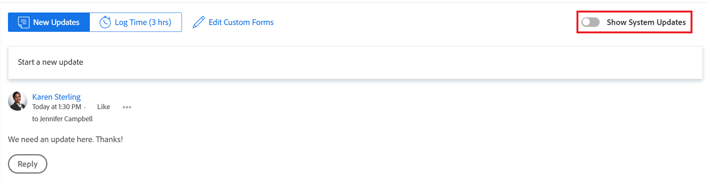

# Werk bijwerken

<!-- Drafted for commenting experience: 

The highlighted information on this page refers to functionality not yet generally available. It is available only in the Preview environment for a limited number of objects. -->

U kunt een update toevoegen aan een Adobe Workfront-object (project, taak of uitgave) om te communiceren over de voortgang van het object. Gebruikers die zijn toegewezen aan of geabonneerd op het object, kunnen uw update weergeven. U kunt gebruikers ook labelen om de update onder de aandacht te brengen.

U kunt updates aan een object toevoegen vanuit de volgende Workfront-gebieden:

* Vanuit een Workfront-object, in de sectie Updates
* Vanuit het thuisgebied (voor taken en problemen)
* Vanuit het deelvenster Samenvatting in een lijst met objecten (voor taken en problemen)
* Van het timesheet (voor taken en kwesties)

## Toegangsvereisten

<!--
drafted for P&P release:
<table style="table-layout:auto"> 
 <col> 
 </col> 
 <col> 
 </col> 
 <tbody> 
  <tr> 
   <td role="rowheader"><strong>Adobe Workfront plan*</strong></td> 
   <td> 
Any
 </td> 
  </tr> 
  <tr> 
   <td role="rowheader"><strong>Adobe Workfront license*</strong></td> 
   <td> 
Current license: Contributor or higher for issues and documents: Light or higher for all other objects
 
   Or
   
Legacy  license: Request or higher for issues and documents; Review or higher for all other objects

   </td> 
  </tr> 
  <tr> 
   <td role="rowheader"><strong>Access level configurations*</strong></td> 
   <td> 
View or Edit access for the object the update is on
 
<b>NOTE</b>
   
   If you still don't have access, ask your Workfront administrator if they set additional restrictions in your access level. For information on how a Workfront administrator can modify your access level, see <a href="../../administration-and-setup/add-users/configure-and-grant-access/create-modify-access-levels.md" class="MCXref xref">Create or modify custom access levels</a>.
 </td> 
  </tr> 
  <tr> 
   <td role="rowheader"><strong>Object permissions</strong></td> 
   <td> 
View access to the object
 
For information on requesting additional access, see <a href="../../workfront-basics/grant-and-request-access-to-objects/request-access.md" class="MCXref xref">Request access to objects </a>.
 </td> 
  </tr> 
 </tbody> 
</table>
-->
U moet de volgende toegang hebben om de stappen in dit artikel uit te voeren:

<table style="table-layout:auto"> 
 <col> 
 </col> 
 <col> 
 </col> 
 <tbody> 
  <tr> 
   <td role="rowheader"><strong>Adobe Workfront-abonnement*</strong></td> 
   <td> 
Alle
 </td> 
  </tr> 
  <tr> 
   <td role="rowheader"><strong>Adobe Workfront-licentie*</strong></td> 
   <td> 
een verzoek of hoger indienen voor kwesties en documenten; Reviseren of hoger voor alle andere objecten
 </td> 
  </tr> 
  <tr> 
   <td role="rowheader"><strong>Configuraties op toegangsniveau*</strong></td> 
   <td> 
Toegang weergeven of bewerken voor het object waarop de update betrekking heeft
 
<b>OPMERKING</b>

Als u nog steeds geen toegang hebt, vraagt u de Workfront-beheerder of deze aanvullende beperkingen op uw toegangsniveau instelt. Voor informatie over hoe een beheerder van Workfront uw toegangsniveau kan wijzigen, zie <a href="../../administration-and-setup/add-users/configure-and-grant-access/create-modify-access-levels.md" class="MCXref xref">Aangepaste toegangsniveaus maken of wijzigen</a>.
 </td>
</tr> 
  <tr> 
   <td role="rowheader"><strong>Objectmachtigingen</strong></td> 
   <td> 
Toegang tot het object weergeven
 
Voor informatie over het aanvragen van aanvullende toegang raadpleegt u <a href="../../workfront-basics/grant-and-request-access-to-objects/request-access.md" class="MCXref xref">Toegang tot objecten aanvragen </a>.
 </td> 
  </tr> 
 </tbody> 
</table>

&#42;Neem contact op met uw Workfront-beheerder om te weten te komen welk plan, licentietype of toegang u hebt.

## Een update toevoegen aan een werkitem

<!--drafted for the commenting experience - change the NOTE at the top of this paragraph with every new release to other objects

Adding an update to a work item differs depending on what environment and what object you choose. 

### Add an update to a work item in the Production environment

>[!NOTE]
>
>The following functionality is available for all objects except for goals, in the Production and Preview environements. You must have an additional license to access Workfront Goals. For information about commenting on goals, see [Manage goal comments in Adobe Workfront Goals](../../workfront-goals/goal-management/manage-goal-comments.md)

-->

1. Ga naar het het werkpunt waarvoor u een update (zoals een project, een taak, of een kwestie) wilt verstrekken.
1. Klik op de knop **Updates** sectie.
1. Klikken **Een nieuwe update starten,** typ de update.

1. (Optioneel) Als u RTF-opmaak wilt toevoegen aan de update, gebruikt u de kenmerken in het dialoogvenster **RTF** terwijl u typt.

   | **Kenmerk** | **Werkbalkknop** | **Mac-sneltoetsen** | **Sneltoetsen pc** |
   |---|---|---|---|
   | Vet |  | + | Ctrl+B |
   | Cursief |  | Alt+i | Ctrl+I |
   | Onderstrepen |  | Alt+u | Ctrl+U |
   | Hyperlink |  | K | Ctrl+K |
   | Lijst met opsommingstekens |  | Shift+8 | Ctrl+Shift+8 |
   | Genummerde lijst |  | Shift+7 | Ctrl+Shift+7 |
   | Blokprijsopgave |  | Shift+9 | Ctrl+Shift+9 |

   Als u de opmaak van tekst wilt stoppen, deselecteert u het kenmerk in het dialoogvenster **RTF** werkbalk.

   >[!NOTE]
   >
   >* Opmaak wordt ook weergegeven in e-mailberichten die gebruikers ontvangen met uw update.
   >* Opmaak van RTF-gegevens die wordt toegepast op een update in een e-mailbericht, wordt niet weergegeven in de update wanneer deze wordt weergegeven op het tabblad Updates.
   >* Als uw organisatie Workfront met Internet Explorer gebruikt, verliest alle opgemaakte tekst die in een update wordt geplakt zijn RTF-opmaak en wordt deze als onbewerkte tekst weergegeven. U kunt de tekst opnieuw opmaken met de kenmerken op de werkbalk RTF.
   >* Opmaak van RTF-tekst is niet beschikbaar voor updates die worden uitgevoerd in het gedeelte Timesheets of voor notitie- en laatste-voorwaardenobjecten die worden weergegeven in een rapport.

1. (Optioneel) Als u tekst uit vorige updates of uit andere bronnen wilt opnemen en deze wilt onderscheiden van uw eigen update, kunt u deze markeren als een blokofferte. Klik op de knop **Blokprijsopgave** pictogram  en typ de tekst die u wilt aanhalen. De geciteerde tekst wordt gemarkeerd met een verticaal grijze lijn weergegeven. Klik op de knop **Blokprijsopgave** weer op om terug te keren naar de normale opmaak.

   

1. (Optioneel) Voeg eventuele emoties toe aan de update.

   >[!NOTE]
   >
   >* Workfront vervangt leestekens zoals :) niet door emojis.
   >* Emojis is niet beschikbaar voor updates die in het gedeelte Timesheets zijn gemaakt of voor notitie- en laatste voorwaardenobjecten die in een rapport worden weergegeven.
   >* De functie emoji in Workfront gebruikt Unicode-tekens en wordt als zodanig alleen weergegeven in browsers en besturingssystemen die Unicode-codepunten ondersteunen. Gebruikers van een ander platform, browser of besturingssysteem dan de uwe hebben mogelijk geen toegang tot dezelfde emojis.
   >* Een niet-ondersteunde emoji wordt weergegeven door een zwarte of witte doos.
   >* Windows 7 biedt alleen ondersteuning voor zwart-witafbeeldingen.
   >* Mojs die worden toegepast op een update die via e-mail wordt uitgevoerd, worden niet weergegeven in de update wanneer deze wordt weergegeven in het gedeelte Updates.

1. (Optioneel) Een URL-koppeling toevoegen aan extra informatiebronnen:

   1. Klik in de update op de plaats waar u een koppeling wilt invoegen.
   1. Op de **RTF** klikt u op de **Hyperlink** pictogram. 

   1. In de **Koppeling maken** vak dat wordt weergegeven onder **URL**, typt of plakt u de URL van de bron waaraan u wilt koppelen.

   1. Onder **Weer te geven tekst**, typt of plakt u de koppelingstekst.
   1. Klikken **Opslaan**.

1. (Optioneel) Als u een afbeelding aan de update wilt koppelen, klikt u op de knop **Afbeelding** pictogram  en blader naar de afbeelding op uw computer.\
   of\
   Sleep de afbeelding naar het updategebied.

   >[!NOTE]
   >
   >* Uw Workfront-beheerder moet het toevoegen van afbeeldingen inschakelen voordat u het afbeeldingspictogram kunt zien.
   >* De maximale grootte van het afbeeldingsbestand is 7 MB. Ondersteunde bestandstypen voor afbeeldingen zijn .jpg, .gif en .png.
   >* Afbeeldingen zijn alleen toegankelijk via het tabblad Updates van een object en zijn niet beschikbaar op het tabblad Documenten.
   >* U kunt een update verzenden met een afbeelding en geen tekst.

1. (Optioneel) Geef een of meer van de volgende items op:

   <table style="table-layout:auto"> 
    <col> 
    <col> 
    <tbody> 
     <tr> 
      <td role="rowheader"><strong>Waarschuwen</strong></td> 
      <td>Identificeer gebruikers die van de update moeten worden op de hoogte gebracht. Gebruikers die zijn toegewezen aan of geabonneerd op het object, ontvangen automatisch een melding wanneer een update wordt uitgevoerd. 
Voor informatie over het opnemen van anderen in een update raadpleegt u <a href="../../workfront-basics/updating-work-items-and-viewing-updates/tag-others-on-updates.md" class="MCXref xref">Andere tags toepassen op updates</a>.
</td> 
     </tr> 
     <tr> 
      <td role="rowheader"><strong>Vastlegdatum</strong></td> 
      <td>Selecteer in de datumkiezer de datum die u hebt vastgelegd om het werkitem te voltooien. Zie voor informatie over Datum vastleggen <a href="../../manage-work/projects/updating-work-in-a-project/overview-of-commit-dates.md" class="MCXref xref">Overzicht van datum vastleggen</a>.</td> 
     </tr> 
     <tr> 
      <td role="rowheader"><strong>Voorwaarde</strong></td> 
      <td>Selecteer een nieuwe voorwaarde voor de taak of kwestie. Voor informatie over het selecteren van een voorwaarde raadpleegt u <a href="../../manage-work/projects/updating-work-in-a-project/update-condition-for-tasks-and-issues.md" class="MCXref xref">Voorwaarde voor bijwerken voor taken en problemen</a>.</td> 
     </tr> 
     <tr> 
      <td role="rowheader"><strong>Status</strong></td> 
      <td>Klik op de pijl naast de huidige status en selecteer vervolgens de gewenste status in het vervolgkeuzemenu. Voor informatie over het instellen van een status raadpleegt u <a href="../../manage-work/projects/updating-work-in-a-project/update-task-status.md" class="MCXref xref">Taakstatus bijwerken</a>.
Het bijwerken van de status van een werkitem wijzigt niet automatisch de status van een project. Afhankelijk van hoe uw project opstelling is, zou u updates aan de projectstatus afzonderlijk kunnen moeten maken. Voor meer informatie over de diverse types van projectupdate, zie <a href="../../manage-work/projects/manage-projects/select-project-update-type.md" class="MCXref xref">Selecteer het Type van projectupdate </a>.

<b>OPMERKING</b>

   U kunt de status van een tijdelijk onderdeel niet wijzigen als dit onderdeel zich in de status In afwachting van goedkeuring bevindt.
</td>
   </tr> 
     <tr> 
      <td role="rowheader"><strong>Voltooiingsbalk</strong></td> 
      <td>(Alleen beschikbaar voor taken) Geef het percentage op van het werk dat is voltooid door de voortgangsbalk naar het gewenste percentage te verschuiven. U kunt ook dubbelklikken op de voltooiingsbalk en het percentage invoeren dat is voltooid.</td> 
     </tr> 
     <tr> 
      <td role="rowheader"><strong>Privé voor mijn bedrijf</strong></td> 
      <td> 
Schakel deze optie uit als u wilt voorkomen dat gebruikers buiten uw bedrijf toegang hebben om deze update te bekijken.
 </td> 
     </tr> 
    </tbody> 
   </table>

1. Klikken **Bijwerken** om de update aan het Workfront-object toe te voegen.

   >[!NOTE]
   >
   >Een klein pop-upvenster wordt zeven seconden weergegeven nadat u op **Bijwerken**, zodat u de update ongedaan kunt maken en naar het bewerkingsvenster kunt terugkeren voordat de update wordt geplaatst. De update wordt gepost als u de pop-up Ongedaan maken sluit, wacht tot deze verdwijnt of weg van de pagina navigeert.
   >
   >Als uw Workfront-beheerder de instelling Nooit toestaan dat gebruikers opmerkingen verwijderen selecteert in uw toegangsniveau, kunt u een opmerking niet ongedaan maken. Zie voor meer informatie [Aangepaste toegangsniveaus maken en wijzigen](../../administration-and-setup/add-users/configure-and-grant-access/create-modify-access-levels.md).

1. Als u wilt reageren op een update, raadpleegt u [Reageren op updates](../../workfront-basics/updating-work-items-and-viewing-updates/reply-to-updates.md).

<!--
### Add an update to a work item in the Preview environment

>[!NOTE]
>
> In the Preview environment, the following functionality is available only for issues, after opting in the Beta program for the new commenting experience.
> 
> In the Production environment, the following functionality is available for goals. You must have an additional license to access Workfront Goals. For information about commenting on goals, see [Manage goal comments in Adobe Workfront Goals](../../workfront-goals/goal-management/manage-goal-comments.md). 

1. Locate the object you want to add comments to, then click its name to open the object's page.
1. Click  **Updates** in the left panel. 
1. Activate the **Beta** toggle in the upper-right corner of the Updates area. This switches the Updates area to the new commenting experience. 
1. Click the **Comments** tab in the upper-left corner of the Updates area.
1. Start entering a comment in the **New comment** box. 
   
   

   >[!TIP]
   >
   >Navigating away from the Updates section before you finish typing and submitting a comment keeps the comment on the page in draft mode even after you log off and log back on. Drafted comments are only visible to the user entering them.

1. (Optional) In the **Tag people or teams** area, start typing the name or the email of a user, or a team that you would like to include in this comment, then select it when it displays in the list. 
1. (Optional) To add rich text formatting to your update, use any attributes on the **Rich Text** toolbar as you type.

   | **Attribute** |**Toolbar Button** |**Mac Shortcut Keys** |**PC Shortcut Keys** |
   |---|---|---|---|
   | Bold | |⌘+b |Ctrl+B |
   | Italics | |⌘+i |Ctrl+I |
   | Underline | |⌘+u |Ctrl+U |
   | Hyperlink | |⌘+K |Ctrl+K |
   | Bulleted List | |⌘+Shift+8 |Ctrl+Shift+8 |
   | Numbered List | |⌘+Shift+7 |Ctrl+Shift+7 |
   | Block Quote | |⌘+Shift+9 |Ctrl+Shift+9 |

    To stop formatting text, deselect the attribute on the **Rich Text** toolbar.

   >[!NOTE]
   >
   >* Formatting also displays in any email notification users receive containing your update.
   >* Rich Text formatting applied to an update in an email does not display on the update when viewed in the Updates tab.  
   >* If your organization uses Workfront with Internet Explorer, any formatted text pasted into an update loses its Rich Text formatting and displays as plain text. You can reformat the text using the attributes on the Rich Text toolbar.
   >* Rich Text formatting is not available for updates made in the Timesheets area or for Note and Last Condition objects viewed in a report.

   ************ HIDE THIS ********* 1. (Optional) If you want to include text from previous updates or from other sources and distinguish it from your own update, you can mark it as a Block Quote. Click the **Block Quote** icon  and type the text you want to quote. The quoted text displays marked with a vertical gray line. Click the **Block Quote** icon again to return to normal formatting.

   ********  HIDE THIS ******** 1. (Optional) Add any emojis to your update.

   >[!NOTE]
   >
   >* Workfront does not replace punctuation emoticons such as :) with emojis.
   >* Emojis are not available for updates made in the Timesheets area or for Note and Last Condition objects viewed in a report.
   >* The emoji feature in Workfront utilizes Unicode characters and, as such, displays only on browsers and operating systems that support Unicode code points. Users on a platform, browser, or operating system version different than yours might not have access to the same emojis.
   >* An unsupported emoji is represented by a black or white box.
   >* Windows 7 supports only black and white emojis.  
   >* Emojis that are applied to an update made via email do not display on the update when viewed in the Updates area.

1. (Optional) To add a URL link to additional information sources:

   1. Click in your update where you want to insert a link.
   1. On the **Rich Text** toolbar, click the **Hyperlink** icon.   

   1. In the **Create Link** box that appears, under **URL**, type or paste the URL of the source to which you want to link.
   
   1. Under **Text to display**, type or paste the link text.
   1. Click **Save**.   
1. Click **Submit**. 
1. (Optional) Click **Reply** to reply to an existing comment, then follow the steps 5-7 above. (**************insure this stays accurate***********)
1. (Optional) Click the **Like** icon to like a comment that someone else added. The icon updates with the number of likes.

1. (Optional) Click the **System Activity** tab to view updates logged by the system. When a goal is updated, Workfront generates a note about that update that and displays it in the System Activity tab. Workfront also records a system update when a result, activity, or project is added to the goal or when it is updated. 

1. (Conditional and Optional) If you included additional people in your comment, click on the number of members included in the update to display a list of entities that the comment you entered is shared with. 

   

-->

## Updategegevens kopiëren

Er zijn verschillende manieren waarop u een update kunt kopiëren. Nadat u een koppeling hebt gekopieerd, kunt u de koppeling met anderen delen om deze naar de update te leiden.

* [De update kopiëren](#copy-the-update)
* [De verbinding van de draad kopiëren](#copy-the-thread-link)
* [De koppeling voor bijwerken kopiëren](#copy-the-update-link)

### De update kopiëren {#copy-the-update}

Met deze optie wordt de tekst van een specifieke update naar het klembord gekopieerd.

1. Ga naar de update of het antwoord dat u wilt kopiëren.
1. Klik op de knop **Meer** en klik vervolgens op **Platte tekst kopiëren**.

   

### De verbinding van de draad kopiëren {#copy-the-thread-link}

Met deze optie wordt de volledige thread-koppeling naar het klembord gekopieerd, zodat u de verbinding met andere gebruikers kunt delen.

1. Ga naar de updatethread die u wilt kopiëren.
1. Klik op de knop **Meer** en klik vervolgens op **Verbindingskoppeling kopiëren**.

   

### De koppeling voor bijwerken kopiëren {#copy-the-update-link}

Met deze optie wordt een specifieke updatekoppeling naar het klembord gekopieerd. Wanneer u de update-koppeling deelt, ziet de gebruiker die deze koppeling volgt, een rand rondom de update.

1. Ga naar de update of het antwoord dat u wilt kopiëren.
1. Klik op de knop **Meer** menu naast de afzonderlijke update en klik vervolgens op **Koppeling voor bijwerken kopiëren**.

   

## Een update of antwoord verwijderen

Afhankelijk van de toegang die uw Workfront-beheerder u biedt, kunt u mogelijk updates verwijderen die u hebt toegevoegd op het tabblad Updates van een object. Zie voor meer informatie [Aangepaste toegangsniveaus maken of wijzigen](../../administration-and-setup/add-users/configure-and-grant-access/create-modify-access-levels.md#creating-a-new-access-from-scratch) in het artikel [Aangepaste toegangsniveaus maken of wijzigen](../../administration-and-setup/add-users/configure-and-grant-access/create-modify-access-levels.md).

Geen enkele Workfront-gebruiker (inclusief de Workfront-beheerder) kan updates van een andere gebruiker verwijderen. Nochtans, als het de toegangsniveau van een gebruiker hen toestaat om hun eigen updates te schrappen, kan de beheerder van Workfront login als die gebruiker en schrapt updates zij aanbrachten. Zie voor meer informatie [Aangepaste toegangsniveaus maken of wijzigen](../../administration-and-setup/add-users/configure-and-grant-access/create-modify-access-levels.md#creating-a-new-access-from-scratch) en [Aanmelden als een andere gebruiker](../../administration-and-setup/add-users/create-and-manage-users/log-in-as-another-user.md).

1. Ga naar de update of het antwoord dat u wilt verwijderen.
1. Klik op de knop **Meer** naast de update of het antwoord dat u wilt verwijderen, klikt u op **Verwijderen**.

   

1. Klik in het bericht dat wordt weergegeven op **Bevestigen**.

>[!NOTE]
>
>Als u een update met een bijgevoegde afbeelding verwijdert, worden zowel de opmerking als de afbeelding verwijderd.

## Een update toevoegen aan een tijdspagina

1. Ga naar een tijdpagina waarop u een update wilt uitvoeren.
1. Klik op de tijdpagina om deze te openen.
1. Klik onder aan de tijdpagina op **Een opmerking opnemen**.
1. Typ een update in het vak dat onder aan de tijdpagina wordt weergegeven.

   

1. (Voorwaardelijk)Als u uw update wilt opslaan zonder het tijdblad ter goedkeuring te verzenden, klikt u op **Opslaan voor later**.

   of

   Als u de update wilt opslaan en de tijdpagina ter goedkeuring wilt verzenden, klikt u op **Ter goedkeuring verzenden**.

   of

   Als de tijdpagina niet is ingesteld met een fiatteur, klikt u op **Tijdblad opslaan en sluiten** om de update op te slaan.

## Systeemupdates in- of uitschakelen

Op het tabblad Updates van een Workfront-object worden twee soorten gegevens weergegeven:

* **Gebruikersupdates:** De updates van de gebruiker zijn commentaren die u en andere gebruikers in uw systeem ingaan.

   

* **Systeemupdates:** Bij systeemupdates worden het verwijderen van elementen vastgelegd, versies toegevoegd of verwijderd, een goedkeuringsaanvraag bijgevoegd of verwijderd, en eventuele wijzigingen die in de documenten op het object zijn aangebracht.

   

Afhankelijk van uw Workfront-licentie zijn systeemupdates mogelijk standaard ingeschakeld. Workfront-beheerders kunnen bepalen wat wordt bijgehouden in systeemupdates, zoals wordt uitgelegd in [Door het systeem bijgehouden updates](../../administration-and-setup/set-up-workfront/system-tracked-update-feeds/system-tracked-update-feeds.md). U kunt ook systeemupdates of -activiteiten uitfilteren, zodat alleen gebruikersupdates voor alle objecten worden weergegeven.

Voor meer informatie over het verschil tussen gebruiker en systeemupdates, zie [Door het systeem bijgehouden updates](../../administration-and-setup/set-up-workfront/system-tracked-update-feeds/system-tracked-update-feeds.md).

Zo schakelt u systeemupdates in of uit:

1. Klik op de knop **Updates** op een object.
1. Klikken **Systeemupdates tonen** om de schakelaar links (gehandicapt) of juist (toegelaten) te schuiven.

   

   Deze optie is overal in Workfront blijvend en blijft in de positie staan die u selecteert, zelfs als u zich afmeldt bij Workfront.
