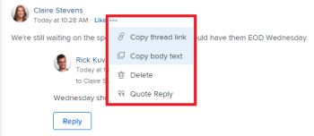

# Werk bijwerken

<!--take "Beta" references out when we remove the beta-->

De gemarkeerde informatie op deze pagina verwijst naar functionaliteit die nog niet algemeen beschikbaar is. Deze optie is alleen beschikbaar in de voorvertoningsomgeving.

>[!NOTE]
>
>De ervaring met opmerkingen wordt momenteel opnieuw ontworpen in Adobe Workfront.
>
>Ga voor meer informatie over de nieuwe opmerkingervaring naar [Nieuwe ervaring met opmerkingen](../../product-announcements/betas/new-commenting-experience-beta/unified-commenting-experience.md).
>
>U hebt toegang tot de nieuwe ervaring voor de volgende objecten:
> * Problemen projecten, taken en documenten, wanneer u het opmerkingsbètabestand inschakelt.
   >
   >     Deze functionaliteit is alleen beschikbaar voor de sectie Updates en is niet beschikbaar voor de volgende gebieden:
   >
   >     * Home
   >     * Samenvattingspaneel in lijsten
   >     * Samenvattingspaneel in tijdbladen
>
> * Doelen

   >
   >   De nieuwe ervaring met opmerkingen is de standaardeigenschap voor doelen. U moet een extra licentie hebben om toegang te krijgen tot Workfront Goals. Zie voor meer informatie [Vereisten voor het gebruik van Workfront-doelen](../../workfront-goals/goal-management/access-needed-for-wf-goals.md).
   >
   >    Zie voor informatie over opmerkingen over doelen [Doelopmerkingen beheren in Adobe Workfront-doelen](../../workfront-goals/goal-management/manage-goal-comments.md).

In de sectie Updates kunt u opmerkingen toevoegen aan de meeste objecten in Adobe Workfront. Voor meer informatie over welke voorwerpen de sectie van Updates tonen, zie [Overzicht van de sectie Updates](../updating-work-items-and-viewing-updates/updates-tab-overview.md).

U kunt een update toevoegen aan een Workfront-object (project, taak of uitgave) om te communiceren over de voortgang van het object, terwijl u commentaar geeft op het object. Gebruikers die zijn toegewezen aan of geabonneerd op het object, kunnen uw update weergeven. U kunt gebruikers ook labelen om de update onder de aandacht te brengen. Gelabelde gebruikers ontvangen een melding in de app en een e-mail over uw update.

De informatie op deze pagina beschrijft hoe u commentaar kunt geven op Workfront-objecten en hoe u projecten, taken en problemen bijwerkt. Zie voor informatie over opmerkingen over doelen [Doelopmerkingen beheren in Adobe Workfront-doelen](../../workfront-goals/goal-management/manage-goal-comments.md). U moet een extra licentie hebben om toegang te krijgen tot Workfront Goals.

U kunt een update toevoegen aan projecten, taken en problemen uit de volgende Workfront-domeinen:

* Vanuit een Workfront-object, in de sectie Updates
* Vanuit het thuisgebied (voor taken en problemen)
* Vanuit het deelvenster Samenvatting in een lijst met objecten (voor taken en problemen)
* Van het timesheet (voor taken en kwesties)

## Toegangsvereisten

<!--
drafted for P&P release:
<table style="table-layout:auto"> 
 <col> 
 </col> 
 <col> 
 </col> 
 <tbody> 
  <tr> 
   <td role="rowheader"><strong>Adobe Workfront plan*</strong></td> 
   <td> 
Any
 </td> 
  </tr> 
  <tr> 
   <td role="rowheader"><strong>Adobe Workfront license*</strong></td> 
   <td> 
Current license: Contributor or higher for issues and documents: Light or higher for all other objects
 
   Or
   
Legacy  license: Request or higher for issues and documents; Review or higher for all other objects

   </td> 
  </tr> 
  <tr> 
   <td role="rowheader"><strong>Access level configurations*</strong></td> 
   <td> 
View or Edit access for the object the update is on
 
<b>NOTE</b>
   
   If you still don't have access, ask your Workfront administrator if they set additional restrictions in your access level. For information on how a Workfront administrator can modify your access level, see <a href="../../administration-and-setup/add-users/configure-and-grant-access/create-modify-access-levels.md" class="MCXref xref">Create or modify custom access levels</a>.
 </td> 
  </tr> 
  <tr> 
   <td role="rowheader"><strong>Object permissions</strong></td> 
   <td> 
View access to the object
 
For information on requesting additional access, see <a href="../../workfront-basics/grant-and-request-access-to-objects/request-access.md" class="MCXref xref">Request access to objects </a>.
 </td> 
  </tr> 
 </tbody> 
</table>
-->
U moet de volgende toegang hebben om de stappen in dit artikel uit te voeren:

<table style="table-layout:auto"> 
 <col> 
 </col> 
 <col> 
 </col> 
 <tbody> 
  <tr> 
   <td role="rowheader"><strong>Adobe Workfront-abonnement*</strong></td> 
   <td> 
Alle
 </td> 
  </tr> 
  <tr> 
   <td role="rowheader"><strong>Adobe Workfront-licentie*</strong></td> 
   <td> 
een verzoek of hoger indienen voor kwesties en documenten; Reviseren of hoger voor alle andere objecten
 </td> 
  </tr> 
  <tr> 
   <td role="rowheader"><strong>Configuraties op toegangsniveau*</strong></td> 
   <td> 
Toegang weergeven of bewerken voor het object waarop de update betrekking heeft
 
<b>OPMERKING</b>

Als u nog steeds geen toegang hebt, vraagt u de Workfront-beheerder of deze aanvullende beperkingen op uw toegangsniveau instelt. Voor informatie over hoe een beheerder van Workfront uw toegangsniveau kan wijzigen, zie <a href="../../administration-and-setup/add-users/configure-and-grant-access/create-modify-access-levels.md" class="MCXref xref">Aangepaste toegangsniveaus maken of wijzigen</a>.
 </td>
</tr> 
  <tr> 
   <td role="rowheader"><strong>Objectmachtigingen</strong></td> 
   <td> 
Toegang tot het object weergeven
 
Voor informatie over het aanvragen van aanvullende toegang raadpleegt u <a href="../../workfront-basics/grant-and-request-access-to-objects/request-access.md" class="MCXref xref">Toegang tot objecten aanvragen </a>.
 </td> 
  </tr> 
 </tbody> 
</table>

&#42;Neem contact op met uw Workfront-beheerder om te weten te komen welk plan, licentietype of toegang u hebt.

## Een update toevoegen aan een werkitem

<!--drafted for the commenting experience - change the NOTE at the top of the following section with every new release to other objects -->

Het toevoegen van een update aan een tijdelijk item hangt af van de versie van de sectie Updates en van het object dat u kiest.

### Een update toevoegen aan een tijdelijk item in de sectie Huidige updates

>[!NOTE]
>
>De volgende functionaliteit is beschikbaar voor alle voorwerpen behalve doelstellingen. U moet een extra licentie hebben om toegang te krijgen tot Workfront Goals. Zie voor informatie over opmerkingen over doelen [Doelopmerkingen beheren in Adobe Workfront-doelen](../../workfront-goals/goal-management/manage-goal-comments.md)

1. Ga naar het het werkpunt waarvoor u een update (zoals een project, een taak, of een kwestie) wilt verstrekken.
1. Klik op de knop **Updates** sectie.
1. Klikken **Een nieuwe update starten,** typ de update.
1. (Optioneel) Gebruik RTF-tekst of voeg emoties, koppelingen of afbeeldingen toe aan de update om de inhoud te verbeteren. Zie voor meer informatie de [RTF-bestanden gebruiken in een Workfront-update](#use-rich-text-in-a-workfront-update) in dit artikel
1. (Optioneel) Werk een van de volgende gegevens bij over het werkitem:

   <table style="table-layout:auto"> 
    <col> 
    <col> 
    <tbody> 
     <tr> 
      <td role="rowheader"><strong>Waarschuwen</strong></td> 
      <td>Identificeer gebruikers die van de update moeten worden op de hoogte gebracht. Gebruikers die zijn toegewezen aan of geabonneerd op het object, ontvangen automatisch een melding wanneer een update wordt uitgevoerd. 
Voor informatie over het opnemen van anderen in een update raadpleegt u <a href="../../workfront-basics/updating-work-items-and-viewing-updates/tag-others-on-updates.md" class="MCXref xref">Andere tags toepassen op updates</a>.
</td> 
     </tr> 
     <tr> 
      <td role="rowheader"><strong>Vastlegdatum</strong></td> 
      <td>Selecteer in de datumkiezer de datum die u hebt vastgelegd om het werkitem te voltooien. Zie voor informatie over Datum vastleggen <a href="../../manage-work/projects/updating-work-in-a-project/overview-of-commit-dates.md" class="MCXref xref">Overzicht van datum vastleggen</a>.</td> 
     </tr> 
     <tr> 
      <td role="rowheader"><strong>Voorwaarde</strong></td> 
      <td>Selecteer een nieuwe voorwaarde voor de taak of kwestie. Voor informatie over het selecteren van een voorwaarde raadpleegt u <a href="../../manage-work/projects/updating-work-in-a-project/update-condition-for-tasks-and-issues.md" class="MCXref xref">Voorwaarde voor bijwerken voor taken en problemen</a>.</td> 
     </tr> 
     <tr> 
      <td role="rowheader"><strong>Status</strong></td> 
      <td>Klik op de pijl naast de huidige status en selecteer vervolgens de gewenste status in het vervolgkeuzemenu. Voor informatie over het instellen van een status raadpleegt u <a href="../../manage-work/projects/updating-work-in-a-project/update-task-status.md" class="MCXref xref">Taakstatus bijwerken</a>.
Het bijwerken van de status van een werkitem wijzigt niet automatisch de status van een project. Afhankelijk van hoe uw project opstelling is, zou u updates aan de projectstatus afzonderlijk kunnen moeten maken. Voor meer informatie over de diverse types van projectupdate, zie <a href="../../manage-work/projects/manage-projects/select-project-update-type.md" class="MCXref xref">Selecteer het Type van projectupdate </a>.

<b>OPMERKING</b>

   U kunt de status van een tijdelijk onderdeel niet wijzigen als dit onderdeel zich in de status In afwachting van goedkeuring bevindt.
</td>
   </tr> 
     <tr> 
      <td role="rowheader"><strong>Voltooiingsbalk</strong></td> 
      <td>(Alleen beschikbaar voor taken) Geef het percentage op van het werk dat is voltooid door de voortgangsbalk naar het gewenste percentage te verschuiven. U kunt ook dubbelklikken op de voltooiingsbalk en het percentage invoeren dat is voltooid.</td> 
     </tr> 
     <tr> 
      <td role="rowheader"><strong>Privé voor mijn bedrijf</strong></td> 
      <td> 
Schakel deze optie uit als u wilt voorkomen dat gebruikers buiten uw bedrijf toegang hebben om deze update te bekijken.
 
      
<b>OPMERKING</b>

      
Deze optie toont slechts wanneer de gebruiker met een Bedrijf wordt geassocieerd.

      </td> 
     </tr> 
    </tbody> 
   </table>

1. Klikken **Bijwerken** om de update aan het Workfront-object toe te voegen.

   >[!NOTE]
   >
   >Een klein pop-upvenster wordt zeven seconden weergegeven nadat u op **Bijwerken**, zodat u de update ongedaan kunt maken en naar het bewerkingsvenster kunt terugkeren voordat de update wordt geplaatst. De update wordt gepost als u de pop-up Ongedaan maken sluit, wacht tot deze verdwijnt of weg van de pagina navigeert.
   >
   >Als uw Workfront-beheerder de instelling Nooit toestaan dat gebruikers opmerkingen verwijderen selecteert in uw toegangsniveau, kunt u een opmerking niet ongedaan maken. Zie voor meer informatie [Aangepaste toegangsniveaus maken en wijzigen](../../administration-and-setup/add-users/configure-and-grant-access/create-modify-access-levels.md).

1. Als u wilt reageren op een update, raadpleegt u [Reageren op updates](../../workfront-basics/updating-work-items-and-viewing-updates/reply-to-updates.md).

### Een update aan een werkitem toevoegen met behulp van de bètaervaring voor opmerkingen

1. Zoek het object dat u wilt bijwerken en klik op de naam van het object om de objectpagina te openen.
1. Klikken  **Updates** in het linkerdeelvenster.
1. De optie **Bèta met opmerkingen** Schakel rechtsboven in het gedeelte Updates in en klik op **Akkoord** over de bètaovereenkomst. Hiermee schakelt u het gebied Updates over naar de bètaervaring met opmerkingen.
De **Opmerkingen** is standaard geselecteerd.
1. Beginnen met een opmerking in het dialoogvenster **Nieuwe opmerking** doos.

   

   >[!TIP]
   >
   >Als u weg navigeert uit de sectie Updates voordat u klaar bent met het typen en verzenden van een opmerking, wordt de opmerking op de pagina in de conceptmodus bewaard, zelfs nadat u zich hebt afgemeld en u weer hebt aangemeld. Afbeeldingen die aan de opmerking worden toegevoegd, worden ook in het concept opgeslagen. Concepten worden 7 dagen bewaard waarna ze worden verwijderd en kunnen niet worden hersteld. Getekende opmerkingen zijn alleen zichtbaar voor de gebruiker die ze invoert.

1. (Optioneel) In het dialoogvenster **Tags toewijzen aan personen of teams** -gebied, typt u de naam of het e-mailadres van een gebruiker of een team dat u in deze opmerking wilt opnemen, en selecteert u deze vervolgens wanneer de opmerking in de lijst wordt weergegeven.
1. (Optioneel) Als u tekstopmaak wilt toevoegen aan de update, gebruikt u een van de volgende opties in het menu **RTF** werkbalk om de tekst te verbeteren:

   * Vet
   * Cursief
   * Onderstrepen
   * Koppeling
   * Lijst met opsommingstekens
   * Genummerde lijst
   * Bijlage toevoegen <!--(mark this parenthesis as draft: ************ this might be renamed to "Add image")-->

   Zie voor meer informatie de [RTF-bestanden gebruiken in een Workfront-update](#use-rich-text-in-a-workfront-update) in dit artikel. <!--remove this list, above, when we get to parity for Rich Text-->

   >[!TIP]
   >
   >Als een andere gebruiker een opmerking verzendt naar hetzelfde item dat u bijwerkt, wordt er een rode lijn weergegeven met de indicator &quot;Nieuw&quot; om u op de hoogte te brengen van de nieuwere opmerkingen.
   >
   >De indicator wordt alleen weergegeven nadat de opmerking op het item is verzonden, en niet wanneer de opmerking nog steeds wordt samengesteld.
   >
   >De indicator &quot;Nieuw&quot;toont slechts wanneer zowel de gebruiker die een nieuwe update inging als de gebruiker die momenteel een update ingaat de nieuwe opmerkingervaring gebruikt.
   >

1. Klikken **Verzenden** om de update aan het Workfront-object toe te voegen.
1. (Optioneel) Als u een opmerking wilt bewerken, klikt u op de knop **Meer** menu  rechts van het gelijkaardige pictogram, dan klik **Bewerken**.
1. Bewerk de informatie in de opmerking, voeg afbeeldingen toe of verwijder afbeeldingen of verwijder een van de getagde gebruikers.
U kunt uw opmerking binnen 15 uur na verzending bewerken. Een indicator &quot;Bewerkt&quot; wordt links van de datumstempel toegevoegd die wordt weergegeven wanneer de opmerking is bijgewerkt.

   

   >[!TIP]
   >
   >* Er wordt een e-mail gegenereerd om gebruikers alleen van uw update op de hoogte te stellen wanneer u de oorspronkelijke update verzendt. Er wordt geen e-mail gegenereerd nadat u de update hebt bewerkt.
   >* De datumstempel naast de opmerking is de datum van de oorspronkelijke opmerking en niet de datum van de laatste bewerking.

1. (Optioneel) Klik op **Reageren** om op een bestaande opmerking te reageren, volgt u de stappen 4 tot en met 7 hierboven. <!--(**************insure this stays accurate***********)-->. Voor informatie over het beantwoorden van een update raadpleegt u [Reageren op updates](../../workfront-basics/updating-work-items-and-viewing-updates/reply-to-updates.md).
1. (Voorwaardelijk en optioneel) Als andere gebruikers opmerkingen hebben toegevoegd die buiten het zichtbare gebied in de sectie Updates worden weergegeven, klikt u op **Weergave** in het blauw **banner voor nieuwe opmerkingen** onder aan het scherm om deze opmerkingen weer te geven.

   

   Aanvullende opmerkingen worden onder in het scherm weergegeven.

   >[!NOTE]
   >
   >   De indicator &quot;nieuwe commentaren&quot;en &quot;de knoop van de Mening tonen slechts wanneer zowel de gebruikers die de nieuwe updates evenals de gebruiker ingegaan die momenteel de sectie van Updates bekijken de nieuwe het becommentariëren ervaring gebruiken.

1. (Optioneel) Klik op de knop **leuk** pictogram. Het pictogram wordt bijgewerkt met het aantal ‘like’.
1. (Voorwaardelijk en Optioneel) Als u extra personen hebt toegevoegd aan uw opmerking, klikt u op het aantal leden dat is opgenomen in de update om een lijst weer te geven met entiteiten waarmee de opmerking die u hebt ingevoerd, wordt gedeeld.

   
1. (Optioneel) Klik op de knop **Systeemactiviteit** om updates weer te geven die zijn geregistreerd door het systeem. Wanneer het object of een van de onderliggende items wordt bijgewerkt, genereert Workfront een notitie over die update en geeft deze weer op het tabblad Systeemactiviteit.

   Zie voor meer informatie [Overzicht van de sectie Updates](../updating-work-items-and-viewing-updates/updates-tab-overview.md)

   >[!TIP]
   >
   >U kunt geen opmerking toevoegen aan een systeemupdate.

## RTF-bestanden gebruiken in een Workfront-update{#use-rich-text-in-a-workfront-update}

<!--remove this top note when we get to parity with the current version, OR change the note to mention that some options are ONLY available in the Beta version and not the current one.-->

>[!NOTE]
>
>Sommige opties op de werkbalk RTF zijn mogelijk niet beschikbaar voor de bètaervaring met opmerkingen.

U kunt uw updates verbeteren met RTF-bestanden of door er verschillende items aan toe te voegen, zoals emojis, koppelingen of afbeeldingen.

1. Ga naar het gedeelte Updates en typ een opmerking.
1. (Optioneel) Als u RTF-opmaak wilt toevoegen aan de update, gebruikt u de kenmerken in het dialoogvenster **RTF** terwijl u typt.

   | **Kenmerk** | **Werkbalkknop** | **Mac-sneltoetsen** | **Windows-sneltoetsen** |
   |---|---|---|---|
   | Vet |  | + | Ctrl+B |
   | Cursief |  | Alt+i | Ctrl+I |
   | Onderstrepen |  | Alt+u | Ctrl+U |
   | Hyperlink |  |  Het vak Koppelingen maken of Koppelingen toevoegen openen: K   In de bètaervaring voor opmerkingen kunt u een koppeling over de geselecteerde tekst plakken: ^V  |  Het vak Koppelingen maken of Koppelingen toevoegen openen: Ctrl+K   In de bètaervaring voor opmerkingen kunt u een koppeling over de geselecteerde tekst plakken: Ctrl+V  |
   | Lijst met opsommingstekens |  | Shift+8 | Ctrl+Shift+8 |
   | Genummerde lijst |  | Shift+7 | Ctrl+Shift+7 |
   | Blokprijsopgave |  | Shift+9 | Ctrl+Shift+9 |

   Als u de opmaak van tekst wilt stoppen, deselecteert u het kenmerk in het dialoogvenster **RTF** werkbalk.

   <!-- in the table above: take "Create Links" verbiage from the hyperlink when the old commenting is removed and the commenting beta is the only way to comment-->

   >[!NOTE]
   >
   >* Opmaak wordt ook weergegeven in e-mailberichten die gebruikers ontvangen met uw update.
   >* Opmaak van RTF-gegevens die wordt toegepast op een update in een e-mailbericht, wordt niet weergegeven in de update wanneer deze wordt weergegeven op het tabblad Updates.
   >* Als uw organisatie Workfront met Internet Explorer gebruikt, verliest alle opgemaakte tekst die in een update wordt geplakt zijn RTF-opmaak en wordt deze als onbewerkte tekst weergegeven. U kunt de tekst opnieuw opmaken met de kenmerken op de werkbalk RTF.
   >* Opmaak van RTF-tekst is niet beschikbaar voor updates die worden uitgevoerd in het gedeelte Timesheets of voor notitie- en laatste-voorwaardenobjecten die worden weergegeven in een rapport.

1. (Optioneel) Als u tekst uit vorige updates of uit andere bronnen wilt opnemen en deze wilt onderscheiden van uw eigen update, kunt u deze markeren als een blokofferte. Klik op de knop **Blokprijsopgave** pictogram  en typ de tekst die u wilt aanhalen. De geciteerde tekst wordt gemarkeerd met een verticaal grijze lijn weergegeven. Klik op de knop **Blokprijsopgave** weer op om terug te keren naar de normale opmaak.

   

1. (Optioneel) Voeg emoties toe aan de update.

   >[!NOTE]
   >
   >* Workfront vervangt leestekens zoals :) niet door emojis.
   >* Emojis is niet beschikbaar voor updates die in het gedeelte Timesheets zijn gemaakt of voor notitie- en laatste voorwaardenobjecten die in een rapport worden weergegeven.
   >* De functie emoji in Workfront gebruikt Unicode-tekens en wordt als zodanig alleen weergegeven in browsers en besturingssystemen die Unicode-codepunten ondersteunen. Gebruikers van een ander platform, browser of besturingssysteem dan de uwe hebben mogelijk geen toegang tot dezelfde emojis.
   >* Een niet-ondersteunde emoji wordt weergegeven door een zwarte of witte doos.
   >* Windows 7 biedt alleen ondersteuning voor zwart-witafbeeldingen.
   >* Mojs die worden toegepast op een update die via e-mail wordt uitgevoerd, worden niet weergegeven in de update wanneer deze wordt weergegeven in het gedeelte Updates.

1. (Optioneel) Een URL-koppeling toevoegen aan extra informatiebronnen:

   1. Klik in de update op de plaats waar u een koppeling wilt invoegen.
   1. Op de **RTF** klikt u op de **Hyperlink** pictogram .

   1. In de **Koppeling maken** vak dat wordt weergegeven onder **URL**, typt of plakt u de URL van de bron waaraan u wilt koppelen.

   1. Onder **Weer te geven tekst**, typt of plakt u de koppelingstekst.
   1. Klikken **Opslaan**.

1. (Optioneel) Voer een van de volgende handelingen uit als u een afbeelding aan de update wilt koppelen, afhankelijk van de omgeving die u gebruikt:

   * Klik op de knop **Afbeelding** pictogram  en blader aan het beeld op uw computer of sleep het beeld in het updategebied, wanneer het gebruiken van de huidige het bijwerken ervaring

   of

   Klik op de knop **Bijlage toevoegen** pictogram  en bladert u naar de afbeelding op uw computer als u de bètaervaring voor opmerkingen gebruikt. <!--the name of the icon and the icon for it might change-->

   >[!NOTE]
   >
   >* Uw Workfront-beheerder moet het toevoegen van afbeeldingen inschakelen in het gedeelte Voorkeuren voor feeds bijwerken van het gebied Workfront Interface voordat u de pictogrammen Afbeelding of Bijlage toevoegen kunt zien. Zie voor meer informatie [Voorkeuren voor gebruikersupdates configureren](../../administration-and-setup/set-up-workfront/system-tracked-update-feeds/configure-preferences-user-updates.md).
   >* De maximale grootte van het afbeeldingsbestand is 7 MB. Ondersteunde bestandstypen voor afbeeldingen zijn .jpg, .gif en .png.
   >* Afbeeldingen zijn toegankelijk vanuit de sectie Updates van een object en zijn ook beschikbaar in het gebied Documenten.
   >* U kunt een update verzenden met een afbeelding en geen tekst.
   >* Wanneer u een opmerking verwijdert die een afbeelding bevat, zijn de volgende scenario&#39;s afhankelijk van de ervaring die u kiest:
      >
      >     * In de huidige opmerkingervaring blijft de afbeelding in het gebied Documenten staan, maar is deze niet meer zichtbaar in de sectie Updates.
      >     * In de nieuwe opmerkingervaring wordt de afbeelding verwijderd uit de sectie Updates en uit het gebied Documenten. De afbeelding wordt ook verwijderd uit het gebied Documenten wanneer u een opmerking bewerkt en de afbeelding verwijdert.
   >* Wanneer iemand een afbeelding verwijdert die is gekoppeld aan een opmerking in het gebied Documenten, wordt deze ook uit de opmerking verwijderd.

1. Klikken **Bijwerken**  of **Verzenden**, wanneer u de bètaervaring voor opmerkingen gebruikt.

## Updategegevens kopiëren

<!--drafted for beta release toggle - remove when copying an update will be available:

>[!NOTE]
>
>Copying an update is not possible when using the Beta commenting experience.
-->

Er zijn verschillende manieren waarop u een update kunt kopiëren. Nadat u een koppeling hebt gekopieerd, kunt u de koppeling met anderen delen om deze naar de update te leiden.

* [De update kopiëren](#copy-the-update)
* [De verbinding van de draad kopiëren](#copy-the-thread-link)
* [De koppeling voor bijwerken kopiëren](#copy-the-update-link)

### De update kopiëren {#copy-the-update}

Met deze optie wordt de tekst van een specifieke update naar het klembord gekopieerd.

1. Ga naar de update of het antwoord dat u wilt kopiëren.
1. Klik op de knop **Meer** en klik vervolgens op **Platte tekst kopiëren**.

   

### De verbinding van de draad kopiëren {#copy-the-thread-link}

Met deze optie wordt de volledige thread-koppeling naar het klembord gekopieerd, zodat u de verbinding met andere gebruikers kunt delen.

1. Ga naar de updatethread die u wilt kopiëren.

1. Klik op de knop **Meer** en klik vervolgens op **Verbindingskoppeling kopiëren** of **Koppeling kopiëren**, wanneer u de bètaervaring gebruikt.

   

### De koppeling voor bijwerken kopiëren {#copy-the-update-link}

Met deze optie wordt een specifieke updatekoppeling naar het klembord gekopieerd. Wanneer u de update-koppeling deelt, ziet de gebruiker die deze koppeling volgt, een rand rondom de update.

1. Ga naar de update of het antwoord dat u wilt kopiëren.
1. Klik op de knop **Meer** menu naast de afzonderlijke update en klik vervolgens op **Koppeling voor bijwerken kopiëren** of **Koppeling kopiëren**, wanneer u de bètaervaring gebruikt.

   

## Een update of antwoord verwijderen

Afhankelijk van de toegang die uw Workfront-beheerder u biedt, kunt u mogelijk updates verwijderen die u hebt toegevoegd op het tabblad Updates van een object. Zie voor meer informatie [Aangepaste toegangsniveaus maken of wijzigen](../../administration-and-setup/add-users/configure-and-grant-access/create-modify-access-levels.md#creating-a-new-access-from-scratch) in het artikel [Aangepaste toegangsniveaus maken of wijzigen](../../administration-and-setup/add-users/configure-and-grant-access/create-modify-access-levels.md).

Geen enkele Workfront-gebruiker (inclusief de Workfront-beheerder) kan updates van een andere gebruiker verwijderen. Nochtans, als het de toegangsniveau van een gebruiker hen toestaat om hun eigen updates te schrappen, kan de beheerder van Workfront login als die gebruiker en schrapt updates zij aanbrachten. Zie voor meer informatie [Aangepaste toegangsniveaus maken of wijzigen](../../administration-and-setup/add-users/configure-and-grant-access/create-modify-access-levels.md#creating-a-new-access-from-scratch) en [Aanmelden als een andere gebruiker](../../administration-and-setup/add-users/create-and-manage-users/log-in-as-another-user.md).

1. Ga naar de update of het antwoord dat u wilt verwijderen.
1. Klik op de knop **Meer** naast de update of het antwoord dat u wilt verwijderen, klikt u op **Verwijderen**.

   

1. Klik in het bericht dat wordt weergegeven op **Bevestigen** of klik op **Verwijderen**, wanneer u de bètaervaring voor opmerkingen gebruikt.

   >[!NOTE]
   >
   >Als u een update met een bijgevoegde afbeelding verwijdert, worden zowel de opmerking als de afbeelding verwijderd. Zie voor meer informatie de [RTF-bestanden gebruiken in een Workfront-update](#use-rich-text-in-a-workfront-update) in dit artikel.

   Wanneer aan de opmerking die u verwijdert, reacties zijn gekoppeld, wordt aangegeven dat de opmerking is verwijderd met de naam van de gebruiker die de opmerking heeft verwijderd.

   

   Als u de bètaervaring voor opmerkingen gebruikt, worden verwijderde opmerkingen direct uit Workfront verwijderd. Een gebruiker die de sectie van Updates gebruikt ziet een commentaar dat door een andere gebruiker in echt - tijd wordt geschrapt.

   <!--when we remove the beta, take out the first part of the sentence above about only when commenting in beta experience. Leave the rest though-->

## Een update toevoegen aan een tijdspagina

1. Ga naar een tijdpagina waarop u een update wilt uitvoeren.
1. Klik op de tijdpagina om deze te openen.
1. Klik onder aan de tijdpagina op **Een opmerking opnemen**.
1. Typ een update in het vak dat onder aan de tijdpagina wordt weergegeven.

   

1. (Voorwaardelijk)Als u uw update wilt opslaan zonder het tijdblad ter goedkeuring te verzenden, klikt u op **Opslaan voor later**.

   of

   Als u de update wilt opslaan en de tijdpagina ter goedkeuring wilt verzenden, klikt u op **Ter goedkeuring verzenden**.

   of

   Als de tijdpagina niet is ingesteld met een fiatteur, klikt u op **Tijdblad opslaan en sluiten** om de update op te slaan.

## Systeemupdates in- of uitschakelen

<!--remove the preview tag with 23.2 production, but keep the note till we remove Beta and it becomed the only exprience: -->

>[!NOTE]
>
>Het is niet mogelijk systeemupdates uit te schakelen wanneer u de bètaopmerkingervaring gebruikt.
>De informatie in deze sectie verwijst alleen naar functionaliteit die beschikbaar is in de huidige sectie Updates.
>Voor meer informatie over systeemupdates in de bètaversie raadpleegt u [Overzicht van de sectie Updates](../updating-work-items-and-viewing-updates/updates-tab-overview.md).

In de sectie Updates van een Workfront-object worden twee soorten gegevens weergegeven:

* **Gebruikersupdates:** De updates van de gebruiker zijn commentaren die u en andere gebruikers in uw systeem ingaan.

   

* **Systeemupdates:** Bij systeemupdates worden het verwijderen van elementen vastgelegd, versies toegevoegd of verwijderd, een goedkeuringsaanvraag bijgevoegd of verwijderd, en eventuele wijzigingen die in de documenten op het object zijn aangebracht.

   

Afhankelijk van uw Workfront-licentie zijn systeemupdates mogelijk standaard ingeschakeld. Workfront-beheerders kunnen bepalen wat wordt bijgehouden in systeemupdates, zoals wordt uitgelegd in [Door het systeem bijgehouden updates](../../administration-and-setup/set-up-workfront/system-tracked-update-feeds/system-tracked-update-feeds.md). U kunt ook systeemupdates of -activiteiten uitfilteren, zodat alleen gebruikersupdates voor alle objecten worden weergegeven.

Voor meer informatie over het verschil tussen gebruiker en systeemupdates, zie [Door het systeem bijgehouden updates](../../administration-and-setup/set-up-workfront/system-tracked-update-feeds/system-tracked-update-feeds.md).

Zo schakelt u systeemupdates in of uit:

1. Klik op de knop **Updates** op een object.
1. Klikken **Systeemupdates tonen** om de schakelaar links (gehandicapt) of juist (toegelaten) te schuiven.

   

   Deze optie is overal in Workfront blijvend en blijft in de positie staan die u selecteert, zelfs als u zich afmeldt bij Workfront.

