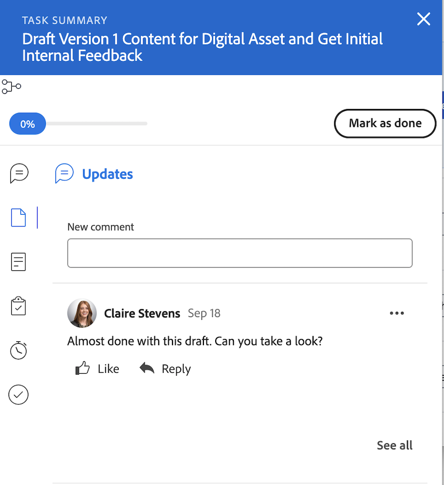

# Van verouderd startpunt naar nieuw startpunt

Legacy Home wordt op 10/17 uit Workfront verwijderd met de Q4-release. Dit artikel bevat informatie over de functionaliteit die beschikbaar is in een nieuwe introductiepagina en aanbevelingen voor Workfront-beheerders die gebruikers naar de nieuwe introductieprestaties verplaatsen.

Voor meer informatie over de veroudering van het Huis van de Oudheid, zie de [ Gids van de Verouderde Veroudering van het Huis ](/help/quicksilver/product-announcements/announcements/legacy-home-deprecation.md).

## Begrijpen wat er verandert van Legacy Home in New Home

### Werklijst

#### Werken organiseren met de widget Mijn werk

De widget Mijn werk is gemaakt in de widgetvorm om de werklijst Oudere pagina zo goed mogelijk te spiegelen. Gebruikers kunnen hun werklijst in de widget Mijn werk groeperen en filteren met vergelijkbare filters en groepen:

| **Filter** | **Groepering** |
|------------|-----------|
| - Werken met   - Klaar om   te starten - Niet gereed   - Gevraagd   - Gedelegeerde   - Voltooid | - Project   - Status   - Vervaldatum   - Niets |

**Verouderde groepering van het Huis niet beschikbaar in Nieuw Huis**

* Geplande voltooiingsdatum - Hernoemd naar vervaldatum in Nieuwe startpagina
* Geplande start
* Vastlegdatum
* Mijn prioriteit

| **Verouderd Huis** | **Nieuw Huis** |
|------------|-----------|
|  |  |

#### Werk delegeren

Gebruikers kunnen hun werk nog steeds delegeren vanuit New Home in de volgende widgets:

* Mijn werk
* Mijn taken
* Mijn problemen
* In afwachting van mijn goedkeuring

Gebruikers kunnen zoeken naar werk dat aan hen is gedelegeerd in de volgende widgets:

* Mijn werkwidget gebruiken het filter &#39;Aan mij gedelegeerd&#39;
* Wachtend op mijn goedkeuring met het filter Gedelegeerde goedkeuringen

| **Verouderd Huis** | **Nieuw Huis** |
|------------|-----------|
|  |  |

#### De kalenderweergave gebruiken

De kalenderweergave is niet meer beschikbaar in New Home, maar een kalendervervanging staat op de routekaart voor Prioriteiten.

#### Een persoonlijke taak maken

Gebruikers kunnen een persoonlijke taak niet meer op dezelfde manier maken als in Legacy Home, maar ze kunnen wel To-do-items maken.

#### Goedkeuringen bekijken die ik heb verzonden

Gebruikers kunnen geen goedkeuringen bekijken die ze in New Home hebben verzonden. Als gebruikers in uw organisatie deze functionaliteit nodig hebben, kunt u een goedkeuringenrapport opstellen als tijdelijke oplossing of een opmerking uploaden of hier een opmerking plaatsen op de volgende communityplaatsen:

* [ voeg &quot;Goedkeuringen toe I voorlegde&quot;Widget aan Nieuw Huis ](https://experienceleaguecommunities.adobe.com/t5/workfront-ideas/add-quot-approvals-i-submitted-quot-widget-to-new-home/idc-p/704664#M25269)
* [ voeg &quot;Goedkeuringen toe ik&quot;aan het nieuwe Huis ](https://experienceleaguecommunities.adobe.com/t5/workfront-ideas/add-quot-approvals-i-submitted-quot-widget-to-new-home/idc-p/704664#M25269) heb voorgelegd

#### Items toevoegen aan Mijn prioriteit

Gebruikers hebben niet langer toegang tot de functie Mijn prioriteit in New Home. Wij introduceren een nieuwe kolom Mijn focus met Prioriteiten die dit zal vervangen.

Gebruikers kunnen de widget raden gebruiken om items met hoge prioriteit bij te houden.

### Werk-items bijwerken

In Legacy home kunnen gebruikers hun werk bijwerken met het juiste deelvenster. In New Home gebruiken gebruikers nu het deelvenster Samenvatting om hun werk bij te werken. Dit is hetzelfde deelvenster Samenvatting dat beschikbaar is in Projecten, Taken, Problemen en Documenten.

#### Het deelvenster Samenvatting gebruiken

In het overzicht kunnen gebruikers

* Percentage bijwerken voltooid
* Een update toevoegen
* Ga naar het gebied Documenten om een document te uploaden
* Details van werkitems weergeven en aangepaste velden bijwerken
Workfront-beheerders kunnen aanpassen welke velden worden weergegeven in de sjabloon Overzicht in de lay-outsjabloon. Voor meer informatie, zie [ Huis en Samenvatting aanpassen gebruikend een lay-outmalplaatje ](/help/quicksilver/administration-and-setup/customize-workfront/use-layout-templates/customize-home-summary-layout-template.md).
* De status van het werkitem wijzigen
* Subtaken weergeven
* Logtijd
* Bijgevoegde goedkeuringsprocessen weergeven
* Bestanden uploaden - Deze functionaliteit is nieuw

| **Verouderd Huis** | **Nieuw Huis** |
|------------|-----------|
|  |  |

#### Het deelvenster Samenvatting openen

De gebruikers kunnen het Summiere paneel openen door over het het werkpunt te bewegen, dan het klikken van het **Samenvatting** pictogram .

Voor extra informatie over hoe te om het Summiere paneel te gebruiken, zie [ Overzicht van de Samenvatting ](/help/quicksilver/workfront-basics/the-new-workfront-experience/summary-overview.md).

#### Snelle handelingen gebruiken

Naast het deelvenster Samenvatting kunnen gebruikers ook snelle handelingen gebruiken om

* Logtijd
* Een update toevoegen
* Een aangepast formulier bijwerken
* Een bestand uploaden

Houd de muisaanwijzer boven het werkitem om het menu met snelle acties te zoeken. De snelle vertoningen van de actielijst dichtbij het **Werk op het** of **Gereed** knoop.

### Goedkeuringen en teamverzoeken weergeven

Gebruikers kunnen goedkeuringen en teamverzoeken in New Home nog steeds beheren met behulp van de volgende widgets:

* In afwachting van mijn goedkeuring
* Alle goedkeuringen
* Teamverzoeken

Voor informatie over het toevoegen van widgets aan uw Nieuwe Homepage, zie [ toevoegen, uitgeven, of verwijder widgets in Nieuw Huis ](/help/quicksilver/workfront-basics/using-home/new-home/add-edit-remove-widgets-in-new-home.md).

## Meer informatie over beschikbare widgets

Widgets vormen de basis van het Nieuwe Huis. Door widgets aan de startpagina toe te voegen, kunnen gebruikers het type informatie kiezen dat wordt weergegeven om optimaal aan hun werkbehoeften te voldoen. Sommige widgets zijn alleen beschikbaar voor specifieke licentietypen, aangezien de objecten die ze bijhouden alleen beschikbaar zijn voor die licenties.

Workfront-beheerders kunnen met behulp van een lay-outsjabloon aanpassen welke widgets beschikbaar zijn in New Home. Voor meer informatie, zie [ nieuw Huis aanpassen gebruikend een lay-outmalplaatje ](/help/quicksilver/administration-and-setup/customize-workfront/use-layout-templates/customize-new-home-layout-template.md).

+++ Uitbreiden om een gedetailleerde lijst met de beschikbare widgets weer te geven
Hieronder vindt u een overzicht van de 11 widgets die u momenteel kunt kiezen, en een overzicht van de gegevens die worden weergegeven:

* **Mijn Werk**\
   Toont alle toegewezen taken, kwesties, en verzoeken in één plaats. U kunt op de knop Werken aan een onderdeel klikken om te beginnen werken aan een onderdeel of op de knop Gereed om de onderdelen te markeren. U kunt ook informatie (Status, Voorwaarde, Percentage voltooid) bijwerken over taken en problemen, logtijd en updates toevoegen vanaf de widget Mijn werk.

* **Boards**\
    Hiermee geeft u alle borden weer die u hebt gemaakt of die u hebt uitgenodigd om te gebruiken. U kunt ook een nieuw bord maken op basis van de volgende sjablonen: Basisbord, Kanban-bord, Retrospectief-bord en Dynamisch bord.

* **Mijn projecten**\
    Toont _projecten u_ of _projecten bezit u_ in een lijst bent. U kunt bestaande filters, weergaven of groepen gebruiken om de lijst aan te passen, of u kunt een project rechtstreeks vanuit de widget maken.

* **Mijn taken**\
    De taken van vertoningen die aan u in een lijst worden toegewezen. U kunt bestaande filters, weergaven of groepen gebruiken om de lijst aan te passen, of u kunt een taak rechtstreeks vanuit de widget maken. U kunt uw taken ook delegeren terwijl u weg van het bureau bent.

* **Mijn kwesties**\
    Hiermee geeft u problemen weer die aan u zijn toegewezen in een lijst. U kunt bestaande filters, weergaven of groepen gebruiken om de lijst aan te passen, of u kunt een uitgave rechtstreeks vanuit de widget maken. Deze widget bevat alleen problemen waarvan de bijbehorende projecten zijn ingesteld op Huidig en die geen voltooide projecten bevatten. U kunt uw kwesties ook delegeren terwijl u weg van het bureau bent.

* **Mijn verzoeken**\
    Hiermee geeft u alle verzoeken weer die u hebt verzonden, een filter om alleen open aanvragen weer te geven en een knop waarmee het overzichtsvenster voor een aanvraag wordt geopend.

* **verzoeken van het Team**\
    Toont alle hangende verzoeken om teams die u op gesorteerd door team bent, evenals knopen om een verzoek aan een gebruiker direct toe te wijzen of aan het zelf te werken.

* **wachtend op mijn goedkeuring**\
    Toont al uw in behandeling zijnde toegewezen of gedelegeerde goedkeuringen, een knoop om goedkeuringen te delegeren, en knopen om goedkeuringsbesluiten direct binnen widget te nemen.

* **Alle goedkeuringen**\
        Toont 2 grafieken met informatie over gemiddelde goedkeuringstijd en besluiten evenals lijstmeningen van hangende en achterstallige goedkeuringen.  deze eigenschap maakt deel uit van een gefaseerde versie en is momenteel slechts beschikbaar voor specifieke klanten.

* **Vermeldingen**\
    Geeft recente commentaarthreads van over Workfront weer, vergelijkbaar met de pagina Mijn updates. U kunt de antwoordknoop gebruiken om een antwoord binnen widget samen te stellen. Deze widget bevat ook opmerkingen over taken en problemen die u hebt toegewezen, die u hebt toegewezen aan een andere gebruiker, die u hebt, waarop u primair contact hebt gemaakt of die u hebt gemaakt, zolang de taak of uitgave in de afgelopen 30 dagen is bijgewerkt.

* **aan-doet**\
    Met deze unieke widget kunt u items toevoegen aan een persoonlijke controlelijst die u kunt bewerken. To-dos worden bijgehouden als taken in uw persoonlijke project, en blijven tot twee weken na voltooiing.

  >[!NOTE]
  >
  >U moet over machtigingen beschikken om taken te maken om taken te kunnen uitvoeren in de widget Aan/uit en alleen persoonlijke taken die door de huidige gebruiker zijn ingevoerd, worden in de widget weergegeven.

+++

  

### Widgets weergeven die beschikbaar zijn voor elk type licentie

Standaard bevat de startpagina een aantal specifieke widgets, gebaseerd op het type licentie. In de onderstaande tabellen ziet u welke widgets gebruikers van elk licentietype zien wanneer ze voor het eerst naar New Home navigeren.

<table border="1" class="inlineTable">
    <tr>
        <td><b>Nieuw type licentie</b></td>
        <td><b>Standaardwidgets</b></td>
    </tr>
    <tr>
        <td>Standaard</td>
        <td>Mijn projecten, mijn werk, herinneringen, opdrachten</td>
    </tr>
    <tr>
        <td>Licht</td>
        <td>Mijn werk, in afwachting van mijn goedkeuring</td>
    </tr>
    <tr>
        <td>Medewerker</td>
        <td>Mijn verzoeken, opmerkingen in afwachting van mijn goedkeuring, raden van bestuur</td>
    </tr>
    <tr>
        <td>Extern</td>
        <td>In afwachting van mijn goedkeuring</td>
    </tr>
</table>

<table border="1" class="inlineTable">
    <tr>
        <td><b>Huidig licentietype</b></td>
        <td><b>Standaardwidgets</b></td>
    </tr>
    <tr>
        <td>Plan</td>
        <td>Mijn projecten, opmerkingen, opdrachten</td>
    </tr>
    <tr>
        <td>Werk</td>
        <td>Mijn werk, herinneringen, opdrachten</td>
    </tr>
    <tr>
        <td>Controleren</td>
        <td>Mijn werk, opmerkingen</td>
    </tr>
    <tr>
        <td>Verzoek</td>
        <td>Mijn projecten, in afwachting van mijn goedkeuring</td>
    </tr>
    <tr>
        <td>Contribute</td>
        <td>Mijn werk, opmerkingen</td>
    </tr>
    <tr>
        <td>Extern</td>
        <td>In afwachting van mijn goedkeuring</td>
    </tr>
</table>

## Voorbereiden op de afleiding

Hieronder vindt u enkele aanbevelingen die u helpen de overgang te vergemakkelijken, zodat u en uw organisatie minder problemen ondervinden.

### De overgang naar Nieuwe startpagina starten

Onze primaire aanbeveling is om zo snel mogelijk een begin te maken met de overgang naar een nieuwe thuisbasis. In organisatorisch opzicht betekent dit dat uw beheerder de ervaringen van gebruikers aanpast via lay-outsjablonen (vergelijkbaar met verouderde Home) om ervoor te zorgen dat elke gebruiker beschikt over wat hij of zij nodig heeft.

We raden beheerders aan:

1. Bouw een standaardlay-out Nieuwe homepage gebruikend lay-outmalplaatjes (of, naar keuze, creeer één voor elke gebruiker, team, groep, of baanrol die een unieke lay-out vereist.) Zie [ nieuw Huis aanpassen gebruikend een lay-outmalplaatje ](/help/quicksilver/administration-and-setup/customize-workfront/use-layout-templates/customize-new-home-layout-template.md) voor meer informatie.

1. Wijs uw nieuwe lay-outmalplaatjes aan een klein aantal testgebruikers toe, die kunnen verifiëren dat hun widgets en algemene montages aan hun werkbehoeften voldoen.

1. Wijs de rest van de gebruikers opnieuw toe aan de lay-out Nieuwe startpagina.

Als u dit zo snel mogelijk doet, hebben uw gebruikers de tijd om zich aan de nieuwe ervaring aan te passen en hun nieuwe homepages aan te passen aan hun individuele behoeften. Zie [ verwijderen, toevoegen en herrangschikken widgets in nieuw Huis ](/help/quicksilver/workfront-basics/using-home/new-home/add-edit-remove-widgets-in-new-home.md) voor informatie over hoe een gebruiker widgets op hun eigen nieuwe homepage kan aanpassen.