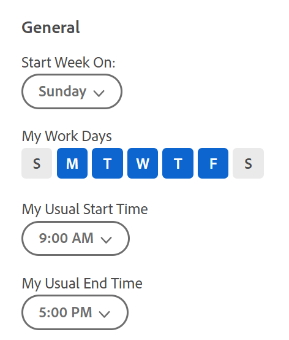

# Uw [!UICONTROL Home Calendar] weergave-instellingen configureren

<!--Audited: 01/2024-->

U kunt de instellingen voor [!UICONTROL Home Calendar] als volgt configureren:

* Integreer met een webversie van [!DNL Outlook] in een door de cloud gehoste versie [!DNL Office 365] of [!DNL Outlook Live] . U kunt alle gebeurtenissen in uw Outlook-agenda en alle bijbehorende kalenders die u in de [!UICONTROL Home Calendar] -agenda in Adobe Workfront selecteert, weergeven.
* Help u uw werkbelasting te volgen op basis van uw beschikbare werkuren op de [!UICONTROL Allocation] -balk.

Zie [[!UICONTROL Home Calendar] view ](../../../workfront-basics/using-home/using-the-home-area/home-calendar-view.md) voor meer informatie over de startagenda.

In dit artikel wordt beschreven hoe u de instellingen van de agenda van het begin kunt configureren en de startagenda kunt integreren met uw externe Outlook-agenda.

## Toegangsvereisten

+++ Breid uit om de toegangseisen voor de functionaliteit in dit artikel weer te geven.

U moet de volgende toegang hebben om de stappen in dit artikel uit te voeren:

<table style="table-layout:auto"> 
 <col> 
 </col> 
 <col> 
 </col> 
 <tbody> 
  <tr> 
   <td role="rowheader"><strong>[!DNL Adobe Workfront plan]</strong></td> 
   <td> 
Alle
 </td> 
  </tr> 
  <tr> 
   <td role="rowheader"><strong>[!DNL Adobe Workfront] licentie*</strong></td> 
   <td> 
Huidig: [!UICONTROL Work] of hoger
 
   of
   
Nieuw: [!UICONTROL Standard]
 
   </td> 
  </tr> 
   </tbody> 
</table>

*Neem contact op met de [!DNL Workfront] beheerder als u wilt weten welk abonnement- of licentietype u hebt. Voor meer informatie, zie [ vereisten van de Toegang in de documentatie van Workfront ](/help/quicksilver/administration-and-setup/add-users/access-levels-and-object-permissions/access-level-requirements-in-documentation.md).

+++

## Informatie over het integreren van [!DNL Microsoft Outlook] kalenders

Neem het volgende in overweging wanneer u uw thuiskalender configureert met uw [!DNL Microsoft Outlook] -kalender:

* U kunt alleen een webversie van [!DNL Outlook] integreren in een door de cloud gehoste versie [!DNL Office 365] of [!DNL Outlook Live] .

  On-premise [!DNL Outlook] en [!DNL Outlook] op een cloud-gebaseerde Enterprise [!DNL Exchange] server worden niet ondersteund.

  Als uw organisatie gebruikmaakt van Single Sign-On, hebt u [!DNL Microsoft 365 E3] of [!DNL E5] nodig.

* Bijlagen die aan uw [!DNL Outlook] -gebeurtenissen zijn gekoppeld, zijn niet gekoppeld aan de [!DNL Outlook] -gebeurtenissen in uw startagenda.
* De integratie met een [!DNL Outlook] kalender moet voor elke gebruiker afzonderlijk worden voltooid.
* Gebeurtenissen die in de [!UICONTROL Due] -balk worden weergegeven, worden alleen weergegeven in de [!DNL Microsoft] -kalender als u ze van de [!UICONTROL Work List] naar de [!DNL Adobe Workfront] -kalender hebt gesleept. Voor meer informatie, zie [[!UICONTROL Due] bar ](../../../workfront-basics/using-home/using-the-home-area/home-calendar-view.md#viewing-the-due-bar) en [ lijst van het Werk op [!UICONTROL Home Calendar]](../../../workfront-basics/using-home/using-the-home-area/home-calendar-view.md#using-the-left-panel-of-the-home-view) in [[!UICONTROL Home Calendar] mening ](../../../workfront-basics/using-home/using-the-home-area/home-calendar-view.md).

* Wanneer u de integratie met [!DNL Outlook] inschakelt, worden alleen werkitems die vanaf dat punt naar de [!UICONTROL Home Calendar] worden gesleept, gesynchroniseerd. Items die zich vóór het inschakelen van de integratie in de startagenda bevonden, worden niet weergegeven en u moet ze opnieuw naar de startagenda slepen als u deze wilt weergeven in [!DNL Outlook] .
* Wanneer u een [!DNL Outlook] -kalender deelt (of niet deelt) met andere personen, of wanneer u het machtigingsniveau wijzigt voor een kalender die u met anderen deelt, heeft deze wijziging geen invloed op hun kalenders gedurende ongeveer 30 minuten. Raadpleeg de documentatie van [!DNL Microsoft Outlook] voor meer informatie.\
   Als u [!DNL Workfront] Kalender integreert met een [!DNL Outlook] -kalender die u deelt met andere gebruikers, worden de [!DNL Workfront] -agendapunten daarom gedurende ongeveer 30 minuten niet weergegeven.

>[!NOTE]
>
>De kalenderconfiguratie van [!DNL Outlook] is volledig gescheiden van [!DNL Outlook] toe:voegen-binnen ([!UICONTROL [!DNL Outlook] Integration] of [!DNL Workfront Outlook]). Er is geen installatie vereist om de kalender te configureren, maar er is wel een installatie nodig voor de [!DNL Outlook] Add-in. Voor meer informatie over [!DNL Outlook] toe:voegen-binnen zie [ Opstelling  [!DNL Adobe Workfront for Outlook]](../../../workfront-integrations-and-apps/using-workfront-with-outlook/set-up-workfront-for-outlook.md).

## Uw [!UICONTROL Home Calendar] weergave-instellingen configureren en deze integreren met Outlook-kalenders

1. In de [!UICONTROL Home Calendar] mening, klik het **[!UICONTROL Settings]** tandwielpictogram  in de hogere juiste hoek om het **[!UICONTROL Calendar settings]** paneel op het recht te openen.

   Als u informatie over de toegang tot van de [!UICONTROL Home Calendar] mening nodig hebt, zie [ Mening [!UICONTROL Home Calendar]](../../../workfront-basics/using-home/using-the-home-area/view-home-calendar.md).

1. (Optioneel) Als u de [!DNL Microsoft Outlook] -kalender wilt integreren, klikt u op **[!UICONTROL Add account]** in de rechterbovenhoek van het deelvenster **[!UICONTROL Calendar settings]** . Voer vervolgens uw aanmeldgegevens voor [!DNL Microsoft Outlook] in als u hierom wordt gevraagd. U kunt deze stap herhalen om meerdere [!DNL Outlook] -accounts toe te voegen.

   >[!NOTE]
   >
   >U moet [!DNL Workfront] toestemming geven om toegang te krijgen tot uw [!DNL Outlook] -kalender. Als u toestemming verleent, kan [!DNL Workfront] toegang tot kalendergegevens behouden, uw [!DNL outlook] -profiel lezen en uw [!DNL Microsoft] -kalender lezen en bijwerken.

1. Vernieuw het browservenster om informatie van uw [!DNL Outlook] -account te bekijken in de kalender en in het deelvenster [!UICONTROL Calendar settings] .
1. Klik nogmaals op het tandwielpictogram **[!UICONTROL Settings]** in de rechterbovenhoek om het deelvenster **[!UICONTROL Calendar settings]** te openen. 

1. (Optioneel) Selecteer **[!UICONTROL View]** of **[!UICONTROL Sync]** onder elke [!DNL Microsoft] -account die u in de vorige stap hebt toegevoegd:

   * **[!UICONTROL View]**: dit is een alleen-lezen optie waarmee [!DNL Microsoft] agendagebeurtenissen worden weergegeven op uw [!UICONTROL Home Calendar] .
   * **[!UICONTROL Sync]**: met deze optie is het mogelijk om de kalenders [!DNL Microsoft] en [!UICONTROL Home] in twee richtingen te synchroniseren. Met andere woorden, [!DNL Workfront] [!UICONTROL Home Calendar] -items worden in real-time geëxporteerd naar uw [!DNL Microsoft] -agenda en [!DNL Microsoft] -agendapunten. [!UICONTROL Home Calendar]

     

1. (Optioneel) Selecteer onder uw [!DNL Workfront] -account of een geïntegreerde account de bijbehorende kalenders die u wilt weergeven op uw [!UICONTROL Home Calendar] (zoals uw PTO-, Verjaars- of feestdagen-kalender) en klik vervolgens op de knop [!UICONTROL Refresh] of [!UICONTROL Reload] van uw browser om de wijzigingen weer te geven.

1. (Optioneel) Selecteer in de sectie **[!UICONTROL General]** onder **[!UICONTROL Start Week On]** de dag die u wilt weergeven als de eerste dag van uw werkweek in de startkalender.

   

1. Configureer de volgende opties:

   * **[!UICONTROL My Work Days]:** selecteer de dagen u werkt.
   * **[!UICONTROL My Usual Start Time]:** selecteer de tijd u uw werkdag begint.
   * **[!UICONTROL My Usual End Time]:** selecteer de tijd u uw werkdag beëindigt.

   [!DNL Workfront] gebruikt deze drie instellingen om het aantal uren te berekenen dat u in een week werkt. Dit getal is van invloed op de [!UICONTROL Allocation] -balk, zodat u de werkbelasting kunt bijhouden op basis van de beschikbare werkuren. Voor meer informatie, zie [[!UICONTROL Allocation] bar ](../../../workfront-basics/using-home/using-the-home-area/home-calendar-view.md#understanding-the-allocation-of-time) in de artikel [[!UICONTROL Home Calendar] mening ](../../../workfront-basics/using-home/using-the-home-area/home-calendar-view.md).

1. Klik buiten het **[!UICONTROL Calendar settings]** -gebied om het te sluiten.

   [!DNL Workfront] slaat uw wijzigingen automatisch op.

Voor informatie over het gebruiken van de [!UICONTROL Calendar] mening om uw werktaken en geïntegreerde kalendergebeurtenissen te beheren, zie [ Gebruik de [!UICONTROL Home Calendar] mening ](../../../workfront-basics/using-home/using-the-home-area/use-home-calendar-view.md).

<!--
<MadCap:conditionalText data-mc-conditions="QuicksilverOrClassic.Draft mode">
(NOTE: from Courtney: [step #] Type your weekly work hours under How many hours a week do you work?This number affects the Allocation bar, which helps you track your workload against your available work hours. For more information, see "Allocation Bar" in the article "Understanding the Home Calendar View.")
</MadCap:conditionalText>
-->
