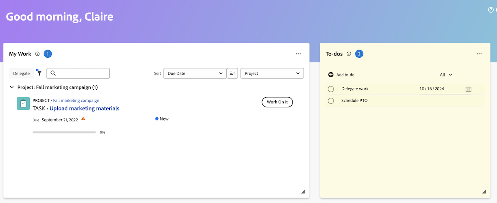

# Werkitems en projecten maken vanuit het thuisgebied

U kunt werkitems en projecten maken vanuit het [!UICONTROL Home] -gebied.

Vanaf Home kunt u

* Verzoeken verzenden
* Taken en problemen toevoegen aan specifieke projecten
* Creeer projecten van een malplaatje, leeg project, of voer een project van MS in.

## Toegangsvereisten

+++ Breid uit om de toegangseisen voor de functionaliteit in dit artikel weer te geven. 

<table style="table-layout:auto"> 
 <col> 
 <col> 
 <tbody> 
  <tr> 
   <td role="rowheader"><strong>[!DNL Adobe Workfront package]</strong></td> 
   <td> 
Alle
 </td> 
  </tr> 
  <tr> 
   <td role="rowheader"><strong>[!DNL Adobe Workfront] licentie</strong></td> 
   <td>
    
Standard
 
    
Werk of hoger
 </td> 
  </tr> 
    <tr> 
   <td role="rowheader"><strong>Configuraties op toegangsniveau</strong></td> 
   <td> 
Toegang weergeven of bewerken voor het object waarop de update betrekking heeft
 </td> 
  </tr> 
   <tr> 
   <td role="rowheader"><strong>Aanvullende producten</strong></td> 
   <td>U moet Adobe Workfront Planning hebben om de verzoeken van de Planning te bekijken of om formulieren te verzoeken</td>
  </tr> 
  <tr> 
   <td role="rowheader"><strong>Objectmachtigingen</strong></td> 
   <td> 
[!UICONTROL Edit] toegang of hoger op taken
 </td> 
  </tr> 
 </tbody> 
</table>

Voor informatie, zie [&#x200B; vereisten van de Toegang in de documentatie van Workfront &#x200B;](/help/quicksilver/administration-and-setup/add-users/access-levels-and-object-permissions/access-level-requirements-in-documentation.md).

+++

## Een persoonlijk te-doen item maken

U kunt een persoonlijk item maken dat u kunt uitvoeren in de widget Aan/Uit in het gebied [!UICONTROL Home] . De te doen punten zijn persoonlijke taken die u voor zich creeert.

U en andere gebruikers kunnen uw persoonlijke taken in een persoonlijk taakrapport bekijken. Daar kunnen ze ze, indien nodig, aan projecten toevoegen.

>[!TIP]
>
>De werkitems die u naar andere gebruikers of naar uzelf verzendt vanaf de pagina met gebruikersprofielen, worden ook weergegeven in de widget Aan/uit in het gedeelte Home van de gebruiker. Voor informatie, zie [&#x200B; persoonlijke taken &#x200B;](/help/quicksilver/workfront-basics/updating-work-items-and-viewing-updates/create-personal-tasks.md) creëren.

Een te-do-item maken:

1. Klik het **[!UICONTROL Main Menu]**  in de hoger-juiste hoek, of het **Belangrijkste menu**  in de upper-left hoek, als beschikbaar, dan klik **[!UICONTROL Home]**.
1. (Voorwaardelijk) klik **aanpassen**, dan klik **aan-Dozen** om toe te voegen aan-Doopwidget aan uw huisscherm.
1. Ga naar **&#x200B;**&#x200B;widget, dan klik **toevoegen aan-doe**.
1. Typ de naam voor het persoonlijke aan-doe item en klik op Enter.
1. (Facultatief) klik het **pictogram van de Datum** 
   
1. (Optioneel) Maak een persoonlijk taakrapport of filter. Voor informatie over het creëren van een persoonlijke taakfilter, zie [&#x200B; Filter: persoonlijke taak &#x200B;](/help/quicksilver/reports-and-dashboards/reports/custom-view-filter-grouping-samples/filter-personal-tasks.md).
U kunt uw aan-doe punten evenals andere gebruikers aan-doe punten in het persoonlijke taakrapport bekijken.

## Een taak toevoegen aan een project

U kunt een taak aan een bestaand project direct van het gebied van het Huis toevoegen:

1. Klik het **[!UICONTROL Main Menu]**  in de hoger-juiste hoek, dan klik **[!UICONTROL Home]**.
1. (Voorwaardelijk) voeg **Mijn Taken** widget aan uw huisscherm toe. Klik **aanpassen**, en vinden **Mijn Taken**.
1. Ga naar **Mijn Taken** widget, dan klik **Nieuw**.
   
1. In het **Nieuwe de dialoogvakje van de Taak**, ga de taaknaam in.
1. Typ een projectnaam en selecteer vervolgens de naam in de lijst.
1. (Optioneel) Voer gegevens in de volgende velden in:

   | Veld | Instructies |
   |----------|----------|
   | **Beschrijving** | Voer een beschrijving in. |
   | **Taken** | Wijs gebruikers toe. |
   | **Duur** | Voer de duur in. |
   | **Geplande de Datum van de Voltooiing** | Kies een geplande voltooiingsdatum. |
   | **Meer opties** | Kies meer opties om meer instellingen voor de taak te configureren. Voor meer informatie bij het creëren van taken, zie [&#x200B; taken &#x200B;](/help/quicksilver/manage-work/tasks/manage-tasks/edit-tasks.md) uitgeven. |

1. Klik **creëren taak**.

## Een probleem toevoegen aan een project

U kunt een kwestie aan een bestaand project direct van het gebied van het Huis toevoegen:

1. Klik het **[!UICONTROL Main Menu]**  in de hoger-juiste hoek, dan klik **[!UICONTROL Home]**.
1. (Voorwaardelijk) voeg **Mijn Uitgaven** widget aan uw huisscherm toe. Klik **aanpassen**, en vinden **Mijn Kwesties**.
1. Ga naar **Mijn Kwesties** widget, dan klik **Nieuw**.
   
1. In het **Nieuwe de dialoogvakje van de kwestie**, begin typend een projectnaam, dan selecteer de naam van de lijst.
1. Voer een naam in voor de uitgave.
1. (Optioneel) Voer gegevens in de volgende velden in:

   | Veld | Instructies |
   |----------|----------|
   | **Beschrijving** | Voer een beschrijving in. |
   | **Taken** | Wijs gebruikers toe. |
   | **Prioriteit** | Kies een prioriteitsniveau. |
   | **Documenten** | Upload een document. |

1. Klik **sparen nieuwe kwestie**.

## Een aanvraag maken

U kunt een aanvraag rechtstreeks vanuit het gebied Home maken:

1. Klik het **[!UICONTROL Main Menu]**  in de hoger-juiste hoek, dan klik **[!UICONTROL Home]**.
1. (Voorwaardelijk) om **Mijn verzoeken** widget aan uw huisscherm toe te voegen. Klik **aanpassen**, en vinden **Mijn Verzoeken**.
1. Ga naar **Mijn Verzoeken** widget, dan klik **Nieuw**.
   

1. In het **Nieuwe verzoek** dialoog, begin typend de naam van de de verzoekrij van Workfront of het verzoekformulier van de Planning van Workfront in de onderzoeksbar, dan selecteer het wanneer het verschijnt.
1. Vul de relevante velden in.
1. Klik **voorleggen**.

Voor meer informatie over het voorleggen van verzoeken, zie [&#x200B; verzoeken &#x200B;](/help/quicksilver/manage-work/requests/create-requests/create-submit-requests.md) creëren en voorleggen.

## Een project maken

U kunt een project direct van het gebied van het Huis tot stand brengen:

1. Klik het **[!UICONTROL Main Menu]**  in de hoger-juiste hoek, dan klik **[!UICONTROL Home]**.
1. (Voorwaardelijk) voeg **Mijn Projecten** widget aan uw huisscherm toe. Klik **aanpassen**, en vinden **Mijn Projecten**.
1. Ga naar **Mijn Projecten** widget, dan klik **Nieuw**.
   
1. Kies een van de volgende opties:

   | Veld | Instructies |
   |----------|----------|
   | Van een sjabloon | Ga naar [&#x200B; creeer een project gebruikend een malplaatje &#x200B;](/help/quicksilver/manage-work/projects/create-projects/create-project-from-template.md) voor gedetailleerde instructies bij het creëren van een project van een malplaatje. |
   | Leeg project | Ga naar [&#x200B; creeer een project van kras &#x200B;](/help/quicksilver/manage-work/projects/create-projects/create-project.md#create-a-project-from-scratch) voor gedetailleerde instructies bij het creëren van een leeg project. |
   | MS-project importeren | Ga naar [&#x200B; de Invoer een project van het Project van Microsoft &#x200B;](/help/quicksilver/manage-work/projects/create-projects/import-project-from-ms-project.md) voor gedetailleerde instructies bij het invoeren van een project van MS. |

<!--
## Create a board

You can create a board directly from the Home area:

1. Click the **[!UICONTROL Main Menu]**  in the upper-right corner, then click **[!UICONTROL Home]**.
1. (Conditional) Add the **Boards** widget to your home screen. Click **Customize**, and find **Boards**. -->

<!--
## Delete a to-do item

1. Click the **[!UICONTROL Main Menu]**  in the upper-right corner, then click **[!UICONTROL Home]**.
1. Go to the to-do widget.
1. Hover over the item, then click the **Delete** icon . 

## Edit a to-do item

1. Click the **[!UICONTROL Main Menu]**  in the upper-right corner, then click **[!UICONTROL Home]**.
1. Go to the to-do widget.
1. Edit the item name.
1. Click on the **Date** icon  to add or adjust a due date. -->
