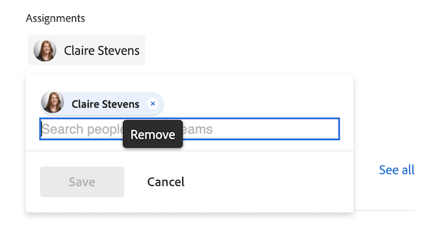

# Werkitems beheren en teamaanvragen uitvoeren in het gebied [!UICONTROL Home]

Wanneer u werktaken en problemen hebt toegewezen, worden deze weergegeven in de widget Mijn werk, Mijn taken en Mijn problemen.  U kunt werkitems en verzoeken weergeven, bewerken of verwijderen.

## Toegangsvereisten

+++ Breid uit om de toegangseisen voor de functionaliteit in dit artikel weer te geven. 

<table style="table-layout:auto"> 
 <col> 
 </col> 
 <col> 
 </col> 
 <tbody> 
  <tr> 
   <td role="rowheader"><strong>[!DNL Adobe Workfront package]</strong></td> 
   <td> 
Alle
 </td> 
  </tr> 
  <tr> 
   <td role="rowheader"><strong>[!DNL Adobe Workfront] licentie</strong></td> 
   <td>
   
Standard

    
Werk of hoger
 </td> 
  </tr> 
  <tr> 
   <td role="rowheader"><strong>Configuraties op toegangsniveau</strong></td> 
   <td> 
[!UICONTROL Edit] toegang tot taken en problemen
 </td> 
  </tr> 
  <tr> 
   <td role="rowheader"><strong>Objectmachtigingen</strong></td> 
   <td> 
Contribute-machtigingen of hoger voor de taken en problemen waaraan u moet werken
</td> 
  </tr> 
 </tbody> 
</table>

Voor informatie, zie [ vereisten van de Toegang in de documentatie van Workfront ](/help/quicksilver/administration-and-setup/add-users/access-levels-and-object-permissions/access-level-requirements-in-documentation.md).

+++

## Een tijdelijk item weergeven in de widget Mijn werk

Werkitems die aan u zijn toegewezen, worden weergegeven in de widget Mijn werk in [!UICONTROL Home] . U kunt configureren welke werkitems worden weergegeven in de widget Mijn werk met behulp van het filter boven aan de widget [!UICONTROL worklist] .

U kunt filters selecteren waarmee items worden weergegeven die klaar zijn om aan te werken, of items waaraan u momenteel al werkt.

In dit artikel wordt beschreven hoe u de filters in het gebied [!UICONTROL Home] kunt gebruiken om items weer te geven waaraan u momenteel werkt of waaraan u wellicht wilt beginnen te werken. Voor informatie over hoe te om filters in het [!UICONTROL Home] gebied te gebruiken, zie [ punten van de Vertoning in [!UICONTROL worklist] in het [!UICONTROL Home] gebied ](/help/quicksilver/workfront-basics/using-home/using-the-home-area/display-items-in-home-work-list.md).

Een tijdelijk item weergeven in de widget Mijn werk:

1. Klik het **[!UICONTROL Main Menu]**  in de hoger-juiste hoek, dan klik **[!UICONTROL Home]**.
1. (Voorwaardelijk) klik **aanpassen** om **Mijn werk** widget toe te voegen.

1. Klik het **pictogram van de Filter**  {in de hoogste-linkerhoek van de widgetwerklijst.

1. Klik op een van de volgende opties of op beide opties voor taken:

   **[!UICONTROL Ready to Start]:** toont slechts taken en kwesties die klaar zijn om te beginnen. Beide volgende instructies moeten waar zijn:

   * De taken en hun ouders hebben geen voorgangers of taakbeperkingen die hen beletten om aan te werken.
   * De [!UICONTROL Planned Start Date] van de taken of problemen bevindt zich in het verleden of maximaal twee weken in de toekomst.

   **[!UICONTROL Not Ready]**: alleen taken en problemen worden weergegeven die nog niet zijn gestart. Een van de volgende instructies moet true zijn:

   * De taken en hun ouders zouden voorgangers of taakbeperkingen kunnen hebben die hen verhinderen om aan worden gewerkt.
   * De taken of problemen hebben een [!UICONTROL Planned Start Date] die in de toekomst meer dan twee weken duurt.

1. Klik op **[!UICONTROL Working On]** onder [!UICONTROL Tasks] of [!UICONTROL Issues] om taken en problemen weer te geven waaraan u momenteel werkt.
1. Klik op **[!UICONTROL Requested]** onder [!UICONTROL Issues] om problemen weer te geven die bij u zijn aangevraagd (u bent eraan toegewezen), maar u hebt nog niet geaccepteerd om aan te werken.

## Toegang tot een teamverzoek in de widget Teamverzoek

U hebt rechtstreeks toegang tot een aanvraag die aan uw team is toegewezen via de widget Teamverzoeken in [!UICONTROL Home] -gebied. Voor meer informatie over teamverzoeken, zie [ overzicht van de verzoeken van het Team ](../../../people-teams-and-groups/work-with-team-requests/team-requests-overview.md).

Om tot een teamverzoek toegang te hebben:

1. Klik het **[!UICONTROL Main Menu]**  in de hoger-juiste hoek, dan klik **[!UICONTROL Home]**.
1. (Voorwaardelijk) klik **aanpassen** om **de Verzoeken van het Team** widget toe te voegen.

   De widget geeft teamverzoeken weer onder teamgroeperingen. De widget **[!UICONTROL Team Requests]** geeft alle aanvragen weer die zijn toegewezen aan een team dat u hebt ingeschakeld. Voor meer informatie over het werken met teamverzoeken, zie [ werk en teamverzoeken ](../../../people-teams-and-groups/work-with-team-requests/manage-work-and-team-requests.md) leiden.

   

## Werken met een tijdelijk item in de widget Mijn werk

Wanneer u op de knop [!UICONTROL Work On It] klikt, geeft u aan welke gebruiker het werkitem heeft verzonden en aan welke andere gebruiker dan ook die is toegewezen aan het werkitem dat u wilt starten.

U kunt als volgt aan een werkitem werken:

1. Klik het **[!UICONTROL Main Menu]**  in de hoger-juiste hoek, dan klik **[!UICONTROL Home]**.
1. (Voorwaardelijk) klik **aanpassen** om **Mijn werk** widget toe te voegen.

1. Selecteer in het **[!UICONTROL worklist]** -gebied van de widget de aanvraag waaraan u wilt werken en klik op **[!UICONTROL Work On It]** .
1. Beweeg over het het werkpunt, dan klik het **Summiere** pictogram om informatie over het het werkpunt te bekijken.

   

## Een tijdelijk item verwijderen

Als u besluit dat u niet aan het het werkpunt zou moeten werken, kunt u het uit uw lijst verwijderen.

Een tijdelijk item verwijderen:

1. Klik het **[!UICONTROL Main Menu]**  in de hoger-juiste hoek, dan klik **[!UICONTROL Home]**.
1. (Voorwaardelijk) klik **aanpassen** om **Mijn werk** widget toe te voegen.

1. In de widgetwerklijst, houd over het het werkpunt, dan klik het **Summiere** pictogram om informatie over het het werkpunt te bekijken.
   
1. in de **sectie van Taken**, verwijder uw naam.
   

<!--
## Reassign a request

1. Click the **[!UICONTROL Main Menu]**  in the upper-right corner, then click **[!UICONTROL Home]**.
1. In the **[!UICONTROL Work List]** area, select the request you want to reassign.

1. Click on the **[!UICONTROL Assignments]** widget and remove yourself from the request, then type the name of the user you want to reassign the request to.

   >[!TIP]
   >
   >If the work request is still in the Ready to Start or Not Ready state, you can use the **[!UICONTROL Reassign]** button in the **[!UICONTROL More]** menu in the [!UICONTROL Work List].\
   >

1. If a task's status is changed to [!UICONTROL New] or [!UICONTROL In Progress] after it was completed, you must unassign the user, save the task, then reassign the user in order for the task to reappear in their Home Work List.

## Reply to a request

You can reply to a request to further clarify the request or to propose a new date.

1. Click the **[!UICONTROL Main Menu]**  in the upper-right corner, then click **[!UICONTROL Home]**.
1. In the **[!UICONTROL Work List]** area, select the request you want to reply to.
1. Locate the individual who assigned the request to you.

   You can find this information on the [!UICONTROL Updates] tab of the task. Make sure the option to **[!UICONTROL Show System Updates]** is enabled.

1. Click **[!UICONTROL Start new update]** and begin typing your reply.
1. Enter the name of the recipient in the **[!UICONTROL Notify]** box, then click **[!UICONTROL Update]**.

   >[!TIP]
   >
   >If the work request is still in the Ready to Start or [!UICONTROL Not Ready] state, you can use the **[!UICONTROL Reply]** button in the **[!UICONTROL More]** menu in the [!UICONTROL Work List].\
   >![[!UICONTROL Reply button]](assets/reassign-in-left-panel-350x204.png)   

   -->
