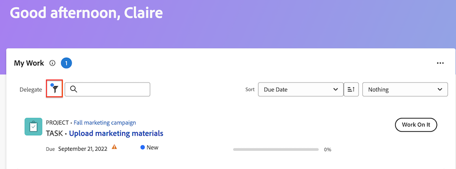
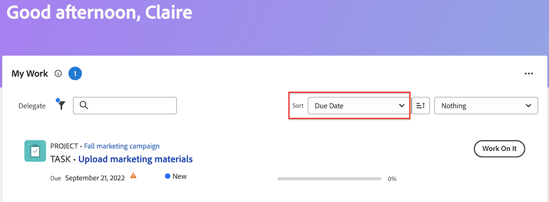

# Uw werk beheren met de widget Mijn werk

Met de widget Mijn werk worden alle toegewezen taken, problemen en verzoeken op één locatie weergegeven. Hier, kunt u uw werk filteren en organiseren, logboektijd, updates maken, en het werkpunten volledig merken.

>[!IMPORTANT]
>
>Als u taken en problemen wilt weergeven in de widget Mijn werk, moet het bovenliggende project de status Huidig hebben of een status die gelijk is aan de huidige status.

## Toegangsvereisten

+++ Breid uit om de toegangseisen voor de functionaliteit in dit artikel weer te geven.

U moet de volgende toegang hebben om de stappen in dit artikel uit te voeren:

<table style="table-layout:auto"> 
 <col> 
 </col> 
 <col> 
 </col> 
 <tbody> 
  <tr> 
   <td role="rowheader"><strong>[!DNL Adobe Workfront plan]</strong></td> 
   <td> 
Alle
 </td> 
  </tr> 
  <tr> 
   <td role="rowheader"><strong>[!DNL Adobe Workfront] licentie</strong></td> 
   <td> 
Huidig: Contribute

   
of
 
   
Nieuw:[!UICONTROL Light] of hoger
 
  </td> 
  </tr> </ul>
  <tr> 
   <td role="rowheader"><strong>Configuraties op toegangsniveau</strong></td> 
   <td> 
[!UICONTROL View] of betere toegang tot Projecten, Taken, Kwesties, en Documenten
 </td> 
  </tr>  
  <tr> 
   <td role="rowheader"><strong>Objectmachtigingen</strong></td> 
   <td> 
Contribute-machtigingen of hoger voor de taken en problemen waaraan u moet werken
  </td> 
  </tr> 
 </tbody> 
</table>

Voor meer detail over de informatie in deze lijst, zie [&#x200B; vereisten van de Toegang in de documentatie van Workfront &#x200B;](/help/quicksilver/administration-and-setup/add-users/access-levels-and-object-permissions/access-level-requirements-in-documentation.md).

+++

## Uw werk met filters zoeken

U kunt de Mijn filters van het Werk verfijnen om zich op specifieke punten in uw lijst van het werk te concentreren:

### Filterdetails

<table>
  <tbody>
    <tr>
      <td>Werken met</td>
      <td>Hiermee geeft u items weer waaraan u momenteel werkt</td>
    </tr>
    <tr>
      <td>Gereed om te starten</td>
      <td>Items weergeven met 
      <ul>
      <li>Geen onvolledige voorgangers of taakbeperkingen</li>
      
en

      <li>De geplande begindatum ligt in het verleden of maximaal twee weken in de toekomst</li>
      </ul>
      </td>
    </tr>
    <tr>
      <td>Niet klaar</td>
      <td>Hiermee geeft u items weer die
       <ul>
      <li>Onvolledige voorgangers of taakbeperkingen die verhinderen dat het item wordt bewerkt</li>
      
of

      <li>De geplande begindatum meer dan twee weken in de toekomst</li>
      </ul>
       </td>
    </tr>
    <tr>
      <td>Gevraagd</td>
      <td>Hier worden problemen weergegeven waaraan u nog niet hebt gewerkt</td>
    </tr>
    <tr>
      <td>Gedelegeerde</td>
      <td>Hiermee geeft u items weer die u aan andere gebruikers hebt gedelegeerd</td>
    </tr>
    <tr>
      <td>Aan mij gedelegeerd</td>
      <td>Hier worden items weergegeven die gebruikers aan u hebben gedelegeerd</td>
    </tr>
    <tr>
      <td>Voltooid</td>
      <td>Hiermee geeft u werk weer dat in de laatste twee weken is voltooid. Deze filteroptie omvat geen goedkeuringen.</td>
    </tr>
  </tbody>
</table>

>[!TIP]
>
>Als u specifiekere filteropties zoekt, kunt u Mijn Taak of Mijn Uitgave widgets gebruiken. Voor meer informatie over Mijn Taak en Mijn filters van de Uitgave, zie [&#x200B; overzicht van de widgetfilters van het Huis &#x200B;](/help/quicksilver/workfront-basics/using-home/using-the-home-area/widget-filter-overview-home.md).

## Uw werk organiseren

U kunt de sorteer- en groepsfuncties van de widget Mijn werk gebruiken om uw werk op een voor u begrijpelijke manier te organiseren.

### Sorteren

U kunt de werklijst sorteren op

* Vervaldatum
Eerdere items geven een waarschuwingspictogram weer naast de datum. Workfront gebruikt de Geplande Datum van de Voltooiing om te bepalen als de taken en de kwesties achterstallig zijn.
* Naam
* Percentage voltooid
* Status

>[!TIP]
>
>Als u een lijst wilt maken waarin alle items worden weergegeven die in het verleden verschuldigd zijn boven aan de widget Mijn werk, sorteert u deze op Datum verstreken en past u geen groepering toe.

### Groep

U kunt de werklijst groeperen op

* Project
* Status
* Vervaldatum
De vervaldatum wordt bepaald door de geplande datum van voltooiing.

>[!NOTE]
>
>Wanneer u een groep toepast, bepaalt de selectie in het menu Sorteren de volgorde binnen de groep.

## Gegevens over het werkitem bijwerken in het overzicht

U kunt het deelvenster Samenvatting openen om informatie in een taak of uitgave snel bij te werken. In de samenvatting kunt u

* Percentage bijwerken voltooid
* Een update toevoegen
* Navigeer naar het gebied Document om een document te uploaden
* Details van werkitems weergeven en aangepaste velden bijwerken
Workfront-beheerders kunnen aanpassen welke velden worden weergegeven in het overzicht in de lay-outsjabloon. Voor meer informatie, zie [&#x200B; het Summiere paneel aanpassen gebruikend een lay-outmalplaatje &#x200B;](/help/quicksilver/administration-and-setup/customize-workfront/use-layout-templates/customize-home-summary-layout-template.md).
* De status van het werkitem wijzigen
* Subtaken weergeven
* Logtijd
* Bijgevoegde goedkeuringsprocessen weergeven

Om de Samenvatting te openen, over het het werkpunt te bewegen, dan het **pictogram van de Samenvatting  te klikken pictogram van de Samenvatting 0&rbrace;.**

Voor extra informatie over hoe te om het Summiere paneel te gebruiken, zie [&#x200B; Overzicht van de Samenvatting &#x200B;](/help/quicksilver/workfront-basics/the-new-workfront-experience/summary-overview.md).

## Snelle acties gebruiken om werkitems bij te werken

U kunt het menu Handelingen gebruiken om

* Logtijd
* Een update toevoegen
* Een aangepast formulier bijwerken
* Een bestand uploaden

Houd de muisaanwijzer boven het werkitem om het menu met snelle acties te zoeken. De snelle vertoningen van de actielijst dichtbij het **Werk op het** of **Gereed** knoop.

## Goedkeuringen en teamverzoeken weergeven

De goedkeuringen en de teamverzoeken worden niet weergegeven in Mijn werk widget. Als u regelmatig met goedkeuringen en teamverzoeken werkt, adviseren wij u de volgende widgets aan uw Nieuwe Homepage toe te voegen:

* Mijn goedkeuring
* Alle goedkeuringen
* Teamverzoeken

Voor informatie over het toevoegen van widgets aan uw Nieuwe pagina van het Huis, zie [&#x200B; toevoegen, uitgeven, of verwijder widgets in Huis &#x200B;](/help/quicksilver/workfront-basics/using-home/using-the-home-area/add-edit-remove-widgets-in-new-home.md).
