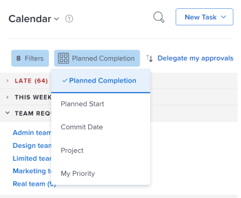

# De weergave [!UICONTROL Home Calendar] gebruiken

U kunt de kalenderweergave in het [!UICONTROL Home] -gebied gebruiken om uw werkdag en werktoewijzingen te beheren. Alleen u kunt uw [!UICONTROL Home Calendar] weergeven en beheren.

>[!NOTE]
>
>De weergave [!UICONTROL Calendar] in het [!UICONTROL Home] -gebied verschilt van een [!DNL Adobe Workfront] [!UICONTROL Calendar] -rapport. Dit is een dynamisch rapport dat een visuele weergave van uw werk biedt. Voor informatie over het [!DNL Workfront] [!UICONTROL Calendar] rapport, zie [ overzicht van de rapporten van de Kalender ](../../../reports-and-dashboards/reports/calendars/calendar-reports-overview.md).
>
>  <!--
>  <li data-mc-conditions="QuicksilverOrClassic.Draft mode">Due to a temporary problem, your Workfront Calendar data might not display as described in this article. This problem will be fixed in the near future. (NOTE: From Alina: Spoke with Lisa and Court and they agreed to draft or delete this. Court could not remember what this was referring to and Lisa did not add this note. Lisa might update this if she hears from the team that this is still accurate.)</li>>
>  -->

## Toegangsvereisten

U moet de volgende toegang hebben om de stappen in dit artikel uit te voeren:

<table style="table-layout:auto"> 
 <col> 
 </col> 
 <col> 
 </col> 
 <tbody> 
  <tr> 
   <td role="rowheader"><strong>[!DNL Adobe Workfront plan*]</strong></td> 
   <td> 
Alle
 </td> 
  </tr> 
  <tr> 
   <td role="rowheader"><strong>[!DNL Adobe Workfront] licentie*</strong></td> 
   <td> 
[!UICONTROL Work] of hoger
 </td> 
  </tr> 
  <tr> 
   <td role="rowheader"><strong>Configuraties op toegangsniveau*</strong></td> 
   <td> 
[!UICONTROL Edit] toegang tot taken en problemen
 
Opmerking: als u nog steeds geen toegang hebt, vraag dan aan de [!DNL Workfront] -beheerder of deze aanvullende beperkingen op uw toegangsniveau heeft ingesteld. Voor informatie over hoe een [!DNL Workfront] beheerder uw toegangsniveau kan wijzigen, zie <a href="../../../administration-and-setup/add-users/configure-and-grant-access/create-modify-access-levels.md" class="MCXref xref"> tot douanetoegangsniveaus </a> leiden of wijzigen.
 </td> 
  </tr> 
  <tr> 
   <td role="rowheader"><strong>Objectmachtigingen</strong></td> 
   <td> 
[!UICONTROL Contribute] machtigingen of hoger voor de taken en uitgaven die u wilt toevoegen aan de kalender
 
Voor informatie bij het vragen van om extra toegang, zie <a href="../../../workfront-basics/grant-and-request-access-to-objects/request-access.md" class="MCXref xref"> de toegang van het Verzoek tot voorwerpen </a>.
 </td> 
  </tr> 
 </tbody> 
</table>

&#42; om te weten te komen welk plan, vergunningstype, of toegang u hebt, contacteer uw [!DNL Workfront] beheerder.

## Werk-items plannen in uw [!UICONTROL Home Calendar]

U kunt [!UICONTROL Home Calendar] gebruiken om het werkpunten voor uw week te plannen.

>[!NOTE]
>
>Als u een tijdelijk item op uw [!UICONTROL Home Calendar] plaatst, worden de bestaande datums die aan het werkitem zijn gekoppeld, niet gewijzigd.

Een [!DNL Workfront] tijdelijk item toevoegen aan uw kalender:

1. Ga naar de [!UICONTROL Home Calendar] mening, zoals die in [ wordt verklaard bekijk [!UICONTROL Home Calendar]](../../../workfront-basics/using-home/using-the-home-area/view-home-calendar.md).

   Alle het werkpunten die aan u of uw groepen, teams, of baanrollen worden toegewezen tonen in het linkerpaneel. U kunt de lijst sorteren en filteren om alleen bepaalde items weer te geven.

   Voor meer informatie, zie [ Filter en de punten van het soortwerk ](#filter-and-sort-work-items) later in dit artikel.

1. Sleep het werkitem vanuit het linkerdeelvenster naar de dag en tijd waarop u eraan wilt werken.

   Als u van plan bent om aan een punt na zijn geplande voltooiingsdatum of voor meer tijd te werken dan het aantal uren het voor gepland is, toont het het werkpunt in rood en een waarschuwing verschijnt.

   Zie [[!UICONTROL Home Calendar] view ](../../../workfront-basics/using-home/using-the-home-area/home-calendar-view.md) voor meer informatie over werk-items met vervaldatums en over de manier waarop ze invloed hebben op toegewezen tijd in de [!UICONTROL Home Calendar] .

1. Voer een van de volgende handelingen uit:

   * **om een het werkpunt voor veelvoudige dagen te plannen:** Herhaal stap 2 om het punt aan elke dag en tijd toe te voegen wanneer u aan het wilt werken.
   * **om de duur van een kalenderpunt te wijzigen:** Beweeg over de bodemrand van het punt tot de curseur een dubbele pijl wordt, dan sleep de bodemrand aan de beëindigende tijd u wilt.
   * **om een kalenderpunt te schrappen:** Hover over het punt, dan klik het [!UICONTROL trashcan] pictogram dat wordt getoond.

## Werk een tijdelijk item bij op uw [!UICONTROL Home Calendar]

U kunt updates uitvoeren voor werkitems die worden weergegeven in de [!UICONTROL Home Calendar] -weergave. De updates worden ook weergegeven op het tabblad [!UICONTROL Updates] van het daadwerkelijke werkitem.

1. Ga naar de [!UICONTROL Home Calendar] mening, zoals die in [ wordt verklaard bekijk [!UICONTROL Home Calendar]](../../../workfront-basics/using-home/using-the-home-area/view-home-calendar.md).

1. Open het deelvenster [!UICONTROL Details] voor het werkitem dat u wilt bijwerken:

   * Selecteer het werkitem in het linkerdeelvenster en klik op **[!UICONTROL Details]** .
   * Van de kalender: klik de geplande kalendergebeurtenis.

   De details voor het het werkpunt tonen in een paneel dat op het recht van het venster verschijnt.

   

1. Voer een van de volgende handelingen uit om het werkitem bij te werken:

   * Typ in het vak **[!UICONTROL Start a new update]** de update, geef een of meer van de volgende gegevens op en klik op **[!UICONTROL Update]** .

     <table style="table-layout:auto">
      <col>
      <col>
      <tbody>
       <tr>
        <td role="rowheader"><strong>[!UICONTROL Notify]</strong></td>
        <td>
 Taggebruikers die u op de hoogte wilt stellen van uw update. Voor meer informatie, zie <a href="../../../workfront-basics/updating-work-items-and-viewing-updates/tag-others-on-updates.md" class="MCXref xref"> Tags anderen op updates </a>.

 
</td>
       </tr>
       <tr data-mc-conditions="">
        <td role="rowheader"><strong>[!UICONTROL Commit Date]</strong></td>
        <td>Selecteer in de vervolgkeuzelijst de datum waarop u zich ertoe verbindt het werkitem te voltooien. Voor informatie over het plaatsen van [!UICONTROL Commit Date], zie <a href="../../../manage-work/projects/updating-work-in-a-project/overview-of-commit-dates.md" class="MCXref xref">[!UICONTROL Commit Date] overzicht </a>.</td>
       </tr>
       <tr data-mc-conditions="">
        <td role="rowheader"><strong>[!UICONTROL How's this going?]</strong></td>
        <td>Selecteer een nieuwe voorwaarde voor de taak of kwestie. Voor informatie over taak en uitgevende voorwaarden, zie <a href="../../../manage-work/projects/updating-work-in-a-project/update-condition-for-tasks-and-issues.md" class="MCXref xref"> Voorwaarde van de Update voor taken en kwesties </a>.</td>
       </tr>
       <tr>
        <td role="rowheader"><strong>[!UICONTROL Private to] mijn bedrijf</strong></td>
        <td>Schakel deze optie uit om te voorkomen dat gebruikers buiten uw bedrijf deze update kunnen bekijken.</td>
       </tr>
      </tbody>
     </table>

   * Klik op de huidige **[!UICONTROL Status]** voor het item en klik vervolgens op een nieuwe status in de lijst die wordt weergegeven. Voor meer informatie, zie [ overzicht van het proces van de Goedkeuring ](../../../review-and-approve-work/manage-approvals/approval-process-in-workfront.md).

     >[!NOTE]
     >
     >Als u een aan u toegewezen werkitem markeert als [!UICONTROL Complete - Pending Approval] , wordt dit wellicht niet meer weergegeven in uw kalender. Dit komt doordat er van u geen verdere actie wordt verwacht totdat de gebruiker die is ingesteld op het goedkeuren van het item, het als [!UICONTROL Approved] markeert. Wanneer dit gebeurt, kunt u het item in uw kalender zien als een [!UICONTROL Approved] -item.

   * (Optioneel) Als u wilt reageren op een bestaande opmerking of update, klikt u op **[!UICONTROL Reply]** , geeft u ontvangers op in het vak **[!UICONTROL Notify]** , typt u uw antwoord en klikt u op **[!UICONTROL Reply]** .\

     Als u informatie over het specificeren van ontvangers nodig hebt, zie [ Tags anderen op updates ](../../../workfront-basics/updating-work-items-and-viewing-updates/tag-others-on-updates.md).

1. (Optioneel) Als u het deelvenster **[!UICONTROL Details]** wilt sluiten, klikt u op een willekeurige plaats buiten het deelvenster.

## Gebeurtenissen bijwerken van geïntegreerde kalenders

U kunt als volgt de geïntegreerde kalendergebeurtenissen in uw [!UICONTROL Home Calendar] bijwerken:

1. Ga naar de [!UICONTROL Home Calendar] mening, zoals die in [ wordt verklaard bekijk [!UICONTROL Home Calendar]](../../../workfront-basics/using-home/using-the-home-area/view-home-calendar.md).
1. Klik op **[!UICONTROL Refresh calendars]** in de rechterbovenhoek van [!UICONTROL Home Calendar] .

   

   Geïntegreerde kalendergebeurtenissen worden automatisch bijgewerkt wanneer u de [!UICONTROL Home Calendar] -weergave opent of wanneer u de [!UICONTROL Home Calendar] vernieuwt.

## Werkitems filteren en sorteren

1. Ga naar de [!UICONTROL Home Calendar] mening, zoals die in [ wordt verklaard bekijk [!UICONTROL Home Calendar]](../../../workfront-basics/using-home/using-the-home-area/view-home-calendar.md).
1. Klik op de vervolgkeuzelijst **[!UICONTROL Filter]** .

   >[!NOTE]
   >
   >Sommige filteropties zijn gebaseerd op objecten (Taken, Verzoeken, Kwesties, Goedkeuringen, Proofs en Persoonlijk) en andere zijn gebaseerd op de status ([!UICONTROL Working On], [!UICONTROL Ready to Start], [!UICONTROL Not Ready] en [!UICONTROL Completed]). Als er geen status is geselecteerd, worden in [!UICONTROL Home Calendar] alle geselecteerde objecten van een willekeurige status weergegeven. Als er geen object is geselecteerd, worden alle objecten met een willekeurige geselecteerde status weergegeven.

1. Selecteer een van de volgende filteropties om de typen items op te geven die u wilt weergeven:

   <table style="table-layout:auto"> 
    <col> 
    <col> 
    <tbody> 
     <tr> 
      <td role="rowheader"><strong>[!UICONTROL All]</strong></td> 
      <td> toont en selecteert alle punten. Dit omvat taken,   kwesties  , goedkeuringen, persoonlijke taken en voltooide taken en kwesties.</td> 
     </tr> 
     <tr> 
      <td role="rowheader"><strong>[!UICONTROL Tasks Working On]</strong></td> 
      <td> 
 toont slechts taken die u actief aan werkt. Dit zijn taken die aan u zijn toegewezen en waarvoor u op de knop [!UICONTROL Work On It] hebt geklikt. 
 </td> 
     </tr> 
     <tr> 
      <td role="rowheader"><strong>[!UICONTROL Tasks Ready to Start]</strong></td> 
      <td> 
       
 
        
Hiermee geeft u alleen taken weer die u kunt starten. Beide volgende instructies moeten waar zijn:
 
        <ul style="list-style-type: square;"> 
         <li> 
De taken en hun ouders hebben geen voorgangers of taakbeperkingen die hen beletten om aan te werken.
 </li> 
         <li> 
De [!UICONTROL Planned Start Date] van de taken is in het verleden of tot twee weken in de toekomst.
 </li> 
        </ul> 
       
 </td> 
     </tr> 
     <tr> 
      <td role="rowheader"><strong>[!UICONTROL Tasks Not Ready]</strong></td> 
      <td> 
       
 
        
Hiermee geeft u alleen taken weer die nog niet kunnen worden gestart. Een van de volgende instructies moet true zijn:
 
        <ul> 
         <li> 
De taken en hun ouders zouden voorgangers of taakbeperkingen kunnen hebben die hen verhinderen om aan worden gewerkt.
 </li> 
         <li> 
De taken hebben een [!UICONTROL Planned Start Date] die meer dan twee weken in de toekomst is.
 </li> 
        </ul> 
       
 </td> 
     </tr> 
     <tr> 
      <td role="rowheader"><strong>[!UICONTROL Issues Working On]</strong></td> 
      <td> 
Hiermee geeft u alleen problemen weer waaraan u actief werkt. Dit zijn aan u toegewezen problemen waarvoor u op de knop [!UICONTROL Work On It] hebt geklikt.
 </td> 
     </tr> 
     <tr> 
      <td role="rowheader"><strong>[!UICONTROL Issues Requested]</strong></td> 
      <td> toont slechts kwesties die u aan maar worden toegewezen waarvoor u niet de [!UICONTROL Work On It] knoop hebt geklikt. </td> 
     </tr> 
     <tr> 
      <td role="rowheader"><strong>[!UICONTROL Personal]</strong></td> 
      <td>Hiermee geeft u alleen persoonlijke taken weer. Dit zijn taken die u als [!UICONTROL To Do] taak creeert, zoals die in de sectie <a href="../../../workfront-basics/using-home/using-the-home-area/create-work-items-in-home.md#creating-a-personal-task">[!UICONTROL Create a personal task]</a> in het artikel <a href="../../../workfront-basics/using-home/using-the-home-area/create-work-items-in-home.md"> wordt beschreven creeer het werkpunten van het [!UICONTROL Home] gebied </a>.</td> 
     </tr> 
     <tr> 
      <td role="rowheader"><strong>[!UICONTROL Approvals]</strong></td> 
      <td> 
       
 
        
Hiermee geeft u alleen goedkeuringen weer die aan u zijn toegewezen of gedelegeerd en goedkeuringen die u hebt verzonden. Goedkeuringen omvatten goedkeuringen voor werkitems (projecten, taken en kwesties) en goedkeuringen voor documenten, proefdrukken, verzoeken om toegang en tijdkaarten. Raadpleeg de volgende artikelen voor meer informatie over goedkeuringen:
 
        <ul> 
         <li><a href="../../../review-and-approve-work/manage-approvals/view-approvals.md" class="MCXref xref"> Goedkeuringen weergeven </a> </li> 
        </ul> 
        <ul> 
         <li> 
<a href="../../../review-and-approve-work/manage-approvals/manage-approvals.md" class="MCXref xref"> beheert goedkeuringen </a> 
 </li> 
        </ul> 
        
Opmerking: goedkeuringen die u hebt ingediend en waarvoor u ook een van de fiatteurs bent, worden twee keer geteld. 
 
       
 </td> 
     </tr> 
     <tr> 
      <td role="rowheader"><strong>[!UICONTROL Completed]</strong></td> 
      <td> toont slechts voltooide taken, kwesties, en persoonlijke taken. De voltooide het werkvertoningen voor de vorige twee weken, en wordt gegroepeerd in de Lijst van het Werk volgens week. Goedkeuringen zijn niet inbegrepen. </td> 
     </tr> 
    </tbody> 
   </table>

   

1. Als u de lijst met taken wilt groeperen en sorteren, klikt u op de vervolgkeuzelijst **[!UICONTROL Group by]** en selecteert u de criteria die u wilt gebruiken.

   De items worden aan de linkerkant van de kalender weergegeven volgens de criteria en in de volgorde die u opgeeft.

   

   Kies een van de volgende opties:

   <table style="table-layout:auto">
    <tr>
        <td><strong>[!UICONTROL Planned Completion]</strong></td>
        <td>Taken en uitgaven worden gesorteerd in volgorde van de [!UICONTROL Planned Completion dates] . Meer over [!UICONTROL Planned Completion dates] leren, zie <a href="../../../manage-work/tasks/task-information/planned-hours.md"> Gepland overzicht van Uren </a>.</td>
        <td></td>
    </tr>
    <tr>
        <td><strong>[!UICONTROL Planned Start]</strong></td>
        <td>Taken en uitgaven worden gesorteerd in volgorde van de [!UICONTROL Planned Start dates] . Voor meer informatie over taak [!UICONTROL Planned Start Dates], zie <a href="../../../manage-work/tasks/task-information/task-planned-start-date.md"> Overzicht van de taak [!UICONTROL Planned Start Date]</a>.</td>
    </tr>
    <tr>
        <td><strong>[!UICONTROL Commit Date]</strong></td>
        <td>Taken en uitgaven worden gesorteerd in volgorde van de [!UICONTROL Commit dates] . Meer over [!UICONTROL Commit dates] leren, zie <a href="../../../manage-work/projects/updating-work-in-a-project/overview-of-commit-dates.md">[!UICONTROL Commit Date] overzicht </a>.</td>
    </tr>
    <tr>
        <td><strong>[!UICONTROL Project]</strong></td>
        <td>Werkitems worden gesorteerd op project.</td>
    </tr>
    <tr>
        <td><strong>[!UICONTROL My Priority]</strong></td>
        <td>De items worden in een door u gekozen volgorde weergegeven. Voor meer informatie, zie <a href="../../../workfront-basics/using-home/using-the-home-area/prioritize-work-in-home.md"> het werk in het [!UICONTROL Home] gebied </a> Prioritize.</td>
    </tr>
   </table>

## Naar een andere week navigeren

1. Ga naar uw [!UICONTROL Home Calendar] mening, zoals die in [ wordt verklaard bekijk [!UICONTROL Home Calendar]](../../../workfront-basics/using-home/using-the-home-area/view-home-calendar.md).
1. Klik in het **[!UICONTROL Calendar toolbar]** op de pijl naar links van de datumindicator om de kalenderweergave een week terug te verplaatsen of op de pijl naar rechts om één week vooruit te gaan.

   

   U kunt op **[!UICONTROL Today]** klikken om terug te keren naar de huidige week.

## Opgeven welke kalenders u weergeeft

U kunt opgeven welke geïntegreerde kalenders u wilt bekijken op uw [!UICONTROL Home Calendar] , zoals uw PTO-, Verjaardag- of vakantiekalender. Voor instructies, zie [ uw [!UICONTROL Home Calendar] meningsmontages ](../../../workfront-basics/using-home/using-the-home-area/configure-home-calendar-view.md) vormen.
