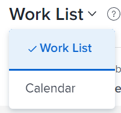

# De [!UICONTROL Home Calendar] weergeven

U kunt de [!UICONTROL Calendar] weergave in [!DNL Adobe Workfront Home] gebruiken om alle toegewezen werkitems op één locatie te beheren. De weergave [!UICONTROL Home Calendar] is alleen voor u zichtbaar en alleen u kunt de weergave [!UICONTROL Home Calendar] beheren.

Meer over de Kalender van het Huis leren, zie [ mening van de Kalender van het Huis ](../../../workfront-basics/using-home/using-the-home-area/home-calendar-view.md).

## Toegangsvereisten

U moet de volgende toegang hebben om de stappen in dit artikel uit te voeren:

<table style="table-layout:auto"> 
 <col> 
 </col> 
 <col> 
 </col> 
 <tbody> 
  <tr> 
   <td role="rowheader"><strong>[!DNL Adobe Workfront plan*]</strong></td> 
   <td> 
Alle
 </td> 
  </tr> 
  <tr> 
   <td role="rowheader"><strong>[!DNL Adobe Workfront] licentie*</strong></td> 
   <td> 
[!UICONTROL Work] of hoger
 </td> 
  </tr> 
  <tr> 
   <td role="rowheader"><strong>Configuraties op toegangsniveau*</strong></td> 
   <td> 
[!UICONTROL Edit] toegang tot taken en problemen
 
Opmerking: als u nog steeds geen toegang hebt, vraag dan aan de [!DNL Workfront] -beheerder of deze aanvullende beperkingen op uw toegangsniveau heeft ingesteld. Voor informatie over hoe een [!DNL Workfront] beheerder uw toegangsniveau kan wijzigen, zie <a href="../../../administration-and-setup/add-users/configure-and-grant-access/create-modify-access-levels.md" class="MCXref xref"> tot douanetoegangsniveaus </a> leiden of wijzigen.
 </td> 
  </tr> 
  <tr> 
   <td role="rowheader"><strong>Objectmachtigingen</strong></td> 
   <td> 
[!UICONTROL Contribute] machtigingen of hoger voor de taken en uitgaven die u wilt toevoegen aan de kalender
 
Voor informatie bij het vragen van om extra toegang, zie <a href="../../../workfront-basics/grant-and-request-access-to-objects/request-access.md" class="MCXref xref"> de toegang van het Verzoek tot voorwerpen </a>.
 </td> 
  </tr> 
 </tbody> 
</table>

&#42; om te weten te komen welk plan, vergunningstype, of toegang u hebt, contacteer uw [!DNL Workfront] beheerder.

## De [!DNL Workfront] [!UICONTROL Home Calendar] weergeven

1. Klik op het pictogram **[!UICONTROL Home]**  in de linkerbovenhoek van Adobe Workfront.

   >[!NOTE]
   >
   >Uw [!DNL Workfront] -beheerder kan de volgende wijzigingen aanbrengen in het pictogram [!UICONTROL Home] in uw omgeving:
   >
   >* Vervang deze door een afbeelding die is aangepast om uw organisatie te illustreren. In dit geval ziet het pictogram er anders uit dan in dit artikel.
   >* De gekoppelde pagina vervangen door een andere pagina. Klik in dit geval op **[!UICONTROL Main Menu]**  in de rechterbovenhoek van de pagina en klik vervolgens op **[!UICONTROL Home]** .

1. Klik op **[!UICONTROL Work List]** in de linkerbovenhoek van Home en klik vervolgens op **[!UICONTROL Calendar]** in het vervolgkeuzemenu.

   

   De weergave [!UICONTROL Home Calendar] wordt weergegeven.

   

   Alle het werkpunten die aan u worden toegewezen of aan uw groepen, teams, of rollen worden toegewezen tonen in het linkerpaneel.

   U kunt uw werkdag beheren door taken vanuit het linkerdeelvenster naar de kalender te slepen. Leren over hoe te om uw [!UICONTROL Home Calendar] te bevolken, zie [ Gebruik de [!UICONTROL Home Calendar] mening ](../../../workfront-basics/using-home/using-the-home-area/use-home-calendar-view.md).
