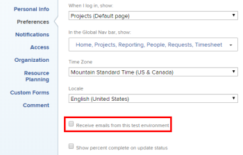

# Uw eigen e-mailmeldingen wijzigen

<!-- Audited: 1/2024 -->

Uw Adobe [!DNL Workfront] -beheerder configureert welke e-mailberichten gebruikers ontvangen wanneer gebeurtenissen plaatsvinden in Workfront (zoals beschreven in [[!UICONTROL Configure event] meldingen voor iedereen in het systeem &#x200B;](../../administration-and-setup/manage-workfront/emails/configure-event-notifications-for-everyone-in-the-system.md) ).

Uw groepsbeheerder kan ook configureren welke meldingen voor u en de gebruikers in uw [!UICONTROL Home Group] worden geactiveerd. Als uw [!UICONTROL Home Group] een subgroep is, ontvangt u de meldingen die zijn geactiveerd voor de bovenste groep boven uw groep.

U kunt dit verder aanpassen door te vormen welke berichten u ontvangt. U kunt ook kiezen of u meldingen wilt ontvangen terwijl gebeurtenissen plaatsvinden of in één e-mail met dagelijkse controlesamenvatting.

Voor meer informatie over e-mailberichten, zie [[!DNL Adobe Workfront]  berichten &#x200B;](../../workfront-basics/using-notifications/wf-notifications.md).

>[!NOTE]
>
>* Als u een berichttype activeert en dan ontdekt dat u geen berichten van dat type ontvangt, kan het zijn omdat dat type niet voor uw rol van toepassing is.
>* De [!DNL Workfront] -beheerder of een groepsbeheerder kan geen meldingen voor [!DNL Workfront Goals] configureren. Voor meer informatie over welke berichten de [!DNL Workfront] beheerder kan vormen, zie [&#x200B; gebeurtenisberichten voor iedereen in het systeem &#x200B;](../../administration-and-setup/manage-workfront/emails/configure-event-notifications-for-everyone-in-the-system.md) vormen. Lees dit artikel voor meer informatie over het configureren van individuele meldingen voor [!DNL Workfront Goals] .
>

## Toegangsvereisten

+++ Breid uit om de toegangseisen voor de functionaliteit in dit artikel weer te geven.

<table style="table-layout:auto"> 
 <col> 
 </col> 
 <col> 
 </col> 
 <tbody> 
  <tr> 
   <td role="rowheader"><strong>[!DNL Adobe Workfront package]</strong></td> 
   <td> 
Alle
 </td> 
  </tr> 
  <tr> 
   <td role="rowheader"><strong>[!DNL Adobe Workfront] licentie</strong></td> 
   <td> 
Medewerker of hoger

   
Aanvraag of hoger

   </td> 
  </tr> 
 </tbody> 
</table>

Voor informatie, zie [&#x200B; vereisten van de Toegang in de documentatie van Workfront &#x200B;](/help/quicksilver/administration-and-setup/add-users/access-levels-and-object-permissions/access-level-requirements-in-documentation.md).

+++

## De instellingen voor e-mailmeldingen weergeven en wijzigen

{{step1-click-profile-pic}}

1. Klik het **[!UICONTROL More]** pictogram  naast uw naam, dan klik **[!UICONTROL Edit]**.

1. Ga in het vak **[!UICONTROL Edit Person]** dat wordt weergegeven naar de sectie **[!UICONTROL Notifications]** .

1. Klik op een categorie om de meldingsinstellingen voor die categorie weer te geven.

   

1. Schakel de selectievakjes aan de rechterkant in of uit om op te geven of u meldingen dagelijks, direct of beide wilt ontvangen.

   U kunt ook de selectievakjes voor een categorie gebruiken om alle meldingen in die categorie te activeren of deactiveren.

   >[!NOTE]
   >
   >Als u een teamlid voor een project bent, blijft u e-mailberichten voor het ontvangen tot u van het team wordt verwijderd, zelfs als u geen toegang meer tot het project hebt. Voor instructies bij het verwijderen van gebruikers uit een team, zie [&#x200B; gebruikers uit projecten &#x200B;](../../manage-work/projects/manage-projects/remove-users-from-projects.md) verwijderen.

   Voor de categorie **[!UICONTROL Communication]** kunt u afzonderlijke meldingen selecteren, alleen voor directe levering. Als u meldingen in een dagelijkse samenvatting wilt laten verzenden, moet u ze allemaal selecteren.

   Als alle e-mailberichten voor een bepaalde categorie zijn geactiveerd, wordt het vak in de titel van de categorie weergegeven als geselecteerd. Als alle e-mailberichten in een bepaalde categorie zijn gedeactiveerd, is het selectievakje uitgeschakeld. Als sommige meldingen zijn geactiveerd en andere zijn gedeactiveerd, wordt het selectievakje Categorie weergegeven als een rechte lijn.\
   Wanneer u een meldingsinstelling wijzigt, wordt het label **[!UICONTROL Edited]** weergegeven voor die meldingsinstelling, zodat u weet dat die meldingsinstelling is gewijzigd.

1. Als u meldingen hebt geselecteerd die u wilt verzenden als dagoverzicht, selecteert u de tijd van de dag waarop u deze wilt ontvangen boven aan de sectie **[!UICONTROL Notifications]** in het menu **[!UICONTROL Email Daily Digest after]** .

   

   De dagelijkse samenvatting bevat gebeurtenissen die 24 uur vóór de geselecteerde tijd voldoen aan de criteria voor de meldingen. U ontvangt één dagelijkse samenvatting per e-mail voor elk type bericht.\
   De dagelijkse controlesamenvatting kan aankomen na de tijd die u selecteert, afhankelijk van het aantal e-mails in de wachtrij voor levering in het systeem. De vermelde tijd is uw lokale tijd zoals die in uw browser montages wordt gespecificeerd.

1. (Voorwaardelijk en optioneel) Schakel de instelling **[!UICONTROL Receive emails from this test environment]** in om e-mailberichten te ontvangen wanneer u de instellingen voor e-mailmeldingen in de voorbeeldomgeving wijzigt. E-mails worden niet automatisch gegenereerd vanuit de voorvertoningsomgeving.

   

1. Klik op **[!UICONTROL Save Changes]**.
