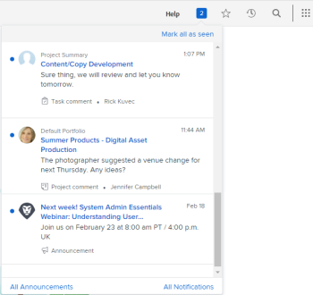

# Meldingen in apps weergeven en beheren

Meldingen in de app houden u op de hoogte van twee soorten informatie: aankondigingsmeldingen en meldingen voor het werkitem. Deze zijn zowel beschikbaar in de webtoepassing als in de mobiele toepassing.

Voor een lijst van het het werkpunt en aankondigingsberichten u kunt ontvangen, zie [ In-app berichtenoverzicht ](../../workfront-basics/using-notifications/in-app-notifications-overview.md).

>[!NOTE]
>
>* Meldingen in de app voor werkactiviteiten zijn niet gekoppeld aan e-mailmeldingen in [!DNL Workfront] . Voor meer informatie, zie [[!DNL Adobe Workfront]  berichten ](../../workfront-basics/using-notifications/wf-notifications.md)
>* Meldingen in de app kunnen niet worden aangepast.
>

## Toegangsvereisten

U moet de volgende toegang hebben om de stappen in dit artikel uit te voeren:

<table style="table-layout:auto"> 
 <col> 
 </col> 
 <col> 
 </col> 
 <tbody> 
  <tr> 
   <td role="rowheader"><strong>[!DNL Adobe Workfront] plan*</strong></td> 
   <td> 
Alle
 </td> 
  </tr> 
  <tr> 
   <td role="rowheader"><strong>[!DNL Adobe Workfront] licentie*</strong></td> 
   <td> 
[!UICONTROL Request] of hoger
 </td> 
  </tr> 
 </tbody> 
</table>

Neem contact op met de [!DNL Workfront] -beheerder als u wilt weten welk abonnement- of licentietype u hebt.

## Meldingen weergeven

Het genummerde pictogram in de rechterbovenhoek van [!DNL Workfront] geeft het aantal meldingen weer dat u nog niet hebt bevestigd.

>[!NOTE]
>
>U kunt alle meldingen in de app weergeven, zowel vanuit de webtoepassing als vanuit de mobiele toepassing. Slechts enkele van deze meldingen worden als pushberichten verzonden in de mobiele toepassing. Voor meer informatie over berichten in mobiele app, zie [[!DNL Adobe Workfront]  voor iOS ](../../workfront-basics/mobile-apps/using-the-workfront-mobile-app/workfront-for-ios.md) of [[!DNL Adobe Workfront]  voor Android ](../../workfront-basics/mobile-apps/using-the-workfront-mobile-app/workfront-for-android.md).

1. Klik op het genummerde pictogram  in de rechterbovenhoek van [!DNL Workfront] om de lijst met meldingen te openen.

   De meest recente ongelezen meldingen worden weergegeven onder het genummerde pictogram, met de meest recente bovenaan.

   

   Het getalpictogram geeft een schuifbare lijst weer met maximaal 80 meldingen. Als u meer wilt zien, klikt u op **[!UICONTROL All notifications]** onder aan de lijst om maximaal 500 meldingen weer te geven. Meldingen worden na 30 dagen automatisch verwijderd.

   Onder aan elke melding worden de [!UICONTROL notification type] en een bijbehorende identificatiepictogramweergave weergegeven. Deze Help u identificeren wat er met het vermelde [!DNL Workfront] item is gebeurd en waarschuwen u als u een actiepunt hebt:

   * Aankondigingsmeldingen worden aangegeven met het pictogram [!UICONTROL announcements] . 

   * Alle andere meldingen worden aangegeven met pictogrammen die aangeven met welk type werkitem ze worden geassocieerd.

     
Het pictogram rechts van de blauwe stip geeft een van de volgende opties weer:

   * De profielfoto van de persoon die de informatie heeft getypt, meestal een update over een [!DNL Workfront] -object waaraan u werkt.
   * Het [!DNL Workfront] -logo, als de melding een systeemaankondiging is.

1. (Optioneel) Als u de datum wilt bekijken waarop u een melding hebt ontvangen, plaatst u de muis boven de dag- of tijdindicator in de rechterbovenhoek van het bericht.

   

1. Klik op het bericht dat u wilt weergeven:

   * Als het bericht waarop u klikt, over een tijdelijk item gaat, wordt het gekoppelde [!DNL Workfront] -object geopend en wordt het volledige bericht op het tabblad **[!UICONTROL Updates]** weergegeven. U kunt **[!UICONTROL Start a new update area]** of **[!UICONTROL Type a reply]**.

     

   * Als het bericht waarop u klikt voor een aankondiging  is, wordt de pagina **[!UICONTROL Announcements]** weergegeven met al uw aankondigingen. De aankondiging u klikte wordt geselecteerd op de linkerzijde en het bericht wordt getoond op het recht.

     

1. (Optioneel) Download alle bijlagen die in het meldingsbericht zijn opgenomen of download alle bijlagen als ZIP-bestand.

   

## Kennisgevingen bevestigen

Na het bekijken van berichten, kunt u hen erkennen om hen van de [!UICONTROL Notifications] lijst te ontruimen of hen te verlaten om aan later te antwoorden.

Op de pagina [!UICONTROL Notifications] kunt u huidige en gewiste meldingen weergeven. U kunt gewiste meldingen ook terugplaatsen naar de lijst in [!UICONTROL Notifications] .

* [Kennisgevingen bevestigen](#acknowledge-notifications)
* [Erkende meldingen weergeven](#view-acknowledged-notifications)

### Kennisgevingen bevestigen

Als u op het genummerde pictogram klikt om de lijst met meldingen te openen, wordt niet automatisch bevestigd dat u alle meldingen hebt gelezen.

Een melding bevestigen en deze uit de lijst met meldingen wissen:

1. Klik op het genummerde pictogram  in de rechterbovenhoek van [!DNL Workfront] om de lijst met meldingen te openen.
1. Voer een van de volgende handelingen uit:

   * Klik op de blauwe stip in de linkerbovenhoek van het bericht.
   * Als het bericht voor een het werkpunt (eerder dan voor een aankondiging) is, klik het bericht om naar het punt te gaan.
   * Als het bericht voor een aankondiging is, klikt u op het bericht om de pagina **[!UICONTROL Announcements]** te openen.
   * Klik op **[!UICONTROL All Notifications]** in de rechterbenedenhoek van de lijst met meldingen om de **[!UICONTROL Notifications]** -pagina weer te geven en klik vervolgens op **[!UICONTROL Mark all as seen]** in de rechterbovenhoek van Workfront.

### Erkende meldingen weergeven

Meldingen weergeven die u al hebt bevestigd:

1. Klik op het genummerde pictogram  in de rechterbovenhoek van [!DNL Workfront] om de lijst met meldingen te openen.
1. Klik op **[!UICONTROL All Notifications]** rechtsonder in de lijst met meldingen.
1. Schuif omlaag op de pagina **[!UICONTROL Notifications]** die wordt weergegeven om uw oude meldingen weer te geven.
1. (Optioneel) Klik op de blauwe cirkel naast de melding als u een bevestiging van de melding wilt terugbrengen naar de lijst met meldingen.

## Een aankondiging verwijderen

U kunt meldingen voor tijdelijke items niet verwijderen. [!DNL Workfront] verwijdert alle meldingen (lezen of ongelezen) na 30 dagen.

U kunt echter wel een aankondigingsbericht verwijderen. U kunt ook een aankondiging openen die u hebt verwijderd binnen 30 dagen nadat u deze hebt verwijderd. [!DNL Workfront] verwijdert aankondigingen niet automatisch.

* [Een aankondiging verwijderen](#delete-an-announcement)
* [Onlangs verwijderde aankondiging openen en herstellen](#access-and-restore-an-announcement-you-deleted-recently)

### Een aankondiging verwijderen

1. Klik op het genummerde pictogram  in de rechterbovenhoek van [!DNL Workfront] om de lijst met meldingen te openen.
1. Klik op **[!UICONTROL Announcements]** of **[!UICONTROL View All Announcements]** .

1. Klik op de pagina **[!DNL Announcements]** die wordt weergegeven op de aankondiging die u wilt verwijderen in de lijst aan de linkerkant en klik vervolgens op **[!UICONTROL Delete]** rechtsboven op de pagina.

### Onlangs verwijderde aankondiging openen en herstellen

U kunt een melding openen die u de afgelopen 30 dagen hebt verwijderd.

1. Klik op het genummerde pictogram  in de rechterbovenhoek van [!DNL Workfront] om de lijst met meldingen te openen.
1. Klik op **[!UICONTROL Announcements]** of **[!UICONTROL View All Announcements]** .

1. Klik op **[!UICONTROL Deleted]** op de pagina die **[!UICONTROL Announcements]** wordt weergegeven.

1. Klik op het bericht dat u wilt weergeven.
1. (Optioneel) Als u de aankondiging wilt herstellen, klikt u op **[!UICONTROL Move to Inbox]** boven en rechts van de tekst van de aankondiging.
