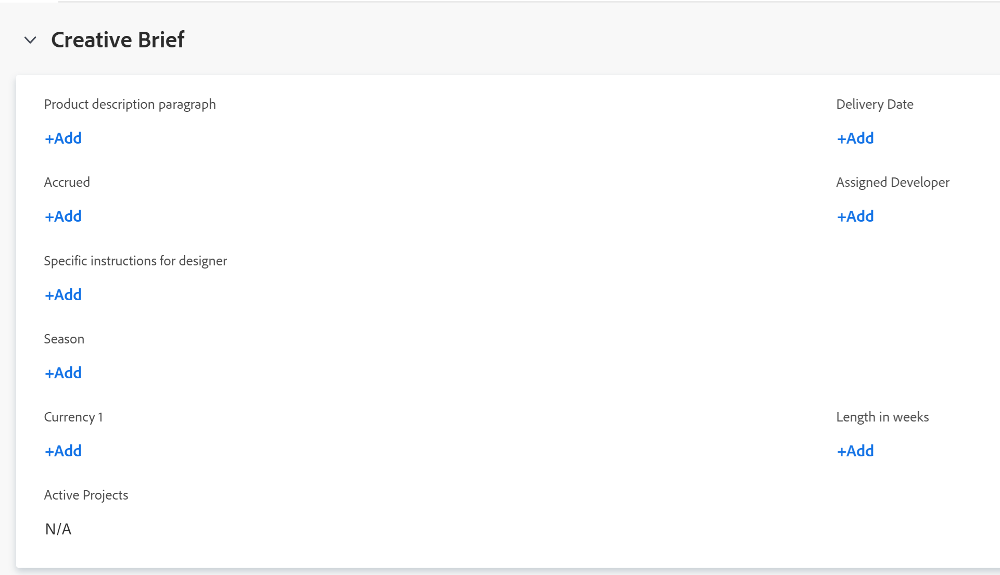

# Gegevens bewerken in aangepaste formuliervelden

{{preview-and-fast-release}}

U kunt gegevens op een aangepast formulier bewerken nadat het formulier aan een object is gekoppeld. Zie voor informatie over het toevoegen van aangepaste formulieren aan objecten [Een aangepast formulier toevoegen aan een object](../../workfront-basics/work-with-custom-forms/add-a-custom-form-to-an-object.md).

## Toegangsvereisten

U moet het volgende hebben:

<table style="table-layout:auto"> 
 <col> 
 <col> 
 <tbody> 
  <tr> 
   <td role="rowheader"> 
Adobe Workfront-abonnement*
 </td> 
   <td>Team of hoger</td> 
  </tr> 
  <tr> 
   <td role="rowheader"> 
Adobe Workfront-licenties*
 </td> 
   <td> 
Aanvraag of hoger
 </td> 
  </tr> 
  <tr data-mc-conditions=""> 
   <td role="rowheader">Toegangsniveau*</td> 
   <td> 
Toegang bewerken tot het object waarvoor u het aangepaste formulier wilt bewerken
 
Opmerking: als u nog steeds geen toegang hebt, vraag dan aan de Workfront-beheerder of deze aanvullende beperkingen op uw toegangsniveau heeft ingesteld. Voor informatie over hoe een beheerder van Workfront uw toegangsniveau kan veranderen, zie <a href="../../administration-and-setup/add-users/configure-and-grant-access/create-modify-access-levels.md" class="MCXref xref">Aangepaste toegangsniveaus maken of wijzigen</a>.
 </td> 
  </tr> 
  <tr data-mc-conditions=""> 
   <td role="rowheader"> 
Objectmachtigingen
 </td> 
   <td> 
    <ul> 
     <li> 
Contribute of hoger voor het object waarvoor u het aangepaste formulier wilt bewerken
 </li> 
     <li>Machtigingen weergeven voor de velden die u wilt bewerken. Zie voor informatie over het delen van machtigingen voor aangepaste velden <a href="../../administration-and-setup/customize-workfront/create-manage-custom-forms/configure-sharing-for-a-custom-field.md" class="MCXref xref">Delen voor aangepaste velden en widgets configureren</a>.</li> 
     <li> 
Machtigingen bewerken voor de secties in het formulier waar de velden die u wilt bewerken zich bevinden
 </li> 
    </ul> 
Zie voor informatie over het aanvragen van aanvullende toegang voor objecten <a href="../../workfront-basics/grant-and-request-access-to-objects/request-access.md" class="MCXref xref">Toegang tot objecten aanvragen </a>.
 </td> 
  </tr> 
 </tbody> 
</table>

&#42;Neem contact op met uw Workfront-beheerder om te weten te komen welk plan, licentietype of toegang u hebt.

## Vereisten

* Uw Workfront-beheerder of een Abonnementsgebruiker met beheerdersrechten voor aangepaste formulieren moet aangepaste formulieren maken in uw omgeving. Zie voor meer informatie [Een aangepast formulier maken of bewerken](../../administration-and-setup/customize-workfront/create-manage-custom-forms/create-or-edit-a-custom-form.md).
* Er moeten aangepaste formulieren aan een object zijn gekoppeld.

  Voor informatie over hoe u aangepaste formulieren op een object kunt toepassen, raadpleegt u [Een aangepast formulier toevoegen aan een object](../../workfront-basics/work-with-custom-forms/add-a-custom-form-to-an-object.md).

## Informatie bewerken op een aangepast formulier

Het bewerken van gegevens op een aangepast formulier dat aan een object is gekoppeld, is identiek voor alle objecten. Voor informatie over welke objecten een aangepast formulier kunnen bevatten, raadpleegt u [Overzicht van aangepaste formulieren](../../administration-and-setup/customize-workfront/create-manage-custom-forms/custom-forms-overview.md).

1. Ga naar een object waarvan u de gegevens in het aangepaste formulier wilt bewerken.
1. Klikken **`<Object type>`Details** in het linkerdeelvenster.

   Als u bijvoorbeeld gegevens bewerkt op een aangepast formulier voor een project, klikt u op **Projectdetails**.

1. Blader naar het aangepaste formulier. Als er een aangepast formulier aan het object is gekoppeld, wordt de naam van het formulier als een gebied weergegeven in de sectie Details.
1. Klik zo nodig op de pijl  links van de naam van het aangepaste formulier om het uit te vouwen.
1. Klik rechtsboven op de pagina op het pictogram Bewerken .
1. Voer de gegevens in een veld in waartoe u toegang hebt.

   

   of

   Als er nog geen gegevens op het formulier zijn ingevoerd, klikt u op **Toevoegen+** voor om het even welk gebied u toegang hebt tot en begint informatie in te gaan.

   

   Als er meerdere aangepaste formulieren aan het object zijn gekoppeld, kunt u dit voor elk formulier doen.

   Afhankelijk van het type veld waarin u werkt, kunt u het volgende overwegen:

   * U kunt slechts één optie selecteren voor velden met keuzerondjes.
   * U kunt een of meerdere opties selecteren in een selectievakje, afhankelijk van de configuratie van het veld door de maker van het formulier.
   * U kunt een of meerdere opties selecteren in een meerkeuzeveld, afhankelijk van de configuratie van het veld door de maker van het formulier.
   * U kunt tekstvelden alleen opmaken (vet, cursief of onderstrepen) als de gebruiker die het formulier heeft gemaakt, deze heeft ingesteld als een tekstveld met het veldtype Opmaak. Tekstvelden met één regel en tekstvelden met één regel kunnen niet worden opgemaakt.
   * U kunt de tijd van de dag alleen bijwerken in een datumveldtype als de gebruiker die het formulier heeft gemaakt het heeft opgenomen tijdens het maken van het veld.

   Voor informatie over alle veldtypen raadpleegt u [Een aangepast formulier maken of bewerken](../../administration-and-setup/customize-workfront/create-manage-custom-forms/create-or-edit-a-custom-form.md).

1. Klikken **Wijzigingen opslaan**.

   >[!IMPORTANT]
   >
   >U moet alle vereiste velden op het formulier invullen voordat u het formulier kunt opslaan. De naam van een vereist veld wordt gevolgd door een sterretje.
   >
   >

   Wanneer iemand gegevens wijzigt in een ander object waarnaar wordt verwezen door berekende aangepaste velden in het object, worden de wijzigingen niet automatisch doorgevoerd in het object. Zie voor informatie over het handmatig bijwerken van alle berekende aangepaste velden in het object [Alle berekende aangepaste velden voor een object opnieuw berekenen](#recalculate-all-calculated-custom-fields-for-an-object) in dit artikel.

   Wanneer afhankelijke velden op de pagina worden gewijzigd, worden berekende velden op het aangepaste formulier dynamisch opnieuw berekend in real-time. U kunt de nieuwe berekende veldwaarde zien zonder het formulier op te slaan, maar deze wordt pas daadwerkelijk toegepast op het formulier en het object als u de wijzigingen opslaat. Dit geldt zowel voor berekende velden op standaardformulieren als voor aangepaste formulieren.

   U kunt ook handmatig alle berekende aangepaste velden voor een object bijwerken wanneer u het object samen met andere objecten in een lijst bulksgewijs bewerkt. Zie voor instructies [Alle berekende aangepaste velden voor meerdere objecten in een lijst opnieuw berekenen wanneer u de objecten bewerkt](#recalculate-all-calculated-custom-fields-for-multiple-objects-in-a-list-when-editing-the-objects) in dit artikel.

## Alle berekende aangepaste velden voor een object opnieuw berekenen  {#recalculate-all-calculated-custom-fields-for-an-object}

1. Ga naar de hoofdpagina van het object waarvan u de aangepaste velden opnieuw wilt berekenen.
1. Klik op de knop **Meer** menu  rechts van de naam van het object klikt u op **Expressies opnieuw berekenen**.

   Hiermee worden alle aangepaste velden op het formulier van het object opnieuw berekend.

## Alle berekende aangepaste velden voor meerdere objecten in een lijst opnieuw berekenen wanneer u de objecten bewerkt {#recalculate-all-calculated-custom-fields-for-multiple-objects-in-a-list-when-editing-the-objects}

<!--

(NOTE: this will need to be edited when the bulk edit for objects update in NW)

-->

U kunt de aangepaste velden van verschillende objecten handmatig opnieuw berekenen door deze los van een lijst of rapport te bewerken.

1. Ga naar een lijst met objecten die aangepaste formulieren met berekende velden bevatten.
1. Selecteer de objecten waarvan u de berekende aangepaste velden wilt bijwerken.
1. Klik op de knop **Pictogram Bewerken**.
1. Klikken **Aangepaste Forms** in het linkermenu selecteert u vervolgens **Aangepaste expressies opnieuw berekenen**.
1. Klikken **Opslaan** **Wijzigingen**.

   Workfront berekent alle aangepaste velden voor alle geselecteerde objecten.

>[!TIP]
>
>Afhankelijk van de complexiteit van uw projecten raden we u aan geen groot aantal projecten te selecteren wanneer u berekende aangepaste velden bulksgewijs herberekent voor optimale prestaties. Sommige dingen die een project te complex zouden kunnen maken zouden veelvoudige gebiedsdelen of taken of een groot aantal douanevelden kunnen zijn.
>
>Aangepaste expressies bulksgewijs herberekenen in een lijst met projecten:
>
>1. Ga naar een projectlijst of rapport en selecteer één of verscheidene projecten.
>1. Klik op de knop **Meer** menu en klik vervolgens op **Aangepaste expressies opnieuw berekenen**.
>
>
>
>Workfront berekent alle aangepaste velden voor alle geselecteerde projecten.
