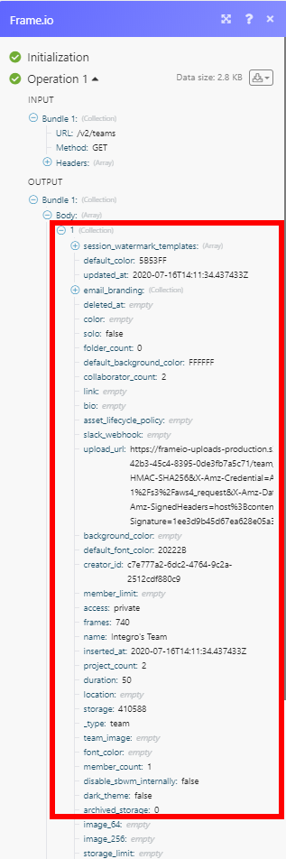

# [!DNL Frame.io] modules

Met de modules [!DNL Adobe Workfront Fusion] [!DNL Frame.io] kunt u elementen en opmerkingen in uw [!DNL Frame.io] -account controleren, maken, bijwerken, ophalen of verwijderen.

Voor een videoinleiding aan de Schakelaar Frame.io, zie:

* [ Frame.io ](https://video.tv.adobe.com/v/3427032/){target=_blank}

## Toegangsvereisten

U moet de volgende toegang hebben om de functionaliteit in dit artikel te kunnen gebruiken:

<table style="table-layout:auto"> 
 <col> 
 <col> 
 <tbody> 
  <tr> 
   <td role="rowheader">[!DNL Adobe Workfront] plan*</td>
  <td> 
[!UICONTROL Pro] of hoger
 </td>
  </tr> 
  <tr data-mc-conditions=""> 
   <td role="rowheader">[!DNL Adobe Workfront] licentie*</td>
   <td> 
[!UICONTROL Plan], [!UICONTROL Work]
 </td> 
  </tr> 
  <tr> 
   <td role="rowheader">[!DNL Adobe Workfront Fusion] licentie**</td> 
   <td>
   
Huidige licentievereiste: geen [!DNL Workfront Fusion] licentievereiste.

   
of

   
Vereiste voor oudere licenties: [!UICONTROL [!DNL Workfront Fusion] voor werkautomatisering en integratie] 

   </td> 
  </tr> 
  <tr> 
   <td role="rowheader">Product</td> 
   <td>
   
Huidige productvereiste: als u het [!UICONTROL Select] - of [!UICONTROL Prime] [!DNL Adobe Workfront] -abonnement hebt, moet uw organisatie [!DNL Adobe Workfront Fusion] en [!DNL Adobe Workfront] aanschaffen om de in dit artikel beschreven functionaliteit te kunnen gebruiken. [!DNL Workfront Fusion] wordt opgenomen in het [!UICONTROL Ultimate] [!DNL Workfront] -abonnement.

   
of

   
Vereiste verouderd product: uw organisatie moet [!DNL Adobe Workfront Fusion] en [!DNL Adobe Workfront] aanschaffen om de in dit artikel beschreven functionaliteit te kunnen gebruiken.

   </td> 
  </tr> 
 </tbody> 
</table>

Neem contact op met de [!DNL Workfront] -beheerder als u wilt weten welk abonnement, licentietype of toegang u hebt.

Voor informatie over [!DNL Adobe Workfront Fusion] vergunningen, zie [[!DNL Adobe Workfront Fusion]  vergunningen ](../../workfront-fusion/get-started/license-automation-vs-integration.md).

## Vereisten

Als u [!DNL Frame.io] modules wilt gebruiken, moet u een [!DNL Frame.io] account hebben

## Frame.io API-informatie

De connector Frame.io gebruikt het volgende:

<table style="table-layout:auto"> 
 <col> 
 <col> 
 <tbody> 
  <tr> 
   <td role="rowheader">Basis-URL</td> 
   <td> https://api.frame.io/v2</td> 
  </tr> 
  <tr> 
   <td role="rowheader">API-versie</td> 
   <td> v2 </td> 
  </tr> 
  <tr> 
   <td role="rowheader">API-tag</td> 
   <td>v1.0.76</td> 
  </tr>
 </tbody> 
 </table>

## Verbinden [!DNL Frame.io] met [!UICONTROL Adobe Workfront Fusion]

U kunt verbinding maken met [!DNL Frame.io] via een API-token of met OAuth 2.0.

[Verbind met  [!DNL Frame.io]  gebruikend een API teken](#connect-to-frameio-using-an-api-token)

[Verbind met  [!DNL Frame.io]  gebruikend OAuth 2.0 PKCE](#connect-to-frameio-using-oauth-20-pkce)

### Verbinding maken met [!DNL Frame.io] via een API-token

Als u uw [!DNL Frame.io] -account wilt verbinden met [!DNL Workfront Fusion] via een API-token, moet u het API-token in uw [!DNL Frame.io] -account maken en dit in het dialoogvenster [!DNL Workfront Fusion] [!DNL Frame.io] [!UICONTROL Create a connection] invoegen.

1. Meld u aan bij uw [!DNL Frame.io] -account.
1. Ga naar de pagina **[!UICONTROL Tokens]** in de [!DNL Frame.io] Developer.
1. Klik op **[!UICONTROL New]**.
1. Voer de naam van het token in, selecteer het bereik dat u wilt gebruiken en klik op **[!UICONTROL Create]** .
1. Kopieer de opgegeven token.
1. Ga naar [!DNL Workfront Fusion] en open het dialoogvenster [!DNL Frame.io] module **[!UICONTROL Create a connection]** .
1. Selecteer **[!DNL Frame.io]** in het veld **[!UICONTROL Connection type]** .
1. Voer het token dat u in stap 5 hebt gekopieerd naar het veld **[!UICONTROL Your [!DNL Frame.io] API Key]** in en klik op **[!UICONTROL Continue]** om de verbinding tot stand te brengen.

De verbinding is tot stand gebracht. U kunt doorgaan met het instellen van de module.

### Verbinding maken met [!DNL Frame.io] via OAuth 2.0 PKCE

U kunt een verbinding met [!DNL Frame.io] tot stand brengen gebruikend OAuth 2.0 PKCE met een facultatieve identiteitskaart van de Cliënt. Als u een client-id wilt opnemen in uw verbinding, moet u een OAuth 2.0-app maken in uw [!DNL Frame.io] -account.

* [Verbind met  [!DNL Frame.io]  gebruikend OAuth 2.0 PKCE (zonder identiteitskaart van de Cliënt)](#connect-to-frameio-using-using-oauth-20-pkce-without-client-id)
* [Verbind met  [!DNL Frame.io]  gebruikend OAuth 2.0 PKCE (met identiteitskaart van de Cliënt)](#connect-to-frameio-using-using-oauth-20-pkce-with-client-id)

#### Verbinding maken met [!DNL Frame.io] via OAuth 2.0 PKCE (zonder client-id)

1. Ga naar [!DNL Workfront Fusion] en open het dialoogvenster [!DNL Frame.io] module **[!UICONTROL Create a connection]** .
1. Selecteer **[!UICONTROL [!DNL Frame.io] OAuth 2.0 PKCE]** in het veld **[!UICONTROL Connection type]** .
1. Voer in het veld **[!UICONTROL Connection name]** een naam in voor de nieuwe verbinding.
1. Klik op **[!UICONTROL Continue]** om de verbinding tot stand te brengen.

De verbinding is tot stand gebracht. U kunt doorgaan met het instellen van de module.

#### Verbinding maken met [!DNL Frame.io] via OAuth 2.0 PKCE (met client-id)

1. Maak een OAuth 2.0-app in [!DNL Frame.io] . Zie de [!DNL Frame.io] -documentatie op [!UICONTROL OAuth 2.0 Code Authorization Flow] voor instructies.

   >[!IMPORTANT]
   >
   >Wanneer u de OAuth 2.0-app maakt in [!DNL Frame.io] :
   >
   >* Voer het volgende in als de omleidings-URI:
   >   
   >  Amerika/APAC `https://app.workfrontfusion.com/oauth/cb/frame-io5`
   >
   >  EMEA `https://app-eu.workfrontfusion.com/oauth/cb/frame-io5`
   >
   >* Schakel de optie PCKE in.

1. Kopieer de opgegeven `client_id` .
1. Ga naar [!DNL Workfront Fusion] en open het dialoogvenster [!DNL Frame.io] module **[!UICONTROL Create a connection]** .
1. Selecteer **[!UICONTROL [!DNL Frame.io] OAuth 2.0 PKCE]** in het veld **[!UICONTROL Connection type]** .
1. Voer in het veld **[!UICONTROL Connection name]** een naam in voor de nieuwe verbinding.
1. Klik op **[!UICONTROL Show advanced settings]**.
1. Voer de `client_id` die u in stap 2 naar het veld **[!UICONTROL Client ID]** hebt gekopieerd in.
1. Klik op **[!UICONTROL Continue]** om de verbinding tot stand te brengen.

De verbinding is tot stand gebracht. U kunt doorgaan met het instellen van de module.

## [!DNL Frame.io] modules en hun velden

Wanneer u [!DNL Frame.io] modules configureert, geeft [!DNL Workfront Fusion] de onderstaande velden weer. Daarnaast kunnen aanvullende [!DNL Frame.io] -velden worden weergegeven, afhankelijk van factoren zoals uw toegangsniveau in de app of service. Een bolde titel in een module wijst op een vereist gebied.

Als u de kaartknoop boven een gebied of een functie ziet, kunt u het gebruiken om variabelen en functies voor dat gebied te plaatsen. Voor meer informatie, zie [ informatie van de Kaart van één module aan een andere in  [!DNL Adobe Workfront Fusion]](../../workfront-fusion/mapping/map-information-between-modules.md).

* [Assets](#assets)
* [Opmerkingen](#comments)
* [Projecten](#projects)
* [Overige](#other)

### Assets

* [[!UICONTROL Create an Asset]](#create-an-asset)
* [[!UICONTROL Delete an Asset]](#delete-an-asset)
* [[!UICONTROL Get an Asset]](#get-an-asset)
* [[!UICONTROL List Assets]](#list-assets)
* [[!UICONTROL Update an Asset]](#update-an-asset)
* [[!UICONTROL Watch Asset Deleted]](#watch-asset-deleted)
* [[!UICONTROL Watch Asset Label Updated]](#watch-asset-label-updated)
* [[!UICONTROL Watch New Asset]](#watch-new-asset)

#### [!UICONTROL Create an Asset]

Deze actiemodule maakt een nieuw element.

<table style="table-layout:auto"> 
 <col> 
 <col> 
 <tbody> 
  <tr> 
   <td role="rowheader">[!UICONTROL Connection] </td> 
   <td>Zie <a href="#connect-frame-io-to-adobe-workfront-fusion" class="MCXref xref"> Verbinding maken [!DNL Frame.io] met [!DNL Adobe Workfront Fusion]</a> in dit artikel voor instructies over het maken van een verbinding met [!DNL Frame.io] .</td> 
  </tr> 
  <tr> 
   <td role="rowheader">[!UICONTROL Team ID] </td> 
   <td> 
Selecteer of wijs het team in kaart dat het project bezit dat u activa voor wilt creëren.
 </td> 
  </tr> 
  <tr> 
   <td role="rowheader">[!UICONTROL Project ID] </td> 
   <td> 
Selecteer het project of wijs identiteitskaart van het project toe dat u activa voor wilt tot stand brengen.
 </td> 
  </tr> 
  <tr> 
   <td role="rowheader">[!UICONTROL Folder ID] </td> 
   <td> 
Selecteer de map of wijs de id toe van de map waarin u middelen wilt maken.
 </td> 
  </tr> 
  <tr> 
   <td role="rowheader">[!UICONTROL Type] </td> 
   <td> 
Selecteer of u een map of bestand wilt maken.
 </td> 
  </tr> 
  <tr> 
   <td role="rowheader">[!UICONTROL Name] </td> 
   <td> 
Voer de naam van het nieuwe bestand of de nieuwe map in.
 </td> 
  </tr> <!--
   <tr data-mc-conditions="QuicksilverOrClassic.Draft mode"> 
    <td role="rowheader">File Type </td> 
    <td> 
Select the type of file you want to upload.
 </td> 
   </tr>
  --> <!--
   <tr data-mc-conditions="QuicksilverOrClassic.Draft mode"> 
    <td role="rowheader">File Size </td> 
    <td> 
The file size in bytes.
 </td> 
   </tr>
  --> 
  <tr> 
   <td role="rowheader">[!UICONTROL Source URL] </td> 
   <td> 
Voer de URL in van het bestand dat u wilt uploaden.
 </td> 
  </tr> 
  <tr> 
   <td role="rowheader">[!UICONTROL Description] </td> 
   <td> 
Voer een korte beschrijving van het element in.
 </td> 
  </tr> 
 </tbody> 
</table>

#### [!UICONTROL Delete an Asset]

Met deze actiemodule verwijdert u een opgegeven element.

<table style="table-layout:auto"> 
 <col> 
 <col> 
 <tbody> 
  <tr> 
    <td role="rowheader">[!UICONTROL Connection] </td> 
   <td>Zie <a href="#connect-frame-io-to-adobe-workfront-fusion" class="MCXref xref"> Verbinding maken [!DNL Frame.io] met [!DNL Adobe Workfront Fusion]</a> in dit artikel voor instructies over het maken van een verbinding met [!DNL Frame.io] .</td> 
  </tr> 
  <tr> 
   <td role="rowheader">[!UICONTROL Team ID] </td> 
   <td> 
Selecteer of wijs het team toe dat het project bezit dat de activa bevat u wilt schrappen.
 </td> 
  </tr> 
  <tr> 
   <td role="rowheader">[!UICONTROL Project ID]</td> 
   <td> 
 Selecteer het project of het element dat u wilt verwijderen.
 </td> 
  </tr> 
  <tr> 
   <td role="rowheader">[!UICONTROL Folder ID] </td> 
   <td> 
Selecteer de map met het element dat u wilt verwijderen
 </td> 
  </tr> 
  <tr> 
   <td role="rowheader">[!UICONTROL Asset ID] </td> 
   <td> 
Selecteer of wijs het element toe dat u wilt verwijderen.
 </td> 
  </tr> 
 </tbody> 
</table>

#### [!UICONTROL Get an Asset]

Deze actiemodule haalt elementdetails op.

<table style="table-layout:auto"> 
 <col> 
 <col> 
 <tbody> 
  <tr> 
    <td role="rowheader">[!UICONTROL Connection] </td> 
   <td>Zie <a href="#connect-frame-io-to-adobe-workfront-fusion" class="MCXref xref"> Verbinding maken [!DNL Frame.io] met [!DNL Adobe Workfront Fusion]</a> in dit artikel voor instructies over het maken van een verbinding met [!DNL Frame.io] .</td> 
  </tr> 
  <tr> 
   <td role="rowheader">[!UICONTROL Team ID] </td> 
   <td> 
Selecteer of wijs het team in kaart dat het project bezit dat de activa bevat u details over wilt terugwinnen.
 </td> 
  </tr> 
  <tr> 
   <td role="rowheader">[!UICONTROL Project ID]</td> 
   <td> 
 Selecteer het project dat het element bevat waarover u details wilt ophalen.
 </td> 
  </tr> 
  <tr> 
   <td role="rowheader">[!UICONTROL Folder ID] </td> 
   <td> 
Selecteer de map met het element waarover u meer informatie wilt ophalen.
 </td> 
  </tr> 
  <tr> 
   <td role="rowheader">[!UICONTROL Asset ID] </td> 
   <td> 
Selecteer het element of wijs de id van het element toe waarover u details wilt ophalen.
 </td> 
  </tr> 
 </tbody> 
</table>

#### [!UICONTROL List Assets]

Deze zoekmodule haalt alle elementen in de opgegeven projectmap op.

<table style="table-layout:auto"> 
 <col> 
 </col> 
 <col> 
 </col> 
 <tbody> 
  <tr> 
    <td role="rowheader">[!UICONTROL Connection] </td> 
   <td>Zie <a href="#connect-frame-io-to-adobe-workfront-fusion" class="MCXref xref"> Verbinding maken [!DNL Frame.io] met [!DNL Adobe Workfront Fusion]</a> in dit artikel voor instructies over het maken van een verbinding met [!DNL Frame.io] .</td> 
  </tr> 
  <tr> 
   <td role="rowheader">[!UICONTROL Team ID] </td> 
   <td> 
Selecteer of wijs het team toe dat het project bezit dat de omslag bevat u activa van wilt terugwinnen.
 </td> 
  </tr> 
  <tr> 
   <td role="rowheader">[!UICONTROL Project ID]</td> 
   <td> 
 Selecteer het project dat de map bevat waarvan u elementen wilt ophalen.
 </td> 
  </tr> 
  <tr> 
   <td role="rowheader">[!UICONTROL Folder ID] </td> 
   <td> 
Selecteer de map waarvan u elementen wilt weergeven.
 </td> 
  </tr> 
  <tr> 
   <td role="rowheader">[!UICONTROL Limit] </td> 
   <td> 
Stel het maximumaantal elementen in dat [!DNL Workfront Fusion] tijdens één uitvoeringscyclus retourneert.
 </td> 
  </tr> 
 </tbody> 
</table>

#### `[!UICONTROL Update an Asset]`

Met deze actiemodule kunt u de naam, beschrijving of aangepaste velden van een bestaand element bijwerken.

<table style="table-layout:auto"> 
 <col> 
 <col> 
 <tbody> 
  <tr> 
    <td role="rowheader">[!UICONTROL Connection] </td> 
   <td>Zie <a href="#connect-frame-io-to-adobe-workfront-fusion" class="MCXref xref"> Verbinding maken [!DNL Frame.io] met [!DNL Adobe Workfront Fusion]</a> in dit artikel voor instructies over het maken van een verbinding met [!DNL Frame.io] .</td> 
  </tr> 
  <tr> 
   <td role="rowheader">[!UICONTROL Team ID] </td> 
   <td> 
Selecteer of wijs het team in kaart dat het project bezit dat u activa voor wilt bijwerken.
 </td> 
  </tr> 
  <tr> 
   <td role="rowheader">[!UICONTROL Project ID] </td> 
   <td> 
Selecteer het project of wijs identiteitskaart van het project toe dat u activa voor wilt bijwerken.
 </td> 
  </tr> 
  <tr> 
   <td role="rowheader">[!UICONTROL Folder ID] </td> 
   <td> 
Selecteer de map of wijs de id toe van de map waarin u middelen wilt bijwerken.
 </td> 
  </tr> 
  <tr> 
   <td role="rowheader">[!UICONTROL Name] </td> 
   <td> 
Voer de naam van het bijgewerkte bestand in.
 </td> 
  </tr> 
  <tr> 
   <td role="rowheader">[!UICONTROL Description] </td> 
   <td> 
Voer een korte beschrijving in van het bijgewerkte element.
 </td> 
  </tr> 
 </tbody> 
</table>

#### [!UICONTROL Watch Asset Deleted]

Deze triggermodule start een scenario wanneer een element wordt verwijderd.

<table style="table-layout:auto"> 
 <col> 
 <col> 
 <tbody> 
  <tr> 
   <td role="rowheader">[!UICONTROL Webhook name]</td> 
   <td> 
 Voer de naam van de webhaak in, bijvoorbeeld het verwijderde element.
 </td> 
  </tr> 
  <tr> 
    <td role="rowheader">[!UICONTROL Connection] </td> 
   <td>Zie <a href="#connect-frame-io-to-adobe-workfront-fusion" class="MCXref xref"> Verbinding maken [!DNL Frame.io] met [!DNL Adobe Workfront Fusion]</a> in dit artikel voor instructies over het maken van een verbinding met [!DNL Frame.io] .</td> 
  </tr> 
  <tr> 
   <td role="rowheader">[!UICONTROL Team ID] </td> 
   <td> 
Selecteer het team waarvoor deze webhaak is gemaakt.
 </td> 
  </tr> 
 </tbody> 
</table>

#### [!UICONTROL Watch Asset Label Updated]

Deze triggermodule start een scenario wanneer de status van een element wordt ingesteld, gewijzigd of verwijderd.

<table style="table-layout:auto"> 
 <col> 
 <col> 
 <tbody> 
  <tr> 
   <td role="rowheader">[!UICONTROL Webhook name]</td> 
   <td> 
 Voer de naam van de webhaak in, bijvoorbeeld de status van het element bijgewerkt.
 </td> 
  </tr> 
  <tr> 
    <td role="rowheader">[!UICONTROL Connection] </td> 
   <td>Zie <a href="#connect-frame-io-to-adobe-workfront-fusion" class="MCXref xref"> Verbinding maken [!DNL Frame.io] met [!DNL Adobe Workfront Fusion]</a> in dit artikel voor instructies over het maken van een verbinding met [!DNL Frame.io] .</td> 
  </tr> 
  <tr> 
   <td role="rowheader">[!UICONTROL Team ID] </td> 
   <td> 
Selecteer het team waarvoor deze webhaak is gemaakt.
 </td> 
  </tr> 
 </tbody> 
</table>

#### [!UICONTROL Watch New Asset]

Deze triggermodule start een scenario wanneer een nieuw element wordt gemaakt.

<table style="table-layout:auto"> 
 <col> 
 <col> 
 <tbody> 
  <tr> 
   <td role="rowheader">[!UICONTROL Webhook name]</td> 
   <td> 
 Voer de naam van de webhaak in, bijvoorbeeld het gemaakte element.
 </td> 
  </tr> 
  <tr> 
    <td role="rowheader">[!UICONTROL Connection] </td> 
   <td>Zie <a href="#connect-frame-io-to-adobe-workfront-fusion" class="MCXref xref"> Verbinding maken [!DNL Frame.io] met [!DNL Adobe Workfront Fusion]</a> in dit artikel voor instructies over het maken van een verbinding met [!DNL Frame.io] .</td> 
  </tr> 
  <tr> 
   <td role="rowheader">[!UICONTROL Team ID] </td> 
   <td> 
Selecteer het team waarvoor deze webhaak is gemaakt.
 </td> 
  </tr> 
 </tbody> 
</table>

### Opmerkingen

* [[!UICONTROL Create a Comment]](#create-a-comment)
* [[!UICONTROL Delete a Comment]](#delete-a-comment)
* [[!UICONTROL Get a Comment]](#get-a-comment)
* [[!UICONTROL List Comments]](#list-comments)
* [[!UICONTROL Update a Comment]](#update-a-comment)
* [[!UICONTROL Watch Comment Updated]](#watch-comment-updated)
* [[!UICONTROL Watch New Comment]](#watch-new-comment)

#### [!UICONTROL Create a Comment]

Deze actiemodule voegt een nieuwe opmerking of reactie toe aan het element.

<table style="table-layout:auto"> 
 <col> 
 <col> 
 <tbody> 
  <tr> 
    <td role="rowheader">[!UICONTROL Connection] </td> 
   <td>Zie <a href="#connect-frame-io-to-adobe-workfront-fusion" class="MCXref xref"> Verbinding maken [!DNL Frame.io] met [!DNL Adobe Workfront Fusion]</a> in dit artikel voor instructies over het maken van een verbinding met [!DNL Frame.io] .</td> 
  </tr> 
  <tr> 
   <td role="rowheader">[!UICONTROL Type] </td> 
   <td> 
Selecteer of u een opmerking wilt maken of op een opmerking wilt reageren.
 </td> 
  </tr> 
  <tr> 
   <td role="rowheader">[!UICONTROL Team ID] </td> 
   <td> 
Selecteer of wijs het team in kaart dat het project bezit dat de activa bevat u een commentaar aan wilt toevoegen.
 </td> 
  </tr> 
  <tr> 
   <td role="rowheader">[!UICONTROL Project ID] </td> 
   <td> 
Selecteer het project of wijs identiteitskaart van het project toe dat de activa bevat u een commentaar aan wilt toevoegen.
 </td> 
  </tr> 
  <tr> 
   <td role="rowheader">[!UICONTROL Folder ID] </td> 
   <td> 
Selecteer de map of wijs de id toe van de map met het element waaraan u een opmerking wilt toevoegen.
 </td> 
  </tr> 
  <tr> 
   <td role="rowheader">[!UICONTROL Asset ID] </td> 
   <td> 
Selecteer of wijs het element toe waaraan u een opmerking wilt toevoegen.
 </td> 
  </tr> 
  <tr> 
   <td role="rowheader">[!UICONTROL Comment ID] </td> 
   <td> 
Selecteer of wijs de commentaar toe u een antwoord aan wilt toevoegen.
 </td> 
  </tr> 
  <tr> 
   <td role="rowheader">[!UICONTROL Text]</td> 
   <td> 
 Voer de tekstinhoud van de opmerking of het antwoord in.
 </td> 
  </tr> 
  <tr> 
   <td role="rowheader">[!UICONTROL Timestamp] </td> 
   <td> 
Voer het framenummer in de video in waarnaar de opmerking moet worden gekoppeld.
 </td> 
  </tr> 
 </tbody> 
</table>

#### [!UICONTROL Delete a Comment]

In deze actiemodule wordt een bestaande opmerking verwijderd.

<table style="table-layout:auto"> 
 <col> 
 <col> 
 <tbody> 
  <tr> 
    <td role="rowheader">[!UICONTROL Connection] </td> 
   <td>Zie <a href="#connect-frame-io-to-adobe-workfront-fusion" class="MCXref xref"> Verbinding maken [!DNL Frame.io] met [!DNL Adobe Workfront Fusion]</a> in dit artikel voor instructies over het maken van een verbinding met [!DNL Frame.io] .</td> 
  </tr> 
  <tr> 
   <td role="rowheader">[!UICONTROL Team ID]</td> 
   <td> 
 Selecteer of wijs het team toe dat het project bezit dat de activa bevat u een commentaar van wilt schrappen.
 </td> 
  </tr> 
  <tr> 
   <td role="rowheader">[!UICONTROL Project ID]</td> 
   <td> 
 Selecteer het project of wijs identiteitskaart van het project toe dat de activa bevat u een commentaar van wilt schrappen.
 </td> 
  </tr> 
  <tr> 
   <td role="rowheader">[!UICONTROL Folder ID]</td> 
   <td> 
 Selecteer de map met het element waaruit u een opmerking wilt verwijderen.
 </td> 
  </tr> 
  <tr> 
   <td role="rowheader">[!UICONTROL Asset ID] </td> 
   <td> 
Selecteer het element dat de opmerking bevat die u wilt verwijderen.
 </td> 
  </tr> 
  <tr> 
   <td role="rowheader">[!UICONTROL Comment ID] </td> 
   <td> 
Selecteer de opmerking die u wilt verwijderen.
 </td> 
  </tr> 
 </tbody> 
</table>

#### [!UICONTROL Get a Comment]

Deze actiemodule wint details van de gespecificeerde commentaar terug.

<table style="table-layout:auto"> 
 <col> 
 <col> 
 <tbody> 
  <tr> 
    <td role="rowheader">[!UICONTROL Connection] </td> 
   <td>Zie <a href="#connect-frame-io-to-adobe-workfront-fusion" class="MCXref xref"> Verbinding maken [!DNL Frame.io] met [!DNL Adobe Workfront Fusion]</a> in dit artikel voor instructies over het maken van een verbinding met [!DNL Frame.io] .</td> 
  </tr> 
  <tr> 
   <td role="rowheader">[!UICONTROL Team ID] </td> 
   <td> 
Selecteer of wijs het team toe dat het project bezit dat de omslag bevat u activa van wilt terugwinnen.
 </td> 
  </tr> 
  <tr> 
   <td role="rowheader">[!UICONTROL Project ID] </td> 
   <td> 
Selecteer het project dat de map bevat waarvan u elementen wilt ophalen.
 </td> 
  </tr> 
  <tr> 
   <td role="rowheader">[!UICONTROL Folder ID] </td> 
   <td> 
Selecteer de map waarvan u elementen wilt weergeven.
 </td> 
  </tr> 
  <tr> 
   <td role="rowheader">[!UICONTROL Asset ID] </td> 
   <td> 
Selecteer het element dat de opmerking bevat die u wilt ophalen.
 </td> 
  </tr> 
  <tr> 
   <td role="rowheader">[!UICONTROL Comment ID] </td> 
   <td> 
Selecteer de opmerking waarover u details wilt ophalen.
 </td> 
  </tr> 
 </tbody> 
</table>

#### [!UICONTROL List Comments]

Deze zoekmodule haalt alle opmerkingen van het opgegeven element op.

<table style="table-layout:auto"> 
 <col> 
 <col> 
 <tbody> 
  <tr> 
    <td role="rowheader">[!UICONTROL Connection] </td> 
   <td>Zie <a href="#connect-frame-io-to-adobe-workfront-fusion" class="MCXref xref"> Verbinding maken [!DNL Frame.io] met [!DNL Adobe Workfront Fusion]</a> in dit artikel voor instructies over het maken van een verbinding met [!DNL Frame.io] .</td> 
  </tr> 
  <tr> 
   <td role="rowheader">[!UICONTROL Team ID] </td> 
   <td> 
Selecteer of wijs het team toe dat het project bezit dat de omslag bevat u commentaren van wilt terugwinnen.
 </td> 
  </tr> 
  <tr> 
   <td role="rowheader">[!UICONTROL Project ID] </td> 
   <td> 
Selecteer het project dat de map bevat waarvan u de opmerkingen wilt ophalen.
 </td> 
  </tr> 
  <tr> 
   <td role="rowheader">[!UICONTROL Folder ID] </td> 
   <td> 
Selecteer de map met het element waaruit u de opmerkingen wilt weergeven.
 </td> 
  </tr> 
  <tr> 
   <td role="rowheader">[!UICONTROL Asset ID] </td> 
   <td> 
Selecteer het element waarvoor u opmerkingen wilt weergeven.
 </td> 
  </tr> 
  <tr> 
   <td role="rowheader">[!UICONTROL Limit] </td> 
   <td> 
Stel het maximumaantal opmerkingen in dat [!DNL Workfront Fusion] tijdens één uitvoeringscyclus retourneert.
 </td> 
  </tr> 
 </tbody> 
</table>

#### [!UICONTROL Update a Comment]

In deze actiemodule wordt een bestaande opmerking bewerkt.

<table style="table-layout:auto"> 
 <col> 
 <col> 
 <tbody> 
  <tr> 
    <td role="rowheader">[!UICONTROL Connection] </td> 
   <td>Zie <a href="#connect-frame-io-to-adobe-workfront-fusion" class="MCXref xref"> Verbinding maken [!DNL Frame.io] met [!DNL Adobe Workfront Fusion]</a> in dit artikel voor instructies over het maken van een verbinding met [!DNL Frame.io] .</td> 
  </tr> 
  <tr> 
   <td role="rowheader">[!UICONTROL Team ID] </td> 
   <td> 
Selecteer of wijs het team toe dat het project bezit dat de activa bevat u een commentaar op wilt bijwerken.
 </td> 
  </tr> 
  <tr> 
   <td role="rowheader">[!UICONTROL Project ID] </td> 
   <td> 
Selecteer het project \ dat de activa bevat u een commentaar op wilt bijwerken.
 </td> 
  </tr> 
  <tr> 
   <td role="rowheader">[!UICONTROL Folder ID] </td> 
   <td> 
Selecteer de map met het element waarop u een opmerking wilt bijwerken.
 </td> 
  </tr> 
  <tr> 
   <td role="rowheader">[!UICONTROL Asset ID] </td> 
   <td> 
Selecteer het element waarop u een opmerking wilt bijwerken.
 </td> 
  </tr> 
  <tr> 
   <td role="rowheader">[!UICONTROL Comment ID] </td> 
   <td> 
Selecteer de opmerking die u wilt bijwerken.
 </td> 
  </tr> 
  <tr> 
   <td role="rowheader">[!UICONTROL Text]</td> 
   <td> 
 Voer de tekstinhoud van de opmerking in.
 </td> 
  </tr> 
  <tr> 
   <td role="rowheader">[!UICONTROL Timestamp] </td> 
   <td> 
Voer het framenummer in de video in waarnaar de opmerking is gekoppeld.
 </td> 
  </tr> 
 </tbody> 
</table>

#### [!UICONTROL Watch Comment Updated]

Deze triggermodule start een scenario wanneer een opmerking wordt bewerkt.

<table style="table-layout:auto"> 
 <col> 
 <col> 
 <tbody> 
  <tr> 
   <td role="rowheader">[!UICONTROL Webhook name] </td> 
   <td> 
Voer de naam van de webhaak in, bijvoorbeeld Opmerking bewerkt.
 </td> 
  </tr> 
  <tr> 
    <td role="rowheader">[!UICONTROL Connection] </td> 
   <td>Zie <a href="#connect-frame-io-to-adobe-workfront-fusion" class="MCXref xref"> Verbinding maken [!DNL Frame.io] met [!DNL Adobe Workfront Fusion]</a> in dit artikel voor instructies over het maken van een verbinding met [!DNL Frame.io] .</td> 
  </tr> 
  <tr> 
   <td role="rowheader">[!UICONTROL Team ID] </td> 
   <td> 
Selecteer het team waarvoor deze webhaak is gemaakt.
 </td> 
  </tr> 
 </tbody> 
</table>

#### [!UICONTROL Watch New Comment]

Deze triggermodule start een scenario wanneer een nieuwe opmerking of een nieuw antwoord wordt gemaakt.

<table style="table-layout:auto"> 
 <col> 
 <col> 
 <tbody> 
  <tr> 
   <td role="rowheader">[!UICONTROL Webhook name] </td> 
   <td> 
Voer de naam van de webhaak in, bijvoorbeeld Nieuwe opmerking.
 </td> 
  </tr> 
  <tr> 
    <td role="rowheader">[!UICONTROL Connection] </td> 
   <td>Zie <a href="#connect-frame-io-to-adobe-workfront-fusion" class="MCXref xref"> Verbinding maken [!DNL Frame.io] met [!DNL Adobe Workfront Fusion]</a> in dit artikel voor instructies over het maken van een verbinding met [!DNL Frame.io] .</td> 
  </tr> 
  <tr> 
   <td role="rowheader">[!UICONTROL Team ID] </td> 
   <td> 
Selecteer het team waarvoor deze webhaak is gemaakt.
 </td> 
  </tr> 
 </tbody> 
</table>

### Projecten

#### [!UICONTROL List Projects]

Deze onderzoeksmodule wint alle projecten voor het gespecificeerde team terug.

<table style="table-layout:auto"> 
 <col> 
 <col> 
 <tbody> 
  <tr> 
    <td role="rowheader">[!UICONTROL Connection] </td> 
   <td>Zie <a href="#connect-frame-io-to-adobe-workfront-fusion" class="MCXref xref"> Verbinding maken [!DNL Frame.io] met [!DNL Adobe Workfront Fusion]</a> in dit artikel voor instructies over het maken van een verbinding met [!DNL Frame.io] .</td> 
  </tr> 
  <tr> 
   <td role="rowheader">[!UICONTROL Team ID] </td> 
   <td> 
Selecteer of kaart het team u projecten voor wilt terugwinnen.
 </td> 
  </tr> 
  <tr> 
   <td role="rowheader">[!UICONTROL Limit] </td> 
   <td> 
Stel het maximumaantal projecten in dat [!DNL Workfront Fusion] tijdens één uitvoeringscyclus retourneert.
 </td> 
  </tr> 
 </tbody> 
</table>

### Overige

#### [!UICONTROL Make an API Call]

In deze module kunt u een aangepaste API-aanroep uitvoeren.

<table style="table-layout:auto"> 
 <col> 
 <col> 
 <tbody> 
  <tr> 
    <td role="rowheader">[!UICONTROL Connection] </td> 
   <td>Zie <a href="#connect-frame-io-to-adobe-workfront-fusion" class="MCXref xref"> Verbinding maken [!DNL Frame.io] met [!DNL Adobe Workfront Fusion]</a> in dit artikel voor instructies over het maken van een verbinding met [!DNL Frame.io] .</td> 
  </tr> 
  <tr> 
   <td role="rowheader"> 
[!UICONTROL URL]
 </td> 
   <td> 
Voer een pad in dat relatief is ten opzichte van <code>https://api.frame.io</code> . Voorbeeld: <code> /v2/teams</code>
 
Opmerking: raadpleeg de [!DNL Frame.io] API-naslaggids voor de lijst met beschikbare eindpunten.
 </td> 
  </tr> 
  <tr> 
   <td role="rowheader"> 
[!UICONTROL Method]
 </td> 
   <td> 
Selecteer de HTTP- verzoekmethode u de API vraag moet vormen. Zie <a href="../../workfront-fusion/modules/http-request-methods.md" class="MCXref xref"> HTTP-aanvraagmethoden in [!DNL Adobe Workfront Fusion]</a> voor meer informatie.
 </td> 
  </tr> 
  <tr> 
   <td role="rowheader">[!UICONTROL Headers]</td> 
   <td> 
Voeg de kopteksten van het verzoek toe in de vorm van een standaard JSON-object.
 
Bijvoorbeeld: <code>{"Content-type":"application/json"}</code>
 
[!DNL Workfront Fusion] voegt automatisch machtigingsheaders toe.
 </td> 
  </tr> 
  <tr> 
   <td role="rowheader">[!UICONTROL Query String] </td> 
   <td> 
Voer de queryreeks voor de aanvraag in. Voor elke parameter die u in het vraagkoord wilt omvatten, klik <b>[!UICONTROL Add item]</b> en ga de naam van het gebied en de gewenste waarde in.
 </td> 
  </tr> 
  <tr> 
   <td role="rowheader">[!UICONTROL Body]</td> 
   <td> 
Voeg de inhoud van de hoofdtekst voor de API-aanroep toe in de vorm van een standaard JSON-object.
 
Opmerking:  
Wanneer u voorwaardelijke instructies gebruikt, zoals <code>if</code> in uw JSON, plaatst u de aanhalingstekens buiten de voorwaardelijke instructie.
 
     
Example: </b>"> 
      
  
 
     
 
 </td> 
  </tr> 
 </tbody> 
</table>

**Voorbeeld:** de volgende API vraag keert alle teams en zijn details in uw [!DNL Frame.io] rekening terug:

URL: `/v2/teams`

Methode: `GET`

Het resultaat is te vinden in de Output van de module onder Bundel > Lichaam.

In ons voorbeeld zijn de gegevens van 1 team geretourneerd:

